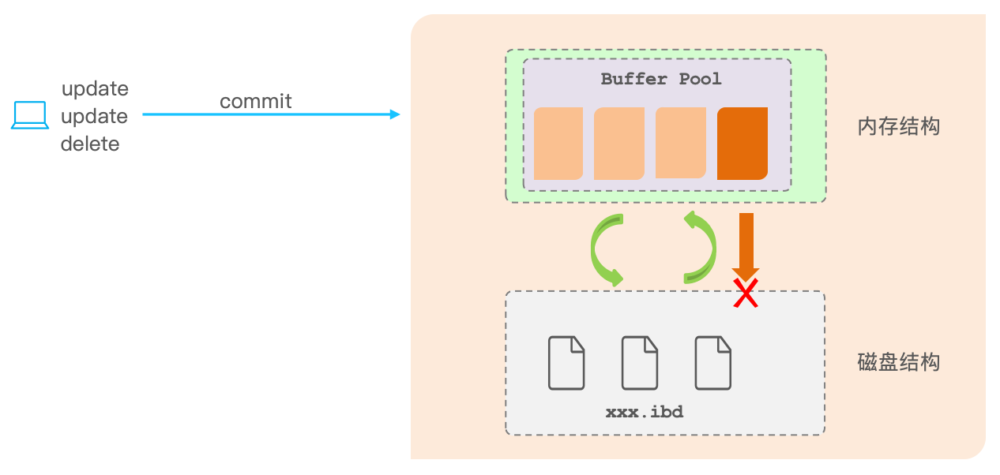
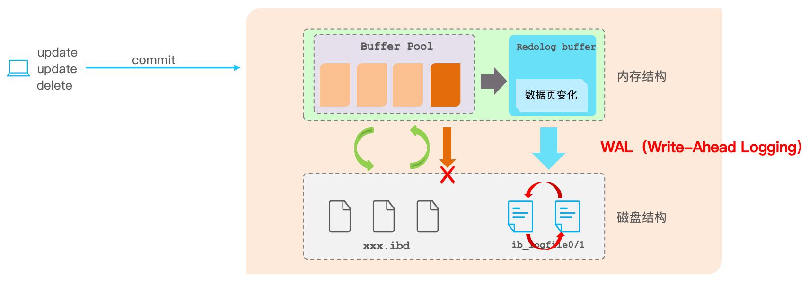
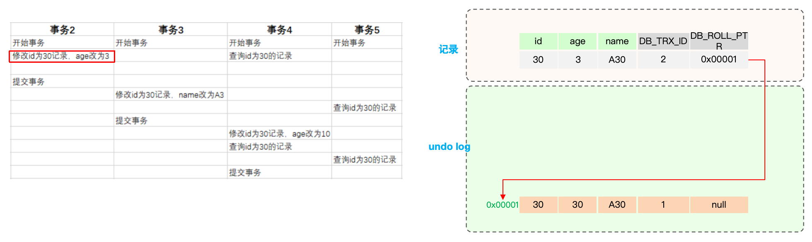
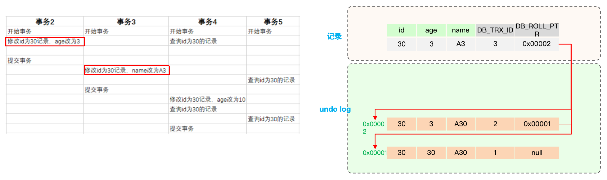
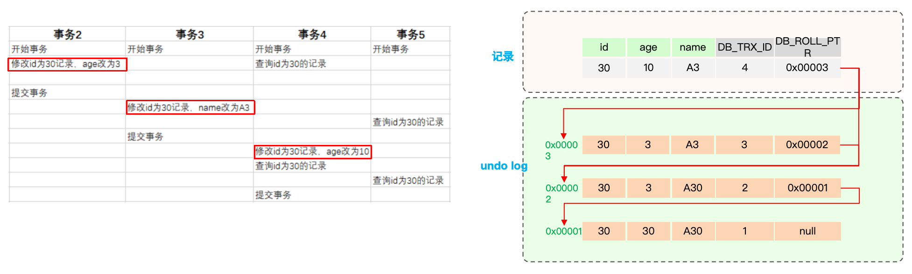
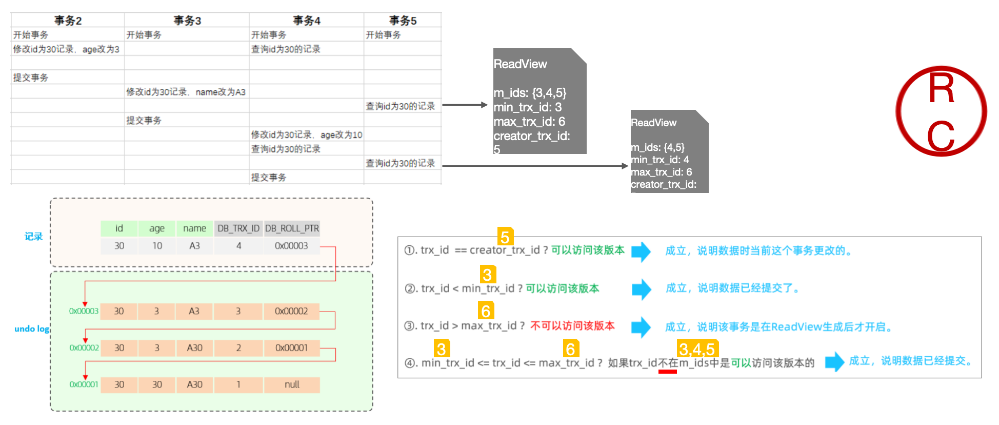

# mysql事务
## 1. 能说一说mysql事务吗？
事务是一组操作的集合，它是一个不可分割的工作单位，事务会把所有的操作作为一个整体一起向系统提交或撤销操作请求，即这些操作要么同时成功，要么同时失败。

事务具有ACID四个特性：
- 原子性（<font color=red>A</font>tomicity）：事务是不可分割的最小操作单元，要么全部成功，要么全部失败。
- 一致性（<font color=red>C</font>onsistency）：事务完成时，必须使所有的数据都保持一致状态。
- 隔离性（<font color=red>I</font>solation）：数据库系统提供的隔离机制，保证事务在不受外部并发操作影响的独立环境下运行。
- 持久性（<font color=red>D</font>urability）：事务一旦提交或回滚，它对数据库中的数据的改变就是永久的。
> 例如，A向B转账500元，这个操作要么都成功，要么都失败，体现了原子性。转账过程中数据要保持一致，A扣除了500元，B必须增加500元。隔离性体现在A向B转账时，不受其他事务干扰。持久性体现在事务提交后，数据要被持久化存储。

## 2. 并发事务会带来哪些问题？怎么解决这些问题？
并发事务问题：

| 类型 | 含义   |
|----|------|
| 脏读 | 一个事务读到另外一个事务还没有提交的数据 |
| 不可重复读 | 一个事务先后读取同一条记录，但两次读取的数据不同 |     
| 幻读 | 一个事务按照条件查询数据时，没有对应的数据行，但是在插入数据时，又发现这行数据已经存在，好像出现了”幻影” |

解决这些问题的方法是对事务进行隔离

| 隔离级别 | 脏读 | 不可重复读 | 幻读 |
|--------|------|-------|------|
| Read uncommitted 未提交读 | √ | √ | √ |
| Read committed 已提交读 | × | √ | √ |
| Repeatable read(<font color=red>默认</font>) 可重复读 | × | × | √ |
| Serializable 可串行化 | × | × | × |

⚠️事务隔离级别越高，数据越安全，但是性能越低。

## 3. undo log和redo log的区别？
- **缓冲池（buffer pool）**:主内存中的一个区域，里面可以缓存磁盘上经常操作的真实数据，在执行增删改查操作时，先操作缓冲池中的数据（若缓冲池没有数据，则从磁盘加载并缓存），以一定频率刷新到磁盘，从而减少磁盘IO，加快处理速度
- **数据页（page）**:是InnoDB 存储引擎磁盘管理的最小单元，每个页的大小默认为 16KB。页中存储的是行数据

### 3.1 redo log
重做日志，记录的是事务提交时数据页的物理修改，是<font color=red>用来实现事务的持久性</font>。

该日志文件由两部分组成：重做日志缓冲（redo log buffer）以及重做日志文件（redo log file）,前者是在内存中，后者在磁盘中。当事务提交之后会把所有修改信息都存到该日志文件中, 用于在刷新脏页到磁盘,发生错误时, 进行数据恢复使用。



### 3.2 undo log
回滚日志，用于记录数据被修改前的信息 , 作用包含两个 : <font color=red>提供回滚</font> 和 <font color=red>MVCC(多版本并发控制)</font> 。undo log和redo log记录物理日志不一样，它是<font color=red>逻辑日志</font>。
- 可以认为当delete一条记录时，undo log中会记录一条对应的insert记录，反之亦然，
- 当update一条记录时，它记录一条对应相反的update记录。当执行rollback时，就可以从undo log中的逻辑记录读取到相应的内容并进行回滚。

<font color=red>undo log可以实现事务的一致性和原子性</font>

### 3.3 小结
- redo log: 记录的是数据页的物理变化，服务宕机可用来同步数据
- undo log ：记录的是逻辑日志，当事务回滚时，通过逆操作恢复原来的数据
- redo log保证了事务的持久性，undo log保证了事务的原子性和一致性

## 4. 那事务中的隔离性是如何保证的？
事务的隔离性通过锁和多版本并发控制（MVCC）来保证。MVCC通过维护数据的多个版本来避免读写冲突。底层实现包括隐藏字段、undo log和read view。隐藏字段包括trx_id和roll_pointer。undo log记录了不同版本的数据，通过roll_pointer形成版本链。read view定义了不同隔离级别下的快照读，决定了事务访问哪个版本的数据
### 4.1 MVCC
全称 <font color=red>M</font>ulti-<font color=red>V</font>ersion <font color=red>C</font>oncurrency <font color=red>C</font>ontrol，多版本并发控制。指维护一个数据的多个版本，使得读写操作没有冲突
MVCC的具体实现，主要依赖于数据库记录中的<font color=red>隐式字段</font>、<font color=red>undo log日志</font>、<font color=red>readView</font>。
- 隐式字段

| 隐藏字段 | 含义  |
|--------|-----|
|DB_TRX_ID|最近修改事务ID，记录插入这条记录或最后一次修改该记录的事务ID。|
|DB_ROLL_PTR|回滚指针，指向这条记录的上一个版本，用于配合undo log，指向上一个版本。|
|DB_ROW_ID|隐藏主键，如果表结构没有指定主键，将会生成该隐藏字段。|

- undo log 
  - 回滚日志，在insert、update、delete的时候产生的便于数据回滚的日志。
  - 当insert的时候，产生的undo log日志只在回滚时需要，在事务提交后，可被立即删除。
  - 而update、delete的时候，产生的undo log日志不仅在回滚时需要，mvcc版本访问也需要，不会立即被删除。

- undo log 版本链



  > 不同事务或相同事务对同一条记录进行修改，会导致该记录的undolog生成一条记录版本链表，链表的头部是最新的旧记录，链表尾部是最早的旧记录。
 
### 4.2 ReadView
#### 4.2.1 快照读和当前读
快照读：读取的是快照数据，即快照生成那一刻的数据，<font color=red>普通的SELECT语句在不加锁情况下就是快照读</font>，如：

```sql
SELECT * FROM t_xx WHERE ...;
```

当前读：读取最新数据，<font color=red>加锁的SELECT或者对数据进行增删改都会进行当前读</font>，如：
```sql
SELECT * FROM t_xx LOCK IN SHARE MODE;;
SELECT * FROM t_xx FOR UPDATE;
INSERT INTO t_xx ...;
DELETE FROM t_xx WHERE ...;
UPDATE t_xx SET ... WHERE ...;
```

不同的隔离级别，生成ReadView的时机不同：
- READ COMMITTED ：在事务中每一次执行快照读时生成ReadView。
- REPEATABLE READ：仅在事务中第一次执行快照读时生成ReadView，后续复用该ReadView。

#### 4.2.2 ReadView四个核心字段
| 字段 | 含义  |
|------|-----|
|m_ids|前活跃的事务ID集合|
|min_trx_id|最小活跃事务ID|
|max_trx_id|预分配事务ID，当前最大事务ID+1（因为事务ID是自增的）|
|creator_trx_id|ReadView创建者的事务ID|
  
#### 4.2.3 版本链数据访问规则
  
trx_id：代表是当前事务ID

| 条件 | 访问情况 | 说明 |
|----|------|----|
|trx_id  == creator_trx_id|<font color=green>可以访问该版本</font>|成立，说明数据是当前这个事务更改的|
|trx_id < min_trx_id|<font color=green>可以访问该版本</font>|成立，说明数据已经提交了。|
|trx_id > max_trx_id|<font color=red>不可以访问该版本</font>|成立，说明该事务是在ReadView生成后才开启。|
|min_trx_id <= trx_id <= max_trx_id|如果trx_id不在m_ids中是<font color=green>可以访问</font>该版本的|成立，说明数据已经提交。|



## 5. 谈一谈MySQL事务的两阶段提交
### 5.1 两阶段提交是什么？
二阶段提交（Two-Phase Commit, 2PC）是分布式事务中的一种协调协议，用于确保多个资源（如数据库或数据节点）在事务提交时保持一致性。MySQL 在存储引擎（如 InnoDB）和 Binlog（归档日志）之间使用二阶段提交来保证事务的一致性。

在 MySQL 中，二阶段提交的典型场景是协调 InnoDB 的事务日志（redo log） 和 Binlog 的写入，以确保事务既能满足崩溃恢复需求，又能保证主从复制的一致性。

### 5.2 两阶段提交的流程
1. 准备阶段（Prepare Phase）
   - MySQL 将事务的修改写入 InnoDB 的 redo log，并将 redo log 标记为 "PREPARED" 状态。
   - 此时，数据的实际修改还没有被提交，事务处于“可恢复”状态（可以通过 redo log 恢复未完成的事务）。
   - 如果发生异常，可以回滚事务。
2. 提交阶段（Commit Phase）
   - MySQL 将事务写入 Binlog（记录事务的持久性变更，用于主从复制）。
   - 在确保 Binlog 写入成功后，更新 redo log 的状态为 "COMMITTED"。
   - 此时，事务正式提交，数据对其他事务可见。

### 5.3 两阶段提交的作用
1. 一致性保证：  
二阶段提交确保了 InnoDB 的事务日志和 Binlog 之间的一致性。如果 Binlog 写入失败，可以通过回滚撤销未完成的事务。

2. 主从复制的一致性：  
Binlog 用于主从复制。如果没有二阶段提交，可能会导致主库和从库数据不一致的问题。

3. 崩溃恢复：  
如果 MySQL 在事务提交中途崩溃，redo log 的 "PREPARED" 状态可以帮助事务在恢复时判断是提交还是回滚。
### 5.4 两阶段提交示例
假设一个事务执行以下操作：  
（1）修改一个用户的余额。  
（2）插入一条记录到交易日志表。

执行流程：
- Prepare 阶段：
  - 将修改写入 redo log 并标记为 "PREPARED"。
  - 此时，事务未提交，但可以通过 redo log 恢复状态。
- Commit 阶段：
  - 将事务写入 Binlog。
  - 确认 Binlog 写入成功后，将 redo log 标记为 "COMMITTED"。
  - 事务完成。
### 5.5 总结
- 二阶段提交在 MySQL 中的核心目标是保证 InnoDB 的事务日志和 Binlog 之间的数据一致性。
- 在分布式场景中，二阶段提交也是解决分布式事务一致性的重要协议。
- 虽 然二阶段提交提供了数据一致性的保障，但它会引入一定的性能开销，因此在实际使用中需要权衡性能与一致性需求。

