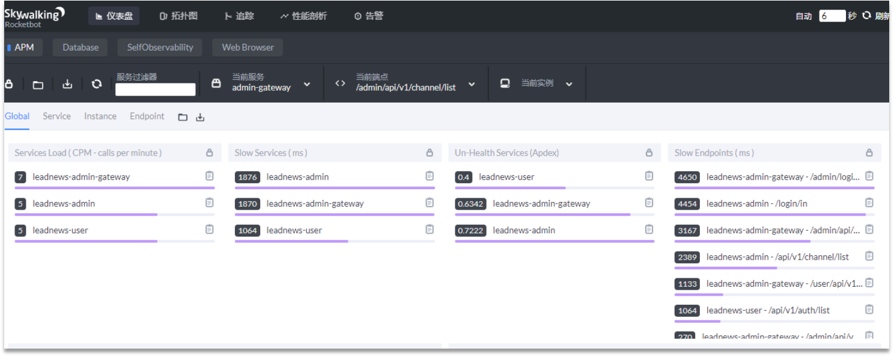
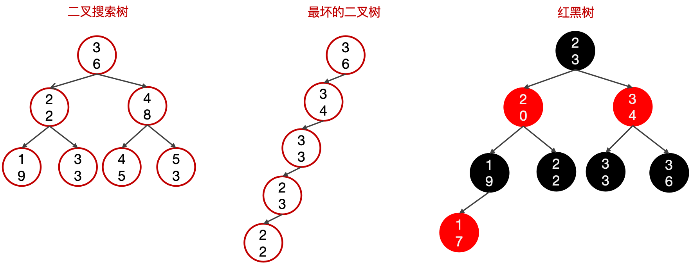
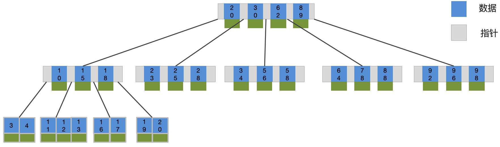
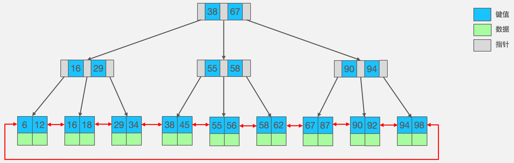
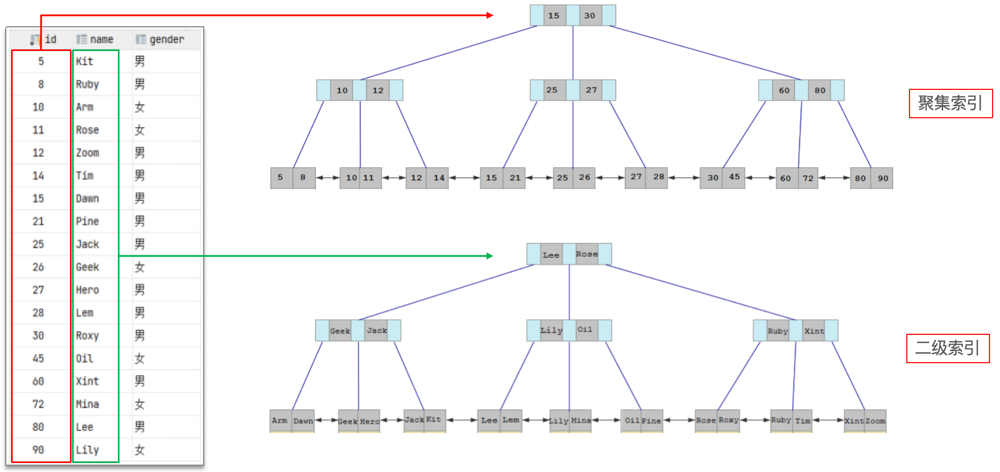
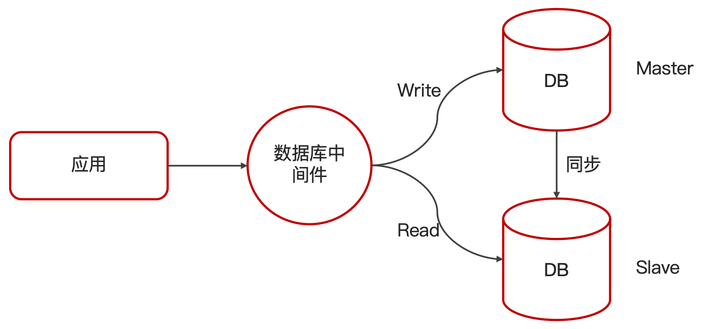

# mysql优化面试题
## 1. 在mysql中，如何定位慢查询？
### 方案一：开源工具
- 调试工具：Arthas
- 运维工具：Prometheus、Skywalking




### 方案二：MySQL自带慢查询
慢查询日志记录了所有执行时间超过指定参数（long_query_time，单位：秒，默认10秒）的所有SQL语句的日志  
如果要开启慢查询日志，需要在MySQL的配置文件（/etc/my.cnf）中配置如下信息：
```text
# 开启MySQL慢日志查询开关 
slow_query_log=1
# 设置慢日志的时间为2秒，SQL语句执行时间超过2秒，就会视为慢查询，记录慢查询日志
long_query_time=2
```

配置完毕之后，通过以下指令重新启动MySQL服务器进行测试，查看慢日志文件中记录的信息 /var/lib/mysql/localhost-slow.log。

## 2. 那这个SQL语句执行很慢，如何分析呢？
可以采用<font color=red size=3>EXPLAIN</font> 或者 <font color=red size=3>DESC</font>命令获取 MySQL 如何执行 SELECT 语句的信息

 - type 这条sql的连接的类型

| type类型 | 含义   |
|--------|------|
| system | 查询系统中的表 |
| const  | 根据主键查询 |     
| eq_ref | 主键索引查询或唯一索引查询 |
| ref    | 普通索引查询 |
| range  | 范围查询 |
| index  | 索引树扫描 |
| all    | 全表扫描 |

- possible_key 当前sql可能会使用到的索引
- key 当前sql实际命中的索引
- key_len 索引占用的大小
- Extra 额外的优化建议

|Extra|含义|
|---|---|
|Using where; Using Index|查找使用了索引，需要的数据都在索引列中能找到，不需要回表查询数据|
|Using index condition|查找使用了索引，但是需要回表查询数据|
> 如果一条SQL执行很慢，我们通常会使用MySQL的 Explain 命令来分析这条SQL的执行情况。  
> 通过 key 和 key_len 可以检查是否命中了索引，如果已经添加了索引，也可以判断索引是否有效。  
> 通过 type 字段可以查看 SQL 是否有优化空间，比如是否存在全索引扫描或全表扫描。  
> 通过 extra 建议可以判断是否出现回表情况，如果出现，可以尝试添加索引 或 修改返回字段来优化。

## 3. 谈谈你对索引的理解
索引(index)是帮助MySQL高效获取数据的数据结构（有序）。在数据之外，数据库系统还维护着满足特定查找算法的数据结构，这些数据结构以某种方式引用（指向）数据，这样就可以在这些数据结构上实现高级查找算法，这种数据结构就是索引。  

MySQL默认使用的索引底层数据结构是B+树。

先看一下树相关的数据结构：

以上几种数据结构在节点很多时树的深度会很深，查询的效率会降低。

B-Tree，B树是一种多叉平衡查找树，相对于二叉树，B树每个节点可以有多个分支，即多叉。  
以一棵最大度数（max-degree）为5（5阶）的B-tree为例，这个B树每个节点最多存储4个key。

从上图可以看出来，如果要进行范围查找，B树会比较麻烦，而B+树则比较简单。

B+Tree是在BTree基础上的一种优化，使其更适合实现外存储索引结构，InnoDB存储引擎就是用B+Tree实现其索引结构


B树与B+树的区别：  
① 磁盘读写代价B+树更低；  
② 查询效率B+树更加稳定；  
③ B+树便于扫库和区间查询  

> 索引在项目中非常常见，它是一种帮助MySQL高效获取数据的数据结构，主要用来提高数据检索效率，降低数据库的I/O成本。  
> 同时，索引列可以对数据进行排序，降低数据排序的成本，也能减少CPU的消耗。
> 
> MySQL的默认存储引擎InnoDB使用的是B+树作为索引的存储结构。  
> 选择B+树的原因包括：节点可以有更多子节点，路径更短；磁盘读写代价更低，非叶子节点只存储键值和指针，叶子节点存储数据；B+树适合范围查询和扫描，因为叶子节点形成了一个双向链表。

## 4. 什么是聚簇索引什么是非聚簇索引？
|分类|含义|特点|
|-|---|--|
|聚集索引(Clustered Index)|将数据存储与索引放到了一块，索引结构的叶子节点保存了行数据|必须有,而且只有一个｜
|二级索引(Secondary Index)|将数据与索引分开存储，索引结构的叶子节点关联的是对应的主键|可以存在多个|

聚集索引选取规则:  
- 如果存在主键，主键索引就是聚集索引。
- 如果不存在主键，将使用第一个唯一（UNIQUE）索引作为聚集索引。
- 如果表没有主键，或没有合适的唯一索引，则InnoDB会自动生成一个rowid作为隐藏的聚集索引。



## 5. 你了解回表查询吗？可以对其进行优化吗？
回表查询是指通过二级索引找到对应的主键值，然后再通过主键值查询聚簇索引中对应的整行数据的过程。


可以通过覆盖索引解决回表查询问题，覆盖索引就是指SELECT查询中返回的列全部能在索引中找到，避免了回表查询，提高了性能。  
使用覆盖索引可以减少对主键索引的查询次数，提高查询效率。

## 6. 索引创建原则有哪些？
- 针对于数据量较大，且查询比较频繁的表建立索引。
- 针对于常作为查询条件（where）、排序（order by）、分组（group by）操作的字段建立索引。
- 尽量选择区分度高的列作为索引，尽量建立唯一索引，区分度越高，使用索引的效率越高。
- 如果是字符串类型的字段，字段的长度较长，可以针对于字段的特点，建立前缀索引。
- 尽量使用联合索引，减少单列索引，查询时，联合索引很多时候可以覆盖索引，节省存储空间，避免回表，提高查询效率。
- 要控制索引的数量，索引并不是多多益善，索引越多，维护索引结构的代价也就越大，会影响增删改的效率。
- 如果索引列不能存储NULL值，请在创建表时使用NOT NULL约束它。当优化器知道每列是否包含NULL值时，它可以更好地确定哪个索引最有效地用于查询。

## 7. 什么情况下会索引失效？
- 违反最左前缀法则
> 如果符合最左法则，但是出现跳跃某一列，只有最左列索引生效
- 范围查询右边的列，不能使用索引
- 在索引列上进行运算操作， 索引将失效

- 字符串不加单引号，造成索引失效

- 以%开头的Like模糊查询，索引失效。如果仅仅是尾部模糊匹配，索引不会失效。

## 8. 谈谈你对SQL优化的经验
- 表的设计优化
  - 比如设置合适的数值（tinyint   int   bigint），要根据实际情况选择
  - 比如设置合适的字符串类型（char和varchar）char定长效率高，varchar可变长度，效率稍低
- 索引优化（参考6优化创建原则和7索引失效）
- SQL语句优化
  - SELECT语句务必指明字段名称（避免直接使用select * ）
  - SQL语句要避免造成索引失效的写法
  - 尽量用union all代替union，union会多一次过滤，效率低
  - 避免在where子句中对字段进行表达式操作
  - Join优化：能用inner join，就不用left join 和 right join，如必须使用一定要以小表为驱动。
    - 内连接会对两个表进行优化，优先把小表放到外边，把大表放到里边。left join 或 right join，不会重新调整顺序
- 主从复制、读写分离

- 分库分表
