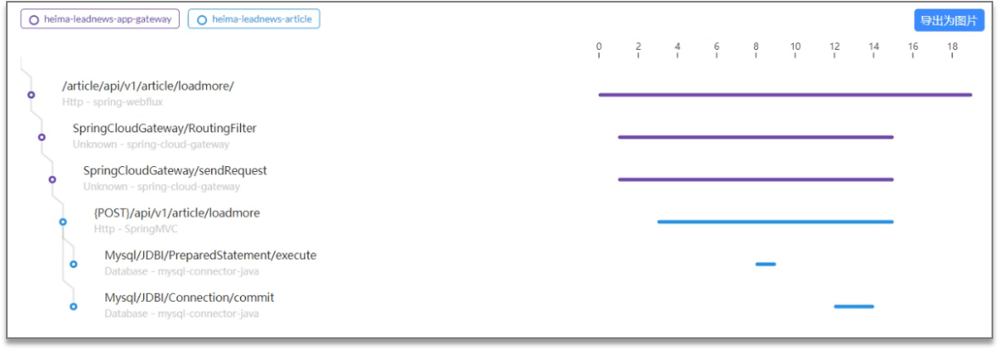

# mysql经典面试题
## 1. 在mysql中，如何定位慢查询？
### 方案一：开源工具
- 调试工具：Arthas
- 运维工具：Prometheus、Skywalking




### 方案二：MySQL自带慢查询
慢查询日志记录了所有执行时间超过指定参数（long_query_time，单位：秒，默认10秒）的所有SQL语句的日志  
如果要开启慢查询日志，需要在MySQL的配置文件（/etc/my.cnf）中配置如下信息：
```text
# 开启MySQL慢日志查询开关 
slow_query_log=1
# 设置慢日志的时间为2秒，SQL语句执行时间超过2秒，就会视为慢查询，记录慢查询日志
long_query_time=2
```

配置完毕之后，通过以下指令重新启动MySQL服务器进行测试，查看慢日志文件中记录的信息 /var/lib/mysql/localhost-slow.log。

## 2. 那这个SQL语句执行很慢，如何分析呢？
可以采用<font color=red size=3>EXPLAIN</font> 或者 <font color=red size=3>DESC</font>命令获取 MySQL 如何执行 SELECT 语句的信息

 - type 这条sql的连接的类型

| type类型 | 含义   |
|--------|------|
| system | 查询系统中的表 |
| const  | 根据主键查询 |     
| eq_ref | 主键索引查询或唯一索引查询 |
| ref    | 普通索引查询 |
| range  | 范围查询 |
| index  | 索引树扫描 |
| all    | 全表扫描 |

- possible_key 当前sql可能会使用到的索引
- key 当前sql实际命中的索引
- key_len 索引占用的大小
- Extra 额外的优化建议

|Extra|含义|
|---|---|
|Using where; Using Index|查找使用了索引，需要的数据都在索引列中能找到，不需要回表查询数据|
|Using index condition|查找使用了索引，但是需要回表查询数据|
> 如果一条SQL执行很慢，我们通常会使用MySQL的 Explain 命令来分析这条SQL的执行情况。  
> 通过 key 和 key_len 可以检查是否命中了索引，如果已经添加了索引，也可以判断索引是否有效。  
> 通过 type 字段可以查看 SQL 是否有优化空间，比如是否存在全索引扫描或全表扫描。  
> 通过 extra 建议可以判断是否出现回表情况，如果出现，可以尝试添加索引 或 修改返回字段来优化。