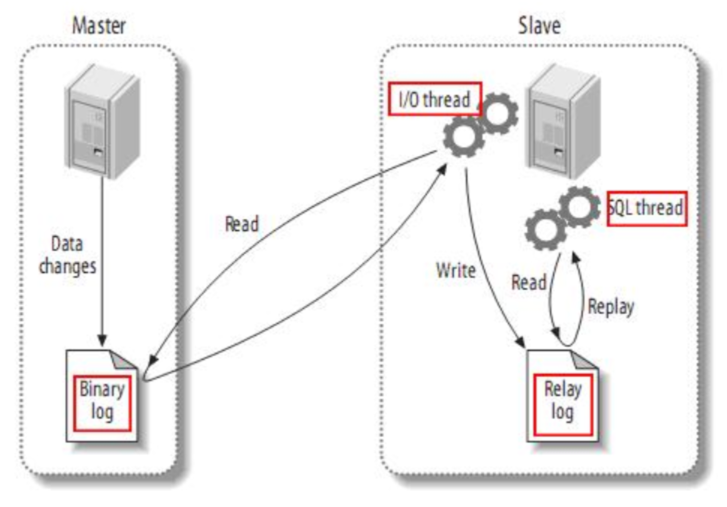

[TOC]

# 一、MySQL高可用集群介绍

## 1、数据库主从架构与分库分表

随着现在互联网的应用越来越大，数据库会频繁的成为整个应用的性能瓶颈。而我们经常使用的MySQL数据库，也会不断面临数据量太大、数据访问太频繁、数据读写速度太快等一系列的问题。所以，我们需要设计复杂的应用架构来保护孱弱的数据库，例如添加Redis缓存，增加MQ进行流量削峰等等。但是，数据库本身如果不能得到提升，这就相当于是水桶理论中的最短板。

而要提升数据库的性能，一种思路，当然是对数据库本身进行优化，例如对MySQL进行优化配置，或者干脆换成ClickHouse这一类的针对大数据的产品。另一方面就是跟微服务架构的思路一样，从单体架构升级到集群架构，这样才能真正全方位解放数据库的性能瓶颈。而我们后续要学习的分库分表就是一种非常常见的数据库集群架构管理方案。

但是就像微服务架构并不是简单的将服务从单机升级为就能一样，分库分表也并不只是字面意义上的将数据分到多个库或者多个表这么简单，他也是基于数据库产品的一系列分布式解决方案。在不同的应用场景下，针对不同的数据库产品，分库分表也有不同的落地方式。而我们后续，会以最为常见的MySQL数据库以及ShardingSphere框架来了解分库分表要如何进行。

## 2、MySQL主从同步原理

既然要解决MySQL数据库的分布式集群化问题，那就不能不先了解MySQL自身提供的主从同步原理。这是构建MySQL集群的基础，也是后续进行分库分表的基础，更是MySQL进行生产环境部署的基础。

其实数据库的主从同步，就是为了要保证多个数据库之间的数据保持一致。最简单的方式就是使用数据库的导入导出工具，定时将主库的数据导出，再导入到从库当中。这是一种很常见，也很简单易行的数据库集群方式。也有很多的工具帮助我们来做这些事情。但是这种方式进行数据同步的实时性比较差。

而如果要保证数据能够实时同步，对于MySQL，通常就要用到他自身提供的一套通过Binlog日志在多个MySQL服务之间进行同步的集群方案。基于这种集群方案，一方面可以提高数据的安全性，另外也可以以此为基础，提供读写分离、故障转移等其他高级的功能。

即在主库上打开Binlog日志，记录对数据的每一步操作。然后在从库上打开RelayLog日志，用来记录跟主库一样的Binlog日志，并将RelayLog中的操作日志在自己数据库中进行重演。这样就能够更加实时的保证主库与从库的数据一致。

> MySQL的Binlog默认是不打开的。

他的实现过程是在从库上启动一系列IO线程，负责与主库建立TCP连接，请求主库在写入Binlog日志时，也往从库传输一份。这时，主库上会有一个IO Dump线程，负责将Binlog日志通过这些TCP连接传输给从库的IO线程。而从库为了保证日志接收的稳定性，并不会立即重演Binlog数据操作，而是先将接收到的Binlog日志写入到自己的RelayLog日志当中。然后再异步的重演RelayLog中的数据操作。

MySQL的BinLog日志能够比较实时的记录主库上的所有日志操作，因此他也被很多其他工具用来实时监控MySQL的数据变化。例如Canal框架，可以模拟一个slave节点，同步MySQL的Binlog，然后将具体的数据操作按照定制的逻辑进行转发。例如转发到Redis实现缓存一致，转发到Kafka实现数据实时流转等。而ClickHouse也支持将自己模拟成一个MySQL的从节点，接收MySQL的Binlog日志，实时同步MySQL的数据。`这个功能目前还在实验阶段。`

# 二、动手搭建MySQL主从集群

## 1、基础环境搭建

以下实验准备两台服务器，来搭建一个MySQL的主从集群。均安装CentOS7操作系统。 192.168.232.128将作为MySQL主节点，192.168.232.129将作为MySQL的从节点。

然后在两台服务器上均安装MySQL服务，MySQL版本采用mysql-8.0.20版本。

