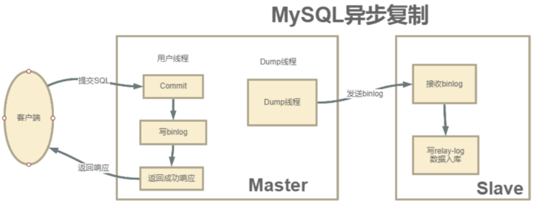
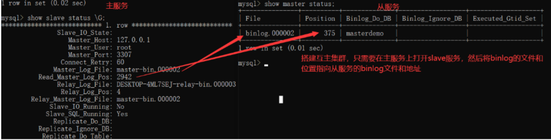

[TOC]

# 一、MySQL高可用集群介绍

## 1、数据库主从架构与分库分表

随着现在互联网的应用越来越大，数据库会频繁的成为整个应用的性能瓶颈。而我们经常使用的MySQL数据库，也会不断面临数据量太大、数据访问太频繁、数据读写速度太快等一系列的问题。所以，我们需要设计复杂的应用架构来保护孱弱的数据库，例如添加Redis缓存，增加MQ进行流量削峰等等。但是，数据库本身如果不能得到提升，这就相当于是水桶理论中的最短板。

而要提升数据库的性能，一种思路，当然是对数据库本身进行优化，例如对MySQL进行优化配置，或者干脆换成ClickHouse这一类的针对大数据的产品。另一方面就是跟微服务架构的思路一样，从单体架构升级到集群架构，这样才能真正全方位解放数据库的性能瓶颈。而我们后续要学习的分库分表就是一种非常常见的数据库集群架构管理方案。

但是就像微服务架构并不是简单的将服务从单机升级为就能一样，分库分表也并不只是字面意义上的将数据分到多个库或者多个表这么简单，他也是基于数据库产品的一系列分布式解决方案。在不同的应用场景下，针对不同的数据库产品，分库分表也有不同的落地方式。而我们后续，会以最为常见的MySQL数据库以及ShardingSphere框架来了解分库分表要如何进行。

## 2、MySQL主从同步原理

既然要解决MySQL数据库的分布式集群化问题，那就不能不先了解MySQL自身提供的主从同步原理。这是构建MySQL集群的基础，也是后续进行分库分表的基础，更是MySQL进行生产环境部署的基础。

其实数据库的主从同步，就是为了要保证多个数据库之间的数据保持一致。最简单的方式就是使用数据库的导入导出工具，定时将主库的数据导出，再导入到从库当中。这是一种很常见，也很简单易行的数据库集群方式。也有很多的工具帮助我们来做这些事情。但是这种方式进行数据同步的实时性比较差。

而如果要保证数据能够实时同步，对于MySQL，通常就要用到他自身提供的一套通过Binlog日志在多个MySQL服务之间进行同步的集群方案。基于这种集群方案，一方面可以提高数据的安全性，另外也可以以此为基础，提供读写分离、故障转移等其他高级的功能。


即在主库上打开Binlog日志，记录对数据的每一步操作。然后在从库上打开RelayLog日志，用来记录跟主库一样的Binlog日志，并将RelayLog中的操作日志在自己数据库中进行重演。这样就能够更加实时的保证主库与从库的数据一致。

> MySQL的Binlog默认是不打开的。

他的实现过程是在从库上启动一系列IO线程，负责与主库建立TCP连接，请求主库在写入Binlog日志时，也往从库传输一份。这时，主库上会有一个IO Dump线程，负责将Binlog日志通过这些TCP连接传输给从库的IO线程。而从库为了保证日志接收的稳定性，并不会立即重演Binlog数据操作，而是先将接收到的Binlog日志写入到自己的RelayLog日志当中。然后再异步的重演RelayLog中的数据操作。

MySQL的BinLog日志能够比较实时的记录主库上的所有日志操作，因此他也被很多其他工具用来实时监控MySQL的数据变化。例如Canal框架，可以模拟一个slave节点，同步MySQL的Binlog，然后将具体的数据操作按照定制的逻辑进行转发。例如转发到Redis实现缓存一致，转发到Kafka实现数据实时流转等。而ClickHouse也支持将自己模拟成一个MySQL的从节点，接收MySQL的Binlog日志，实时同步MySQL的数据。`这个功能目前还在实验阶段。`

# 二、动手搭建MySQL主从集群

## 1、基础环境搭建

以下实验准备两台服务器，来搭建一个MySQL的主从集群。均安装CentOS7操作系统。 192.168.232.128将作为MySQL主节点，192.168.232.129将作为MySQL的从节点。

然后在两台服务器上均安装MySQL服务，MySQL版本采用mysql-8.0.20版本。

## 2、安装MySQL服务

### 1、初始化MySQL

MySQL的安装有很多种方式，具体可以参考官网手册：<https://dev.mysql.com/doc/refman/8.0/en/binary-installation.html>

我们这里采用对系统环境依赖最低，出问题的可能性最小的tar包方式来安装。

上传mysql压缩包到worker2机器的root用户工作目录/root下，然后按照下面的指令，解压安装mysql

```shell
groupadd mysql
useradd -r -g mysql -s /bin/false mysql  #这里是创建一个mysql用户用于承载mysql服务，但是不需要登录权限。
tar -zxvf mysql-8.0.20-el7-x86_64.tar.gz #解压
ln -s mysql-8.0.20-el7-x86_64 mysql #建立软链接
cd mysql
mkdir mysql-files
chown mysql:mysql mysql-files
chmod 750 mysql-files
bin/mysqld --initialize --user=mysql #初始化mysql数据文件 注意点1
bin/mysql_ssl_rsa_setup
bin/mysqld_safe --user=mysql 

cp support-files/mysql.server /etc/init.d/mysql.server
```

> **注意点：**
>
> 1、初始化过程中会初始化一些mysql的数据文件，经常会出现一些文件或者文件夹权限不足的问题。如果有文件权限不足的问题，需要根据他的报错信息，创建对应的文件或者文件夹，并配置对应的文件权限。
>
> 2、初始化过程如果正常完成，日志中会打印出一个root用户的默认密码。这个密码需要记录下来。
>
>     2025-04-30T020:05:28.948043Z 6 [Note] [MY-010454] [Server] A temporary password is generated for root@localhost: P6kigsT6Lg>=

### 2、启动mysql

```shell
bin/mysqld --user=mysql
```

> **注意点：**
>
> 1、这个启动过程会独占当前命令行窗口，如果要后台执行可以在后面添加一个 &。但是一般第一次启动mysql服务时，经常会出现一些错误，所以建议用独占窗口的模式跟踪下日志。
>
> Linux上安装软件经常会出现各种各样的环境问题，很难全部概括。大部分的问题，需要查百度，根据别人的经验来修改。如果安装有困难的同学，可以改为在Windows上安装MySQL，整个过程会简单很多，不会影响后续ShardingSpehre的学习。

### 3、连接MySQL

MySQL服务启动完成后，默认是只能从本机登录，远程是无法访问的。所以需要用root用户登录下，配置远程访问的权限。

```shell
cd /root/mysql
bin/mysql -uroot -p #然后用之前记录的默认密码登录
```

> **注意点：**
>
> 1、如果有同学遇到  **ERROR 2002 (HY000): Can't connect to local MySQL server through socket '/tmp/mysql.sock' (2)**  这个报错信息，可以参照下面的配置，修改下/etc/my.cnf配置文件，来配置下socket连接文件的地址。主要是下面client部分。
>
>     [mysqld]
>     datadir=/var/lib/mysql
>     socket=/var/lib/mysql/mysql.sock
>     user=mysql
>     # Disabling symbolic-links is recommended to prevent assorted security risks
>     symbolic-links=0
>     # Settings user and group are ignored when systemd is used.
>     # If you need to run mysqld under a different user or group,
>     # customize your systemd unit file for mariadb according to the
>     # instructions in http://fedoraproject.org/wiki/Systemd
>
>     [mysqld_safe]
>     log-error=/var/log/mariadb/mariadb.log
>     pid-file=/var/run/mariadb/mariadb.pid
>
>     #
>     # include all files from the config directory
>     #
>     !includedir /etc/my.cnf.d
>
>     [client]
>     port=3306
>     socket=/var/lib/mysql/mysql.sock

登录进去后，需要配置远程登录权限：

```sql
alter user 'root'@'localhost' identified by '123456'; #修改root用户的密码
use mysql;
update user set host='%' where user='root';
flush privileges;
```

这样，Linux机器上的MySQL服务就搭建完成了。可以使用navicat等连接工具远程访问MySQL服务了。

> 如果安装MySQL确实有问题的话，推荐使用宝塔面板。<https://www.bt.cn/> 。使用这个工具可以图形化安装以及管理MySQL，非常方便。
>
> 另外，对于熟悉Docker和K8s，可以用这些虚拟化的方式来搭建，也非常简单高效。

这里需要注意下的是，搭建主从集群的多个服务，有两个必要的条件。

1、MySQL版本必须一致。

2、集群中各个服务器的时间需要同步。

## 3、搭建主从集群

接下来在这两个MySQL服务基础上，搭建一个主从集群。

### 1、配置master主服务

首先，配置主节点的mysql配置文件： /etc/my.cnf(没有的话就手动创建一个)

这一步需要对master进行配置，主要是需要打开binlog日志，以及指定severId。我们打开MySQL主服务的my.cnf文件，在文件中一行server-id以及一个关闭域名解析的配置。然后重启服务。

```ini
[mysqld]
server-id=01
#开启binlog
log_bin=master-bin
log_bin-index=master-bin.index
skip-name-resolve
# 设置连接端口
port=3306
# 设置mysql的安装目录
basedir=/usr/local/mysql
# 设置mysql数据库的数据的存放目录
datadir=/usr/local/mysql/mysql-files
# 允许最大连接数
max_connections=200
# 允许连接失败的次数。
max_connect_errors=10
# 服务端使用的字符集默认为UTF8
character-set-server=utf8
# 创建新表时将使用的默认存储引擎
default-storage-engine=INNODB
# 默认使用“mysql_native_password”插件认证
#mysql_native_password
default_authentication_plugin=mysql_native_password
```

> 配置说明：主要需要修改的是以下几个属性：
>
> server-id：服务节点的唯一标识。需要给集群中的每个服务分配一个单独的ID。
>
> log\_bin：打开Binlog日志记录，并指定文件名。
>
> log\_bin-index：Binlog日志文件

重启MySQL服务， `service mysqld restart`

然后，我们需要给root用户分配一个replication slave的权限。

```shell
#登录主数据库
mysql -u root -p
GRANT REPLICATION SLAVE ON *.* TO 'root'@'%';
flush privileges;
#查看主节点同步状态：
show master status;
```

> 在实际生产环境中，通常不会直接使用root用户，而会创建一个拥有全部权限的用户来负责主从同步。


这个指令结果中的File和Position记录的是当前日志的binlog文件以及文件中的索引。

而后面的Binlog\_Do\_DB和Binlog\_Ignore\_DB这两个字段是表示需要记录binlog文件的库以及不需要记录binlog文件的库。目前我们没有进行配置，就表示是针对全库记录日志。这两个字段如何进行配置，会在后面进行介绍。

> 开启binlog后，数据库中的所有操作都会被记录到datadir当中，以一组轮询文件的方式循环记录。而指令查到的File和Position就是当前日志的文件和位置。而在后面配置从服务时，就需要通过这个File和Position通知从服务从哪个地方开始记录binLog。


### 2、配置slave从服务

下一步，我们来配置从服务mysqls。 我们打开mysqls的配置文件my.cnf，修改配置文件：

```ini
[mysqld]
#主库和从库需要不一致
server-id=02
#打开MySQL中继日志
relay-log-index=slave-relay-bin.index
relay-log=slave-relay-bin
#打开从服务二进制日志
log-bin=mysql-bin
#使得更新的数据写进二进制日志中
log-slave-updates=1
# 设置3306端口
port=3306
# 设置mysql的安装目录
basedir=/usr/local/mysql
# 设置mysql数据库的数据的存放目录
datadir=/usr/local/mysql/mysql-files
# 允许最大连接数
max_connections=200
# 允许连接失败的次数。
max_connect_errors=10
# 服务端使用的字符集默认为UTF8
character-set-server=utf8
# 创建新表时将使用的默认存储引擎
default-storage-engine=INNODB
# 默认使用“mysql_native_password”插件认证
#mysql_native_password
default_authentication_plugin=mysql_native_password
```

> 配置说明：主要需要关注的几个属性：
>
> server-id：服务节点的唯一标识
>
> relay-log：打开从服务的relay-log日志。
>
> log-bin：打开从服务的bin-log日志记录。

然后我们启动mysqls的服务，并设置他的主节点同步状态。

```shell
#登录从服务
mysql -u root -p;
#设置同步主节点：
CHANGE MASTER TO
MASTER_HOST='192.168.232.128',
MASTER_PORT=3306,
MASTER_USER='root',
MASTER_PASSWORD='root',
MASTER_LOG_FILE='master-bin.000004',
MASTER_LOG_POS=156,
GET_MASTER_PUBLIC_KEY=1;
#开启slave
start slave;
#查看主从同步状态
show slave status;
或者用 show slave status \G; 这样查看比较简洁
```

> 注意，CHANGE MASTER指令中需要指定的MASTER\_LOG\_FILE和MASTER\_LOG\_POS必须与主服务中查到的保持一致。
>
> 并且后续如果要检查主从架构是否成功，也可以通过检查主服务与从服务之间的File和Position这两个属性是否一致来确定。


我们重点关注其中红色方框的两个属性，与主节点保持一致，就表示这个主从同步搭建是成功的。

> 从这个指令的结果能够看到，有很多Replicate\_开头的属性，这些属性指定了两个服务之间要同步哪些数据库、哪些表的配置。只是在我们这个示例中全都没有进行配置，就标识是全库进行同步。后面我们会补充如何配置需要同步的库和表。

### 3、主从集群测试

测试时，我们先用showdatabases，查看下两个MySQL服务中的数据库情况


然后我们在主服务器上创建一个数据库

```sql
mysql> create database syncdemo;
Query OK, 1 row affected (0.00 sec)
```

然后我们再用show databases，来看下这个syncdemo的数据库是不是已经同步到了从服务。


接下来我们继续在syncdemo这个数据库中创建一个表，并插入一条数据。

```sql
mysql> use syncdemo;
Database changed
mysql> create table demoTable(id int not null);
Query OK, 0 rows affected (0.02 sec)

mysql> insert into demoTable value(1);
Query OK, 1 row affected (0.01 sec)
```

然后我们也同样到主服务与从服务上都来查一下这个demoTable是否同步到了从服务。


从上面的实验过程看到，我们在主服务中进行的数据操作，就都已经同步到了从服务上。这样，我们一个主从集群就搭建完成了。

> 另外，这个主从架构是有可能失败的，如果在slave从服务上查看slave状态，发现Slave\_SQL\_Running=no，就表示主从同步失败了。这有可能是因为在从数据库上进行了写操作，与同步过来的SQL操作冲突了，也有可能是slave从服务重启后有事务回滚了。
>
> 如果是因为slave从服务事务回滚的原因，可以按照以下方式重启主从同步：
>
> ```sql
> mysql> stop slave ;
> mysql> set GLOBAL SQL_SLAVE_SKIP_COUNTER=1;
> mysql> start slave ;
> ```
>
> 而另一种解决方式就是重新记录主节点的binlog文件消息
>
> ```sql
> mysql> stop slave ;
> mysql> change master to .....
> mysql> start slave ;
> ```
>
> 但是这种方式要注意binlog的文件和位置，如果修改后和之前的同步接不上，那就会丢失部分数据。所以不太常用。

### 4、全库同步与部分同步

在完成这个基本的MySQL主从集群后，我们还可以进行后续的实验：

之前提到，我们目前配置的主从同步是针对全库配置的，而实际环境中，一般并不需要针对全库做备份，而只需要对一些特别重要的库或者表来进行同步。那如何针对库和表做同步配置呢？

首先在Master端：在my.cnf中，可以通过以下这些属性指定需要针对哪些库或者哪些表记录binlog

```ini
#需要同步的二进制数据库名
binlog-do-db=masterdemo
#只保留7天的二进制日志，以防磁盘被日志占满(可选)
expire-logs-days  = 7
#不备份的数据库
binlog-ignore-db=information_schema
binlog-ignore-db=performation_schema
binlog-ignore-db=sys
```

然后在Slave端：在my.cnf中，需要配置备份库与主服务的库的对应关系。

```ini
#如果salve库名称与master库名相同，使用本配置
replicate-do-db = masterdemo 
#如果master库名[mastdemo]与salve库名[mastdemo01]不同，使用以下配置[需要做映射]
replicate-rewrite-db = masterdemo -> masterdemo01
#如果不是要全部同步[默认全部同步]，则指定需要同步的表
replicate-wild-do-table=masterdemo01.t_dict
replicate-wild-do-table=masterdemo01.t_num
```

配置完成了之后，在show master status指令中，就可以看到Binlog\_Do\_DB和Binlog\_Ignore\_DB两个参数的作用了。

### 5、GTID同步集群

上面我们搭建的集群方式，是基于Binlog日志记录点的方式来搭建的，这也是最为传统的MySQL集群搭建方式。而在这个实验中，可以看到有一个Executed\_Grid\_Set列，暂时还没有用上。实际上，这就是另外一种搭建主从同步的方式，即GTID搭建方式。这种模式是从MySQL5.6版本引入的。

GTID的本质也是基于Binlog来实现主从同步，只是他会基于一个全局的事务ID来标识同步进度。GTID即全局事务ID，全局唯一并且趋势递增，他可以保证为每一个在主节点上提交的事务在复制集群中可以生成一个唯一的ID 。

在基于GTID的复制中，首先从服务器会告诉主服务器已经在从服务器执行完了哪些事务的GTID值，然后主库会有把所有没有在从库上执行的事务，发送到从库上进行执行，并且使用GTID的复制可以保证同一个事务只在指定的从库上执行一次，这样可以避免由于偏移量的问题造成数据不一致。

他的搭建方式跟我们上面的主从架构整体搭建方式差不多。只是需要在my.cnf中修改一些配置。

在主节点上：

    gtid_mode=on
    enforce_gtid_consistency=on
    log_bin=on
    server_id=单独设置一个
    binlog_format=row

在从节点上：

    gtid_mode=on
    enforce_gtid_consistency=on
    log_slave_updates=1
    server_id=单独设置一个

然后分别重启主服务和从服务，就可以开启GTID同步复制方式。

## 4、集群扩容与MySQL数据迁移

我们现在已经搭建成功了一主一从的MySQL集群架构，那要扩展到一主多从的集群架构，其实就比较简单了，只需要增加一个binlog复制就行了。

但是如果我们的集群是已经运行过一段时间，这时候如果要扩展新的从节点就有一个问题，之前的数据没办法从binlog来恢复了。这时候在扩展新的slave节点时，就需要增加一个数据复制的操作。

MySQL的数据备份恢复操作相对比较简单，可以通过SQL语句直接来完成。具体操作可以使用mysql的bin目录下的mysqldump工具。

```shell
mysqldump -u root -p --all-databases > backup.sql
#输入密码
```

通过这个指令，就可以将整个数据库的所有数据导出成backup.sql，然后把这个backup.sql分发到新的MySQL服务器上，并执行下面的指令将数据全部导入到新的MySQL服务中。

```shell
mysql -u root -p < backup.sql
#输入密码
```

这样新的MySQL服务就已经有了所有的历史数据，然后就可以再按照上面的步骤，配置Slave从服务的数据同步了。

## 5、搭建半同步复制

### 1》理解半同步复制

到现在为止，我们已经可以搭建MySQL的主从集群，互主集群，但是我们这个集群有一个隐患，就是有可能会丢数据。这是为什么呢？这要从MySQL主从数据复制分析起。

MySQL主从集群默认采用的是一种异步复制的机制。主服务在执行用户提交的事务后，写入binlog日志，然后就给客户端返回一个成功的响应了。而binlog会由一个dump线程异步发送给Slave从服务。



由于这个发送binlog的过程是异步的。主服务在向客户端反馈执行结果时，是不知道binlog是否同步成功了的。这时候如果主服务宕机了，而从服务还没有备份到新执行的binlog，那就有可能会丢数据。

那怎么解决这个问题呢，这就要靠MySQL的半同步复制机制来保证数据安全。

半同步复制机制是一种介于异步复制和全同步复制之前的机制。主库在执行完客户端提交的事务后，并不是立即返回客户端响应，而是等待至少一个从库接收并写到relay log中，才会返回给客户端。MySQL在等待确认时，默认会等10秒，如果超过10秒没有收到ack，就会降级成为异步复制。


这种半同步复制相比异步复制，能够有效的提高数据的安全性。但是这种安全性也不是绝对的，他只保证事务提交后的binlog至少传输到了一个从库，并且并不保证从库应用这个事务的binlog是成功的。另一方面，半同步复制机制也会造成一定程度的延迟，这个延迟时间最少是一个TCP/IP请求往返的时间。整个服务的性能是会有所下降的。而当从服务出现问题时，主服务需要等待的时间就会更长，要等到从服务的服务恢复或者请求超时才能给用户响应。

### 2、搭建半同步复制集群

半同步复制需要基于特定的扩展模块来实现。而mysql从5.5版本开始，往上的版本都默认自带了这个模块。这个模块包含在mysql安装目录下的lib/plugin目录下的semisync\_master.so和semisync\_slave.so两个文件中。需要在主服务上安装semisync\_master模块，在从服务上安装semisync\_slave模块。


首先我们登陆主服务，安装semisync\_master模块：

```sql
mysql> install plugin rpl_semi_sync_master soname 'semisync_master.so';
Query OK, 0 rows affected (0.01 sec)

mysql> show global variables like 'rpl_semi%';
+-------------------------------------------+------------+
| Variable_name                             | Value      |
+-------------------------------------------+------------+
| rpl_semi_sync_master_enabled              | OFF        |
| rpl_semi_sync_master_timeout              | 10000      |
| rpl_semi_sync_master_trace_level          | 32         |
| rpl_semi_sync_master_wait_for_slave_count | 1          |
| rpl_semi_sync_master_wait_no_slave        | ON         |
| rpl_semi_sync_master_wait_point           | AFTER_SYNC |
+-------------------------------------------+------------+
6 rows in set, 1 warning (0.02 sec)

mysql> set global rpl_semi_sync_master_enabled=ON;
Query OK, 0 rows affected (0.00 sec)
```

> 这三行指令中，第一行是通过扩展库来安装半同步复制模块，需要指定扩展库的文件名。
>
> 第二行查看系统全局参数，rpl\_semi\_sync\_master\_timeout就是半同步复制时等待应答的最长等待时间，默认是10秒，可以根据情况自行调整。
>
> 第三行则是打开半同步复制的开关。
>
> 在第二行查看系统参数时，最后的一个参数rpl\_semi\_sync\_master\_wait\_point其实表示一种半同步复制的方式。
>
> 半同步复制有两种方式，一种是我们现在看到的这种默认的AFTER\_SYNC方式。这种方式下，主库把日志写入binlog，并且复制给从库，然后开始等待从库的响应。从库返回成功后，主库再提交事务，接着给客户端返回一个成功响应。
>
> 而另一种方式是叫做AFTER\_COMMIT方式。他不是默认的。这种方式，在主库写入binlog后，等待binlog复制到从库，主库就提交自己的本地事务，再等待从库返回给自己一个成功响应，然后主库再给客户端返回响应。

然后我们登陆从服务，安装smeisync\_slave模块

```sql
mysql> install plugin rpl_semi_sync_slave soname 'semisync_slave.so';
Query OK, 0 rows affected (0.01 sec)

mysql> show global variables like 'rpl_semi%';
+---------------------------------+-------+
| Variable_name                   | Value |
+---------------------------------+-------+
| rpl_semi_sync_slave_enabled     | OFF   |
| rpl_semi_sync_slave_trace_level | 32    |
+---------------------------------+-------+
2 rows in set, 1 warning (0.01 sec)

mysql> set global rpl_semi_sync_slave_enabled = on;
Query OK, 0 rows affected (0.00 sec)

mysql> show global variables like 'rpl_semi%';
+---------------------------------+-------+
| Variable_name                   | Value |
+---------------------------------+-------+
| rpl_semi_sync_slave_enabled     | ON    |
| rpl_semi_sync_slave_trace_level | 32    |
+---------------------------------+-------+
2 rows in set, 1 warning (0.00 sec)

mysql> stop slave;
Query OK, 0 rows affected (0.01 sec)

mysql> start slave;
Query OK, 0 rows affected (0.01 sec)
```

> slave端的安装过程基本差不多，不过要注意下安装完slave端的半同步插件后，需要重启下slave服务。

## 6、主从集群与读写分离

我们要注意，目前我们的这个MySQL主从集群是单向的，也就是只能从主服务同步到从服务，而从服务的数据表更是无法同步到主服务的。


所以，在这种架构下，为了保证数据一致，通常会需要保证数据只在主服务上写，而从服务只进行数据读取。这个功能，就是大名鼎鼎的读写分离。但是这里要注意下，mysql主从本身是无法提供读写分离的服务的，需要由业务自己来实现。这也是我们后面要学的ShardingSphere的一个重要功能。

> 到这里可以看到，在MySQL主从架构中，是需要严格限制从服务的数据写入的，一旦从服务有数据写入，就会造成数据不一致。并且从服务在执行事务期间还很容易造成数据同步失败。
>
> 如果需要限制用户写数据，我们可以在从服务中将read\_only参数的值设为1( `set` `global read_only=1;` )。这样就可以限制用户写入数据。但是这个属性有两个需要注意的地方：
>
> 1、read\_only=1设置的只读模式，不会影响slave同步复制的功能。 所以在MySQL slave库中设定了read\_only=1后，通过 "show slave status\G" 命令查看salve状态，可以看到salve仍然会读取master上的日志，并且在slave库中应用日志，保证主从数据库同步一致；
>
> 2、read\_only=1设置的只读模式， 限定的是普通用户进行数据修改的操作，但不会限定具有super权限的用户的数据修改操作。 在MySQL中设置read\_only=1后，普通的应用用户进行insert、update、delete等会产生数据变化的DML操作时，都会报出数据库处于只读模式不能发生数据变化的错误，但具有super权限的用户，例如在本地或远程通过root用户登录到数据库，还是可以进行数据变化的DML操作； 如果需要限定super权限的用户写数据，可以设置super\_read\_only=0。另外 **如果要想连super权限用户的写操作也禁止，就使用"flush tables with read lock;"，这样设置也会阻止主从同步复制！**

## 7、扩展更复杂的集群结构

我们到这里搭建出了一个一主一从的MySQL主从同步集群，具有了数据同步的基础功能。而在生产环境中，通常会以此为基础，根据业务情况以及负载情况，搭建更大更复杂的集群。

例如**为了进一步提高整个集群的读能力，可以扩展出一主多从**。而为了减轻主节点进行数据同步的压力，可以继续扩展出多级从的主从集群。

而**为了提高这个集群的写能力，可以搭建互主集群**，即两个服务互为主从。这样不管写到哪个服务上，集群内的数据都是同步的。这样就可以用一个集群来分担写数据的压力。

**以此为基础，可以扩展出多主多从的集群，全方位提升集群的数据读写能力**。甚至，我们也可以扩展出环形的主从集群，实现MySQL多活部署。

搭建互主集群只需要按照上面的方式，在主服务上打开一个slave进程，并且指向slave节点的binlog当前文件地址和位置。



另外，在我们搭建的这个主从集群中，有一个比较隐藏的问题，就是这样的主从复制之间会有延迟。这在复杂集群中，做了读写分离后，会更容易体现出来。即数据往主服务写，而读数据在从服务读。这时候这个主从复制延迟就有可能造成主库上刚插入了数据但是从库查不到。当然，这在我们目前的这个集群中是很难出现的，但是在大型集群中会很容易出现。

出现这个问题的根本在于：面向业务的主服务数据都是多线程并发写入的，而从服务是单个线程慢慢拉取binlog，这中间就会有个效率差。所以解决这个问题的关键是要让从服务也用多线程并行复制binlog数据。

MySQL自5.7版本后就已经支持并行复制了。可以在从服务上设置slave\_parallel\_workers为一个大于0的数，然后把slave\_parallel\_type参数设置为LOGICAL\_CLOCK，这就可以了。

```shell
mysql> show global variables like 'slave_parallel%';
+------------------------+----------+
| Variable_name          | Value    |
+------------------------+----------+
| slave_parallel_type    | DATABASE |
| slave_parallel_workers | 0        |
+------------------------+----------+
2 rows in set (0.01 sec)
```