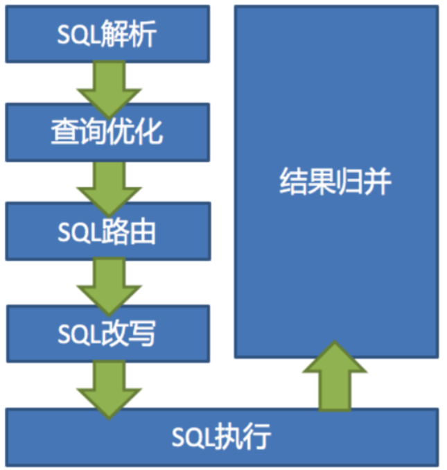

这一部分，我们主要了解ShardingSphere进行分库分表的底层原理，并且深入到源码了解分库分表的实际运行过程。

一方面，我们之前在学习ShardingJDBC时，积累了大量的测试实例，对于学习底层原理是非常好的学习入口。

另一方面，也是为了后面学习ShardingProxy做准备。因为对于ShardingProxy，如果只是学会几个简单的配置和指令，是无法在实际工作中用好的。而ShardingProxy作为一个黑盒产品，要通过ShardingProxy来了解底层原理是比较困难的。

# 一、内核剖析

ShardingSphere虽然有多个产品，但是他们的数据分片主要流程是完全一致的。

> SQL解析和查询优化都是跟具体的数据库产品有关，在5.x新版本中，被统一进了SQL方言里。