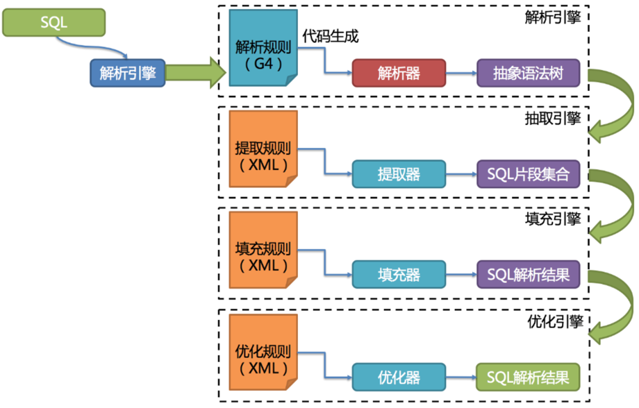
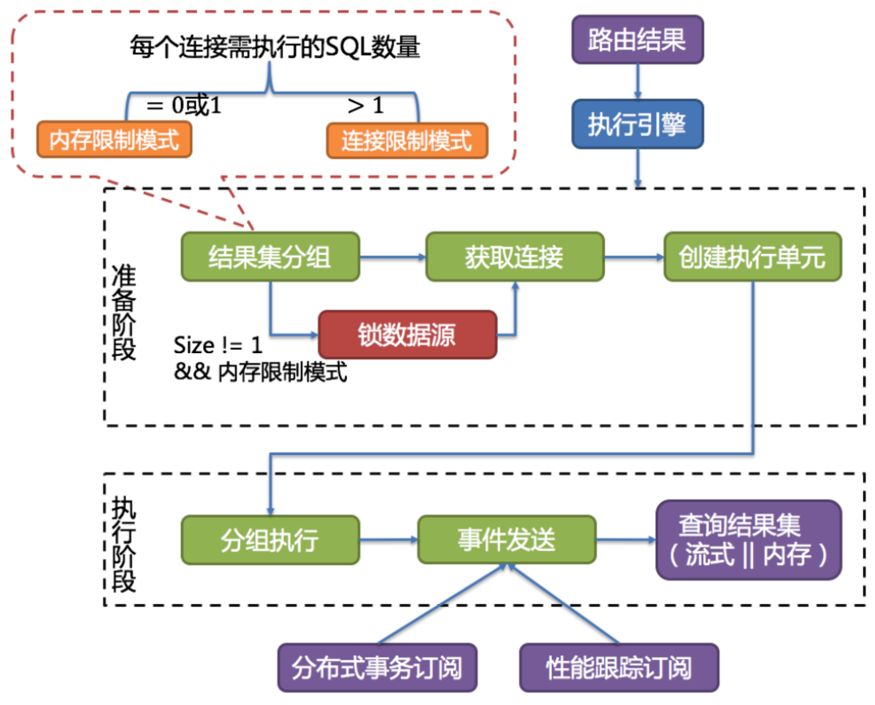

这一部分，我们主要了解ShardingSphere进行分库分表的底层原理，并且深入到源码了解分库分表的实际运行过程。

一方面，我们之前在学习ShardingJDBC时，积累了大量的测试实例，对于学习底层原理是非常好的学习入口。

另一方面，也是为了后面学习ShardingProxy做准备。因为对于ShardingProxy，如果只是学会几个简单的配置和指令，是无法在实际工作中用好的。而ShardingProxy作为一个黑盒产品，要通过ShardingProxy来了解底层原理是比较困难的。

# 一、内核剖析

ShardingSphere虽然有多个产品，但是他们的数据分片主要流程是完全一致的。

> SQL解析和查询优化都是跟具体的数据库产品有关，在5.x新版本中，被统一进了SQL方言里。

## 解析引擎

解析过程分为词法解析和语法解析。 词法解析器用于将SQL拆解为不可再分的原子符号，称为Token。并根据不同数据库方言所提供的字典，将其归类为关键字，表达式，字面量和操作符。 再使用语法解析器将SQL转换为抽象语法树(简称AST， Abstract Syntax Tree)。

例如对下面一条SQL语句：

    SELECT id, name FROM t_user WHERE status = 'ACTIVE' AND age > 18

会被解析成下面这样一颗树：

为了便于理解，抽象语法树中的关键字的 Token 用绿色表示，变量的 Token 用红色表示，灰色表示需要
进⼀步拆分。通过对抽象语法树的遍历，可以标记出所有可能需要改写的位置。SQL的一次解析过程是不可逆的，所有token按SQL原本的顺序依次进行解析，性能很高。并且在解析过程中，需要考虑各种数据库SQL方言的异同，提供不同的解析模版。

其中，SQL解析是整个分库分表产品的核心，其性能和兼容性是最重要的衡量指标。ShardingSphere在1.4.x之前采用的是性能较快的Druid作为SQL解析器。1.5.x版本后，采用自研的SQL解析器，针对分库分表场景，采取对SQL半理解的方式，提高SQL解析的性能和兼容性。然后从3.0.x版本后，开始使用ANLTR作为SQL解析引擎。这是个开源的SQL解析引擎，ShardingSphere在使用ANLTR时，还增加了一些AST的缓存功能。针对ANLTR4的特性，官网建议尽量采用PreparedStatement的预编译方式来提高SQL执行的性能。

sql解析整体结构：

## 路由引擎

根据解析上下文匹配数据库和表的分片策略，生成路由路径。

ShardingSphere的分片策略主要分为单片路由(分片键的操作符是等号)、多片路由(分片键的操作符是IN)和范围路由(分片键的操作符是Between)。不携带分片键的SQL则是广播路由。

分片策略通常可以由数据库内置也可以由用户方配置。内置的分片策略大致可分为尾数取模、哈希、范围、标签、时间等。 由用户方配置的分片策略则更加灵活，可以根据使用方需求定制复合分片策略。

实际使用时，应尽量使用分片路由，明确路由策略。因为广播路由影响过大，不利于集群管理及扩展。

> 全库表路由：对于不带分片键的DQL、DML以及DDL语句，会遍历所有的库表，逐一执行。例如 select \* from course 或者 select \* from course where ustatus='1'(不带分片键)
>
> 全库路由：对数据库的操作都会遍历所有真实库。 例如 set autocommit=0
>
> 全实例路由：对于DCL语句，每个数据库实例只执行一次，例如 CREATE USER customer\@127.0.0.1 identified BY '123';
>
> 单播路由：仅需要从任意库中获取数据即可。 例如 DESCRIBE course
>
> 阻断路由：屏蔽SQL对数据库的操作。例如  USE coursedb。就不会在真实库中执行，因为针对虚拟表操作，不需要切换数据库。

## 改写引擎

用户只需要面向逻辑库和逻辑表来写SQL，最终由ShardigSphere的改写引擎将SQL改写为在真实数据库中可以正确执行的语句。SQL改写分为正确性改写和优化改写。

## 执行引擎

ShardingSphere并不是简单的将改写完的SQL提交到数据库执行。执行引擎的目标是自动化的平衡资源控制和执行效率。

例如他的连接模式分为内存限制模式(MEMORY\_STRICTLY)和连接限制模式(CONNECTION\_STRICTLY)。内存限制模式只关注一个数据库连接的处理数量，通常一张真实表一个数据库连接。而连接限制模式则只关注数据库连接的数量，较大的查询会进行串行操作。

> ShardingSphere引入了连接模式的概念，分为内存限制模式(MEMORY\_STRICTLY)和连接限制模式(CONNECTION\_STRICTLY)。
>
> 这两个模式的区分涉及到一个参数  spring.shardingsphere.props.**max.connections.size.per.query**=50(默认值1，配置参见源码中ConfigurationPropertyKey类)。ShardingSphere会根据 路由到某一个数据源的路由结果 计算出 所有需在数据库上执行的SQL数量，用这个数量除以 用户的配置项，得到每个数据库连接需执行的SQL数量。数量>1就会选择连接限制模式，数量<=1就会选择内存限制模式。
>
> 内存限制模式不限制连接数，也就是说会建立多个数据连接，然后并发控制每个连接只去读取一个数据分片的数据。这样可以最快速度的把所有需要的数据读出来。并且在后面的归并阶段，会选择以每一条数据为单位进行归并，就是后面提到的流式归并。这种归并方式归并完一批数据后，可以释放内存了，可以很好的提高数据归并的效率，并且防止出现内存溢出或垃圾回收频繁的情况。他的吞吐量比较大，比较适合OLAP场景。
>
> 连接限制模式会对连接数进行限制，也即是说至少有一个数据库连接会要去读取多个数据分片的数据。这样他会对这个数据库连接采用串行的方式依次读取多个数据分片的数据。而这种方式下，会将数据全部读入到内存，进行统一的数据归并，也就是后面提到的内存归并。这种方式归并效率会比较高，例如一个MAX归并，直接就能拿到最大值，而流式归并就需要一条条的比较。比较适合OLTP场景。