<div style="text-align: center;"><h1>分库分表与分布式主键生成策略</h1></div>

主键生成策略，这是一个小问题，但却是一个大世界。很多人开发几十年都没有去想过这个问题，觉得有框架拿来用就是了。但是其实他一点都不简单。正好ShardingSphere5.x版本新集成了一个新的主键生成框架，CosId。这框架功能很强大，性能据说也非常高。只是目前还不太好用，有很多小问题。尤其是与周边生态的版本冲突，简直让人抓狂。官方资料也比较少。因此，如果你想要在大型项目中真正用上CosID，那么，我的建议是，最好先确定自己对于CosID有几把刷子，要不然，就等着被各种莫名其妙的错误折磨得死去活来把。

这里就正好借着梳理CosID的机会，好好把分布式主键生成策略给梳理一下。相信把基础思想梳理清楚了之后，再去了解CosId就比较简单了。

# 一、从分库分表的一个神坑说起

我想要将一个表的数据分到两个库中的两个表，共四个分片。这应该是分库分表中最为典型的一个场景了。

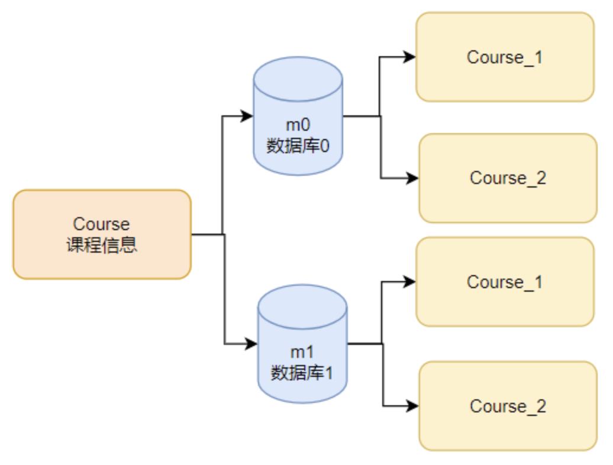

Course课程信息按照cid字段进行分片，那么分库的算法可以简单设置为按cid奇偶拆分，定制算法m$->{cid%2}就行了。而分表的算法呢？如果也是简单的按照cid奇偶拆分，算法定制为course_$->{cid%2+1}。这个时候，所有的Course课程记录，实际上只能分配到m0.course\_1和m2.course\_2两个分片表中。这并不是我们期待的结果啊。我们是希望把数据分到四张表里。这时候怎么办？一种很自然的想法是调整分表的算法，让他按照4去轮询，定制分片算法 course\_$->{((cid+1)%4).intdiv(2)+1}。 这样简单看起来是没有问题的。如果ID是连续递增的，那么这个算法就可以将数据均匀的分到四个分片中。

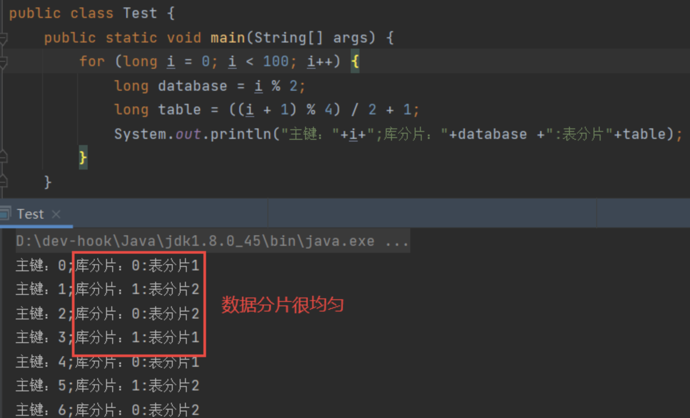

这时，建议你将这个算法去结合ShardingSphere实际使用一下。下面是是示例配置：

```properties
# 打印SQL
spring.shardingsphere.props.sql-show = true
spring.main.allow-bean-definition-overriding = true

# ----------------数据源配置
# 指定对应的库
spring.shardingsphere.datasource.names=m0,m1

spring.shardingsphere.datasource.m0.type=com.alibaba.druid.pool.DruidDataSource
spring.shardingsphere.datasource.m0.driver-class-name=com.mysql.cj.jdbc.Driver
spring.shardingsphere.datasource.m0.url=jdbc:mysql://localhost:3306/coursedb?serverTimezone=UTC
spring.shardingsphere.datasource.m0.username=root
spring.shardingsphere.datasource.m0.password=root

spring.shardingsphere.datasource.m1.type=com.alibaba.druid.pool.DruidDataSource
spring.shardingsphere.datasource.m1.driver-class-name=com.mysql.cj.jdbc.Driver
spring.shardingsphere.datasource.m1.url=jdbc:mysql://localhost:3306/coursedb2?serverTimezone=UTC
spring.shardingsphere.datasource.m1.username=root
spring.shardingsphere.datasource.m1.password=root
#------------------------分布式序列算法配置
# 雪花算法，生成Long类型主键。
spring.shardingsphere.rules.sharding.key-generators.alg_snowflake.type=SNOWFLAKE
spring.shardingsphere.rules.sharding.key-generators.alg_snowflake.props.worker.id=1
# 指定分布式主键生成策略
spring.shardingsphere.rules.sharding.tables.course.key-generate-strategy.column=cid
spring.shardingsphere.rules.sharding.tables.course.key-generate-strategy.key-generator-name=alg_snowflake
#-----------------------配置实际分片节点
spring.shardingsphere.rules.sharding.tables.course.actual-data-nodes=m$->{0..1}.course_$->{1..2}
#MOD分库策略
spring.shardingsphere.rules.sharding.tables.course.database-strategy.standard.sharding-column=cid
spring.shardingsphere.rules.sharding.tables.course.database-strategy.standard.sharding-algorithm-name=course_db_alg

spring.shardingsphere.rules.sharding.sharding-algorithms.course_db_alg.type=MOD
spring.shardingsphere.rules.sharding.sharding-algorithms.course_db_alg.props.sharding-count=2
#给course表指定分表策略  standard-按单一分片键进行精确或范围分片
spring.shardingsphere.rules.sharding.tables.course.table-strategy.standard.sharding-column=cid
spring.shardingsphere.rules.sharding.tables.course.table-strategy.standard.sharding-algorithm-name=course_tbl_alg

# 分表策略-INLINE：按单一分片键分表
spring.shardingsphere.rules.sharding.sharding-algorithms.course_tbl_alg.type=INLINE
spring.shardingsphere.rules.sharding.sharding-algorithms.course_tbl_alg.props.algorithm-expression=course_$->{cid%2+1}
#这种算法如果cid是严格递增的，就可以将数据均匀分到四个片。但是雪花算法并不是严格递增的。
#如果需要做到均匀分片，修改算法同时，还要修改雪花算法。把SNOWFLAKE换成MYSNOWFLAKE
spring.shardingsphere.rules.sharding.sharding-algorithms.course_tbl_alg.props.algorithm-expression=course_$->{((cid+1)%4).intdiv(2)+1}

```

然后往course表里连续插入多条消息。

```java
@Test
public void addcourse() {
    for (int i = 0; i < 10; i++) {
        Course c = new Course();
        // Course表的主键字段cid交由雪花算法生成。
        c.setCname("java");
        c.setUserId(1001L);
        c.setCstatus("1");
        courseMapper.insert(c);
        // insert into course values ....
        System.out.println(c);
    }
}
```

那么你一定会发现，这十条course信息，很奇怪。库倒是分得挺均匀，但是表却分得很奇怪。就是没有办法插入到四张表的。只能插入到m0.course\_1和m2.course\_2两张表中。之前试了很多次，问了很多人，也查了很多资料，收效甚微。好像这只是我自己手气不好，自己瞎折腾出来的问题。一直想着是不是算法写错了？或者是运气问题，雪花算法因为某种不可知的神秘因素，不按我的预期生成数据。这应该也是很多人在学习ShardingSphere时经常遇到的问题。

直到后面，随着学习CosID框架的机会，深入梳理了一下分布式主键生成策略，才发现问题就出在雪花算法中。在ShardingSphere中扩展一个自己的雪花算法实现，才最终解决了这个问题。最后这问题细思极恐。雪花算法+取模分片，这应该是很多项目中都通用的一种分片策略。但是在这个场景下，雪花算法埋着一个大坑呢。这个大坑不可能只坑我一个人，应该坑到的是很多人，很多项目。

这到底是怎么回事呢？各位，咱们从头说起。

# 二、分布式主键要考虑哪些问题？

我们应该如何设计一个分布式主键？

主键是对数据的唯一标识。主键非常重要，尤其当需要用来控制重要数据的生命周期时，主键通常都是标识数据的关键。但是，其实主键并不只是唯一这么简单。

主键除了要标识数据的唯一性之外，其实也是一个挺纠结的东西。在业务层面，我们通常会要求主键与业务不直接相关，这样主键才能够承载更多的，更负载，更频繁变化的业务数据。例如对于订单，要区分订单的唯一性，那么下单时间就是一个天然最好的标识。`这里暂不考虑并发的问题。简单假设，只要时间足够精确，那么下单时间是可以保证唯一性的。`如果用订单的下单时间这样带有明显业务属性的内容来当做主键，那么早期电商业务非常少的时候没有什么问题。但是随着订单业务越来越频繁，为了继续保证区分每一条订单，就会要求对下单时间的区分越来越精确。当电商逐渐演变成现代超大规模，超高并发的场景，以时间作为主键，迟早会无法满足。以其他业务字段来区分，通常也迟早会表现出受业务的制约，影响业务的演变。所以，在设计主键时，最好的方式是使用一个与业务都不相关的字段来作为主键。这样，不管业务如何变化，都可以使用主键来控制数据的生命周期。

但是，另外一个方面，我们通常又会要求主键包含一部分的业务属性，这样可以加速对数据的检索。还是以订单为例，如果我们采用一个与时间完全无关的字段作为主键，当我们需要频繁的统计昨天的订单时，就只能把所有订单都查询出来，然后再按照下单时间字段进行过滤。这样很明显，效率会很低。但是如果我们能够将下单时间作为主键的一部分，例如，以下单时间作为订单的开头部分。那么，我们就可以通过主键前面的下单时间部分，快速检索出一定时间范围内的订单主键，然后再根据主键去获取这一部分订单数据就可以了。这样要查的数据少了，效率自然就能提高了。

所以，对于主键，一方面，要求他与业务不直接相关。这就要求分配主键的服务要足够稳定，足够快速。不能说我辛辛苦苦把业务给弄完了，然后等着分配主键的时候，还要等半天，甚至等不到。`这个要求看似简单，但其实在现在经常讨论的高并发、分布式场景下，一点都不简单。`另一方面，要求他能够包含某一些业务特性。这就要求分配主键的服务能够进行一定程度的扩展。

另外主键也需要考虑安全性，让别人无法通过规律猜出主键来。比如身份证就是一个例子。要是随随便便就能猜到别人的身份证号码，那天下将是一个什么样子？

# 三、主要的主键生成策略

接下来考虑如何生成靠谱的主键呢？常用的策略有很多，大体可以分为几类。

## 1、数据库策略

在单数据库场景下，主键可以很简单。可以把主键扔给数据库，让他自己生成主键。比如MySQL的自增主键。

优点很明显。应用层使用简单，都不用考虑主键问题了，因此不会有主键稳定性的问题。以现代数据库的设计，自增主键的性能通常也比较高。另外，也不存在并发问题。应用不管部署多少个服务，主键都不会冲突。

但是坏处也同样明显。数据库自增主键不利于扩展。而且按照之前的分析，这类主键的规律太过明显，安全性也不是很高。在内部系统中使用问题不大，但是暴露在互联网环境就非常危险了。另外，在分库分表场景下，依靠数据库自增生成主键也非常不灵活。例如两台数据库服务，虽然可以定制出 让第一台数据库生成奇数序列，第二台数据库生成偶数序列 的方式让主键不冲突，但是由于每个数据库并不知道整个数据库集群的工作情况，所以如果数据库集群要扩缩容，所有的主键就都需要重新调整。

## 2、应用单独生成

既然数据库不靠谱，那就由应用自己生成。这一类算法有很多，比如UUID、NANOID、SnowFlake雪花算法等。

与数据库自增方案相比，应用自己生成主键的优点就比较明显。简单实用，比如UUID，用JDK自带的工具生成就行，而SNOWFLAKE，按他的规则自行组合就行了。另外主键很容易进行扩展。应用可以根据自己的需求随意组合生成主键。

但是缺点也非常明显。首先，算法不能太复杂。太复杂的算法会消耗应用程序的计算资源和内存空间，在高并发场景下会给应用带来很大的负担。然后，并发问题很难处理。既要考虑单进程下的多线程并发安全问题，又要防止分布式场景下多进程之间的主键冲突问题，对主键生成算法的要求其实是比较高的。所以，这一类算法虽然看起来挺自由，但是可供选择的算法其实并不多。要自己设计一个即高效，又靠谱的出来，那就更难了。

并且，如果与某一些具体的数据库产品结合使用，那么可能还会有一些定制化的需求。比如，如果使用我们最熟悉的MySQL数据库，通常还会要求主键能够趋势递增。因为MySQL的InnoDB引擎底层使用B+树进行数据存储，趋势递增的主键可以最大限度减少B+树的页裂变。所以，像UUID、NANOID这一类无序的字符串型主键，相比就没有SNOWFLAKE雪花算法这类趋势递增的数字型主键性能高。

## 3、第三方服务统一生成

还一种典型的思路是借助第三方服务来生成主键。 比较典型的工具有Redis，Zookeeper，还有MongoDB。

- Redis

使用incr指令，就可以成成严格递增的数字序列。配合lua脚本，也比较容易防并发。

- Zookeeper

比较原生的方法是使用Zookeeper的序列化节点。Zookeeper在创建序列化节点时，会在节点名称后面增加一个严格递增的数字序列。

另一种方法，在apache提供的Zookeeper客户端Curator中，提供了DistributedAtomicInteger，DistributedAtomicLong等工具，可以用来生成分布式递增的ID。

- MongoDB

比较原生的方法是使用MongoDB的ObjectID。MongoDB中每插入一条记录，就会给这条记录分配一个objectid。

这些方案成本比较低，使用时也比较灵活。应用拿到这些ID后，还是可以自由发挥进行扩展的，因此也都是不错的主键生成工具。

但是他们的缺点也很明显。这些原生的方式大都不是为了分布式主键场景而设计的，所以，如果要保证高效以及稳定，在使用这些工具时，还是需要非常谨慎。

## 4、与第三方结合的segment策略

segment策略的基本思想就是应用依然从第三方服务中获取ID，但是不是每次获取一个ID，而是每次获取一段ID。然后在本地进行ID分发。等这一段ID分发完了，再去第三方服务中获取一段。

例如，以最常用的数据库为例，我们可以设计一张这样的表：

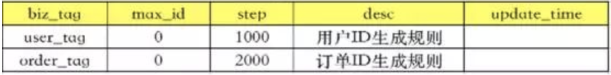

biz_tag只是表示业务，用户服务和订单服务对应的都可能是一大批集群应用。max_id表示现在整个系统中已经分配的最大ID。step表示应用每次过来申请的ID数量。

然后，当第一个订单应用过来申请ID时，就将max_id往前加一个step，变成2000。就表示这2000个ID就分配给这个订单应用了。然后这个订单应用就可以在内存中随意去分配[0,2000)这些ID。而第二个订单应用过来申请ID时，获得的就是[2000,4000)这一批订单应用。这样两个订单应用的ID可以保证不会冲突。

这个策略中有一个最大的问题，就是申请ID是需要消耗网络资源的，在申请资源期间，应用就无法保持高可用了。所以有一种解决方案就是双Buffer写入。

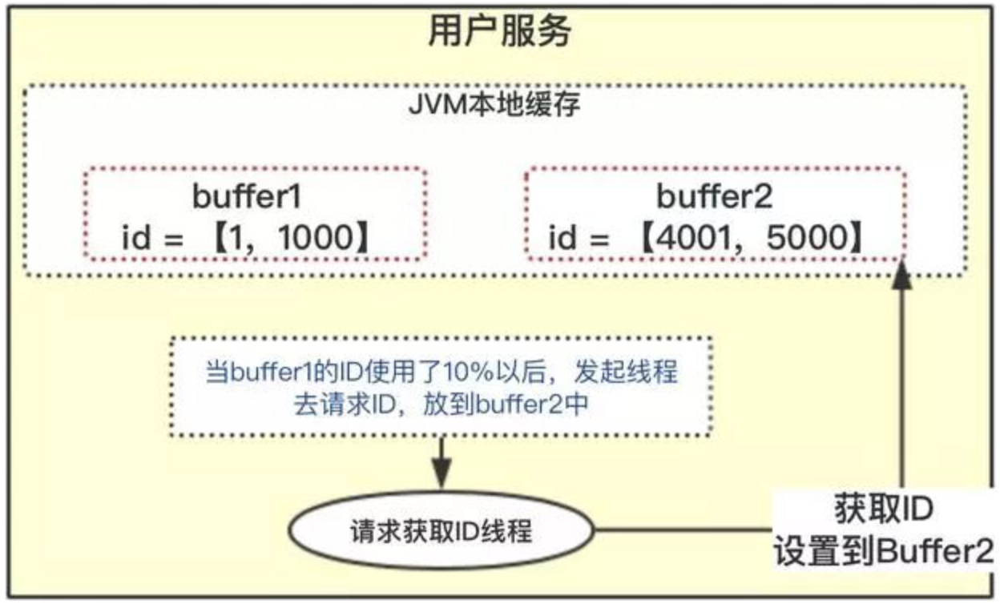

应用既然可以接收一段ID，那就可以再准备一个Buffer，接收另一段ID。当Buffer1的ID使用了10%后，就发起线程去请求ID，放到Buffer2中。等Buffer1中的ID用完了，应用就直接从Buffer2中分配ID。然后等Buffer2用到10%，再同样缓过来。通过双Buffer的交替使用，保证在应用申请ID期间，本地的JVM缓存中一直都是有ID可以分配的。

没错，这就是美团Leaf的完整方案。

他的好处比较明显。ID单调递增，在一定范围内，还可以保持严格递增。通过JVM本地进行号段缓存，性能也很高。

但是这种方案也有几个明显的不足之处。

1、强依赖于DB。其实你可以想象，DB中最为核心的就是max_id和step两个字段而已。这两个字段其实可以往其他存储迁移。想用那个就用哪个不是更方便？这个想法现在不需要自己动手了，CosID已经实现了。数据库、Redis、Zookeeper、MongoDB，想用哪个就用哪个。程序员又找到了一个偷懒的理由。

2、10%的阈值不太灵活。如果应用中的业务非常频繁，分配ID非常快，10%有可能不够。而如果业务非常慢，10%又有点浪费，因为申请过来的ID，如果应用一停机，就浪费掉了。所以，其实可以添加一个动态控制功能，根据分配ID的频率，灵活调整这个阈值，保持本地缓存内的ID数量基本稳定。并且，这也可以用来定制限流方案。

3、延长本地缓存。不管你用哪种服务来充当号段分配器，还是会有一个问题。如果号段分配器挂了，本地应用就只能通过本地缓存撑一段时间。这时，是不是可以考虑多缓存几个号段，延长一下支撑的时间呢？

CosId也想到了，直接将双Buffer升级成了SegmentChain。用一个链表的方式可以灵活缓存更多的号段。默认保留10个Segment，并且在后面分配ID的过程中，也尽量保证SegmentChain中的Segment个数不少于10个。这不就是为了保证本地缓存能够比较充足吗？

4、ID的安全性其实是不太高的。分配的ID在同一个号段内是连续的，之前分析过，这种规律过于明显的ID其实是不太安全的。在面向互联网使用的时候，还是需要自行进行一些打散的操作。比如下面会提到一种方法，将生成的主键作为雪花算法的工作机器位，再次计算生成主键。

以上这几类可以认为是比较基础的分布式主键生成工具。以这些方案为基础，就诞生了很多其他的玩法。下面分享几种典型的思路。

# 四、定制雪花算法

雪花算法是twitter公司开源的ID生成算法。他不需要依赖外部组件，算法简单，效率也高。也是实际企业开发过程中，用得最为广泛的一种分布式主键生成策略。

雪花算法的基础思想是采用一个8字节的二进制序列来生成一个主键。为什么用8个字节？因为8字节正好就是一个Long类型的变量。即保持足够的区分度，又能比较自然的与业务结合。

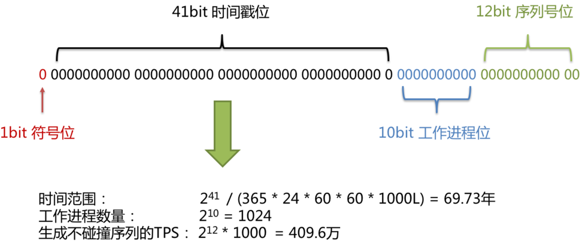

可以看到，SNOWFLAKE其实还是以41个bit的时间戳为主体，放在最高位。接下来10个bit位的工作进程位，是用来标识每一台机器的。但是实现时，是留给应用自行扩展的。后面12个bit的序列号则就是一个自增的序列位。

其核心思想就是将唯一值拼接成一个整体唯一值。首先从整体上来说，时间戳是一个最好的保证趋势递增的数字，所以时间戳自然是主体，放到最高位。但是如果有多个节点同时生成，那么就有可能产生相同的时间戳。怎么办？那就把进程ID给拼接上来。接下来如果在同一个进程中有多个线程同时生成，那么还是会产生相同的ID，怎么办？那就再加上一个严格递增的序列位。这样就整体保证了全局的唯一性。

在标准的雪花算法基础上，也诞生了很多类似的雪花算法实现。无非就是对这些数据根据业务场景进行重组。比如缩短时间戳位，将工作进程位加长，拆分成为datacenter和worker两个部分，等等，但是其实万变不离其宗。

这里唯一需要注意下的是中间的第二部分，很多人只是简单地把他理解为服务器的ID，其实这是有问题的。同一个服务器上可以跑多个服务应用。雪花算法要求的工作进程是区分这些应用，而不是这些机器的。其实你可以想象，就是在这种情况下，不同进程之间的时间戳相同的概率会更高，工作进程位的作用才更重要。简单理解为机器ID，反而会很容易产生一些误解。

而在具体实现时，雪花算法实际上只是提供了一个思路，并没有提供现成的框架。比如ShardingSphere中的雪花算法就是这样生成的。

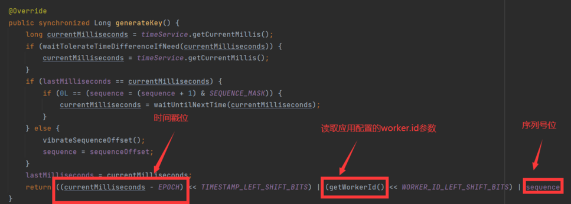

这里面其实隐藏三个问题：

## 	1、时钟回拨问题

雪花算法强依赖于时钟，而高精度的时钟是很难保持一致的。一方面，在分布式场景下，多个机器之间的时钟很难统一，这个倒是可以依赖于Ntpd这样的服务进行通知。但是在同一个机器上，由于时钟只能依赖内核的电信号维护，而电信号很难保持稳定，这也就造成操作系统上的时钟并不是准确的。在高并发场景下，获得的高精度时间戳，有时候会往前跳，有时候又会往回拨。一旦时钟往回拨，就有可能产生重复的ID，这就是时钟回拨问题。

雪花算法其实并没有提供针对时钟回拨问题的标准解决方案，这其实也造成了一些小分歧。解决时钟回拨问题的基本思路都是应用自己记录上一次生成主键的时间戳，然后拿当前时间和上一次的时间进行比较。如果当前时间小于上一次的时间戳了，那就发生了时钟回拨。但是发现问题后怎么处理呢？ShardingSphere中默认的解决方式是让当前线程休眠一会。例如上图中waitToLerateTimeDifferenceIfNeed方法就是在处理时钟回拨问题。

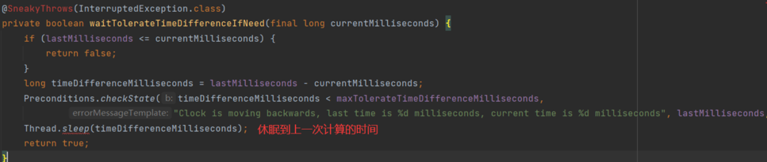

而当前版本ShardingSphere集成了COSID主键生成框架。框架中也包含了雪花算法。他发现时钟回拨，就直接抛出异常了。

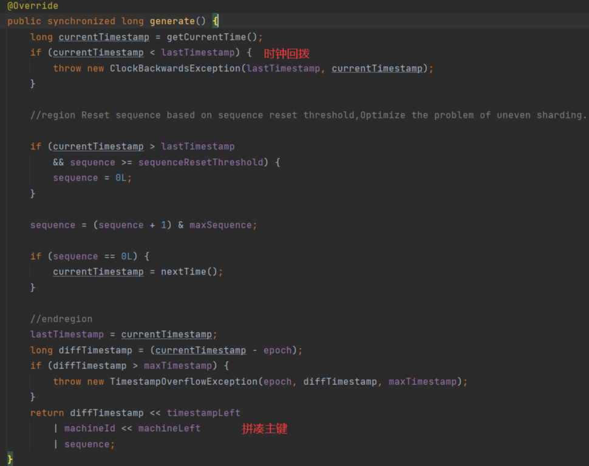

这里的重点不是想要讨论哪种处理时钟回拨问题更合理。而是可以看到，只要使用雪花算法，就埋下了时钟回拨这个雷，需要应用自行去处理。这对于一个没有标准实现的工具型算法来说，不得不说是一种遗憾。

另外，这种传统的雪花算法通过本地保存时间戳的方式来判断是不是发生了时钟回拨，也只能保证本地时间戳是递增的。那么在多个服务组成的集群当中，就无法保证时间戳的统一了。虽然可以通过给每个服务配置不同的工作进程位来防止不同服务之间的主键冲突，但是，万一应用没有配呢？至少我就见过大部分的应用不会为了一个小小的雪花算法去单独考虑如何分配工作进程位。然后，当然也可以使用ntpd这样的时间同步服务把多个机器的时间同步一下，但是同样，不会有人为了一个小小的雪花算法就这么去做。

有一种优化方案就是将时间戳也从本地扔到第三方服务上去，比如Zookeeper。这样多个服务就可以根据共同的时间戳往前推进，省却了时间同步的麻烦。美团的Leaf就是这么做的。但是，这样又是会给雪花算法增加强绑定，同时会降低效率。

这似乎又变成了一个需要进行方案取舍、实现优化的头疼环节。就像整个分布式主键生成问题一样。

## 	2、用主键生成策略优化分配工作进程位

雪花算法中的第二个部分，工作进程位是用来区分不同工作进程的。他也是分布式场景下，保证ID不重复的很重要的字段。在雪花算法中，这个工作进程位是交由应用自己指定的。应用可以随意给每个服务分配一个工作进程。 这在小规模集群中是没有问题的。但是，在大规模集群中这就变得有点麻烦了。想想看，你要在一个一百台机器组成的大集群里，给每个机器分配一个不同的ID，这会是什么感觉？

所以，这时有一种思路就是把这个MachineId当做一个短的并发不是很高的分布式主键来处理。用其他分布式主键生成的方式生成工作进程位。没错。 Cosid框架就是这么想的。他对于SnowFlake的改造也就集中在这个工作进程位。关于CosId的具体实现，后面会再做详细分析。这里我们可以先来思考一下这是一个什么样的场景。我们要依赖工作进程位来生成一个分布式唯一主键，然后现在又需要依赖一个分布式唯一主键生成策略来生成一个工作进程位。这个鸡生蛋，蛋生鸡的问题，要如何解套呢？

首先，工作进程位分配并不需要考虑太高的并发。通常工作进程位只需要在一个应用启动的时候进行分配就可以了。在应用运行的过程中，不需要有太多的变化。而且，就算依赖的第三方服务出现问题了，工作进程位分配失败了，在应用启动过程中就抛出错误，等人们把问题处理完了再分配，也没有什么大的问题。所以工作进程位不需要像分布式唯一主键那样，考虑那么多的缓存、高性能等问题，每次单步推进。申请一次，分配一个就行了。

然后，工作进程位有一些天然的带有唯一性的因素。如果只是粗略的把一个工作进程看成是一台机器，也就是每台机器只运行一个服务的简单场景。那么其实读取服务器的IP地址就已经是一个区分不同工作进程的唯一因素了。但是，如果考虑到每台机器运行多个服务，甚至还包含Docker等各种虚拟化技术的场景，IP地址就不够了。但是，此时，如果再加上一个运行端口，就可以区分唯一了。所以，工作进程位的分配，相比于分布式主键生成策略，其实天生就是可以有很多现成的唯一性因素的，不需要像雪花算法那样去设计复杂的结构。

最后，工作进程位的分配需要可以保持稳定。工作进程与分布式主键还有一个区别，就是工作进程毕竟还是要与一个应用服务建立绑定关系的。给一个应用分配了一个工作进程位之后，如果应用崩溃了，为了保证应用重启后，能够保持稳定的工作状态，他后续产生的雪花ID还是能够保持稳定的区分度。所以，在应用当中分配了一个工作进程位之后，就可以用一个本地缓存，把这个结果保存下来。如果应用重启后，还需要继续保持，那么这个缓存还可以持久化到本地文件当中。

其实把这几个方面想明白了，Cosid当中的工作进程位分配机制也就大致成型了。到底是不是这样呢？别急，后面马上就轮到Cosid出场了。

## 3、从序列号字段定制雪花算法的连续性	

雪花算法生成的ID是不连续的，这很容易理解。但是很多时候，在进行分库分表时，我们还是希望雪花算法生成的ID能够保持某一种规律，这样在定制分库分表算法时，才可以比较好的定制数据分片算法。但是，很可惜，雪花算法给你埋着坑呢。

回到我们开头的小问题。我用ShardingSphere原生的雪花算法生成了一批主键，然后尝试按照之前配置的规则进行拆分。会发现很奇怪的现象，库对2取模，很均匀的分配到了两个片。但是表是对4取模的，也均匀的分到了两个片。用这样的算法去实际分库分表，当然只能分到两个片。

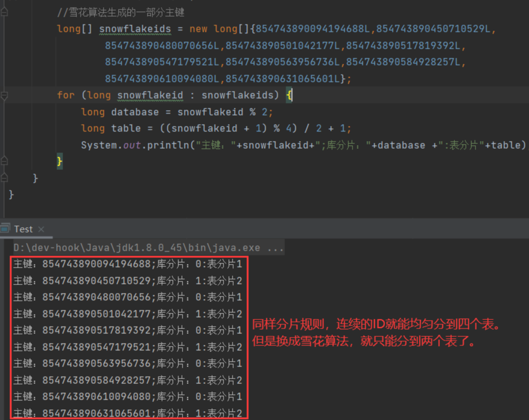

这是为什么呢？简单理解，就是雪花算法生成的结果不连续呗。但是为什么会体现出奇偶分配很均匀的情况呢？这就要深入到雪花算法的实现里了。

因为雪花算法虽然最后规定了一个序列位，只有在lastMilliseconds == currentMilliseconds时才往上加1，否则就重置为-1。简单理解，就是只有在时间戳相同的时候，序列号才往上加1.如果时间戳不同，序列号就会从0开始往上叠加。再加上只有在lastMilliseconds == currentMilliseconds时，才会将currentMilliseconds推进到下一个时间点。这时，在单线程情况下，雪花算法生成的一系列ID的序列位就是有规律的0,1,0,1。

是不是这样呢？验证一下就知道了。

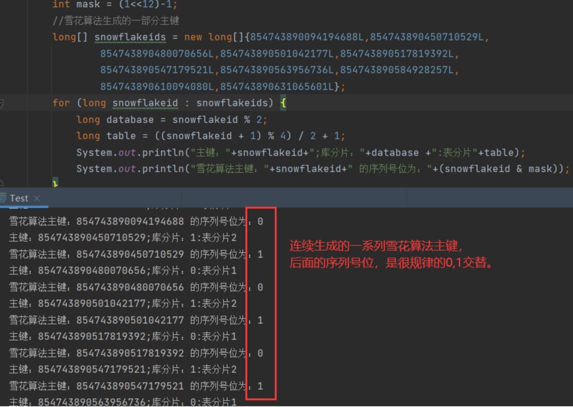

搞清楚问题后，解决的方案比较简单了。在这个场景下，最简单的一种修改方式，就是让sequence每次都加1呗。不管时间戳相不相同，都加1。然后只要不超过12bit的范围，这样对2取模，对4取模这些不就都能均匀分布了吗？

例如简单的将雪花算法的生成逻辑做一下调整。

```java
@Override
    public synchronized Long generateKey() {
        long currentMilliseconds = timeService.getCurrentMillis();
        if (waitTolerateTimeDifferenceIfNeed(currentMilliseconds)) {
            currentMilliseconds = timeService.getCurrentMillis();
        }
        if (lastMilliseconds == currentMilliseconds) {
//            if (0L == (sequence = (sequence + 1) & SEQUENCE_MASK)) {
                currentMilliseconds = waitUntilNextTime(currentMilliseconds);
//            }
        } else {
            vibrateSequenceOffset();
//            sequence = sequenceOffset;
            //让sequence单调递增
            sequence = sequence >= SEQUENCE_MASK ? 0:sequence+1;
            //sequence = SEQUENCE_MASK==sequence&SEQUENCE_MASK ? 0 : sequence +1;
        }
        lastMilliseconds = currentMilliseconds;
        return ((currentMilliseconds - EPOCH) << TIMESTAMP_LEFT_SHIFT_BITS) | (getWorkerId() << WORKER_ID_LEFT_SHIFT_BITS) | sequence;
    }
```

这样生成出来的雪花算法，就能保证序列号位基本上是连续的。数据也能正常分到四个分片了。

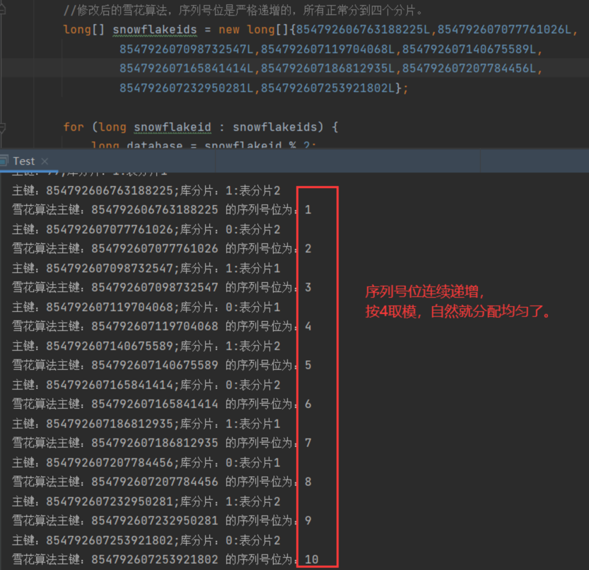

可以看到，这个序列号位连续递增了之后，数据分片的结果也均匀了。

由此可见，雪花算法虽然在保证全局唯一的场景下，是几乎无可挑剔的，但是结合具体的业务场景，他却并不是金科玉律。需要结合业务场景进行灵活定制。

当然，这个分库分表的场景，改改雪花算法，你可能觉得是我小题大做，那么下面这个业务场景，你一定要仔细看看。

> 雪花算法一直是分布式ID的标准。CosId算法也自行实现了一套SnowFlake的实现，并且这套实现已经集成到了ShardingSphere的正式版本当中。那么他对这个雪花算法到底动了些什么手脚呢？