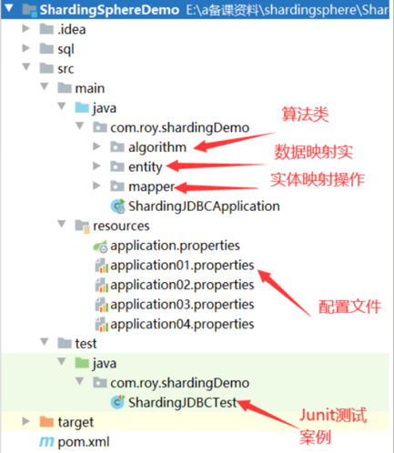
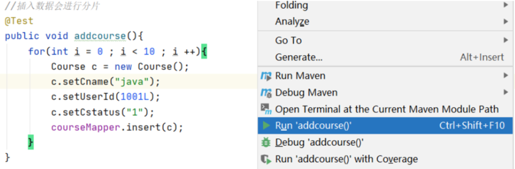
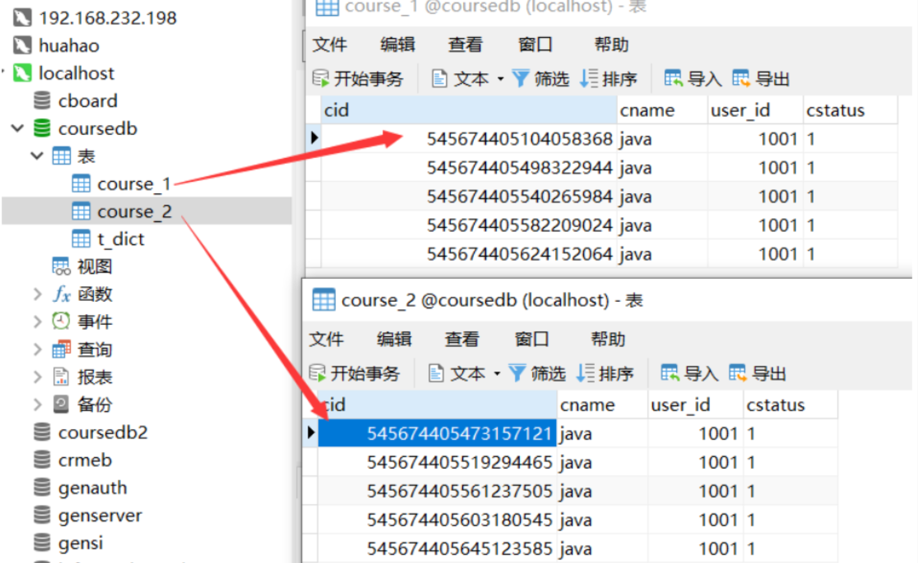

# 一、ShardingSphere产品介绍


ShardingSphere是一款起源于当当网内部的应用框架。2015年在当当网内部诞生，最初就叫ShardingJDBC。2016年的时候，由其中一个主要的开发人员张亮，带入到京东数科，组件团队继续开发。在国内历经了当当网、电信翼支付、京东数科等多家大型互联网企业的考验，在2017年开始开源。并逐渐由原本只关注于关系型数据库增强工具的ShardingJDBC升级成为一整套以数据分片为基础的数据生态圈，更名为ShardingSphere。到2020年4月，已经成为了Apache软件基金会的顶级项目。

ShardingSphere包含三个重要的产品，ShardingJDBC、ShardingProxy和ShardingSidecar。其中sidecar是针对service mesh定位的一个分库分表插件，目前在规划中。而我们今天学习的重点是ShardingSphere的JDBC和Proxy这两个组件。

其中，ShardingJDBC是用来做客户端分库分表的产品，而ShardingProxy是用来做服务端分库分表的产品。这两者定位有什么区别呢？我们看下官方资料中给出的两个重要的图：

**ShardingJDBC**:


shardingJDBC定位为轻量级 Java 框架，在 Java 的 JDBC 层提供的额外服务。它使⽤客户端直连数据库，以 jar 包形式提供服务，⽆需额外部署和依赖，可理解为增强版的 JDBC 驱动，完全兼容 JDBC 和各种 ORM 框架。

**ShardingProxy**


ShardingProxy定位为透明化的数据库代理端，提供封装了数据库⼆进制协议的服务端版本，⽤于完成对异构语⾔的⽀持。⽬前提供 MySQL 和 PostgreSQL 版本，它可以使⽤任何兼容 MySQL/PostgreSQL 协议的访问客⼾端。

那这两种方式有什么区别呢？

|       | Sharding-JDBC | Sharding-Proxy   |
| ----- | ------------- | ---------------- |
| 数据库   | 任意            | MySQL/PostgreSQL |
| 连接消耗数 | 高             | 低                |
| 异构语言  | 仅java         | 任意               |
| 性能    | 损耗低           | 损耗略高             |
| 无中心化  | 是             | 否                |
| 静态入口  | 无             | 有                |

很显然，ShardingJDBC只是客户端的一个工具包，可以理解为一个特殊的JDBC驱动包，所有分库分表逻辑均由业务方自己控制，所以他的功能相对灵活，支持的数据库也非常多，但是对业务侵入大，需要业务方自己定制所有的分库分表逻辑。而ShardingProxy是一个独立部署的服务，对业务方无侵入，业务方可以像用一个普通的MySQL服务一样进行数据交互，基本上感觉不到后端分库分表逻辑的存在，但是这也意味着功能会比较固定，能够支持的数据库也比较少。这两者各有优劣。

# 二、ShardingSphere生态定位

对于ShardingSphere，大家用得多的一般是他的4.x版本，这也是目前最具影响力的一个系列版本。但是，ShardingSphere在2021年底，发布了5.x版本的第一个发布版，这也标志着ShardingSphere的产品定位进入了一个新的阶段。官网上也重点标识了一下ShardingSphere的发展路线：


其实从4.x版本升级到5.x版本，ShardingSphere做了很多功能增强，但是其核心功能并没有太大的变化。更大的区别其实是体现在产品定位上，在4.x版本中，ShardingSphere是定位为一个数据库中间件，而到了5.x版本，ShardingSphere给自己的定位成了DatabasePlus，旨在构建多模数据库上层的标准和生态，从而更接近于Sphere(生态)的定位。


其中核心的理念就是图中的连接、增量、可拔插。一方面未来会支持更多的数据库，甚至不光是MySQL、PostGreSQL这些关系型数据库，还包括了像RocksDB，Redis这一类非关系型的数据库。又一方面会拓展ShardingSphere的数据库功能属性，让用户可以完全基于ShardingSphere来构建上层应用，而其他的数据库只是作为ShardingSphere的可选功能支持。另一方面形成 微内核+三层可拔插扩展 的模型(图中的L1,L2,L3三层内核模型)，让开发者可以在ShardingSphere的内核基础上，做更灵活的功能拓展，可以像搭积木一样定制属于自己的独特系统。

虽然从目前来看，ShardingSphere离他自己构建的这个宏伟蓝图还非常遥远，但是从他逐渐清晰的功能定位可以看出，未来可期。而这也确确实实的带来了github上关注度增长。相比MyCat、DBLE等其他产品，未来更有吸引力。

由于ShardingSphere5.X版本还只提出短短几个月的时间，所以接下来的实战部分，我们依然会选用更为稳定的4.X版本。在课程最后会跟大家再来分享一下5.X版本的一些新特性。

# 三、ShardingJDBC实战

ShardingJDBC是整个ShardingSphere最早也是最为核心的一个功能模块，他的主要功能就是数据分片和读写分离，通过ShardingJDBC，应用可以透明的使用JDBC访问已经分库分表、读写分离的多个数据源，而不用关心数据源的数量以及数据如何分布。

## 1、核心概念

*   逻辑表：水平拆分的数据库的相同逻辑和数据结构表的总称


*   真实表：在分片的数据库中真实存在的物理表。


*   数据节点：数据分片的最小单元。由数据源名称和数据表组成


*   绑定表：分片规则一致的主表和子表。


*   广播表：也叫公共表，指素有的分片数据源中都存在的表，表结构和表中的数据在每个数据库中都完全一致。例如字典表。


*   分片键：用于分片的数据库字段，是将数据库(表)进行水平拆分的关键字段。SQL中若没有分片字段，将会执行全路由，性能会很差。

## 2、测试项目介绍

测试项目参见配套的ShardingDemo项。首先我们对测试项目的结构做下简单的梳理：



> 注：1、引入MyBatisPlus依赖，简化JDBC操作，这样我们就不需要在代码中写SQL语句了。
>
> 2、entity中的实体对象就对应数据库中的表结构。而mapper中的接口则对应JDBC操作。
>
> 3、所有操作均使用JUnit的测试案例执行。 后续所有测试操作都会配合application.properties中的配置以及JUnit测试案例进行。
>
> 4、关于ShardingSphere版本，由于目前最新的5.0版本还在孵化当中，所以我们使用已发布的4.1.1版本来进行学习。


*   分片算法：通过分片算法将数据进行分片，支持通过=、BETWEEN和IN分片。分片算法需要由应用开发者自行实现，可实现的灵活度非常高。


*   分片策略：真正用于进行分片操作的是分片键+分片算法，也就是分片策略。在ShardingJDBC中一般采用基于Groovy表达式的inline分片策略，通过一个包含分片键的算法表达式来制定分片策略，如t\_user\_\$->{u\_id%8}标识根据u\_id模8，分成8张表，表名称为t\_user\_0到t\_user\_7。


## 3、快速实战

我们先运行一个简单的实例，来看下ShardingJDBC是如何工作的。

在application.properties配置文件中写入application01.properties文件的内容：

```properties
#垂直分表策略
# 配置真实数据源
spring.shardingsphere.datasource.names=m1

# 配置第 1 个数据源
spring.shardingsphere.datasource.m1.type=com.alibaba.druid.pool.DruidDataSource
spring.shardingsphere.datasource.m1.driver-class-name=com.mysql.cj.jdbc.Driver
spring.shardingsphere.datasource.m1.url=jdbc:mysql://localhost:3306/coursedb?serverTimezone=GMT%2B8
spring.shardingsphere.datasource.m1.username=root
spring.shardingsphere.datasource.m1.password=root

# 指定表的分布情况 配置表在哪个数据库里，表名是什么。水平分表，分两个表：m1.course_1,m1.course_2
spring.shardingsphere.sharding.tables.course.actual-data-nodes=m1.course_$->{1..2}

# 指定表的主键生成策略
spring.shardingsphere.sharding.tables.course.key-generator.column=cid
spring.shardingsphere.sharding.tables.course.key-generator.type=SNOWFLAKE
#雪花算法的一个可选参数
spring.shardingsphere.sharding.tables.course.key-generator.props.worker.id=1

#使用自定义的主键生成策略
#spring.shardingsphere.sharding.tables.course.key-generator.type=MYKEY
#spring.shardingsphere.sharding.tables.course.key-generator.props.mykey-offset=88

#指定分片策略 约定cid值为偶数添加到course_1表。如果是奇数添加到course_2表。
# 选定计算的字段
spring.shardingsphere.sharding.tables.course.table-strategy.inline.sharding-column= cid
# 根据计算的字段算出对应的表名。
spring.shardingsphere.sharding.tables.course.table-strategy.inline.algorithm-expression=course_$->{cid%2+1}

# 打开sql日志输出。
spring.shardingsphere.props.sql.show=true

spring.main.allow-bean-definition-overriding=true
```

> 1、首先定义一个数据源m1，并对m1进行实际的JDBC参数配置
>
> 2、spring.shardingsphere.sharding.tables.course开头的一系列属性即定义了一个名为course的逻辑表。
>
> actual-data-nodes属性即定义course逻辑表的实际数据分布情况，他分布在m1.course\_1和m1.course\_2两个表。
>
> key-generator属性配置了他的主键列以及主键生成策略。ShardingJDBC默认提供了UUID和SNOWFLAKE两种分布式主键生成策略。
>
> table-strategy属性即配置他的分库分表策略。分片键为cid属性。分片算法为course\_\$->{cid%2+1}，表示按照cid模2+1的结果，然后加上前面的course\_\_ 部分作为前缀就是他的实际表结果。注意，这个表达式计算出来的结果需要能够与实际数据分布中的一种情况对应上，否则就会报错。
>
> sql.show属性表示要在日志中打印实际SQL
>
> 3、coursedb的表结构见示例中sql文件夹中的sql语句。

然后我们执行测试案例中的addcourse案例。



执行后，我们可以在控制台看到很多条这样的日志：

    2025-03-31 18:35:16.426  INFO 22412 --- [           main] ShardingSphere-SQL                       : Logic SQL: INSERT INTO course  ( cname,
    user_id,
    cstatus )  VALUES  ( ?,
    ?,
    ? )
    2025-03-31 18:35:16.427  INFO 22412 --- [           main] ShardingSphere-SQL                       : SQLStatement: InsertStatementContext(super=CommonSQLStatementContext(sqlStatement=org.apache.shardingsphere.sql.parser.sql.statement.dml.InsertStatement@1cbc5693, tablesContext=org.apache.shardingsphere.sql.parser.binder.segment.table.TablesContext@124d26ba), tablesContext=org.apache.shardingsphere.sql.parser.binder.segment.table.TablesContext@124d26ba, columnNames=[cname, user_id, cstatus], insertValueContexts=[InsertValueContext(parametersCount=3, valueExpressions=[ParameterMarkerExpressionSegment(startIndex=59, stopIndex=59, parameterMarkerIndex=0), ParameterMarkerExpressionSegment(startIndex=62, stopIndex=62, parameterMarkerIndex=1), ParameterMarkerExpressionSegment(startIndex=65, stopIndex=65, parameterMarkerIndex=2), DerivedParameterMarkerExpressionSegment(super=ParameterMarkerExpressionSegment(startIndex=0, stopIndex=0, parameterMarkerIndex=3))], parameters=[java, 1001, 1])], generatedKeyContext=Optional[GeneratedKeyContext(columnName=cid, generated=true, generatedValues=[545674405561237505])])
    2025-03-31 18:35:16.427  INFO 22412 --- [           main] ShardingSphere-SQL                       : Actual SQL: m1 ::: INSERT INTO course_2  ( cname,
    user_id,
    cstatus , cid)  VALUES  (?, ?, ?, ?) ::: [java, 1001, 1, 545674405561237505]

从这个日志中我们可以看到，程序中执行的Logic SQL经过ShardingJDBC处理后，被转换成了Actual SQL往数据库里执行。执行的结果可以在MySQL中看到，course\_1和course\_2两个表中各插入了五条消息。这就是ShardingJDBC帮我们进行的数据库的分库分表操作。



然后，其他的几个配置文件依次对应了其他几种分库分表策略，我们可以一一演示一下。

*   application02.properties: 分库分表示例配置。内置分片算法示例， inline、standard、complex、hint。广播表配置示例。

*   application03.properties: 绑定表示例配置

*   application04.properties: 读写分离示例配置

> 要注意理解在读写分离策略中，ShardingJDBC只能帮我们把读写操作分发到不同的数据库上，而数据库之间的数据同步，还是需要由MySQL主从集群来完成。