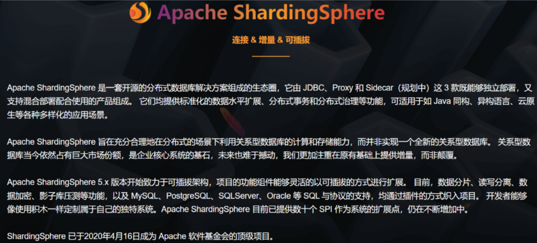
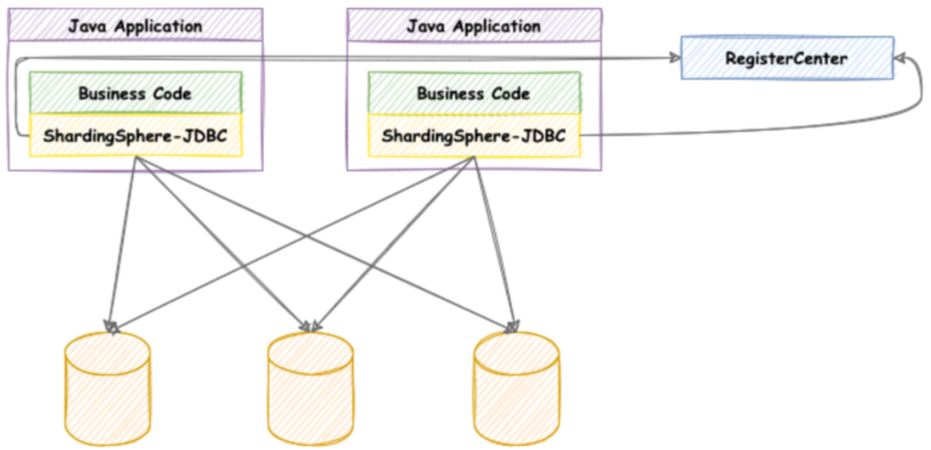
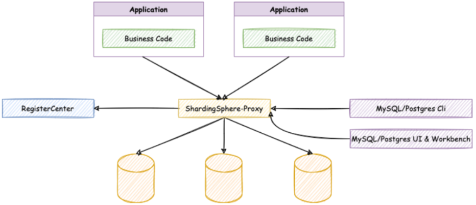
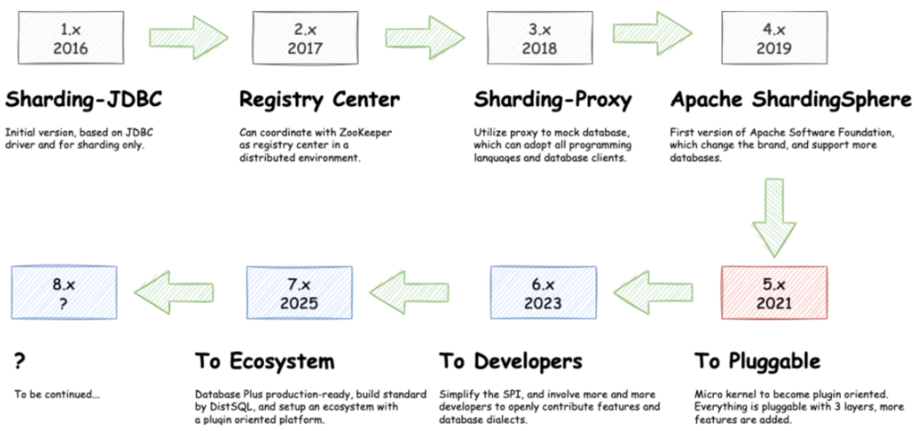
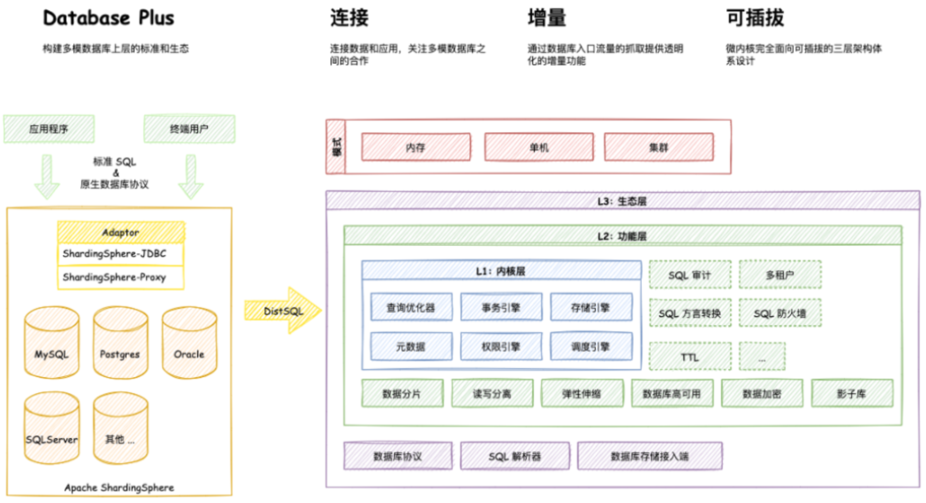

# 一、ShardingSphere产品介绍

ShardingSphere是一款起源于当当网内部的应用框架。2015年在当当网内部诞生，最初就叫ShardingJDBC。2016年的时候，由其中一个主要的开发人员张亮，带入到京东数科，组件团队继续开发。在国内历经了当当网、电信翼支付、京东数科等多家大型互联网企业的考验，在2017年开始开源。并逐渐由原本只关注于关系型数据库增强工具的ShardingJDBC升级成为一整套以数据分片为基础的数据生态圈，更名为ShardingSphere。到2020年4月，已经成为了Apache软件基金会的顶级项目。

ShardingSphere包含三个重要的产品，ShardingJDBC、ShardingProxy和ShardingSidecar。其中sidecar是针对service mesh定位的一个分库分表插件，目前在规划中。而我们今天学习的重点是ShardingSphere的JDBC和Proxy这两个组件。

其中，ShardingJDBC是用来做客户端分库分表的产品，而ShardingProxy是用来做服务端分库分表的产品。这两者定位有什么区别呢？我们看下官方资料中给出的两个重要的图：

**ShardingJDBC**:

shardingJDBC定位为轻量级 Java 框架，在 Java 的 JDBC 层提供的额外服务。它使⽤客户端直连数据库，以 jar 包形式提供服务，⽆需额外部署和依赖，可理解为增强版的 JDBC 驱动，完全兼容 JDBC 和各种 ORM 框架。

**ShardingProxy**

ShardingProxy定位为透明化的数据库代理端，提供封装了数据库⼆进制协议的服务端版本，⽤于完成对异构语⾔的⽀持。⽬前提供 MySQL 和 PostgreSQL 版本，它可以使⽤任何兼容 MySQL/PostgreSQL 协议的访问客⼾端。

那这两种方式有什么区别呢？

|       | Sharding-JDBC | Sharding-Proxy   |
| ----- | ------------- | ---------------- |
| 数据库   | 任意            | MySQL/PostgreSQL |
| 连接消耗数 | 高             | 低                |
| 异构语言  | 仅java         | 任意               |
| 性能    | 损耗低           | 损耗略高             |
| 无中心化  | 是             | 否                |
| 静态入口  | 无             | 有                |

很显然，ShardingJDBC只是客户端的一个工具包，可以理解为一个特殊的JDBC驱动包，所有分库分表逻辑均由业务方自己控制，所以他的功能相对灵活，支持的数据库也非常多，但是对业务侵入大，需要业务方自己定制所有的分库分表逻辑。而ShardingProxy是一个独立部署的服务，对业务方无侵入，业务方可以像用一个普通的MySQL服务一样进行数据交互，基本上感觉不到后端分库分表逻辑的存在，但是这也意味着功能会比较固定，能够支持的数据库也比较少。这两者各有优劣。

# 二、ShardingSphere生态定位

对于ShardingSphere，大家用得多的一般是他的4.x版本，这也是目前最具影响力的一个系列版本。但是，ShardingSphere在2021年底，发布了5.x版本的第一个发布版，这也标志着ShardingSphere的产品定位进入了一个新的阶段。官网上也重点标识了一下ShardingSphere的发展路线：

其实从4.x版本升级到5.x版本，ShardingSphere做了很多功能增强，但是其核心功能并没有太大的变化。更大的区别其实是体现在产品定位上，在4.x版本中，ShardingSphere是定位为一个数据库中间件，而到了5.x版本，ShardingSphere给自己的定位成了DatabasePlus，旨在构建多模数据库上层的标准和生态，从而更接近于Sphere(生态)的定位。

其中核心的理念就是图中的连接、增量、可拔插。一方面未来会支持更多的数据库，甚至不光是MySQL、PostGreSQL这些关系型数据库，还包括了像RocksDB，Redis这一类非关系型的数据库。又一方面会拓展ShardingSphere的数据库功能属性，让用户可以完全基于ShardingSphere来构建上层应用，而其他的数据库只是作为ShardingSphere的可选功能支持。另一方面形成 微内核+三层可拔插扩展 的模型(图中的L1,L2,L3三层内核模型)，让开发者可以在ShardingSphere的内核基础上，做更灵活的功能拓展，可以像搭积木一样定制属于自己的独特系统。

虽然从目前来看，ShardingSphere离他自己构建的这个宏伟蓝图还非常遥远，但是从他逐渐清晰的功能定位可以看出，未来可期。而这也确确实实的带来了github上关注度增长。相比MyCat、DBLE等其他产品，未来更有吸引力。

由于ShardingSphere5.X版本还只提出短短几个月的时间，所以接下来的实战部分，我们依然会选用更为稳定的4.X版本。在课程最后会跟大家再来分享一下5.X版本的一些新特性。

# 三、ShardingJDBC实战

ShardingJDBC是整个ShardingSphere最早也是最为核心的一个功能模块，他的主要功能就是数据分片和读写分离，通过ShardingJDBC，应用可以透明的使用JDBC访问已经分库分表、读写分离的多个数据源，而不用关心数据源的数量以及数据如何分布。

## 1、核心概念

*   逻辑表：水平拆分的数据库的相同逻辑和数据结构表的总称

*   真实表：在分片的数据库中真实存在的物理表。

*   数据节点：数据分片的最小单元。由数据源名称和数据表组成

*   绑定表：分片规则一致的主表和子表。

*   广播表：也叫公共表，指素有的分片数据源中都存在的表，表结构和表中的数据在每个数据库中都完全一致。例如字典表。

*   分片键：用于分片的数据库字段，是将数据库(表)进行水平拆分的关键字段。SQL中若没有分片字段，将会执行全路由，性能会很差。

*   分片算法：通过分片算法将数据进行分片，支持通过=、BETWEEN和IN分片。分片算法需要由应用开发者自行实现，可实现的灵活度非常高。

*   分片策略：真正用于进行分片操作的是分片键+分片算法，也就是分片策略。在ShardingJDBC中一般采用基于Groovy表达式的inline分片策略，通过一个包含分片键的算法表达式来制定分片策略，如t\_user\_\$->{u\_id%8}标识根据u\_id模8，分成8张表，表名称为t\_user\_0到t\_user\_7。