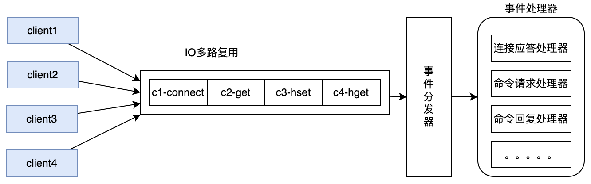

# 深入理解Redis线程模型


# 一、Redis是什么？有什么用？

## 1、Redis是什么？

&#x9;关于Redis，你一定或多或少听说过，互联网集中式缓存的代名词。但是，2024年了，Redis到底是什么呢？

&#x9;Redis 全称 REmote DIctionary Server，远程字典服务，是一个完全开源的，高性能的Key-Value数据库。官网地址： <https://redis.io/> 。引用官网上的一个问答，带你重新了解下Redis。


&#x9;核心总结：

*   数据结构复杂。

Redis相比于传统的K-V型数据库，能够支撑更更复杂的数据类型。这意味着Redis已经远远超出了缓存的范围，可以实现很多复杂的业务场景。并且还在不断发展更多的业务场景。

*   数据保存在内存，但是持久化到硬盘。

数据全部保存在内存，意味着Redis进行数据读和写的性能非常高。是集中式缓存的不二之选。

数据持久化到硬盘，意味着Redis上保存的数据是非常安全的。目前Redis完全可以当做一个数据库来用。

&#x9;所以，官方对Redis的作用，也已经定位成了三个方面：Cache(缓存)，Database(数据库)，Vector Search(向量搜索)


> 截图来自于Redis Cloud

## 2、2024年的Redis是什么样的？

&#x9;在2023年之前，Redis是一个纯粹的开源数据库。但是，在最近的这两年，Redis正在进行华丽的蜕变。从一个缓存产品变成一整套生态服务。


&#x9;其中，Redis Cloud是一套云服务，基于AWS，Azure等公有云，提供了一整套完整的企业服务。 并提供了Redis Enterprise，企业级的收费产品服务。

&#x9;Redis Insight是一套Redis服务的安装及管理套件。可以简单理解为是Redis官方推出的一个图形化客户端。以往使用Redis都需要寻找各种第三方的客户端，现在不用了。并且Redis Insight也可以在Redis Cloud上直接使用。

&#x9;而在功能层面。目前已经形成了Redis OSS和Redis Stack两套服务体系。 其中Redis OSS就是以前常用的开源的服务体系。而Redis Stack可以认为是基于Redis OSS打造的一套更完整的技术栈。基于Redis Cloud提供服务，在Redis OSS功能的基础上，提供了很多高级的扩展功能。


# 二、Redis到底是单线程还是多线程？

&#x9;这是Redis面试过程中最喜欢问的问题。几乎伴随着Redis的整个发展过程。

&#x9;**首先：整体来说，Redis的整体线程模型可以简单解释为 客户端多线程，服务端单线程**

&#x9;Redis为了能够与更多的客户端进行连接，还是使用的多线程来维护与客户端的Socket连接。在redis.conf中就有一个参数maxclients维护了最大的客户端连接数

```conf
# Redis is mostly single threaded, however there are certain threaded
# operations such as UNLINK, slow I/O accesses and other things that are
# performed on side threads.
#
# Now it is also possible to handle Redis clients socket reads and writes
# in different I/O threads. Since especially writing is so slow, normally
# Redis users use pipelining in order to speed up the Redis performances per
# core, and spawn multiple instances in order to scale more. Using I/O
# threads it is possible to easily speedup two times Redis without resorting
# to pipelining nor sharding of the instance.
#
# By default threading is disabled, we suggest enabling it only in machines
# that have at least 4 or more cores, leaving at least one spare core.
# Using more than 8 threads is unlikely to help much. We also recommend using
# threaded I/O only if you actually have performance problems, with Redis
# instances being able to use a quite big percentage of CPU time, otherwise
# there is no point in using this feature.
#
# So for instance if you have a four cores boxes, try to use 2 or 3 I/O
# threads, if you have a 8 cores, try to use 6 threads. In order to
# enable I/O threads use the following configuration directive:
#
# io-threads 4

# Set the max number of connected clients at the same time. By default
# this limit is set to 10000 clients, however if the Redis server is not
# able to configure the process file limit to allow for the specified limit
# the max number of allowed clients is set to the current file limit
# minus 32 (as Redis reserves a few file descriptors for internal uses).
#
# Once the limit is reached Redis will close all the new connections sending
# an error 'max number of clients reached'.
#
# IMPORTANT: When Redis Cluster is used, the max number of connections is also
# shared with the cluster bus: every node in the cluster will use two
# connections, one incoming and another outgoing. It is important to size the
# limit accordingly in case of very large clusters.
#
# maxclients 10000
```

&#x9;但是，在服务端，Redis响应网络IO和键值对读写的请求，则是由一个单独的主线程完成的。Redis基于epoll实现了IO多路复用，这就可以用一个主线程同时响应多个客户端Socket连接的请求。



&#x9;在这种线程模型下，Redis将客户端多个并发的请求转成了串行的执行方式。因此，在Redis中，完全不用考虑诸如MySQL的脏读、幻读、不可重复读之类的并发问题。并且，这种串行化的线程模型，加上Redis基于内存工作的极高性能，也让Redis成为很多并发问题的解决工具。

&#x9;**然后，严格来说，Redis后端的线程模型跟Redis的版本是有关系的。**

&#x9;Redis4.X以前的版本，都是采用的纯单线程。但是在2018年10月份，Redis5.x版本进行了一次大的核心代码重构。 到Redis6.x和7.x版本中，开始用一种全新的多线程机制来提升后台工作。尤其在现在的Redis7.x版本中，Redis后端的很多比较费时的操作，比如持久化RDB，AOF文件、unlink异步删除、集群数据同步等，都是由额外的线程执行的。例如，对于 FLUSHALL操作，就已经提供了异步的方式。


> 实际上，现代CPU早就是多核架构了，Redis如果一直使用单线程，就不能发挥多核CPU的性能优势，迟早是跟不上时代的。并且那些非常耗时的操作，也必然会对主线程产生影响。所以，多线程是一个必然结果。只不过，对于Redis来说，为了保持快速，多线程会走得非常谨慎。
>
> Redis一直保持核心线程的单线程模型，其实是因为对于现代的Redis来说，CPU通常不会成为Redis的性能瓶颈。影响Redis的性能瓶颈大部分是内存和网络。因此，核心线程改为多线程的要求并不急切。另外，Redis的这种单线程为主的工作机制还可以减少线程上下文切换的性能消耗。而且，如果Redis将核心线程改为多线程并发执行，那么就必然带来资源竞争，反而会极大增加Redis的业务复杂性，影响Redis的业务执行效率。