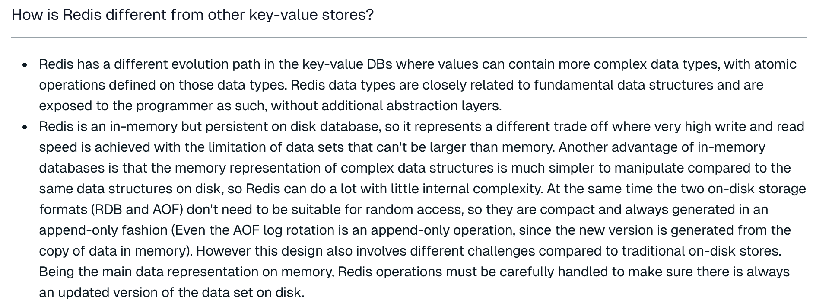
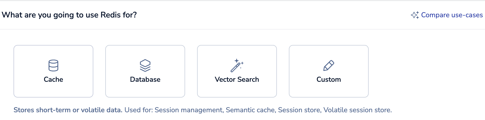
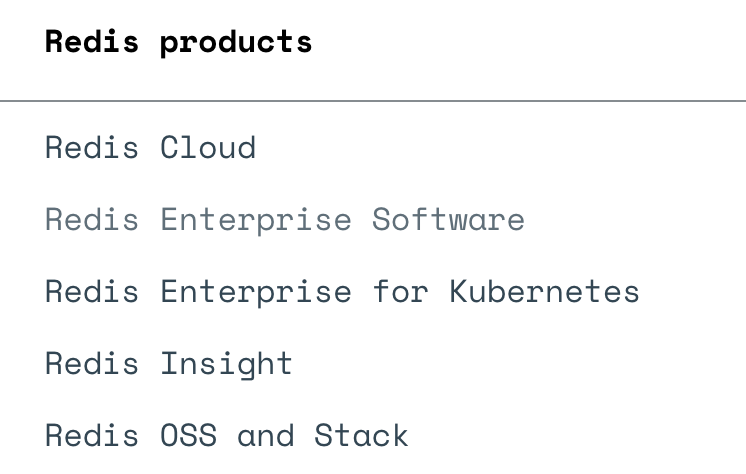

# 深入理解Redis线程模型

# 一、Redis是什么？有什么用？

## 1、Redis是什么？

&#x9;关于Redis，你一定或多或少听说过，互联网集中式缓存的代名词。但是，2024年了，Redis到底是什么呢？

&#x9;Redis 全称 REmote DIctionary Server，远程字典服务，是一个完全开源的，高性能的Key-Value数据库。官网地址： <https://redis.io/> 。引用官网上的一个问答，带你重新了解下Redis。

&#x9;核心总结：

*   数据结构复杂。

Redis相比于传统的K-V型数据库，能够支撑更更复杂的数据类型。这意味着Redis已经远远超出了缓存的范围，可以实现很多复杂的业务场景。并且还在不断发展更多的业务场景。

*   数据保存在内存，但是持久化到硬盘。

数据全部保存在内存，意味着Redis进行数据读和写的性能非常高。是集中式缓存的不二之选。

数据持久化到硬盘，意味着Redis上保存的数据是非常安全的。目前Redis完全可以当做一个数据库来用。

&#x9;所以，官方对Redis的作用，也已经定位成了三个方面：Cache(缓存)，Database(数据库)，Vector Search(向量搜索)

> 截图来自于Redis Cloud

## 2、2024年的Redis是什么样的？

&#x9;在2023年之前，Redis是一个纯粹的开源数据库。但是，在最近的这两年，Redis正在进行华丽的蜕变。从一个缓存产品变成一整套生态服务。

&#x9;其中，Redis Cloud是一套云服务，基于AWS，Azure等公有云，提供了一整套完整的企业服务。 并提供了Redis Enterprise，企业级的收费产品服务。

&#x9;Redis Insight是一套Redis服务的安装及管理套件。可以简单理解为是Redis官方推出的一个图形化客户端。以往使用Redis都需要寻找各种第三方的客户端，现在不用了。并且Redis Insight也可以在Redis Cloud上直接使用。

&#x9;而在功能层面。目前已经形成了Redis OSS和Redis Stack两套服务体系。 其中Redis OSS就是以前常用的开源的服务体系。而Redis Stack可以认为是基于Redis OSS打造的一套更完整的技术栈。基于Redis Cloud提供服务，在Redis OSS功能的基础上，提供了很多高级的扩展功能。