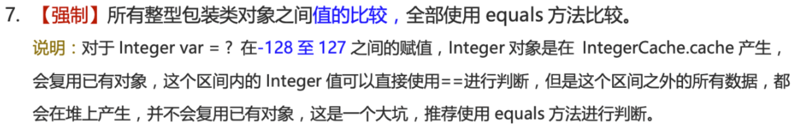

# 基本概念

## Java语言特点

## JVM JDK JRE

## 字节码

## AOT

## Oracle JDK和Open JDK

# 基本语法

## Java中的关键字
| 分类                 | 关键字   |            |          |              |            |           |        |
| :------------------- | -------- | ---------- | -------- | ------------ | ---------- | --------- | ------ |
| 访问控制             | private  | protected  | public   |              |            |           |        |
| 类，方法和变量修饰符 | abstract | class      | extends  | final        | implements | interface | native |
|                      | new      | static     | strictfp | synchronized | transient  | volatile  | enum   |
| 程序控制             | break    | continue   | return   | do           | while      | if        | else   |
|                      | for      | instanceof | switch   | case         | default    | assert    |        |
| 错误处理             | try      | catch      | throw    | throws       | finally    |           |        |
| 包相关               | import   | package    |          |              |            |           |        |
| 基本类型             | boolean  | byte       | char     | double       | float      | int       | long   |
|                      | short    |            |          |              |            |           |        |
| 变量引用             | super    | this       | void     |              |            |           |        |
| 保留字               | goto     | const      |          |              |            |           |        |

> Tips：所有的关键字都是小写的，在 IDE 中会以特殊颜色显示。
>
> `default` 这个关键字很特殊，既属于程序控制，也属于类，方法和变量修饰符，还属于访问控制。
>
> - 在程序控制中，当在 `switch` 中匹配不到任何情况时，可以使用 `default` 来编写默认匹配的情况。
> - 在类，方法和变量修饰符中，从 JDK8 开始引入了默认方法，可以使用 `default` 关键字来定义一个方法的默认实现。
> - 在访问控制中，如果一个方法前没有任何修饰符，则默认会有一个修饰符 `default`，但是这个修饰符加上了就会报错。

⚠️ 注意：虽然 `true`, `false`, 和 `null` 看起来像关键字但实际上他们是字面值，同时你也不可以作为标识符来使用。

## 自增自减运算符

## 移位运算符

# 基本数据类型
| 基本数据类型  | 子节数 | 默认值     | 取值范围       | 对应的包装类型   | 默认值  |
| :------ | :-- | :------ | :--------- | :-------- | :--- |
| byte    | 1   | 0       | -128\~127  | Byte      | null |
| short   | 2   | 0       |            | Short     | null |
| int     | 4   | 0       |            | Integer   | null |
| long    | 8   | 0L      |            | Long      | null |
| float   | 4   | 0f      |            | Float     | null |
| double  | 8   | 0d      |            | Double    | null |
| char    | 2   | 'u0000' |            | Character | null |
| boolean |     | false   | true、false | Boolean   | null |

在二进制补码表示法中，最高位是用来表示符号的（0 表示正数，1 表示负数），其余位表示数值部分。所以，如果我们要表示最大的正数，我们需要把除了最高位之外的所有位都设为 1。如果我们再加 1，就会导致溢出，变成一个负数，故`byte`、`short`、`int`、`long`能表示的最大正数都减 1 了

**为什么说是几乎所有对象实例都存在于堆中呢？** 这是因为 HotSpot 虚拟机引入了 JIT 优化之后，会对对象进行逃逸分析，如果发现某一个对象并没有逃逸到方法外部，那么就可能通过标量替换来实现栈上分配，而避免堆上分配内存

# 包装类型的缓存机制？

Byte、Short、Integer、Long 这4种包装类默认创建了数值[-128, 127]的相应类型的缓存数据，Character创建了数值[0, 127]范围的缓存数据，Boolean直接返回True or False。

# 四、方法

## 1 静态方法为什么不能调用非静态成员？

静态方法是属于类的，在类加载的时候就会分配内存，可以通过类名直接访问。而非静态成员属于实例对象，只有在对象实例化之后才存在，需要通过类的实例对象去访问。

在类的非静态成员不存在的时候静态方法已经存在了，此时调用内存中还不存在的非静态成员，属于非法操作。

## 2 重载和重写有什么区别？

| 区别点   | 重载方法 | 重写方法                             |
| :---- | :--- | :------------------------------- |
| 发生范围  | 同一个类 | 子类                               |
| 参数列表  | 必须修改 | 一定不能修改                           |
| 返回类型  | 可修改  | 子类方法返回值类型应比父类方法返回值类型更小或相等        |
| 异常    | 可修改  | 子类方法声明抛出的异常类应比父类方法声明抛出的异常类更小或相等； |
| 访问修饰符 | 可修改  | 一定不能做更严格的限制（可以降低限制）              |
| 发生阶段  | 编译期  | 运行期                              |

