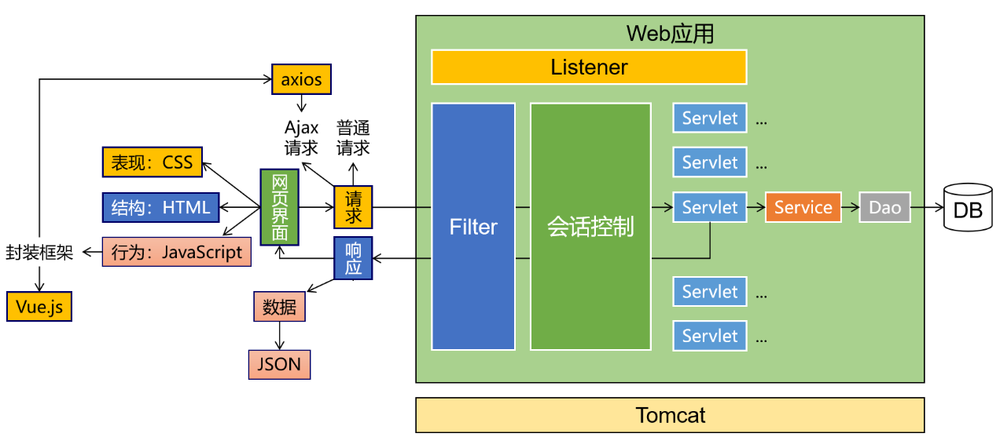

# 一、Web开发要解决的问题

 

 

- 展示用户操作界面
- 从后端获取数据，在用户界面上显示
- 在前端『收集』用户填写的数据发送给后端执行『保存』或『更新』

 

# 二、Web开发相关概念
## 1、C/S模式
- C：Client客户端
- S：Server服务器

 

- 缺点：不同操作系统平台下，同样的功能需要开发很多套不同的程序
	- Android平台
	- IOS平台
	- Windows平台
	- ……

 

## 2、B/S模式
- B：Browser浏览器
- S：Server服务器

 

在浏览器端开发一套用户界面即可，由于主流浏览器都遵循W3C组织定义的网页技术规则，所以同一套网页程序在不同浏览器上能够呈现相同的界面，大大提高开发效率

 

## 3、Web应用
- 应用：Application，特指一款应用程序，我们学编程就是学习开发『应用程序』
- 桌面应用：Microsoft Office、QQ、英雄联盟……等等，在PC端使用的应用程序，我们不做
- Web应用：一款可以通过Web方式访问的应用程序，通常是指通过浏览器访问的应用程序
	- Web应用的前端部分：前端工程
	- Web应用的后端部分：后端工程

 

## 4、请求和响应
前端程序和后端程序交互访问的最基本形式：
- 请求：点菜
- 响应：上菜

 

# 三、学习的目标
- 手段：知识、技术、语法……
- 目的：开发业务功能，给学框架打基础
	- 登录、注册
	- 登录状态检查
	- C：Create 新增、保存
	- R：Retrieve 查询
	- U：Update 更新
	- D：Delete 删除
	- ……

 

> Talk is cheap,show me the code. 
>                                 ——林纳斯·托瓦兹（Linux之父）

 

# 四、技术栈
## 1、前端技术栈
- HTML：定义网页主体结构
- CSS：定义网页布局和显示样式
- JavaScript：编程实现网页动态效果
- Vue：页面渲染和组件化开发框架
- axios：Ajax异步交互框架
- ES6：JavaScript的新语法标准
- Node.js：JavaScript代码执行引擎，让JavaScript代码可以脱离浏览器运行
- npm：JavaScript代码的打包和依赖管理工具
- Vite：帮助我们生成前端工程的目录结构和必要的资源文件
- router：Vue组件化开发环境下，实现组件路由
- Pinia：在前端维护应用程序的全局状态数据
- Promise：JavaScript异步编程，类似于我们Java中的Thread
- ElementPlus：简单、易用、美观的页面控件集

 

## 2、后端技术栈
- XML：常用配置文件格式
- Tomcat：一个可以执行Java代码的Web服务器
- Servlet：一个可以处理请求的特殊的Java类
- HTTP：前后端交互报文的格式规定
- Cookie&Session：会话控制解决方案
- Filter：实现Servlet处理请求之前和之后的统一处理
- Listener：服务器端特定事件的监听与回调

 

## 3、总体机制

 