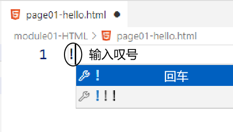

# 一、Web2.0规范
Web2.0规范主张在前端开发中，把结构、表现、行为三者分开，告别此前三者耦合在一起导致代码繁杂难以维护的时代
- 结构：HTML负责实现
- 表现：CSS负责实现
- 行为：JavaScript负责实现

<br/>


## 1、HTML示例


<br/>

## 2、CSS示例


<br/>

## 3、JavaScript示例


<br/>


# 二、HTML简介
## 1、HTML
HTML：Hyper Text Markup Language超文本标记语言。
- 超文本：HTML代码本身是文本，但浏览器却可以基于文本显示多媒体信息
- 标记语言：HTML代码主要是由标签组成的

<br/>


## 2、HTML5
HTML5简称H5，2008年正式发布的HTML新语法标准。相比于之前的语法，H5更简洁、更规范。

<br/>


# 三、First Blood
## 1、创建文件
在电脑任意目录下创建一个文本文件，修改文件名（连同扩展名一起修改）为：index.html

<br/>


<br/>

## 2、编辑文件
使用文本编辑工具打开刚刚创建的文件，编写如下代码：
```html
<html>
	<head>
        <title>我的第一个网页</title>
    </head>
    <body>
        hello html!!!
    </body>
</html>
```

<br/>

## 3、使用浏览器打开文件


<br/>

# 四、HTML语法
## 1、概念
### ①注释
```html
<!-- 这是一个 HTML 注释，不会在浏览器窗口内显示 -->
```

<br/>

### ②标签
```html
<!-- 双标签：开始标签、结束标签 -->
<p>文本标签体</p>

<!-- 单标签 -->
<br>
```

<br/>

### ③属性
```html
<!-- 属性名="属性值" -->
<input type="text" name="userName">
```

<br/>


## 2、规则

> 友情提示：将来我们在IDE环境的协助下编写HTML代码，怎么写都不会写错

- 根标签必须是html标签
- 双标签必须正确关闭
- 标签可以嵌套但不能交叉嵌套
- 注释不能嵌套
- 属性必须有值，除非属性值和属性名一致
- 属性值必须加引号，单引号、双引号都可以
- 不区分大小写

<br/>


# 五、安装VScode【可选】
## 1、安装过程
略

<br/>

## 2、安装插件
复制插件名称，搜索安装<br/>

|插件名称|作用|
|---|---|
|Auto Rename Tag|自动修改标签对插件|
|Chinese Language Pack|汉化包|
|HTML CSS Support|HTML CSS 支持|
|Intellij IDEA Keybindings|IDEA快捷键支持|
|Live Server|实时加载功能的小型服务器|
|open in  browser|通过浏览器打开当前文件的插件|
|Prettier-Code formatter|代码美化格式化插件|
|Vetur|VScode中的Vue工具插件|
|vscode-icons|文件显示图标插件|
|Vue 3 snipptes|生成VUE模板插件|
|Vue language Features|Vue3语言特征插件|

<br/>

## 3、打开工作区
- 在电脑上新建目录
- 使用VScode打开新建的目录

<br/>


<br/>

## 4、新建前端工程


<br/>

## 5、新建文件


<br/>

## 6、生成HTML代码主体结构



<br/>


<br/>

## 7、运行HTML文件查看效果


<br/>


<br/>

# 六、应用场景：文章
## 1、标题标签
```html
    <h1>一级标题</h1>

    <h2>二级标题</h2>

    <h3>三级标题</h3>

    <h4>四级标题</h4>

    <h5>五级标题</h5>

    <h6>六级标题</h6>
```

<br/>


<br/>

标题标签就是用来显示标题的，不要用它们来控制字体大小<br/>
Web2.0开发思想主张根据 HTML 标签本身的语义来开发网页<br/>
结构（HTML）、表现（CSS）、行为（JavaScript）三者分开<br/>
三者分开能够很好的保证各不同技术之间彼此解耦，让代码更简洁、更优雅、更易于维护<br/>
所以这里再次体现了：“高内聚、低耦合”的开发理念<br/>

<br/>


## 2、段落标签
```html
    <p>段落的特点是每个段落独占一行</p>

    <p>段落的特点是每个段落独占一行</p>

    <p>段落的特点是每个段落独占一行</p>
```

<br/>


<br/>


## 3、换行标签
```html
    <!-- 使用br标签换行 -->
    <p>每一个段落，<br/>自己独占一行。</p>
```

<br/>


<br/>

## 4、分割线标签
```html
<p>段落内容</p>
<hr/>
<p>段落内容</p>
```

<br/>


<br/>

## 5、无序列表
```html
<!-- ul是unorder list的缩写 -->
<ul>
	<!-- li是list item的缩写 -->
	<li>中国</li>
	<li>美国</li>
	<li>俄罗斯</li>
</ul>
```

<br/>


<br/>


## 6、超链接
### ①标签语法
- a标签：a字母是anchor单词的第一个字母，anchor是锚的意思
- href属性：指定目标资源的地址（访问路径）
- target属性：取值_blank时，表示在新窗口打开目标页面

<br/>


### ②路径说明
#### 【1】物理路径
- 概念：从物理磁盘的根目录开始的完整路径
```text
D:\location\atguigu-front-end-230522\module01-HTML\target\page-target.html
```
- 问题：完全不具备可迁移性，只能在当前开发人员自己的电脑上运行。而实际开发时，肯定是需要把程序部署到服务器上运行，程序代码必须具备可迁移性。
- <span style="color:blue;font-weight:bolder;">结论</span>：<span style="color:red;font-weight:bolder;">坚决不用！！！</span>

<br/>

#### 【2】相对路径
- 概念：以当前页面自身为基准，逐层查找目标资源
```text
以当前目录为基准：target\page-target.html
以当前目录为基准：.\target\page-target.html
以上一级目录为基准：..\xxx\target\page-target.html
```
- 问题：将来遇到Servlet里面请求的转发，相对路径参照的基准就会发生变化
- <span style="color:blue;font-weight:bolder;">结论</span>：<span style="color:red;font-weight:bolder;">暂时可用</span>

<br/>

#### 【3】绝对路径
- 概念：以斜杠开头的目录
- 基准：开头的斜杠代表服务器根目录，然后根据实际目录结构逐层查找资源
```text
\module01-HTML\target\page-target.html
```
- 好处：不论Servlet怎么转发都不怕，开头斜杠的基准是不变的
- <span style="color:blue;font-weight:bolder;">结论</span>：<span style="color:blue;font-weight:bolder;">建议使用</span>

<br/>


## 7、图片标签
- img标签：image单词的缩写
- src属性：指定图片资源的路径
```html

```

<br/>


## 8、音乐播放组件【选学】
- audio标签：负责显示音乐播放组件
- src属性：指定音乐文件资源的路径
- controls属性：是否显示音乐播放组件的控制界面
- autoplay属性：控制音乐播放组件在打开页面时是否自动播放
```html
<audio src="\module01-HTML\images\music.mp3" controls="controls" autoplay="autoplay"/>
```

<br/>


## 9、视频播放组件【选学】
- width属性：视频播放时的宽度，单位是像素
- height属性：视频播放时的高度，单位是像素
```html
<video src="\module01-HTML\images\pain.mp4" controls="controls" autoplay="autoplay"></video>
```
- 播放组件的小坑：如果要音频、视频播放器互不干扰，那么把它们二者放在各自的div里

<br/>


## 10、HTML实体
对我们文章中用到的特殊符号进行转义，常用的有：

|符号|HTML实体|
|---|---|
|<|&amp;lt;|
|>|&amp;gt;|
|&|&amp;amp;|
|空格|&amp;nbsp;|

<br/>

[官方参考文档点这里](https://www.w3school.com.cn/html/html_entities.asp)

<br/>


# 七、应用场景：表格
## 1、没有任何修饰的表格
```html
<!-- table 标签：定义整个表格 -->
<table>
	<!-- thead 标签：定义表格的头部 -->
	<thead>
		<!-- tr 标签：定义表格中的一行 -->
		<tr>
			<!-- th 标签：定义一个表头单元格，里面文本有加粗效果 -->
			<th>员工id</th>
			<th>员工姓名</th>
			<th>员工年龄</th>
			<th>员工部门</th>
			<th>员工工资</th>
		</tr>
	</thead>

	<!-- tbody 标签：定义表格主体 -->
	<tbody>
		<tr>
			<!-- td 标签：定义普通单元格 -->
			<td>1</td>
			<td>Tom</td>
			<td>25</td>
			<td>RD</td>
			<td>10000</td>
		</tr>
		<tr>
			<!-- td 标签：定义普通单元格 -->
			<td>2</td>
			<td>Jerry</td>
			<td>26</td>
			<td>HR</td>
			<td>8000</td>
		</tr>
		<tr>
			<!-- td 标签：定义普通单元格 -->
			<td>3</td>
			<td>Mary</td>
			<td>35</td>
			<td>FI</td>
			<td>9000</td>
		</tr>
	</tbody>
</table>
```

<br/>

## 2、给表格加样式修饰
整体复制过来，放在head标签里，不要自己写：
```html
<style>
	table {
		/* 合并单元格框线 */
		border-collapse: collapse;

		/* 左右外边距设置为自动，就是水平居中 */
		margin-left: auto;
		margin-right: auto;
	}

	th,td {
		border: 1px black solid;

		/* 设置内边距 */
		padding: 10px;

		/* 文本居中对齐 */
		text-align: center;
	}
</style>
```

<br/>


## 3、合并单元格
```html
<table>
	<tr>
		<th>员工id</th>
		<th>员工姓名</th>
		<th>员工年龄</th>
		<th>员工部门</th>
		<th>员工工资</th>
	</tr>
	<tr>
		<td>1</td>
		<!-- rowspan 属性：设置跨行合并单元格 -->
		<td rowspan="2">Tom</td>
		<td>25</td>
		<td>RD</td>
		<td>10000</td>
	</tr>
	<tr>
		<td>2</td>
		<!-- <td>Jerry</td> -->
		<td>26</td>
		<!-- colspan 属性：设置跨列合并单元格 -->
		<!-- col 是 column 的缩写 -->
		<!-- span 是跨越的意思 -->
		<td colspan="2">HR</td>
		<!-- <td>8000</td> -->
	</tr>
	<tr>
		<td>3</td>
		<td>Mary</td>
		<td>35</td>
		<td>FI</td>
		<td>9000</td>
	</tr>
</table>
```

<br/>

# 八、应用场景：表单
## 1、一个简单的表单
```html
<!-- form 标签：定义一个表单 -->
<!-- action 属性：指定表单提交的目标地址 -->
<!-- 运行效果：表单提交时默认是GET请求方式，请求参数都被附着到了URL地址后面，在浏览器上能看到。 -->
<!-- 危害1：密码在浏览器地址栏明文显示出来，不安全。 -->
<!-- 危害2：URL地址后面附着请求参数容量有限。如果请求参数非常多，就会导致后面的请求参数丢失。 -->
<form action="target/page-target.html">
	<!-- input 标签配合 type 属性取值 text：生成普通文本框 -->
	<!-- name 属性：设定请求参数的名字，便于服务器端识别和提取 -->
	账号：<input type="text" name="username"><br/>
	
	<!-- input 标签配合 type 属性取值 password：生成密码框 -->
	<!-- name 属性：设定请求参数的名字，便于服务器端识别和提取 -->
	密码：<input type="password" name="userPwd"><br/>

	<!-- button 标签配合 type 属性取值 submit：生成表单的提交按钮 -->
	<button type="submit">登录</button>
</form>
```

<br/>


## 2、以POST方式提交的表单
```html
<!-- method 属性：指定提交表单时采用的请求方式，默认是GET方式，建议使用POST方式。 -->
<!-- ※提示：在VSCode中使用Live Server方式会看到HTTP ERROR 405，此时我们不经过服务器，直接在Windows系统中打开页面即可。 -->
<!-- 运行效果：通过POST方式提交表单，不会把请求参数暴露到浏览器地址栏，而是在请求体中携带请求参数。 -->
<!-- 使用建议：开发中，建议大家所有表单都通过POST方式提交。 -->
<form action="target/page-target.html" method="post">
	<!-- 文本框使用 value 属性设置默认值 -->
	账号：<input type="text" name="username" value="haodongge"><br/>
	
	密码：<input type="password" name="userPwd" value="555666"><br/>

	<button type="submit">登录</button>

	<!-- 重置按钮可以把各个表单项的值恢复为默认值 -->
	<button type="reset">重置</button>

	<!-- 设置一个普通按钮，不会提交表单，点击后没有任何效果 -->
	<button type="button">普通按钮</button>
</form>
```

<br/>


Form Data表示表单提交的数据：<br/>


<br/>


<br/>


## 3、单选按钮和多选按钮
```html
<form action="target/page-target.html" method="post">
	<!-- input 标签配合 type 属性取值 radio：生成单选按钮 -->
	<!-- value 属性：设置要给服务器提交的值。 -->
	<!-- checked 属性：设置默认被选中的选项 -->
	你最喜欢的季节：<br/>
	<input type="radio" name="season" value="spring"/>春天<br/>
	<input type="radio" name="season" value="summer" checked="checked"/>夏天<br/>
	<input type="radio" name="season" value="autumn"/>秋天<br/>
	<input type="radio" name="season" value="winter"/>冬天<br/>

	<br/><br/>

	你的性别：<br/>
	<!-- 单选框的互斥性是由name属性设定的。name相同的被设定为一组，组内互斥。 -->
	<input type="radio" name="gender" value="directMan"/>直男<br/>
	<input type="radio" name="gender" value="commonSelfConfidentMan"/>普信男<br/>
	<input type="radio" name="gender" value="downHeadMan" checked="checked"/>下头男<br/>
	<input type="radio" name="gender" value="badHandsomeMan"/>渣男<br/>

	<br/><br/>

	<!-- input 标签配合 type 属性取值 checkbox：生成多选按钮 -->
	<!-- value 属性：设置要给服务器提交的值。 -->
	<!-- checked 属性：设置默认被选中的选项 -->
	你最喜欢的球队：<br/>
	<input type="checkbox" name="team" value="German"/>德国<br/>
	<input type="checkbox" name="team" value="France" checked/>法国<br/>
	<input type="checkbox" name="team" value="Brazil"/>巴西<br/>
	<input type="checkbox" name="team" value="China" checked/>中国<br/>

	<button type="submit">保存</button>

</form>
```

<br/>


## 4、下拉列表
```html
<form action="target/page-target.html" method="post">
	请选择你最希望穿越回去的朝代：<br/>
	<!-- select 标签：定义整个下拉列表 -->
	<!-- name 属性：请求参数的名字 -->
	<select name="period">
		<!-- option 标签：下拉列表项 -->
		<!-- value 属性：设置被选中的option要给服务器提交的值 -->
		<!-- selected 属性：设置默认被选中 -->
		<!-- option 标签的文本标签体：设置给用户看的数据 -->
		<option value="qin">秦朝</option>
		<option value="han">汉朝</option>
		<option value="tang" selected="selected">唐朝</option>
		<option value="song">宋朝</option>
		<option value="yuan">元朝</option>
	</select>

	<br/>

	<button type="submit">保存</button>
</form>
```

<br/>


## 5、多行文本框
在多行文本框中输入内容时，敲回车不会导致表单提交
```html
<form action="target/page-target.html" method="post">
	<!-- textarea标签：定义多行文本框 -->
	<!-- name 属性：设置请求参数名字 -->
    <!-- 在 textarea 标签的文本标签体中设置默认值 -->
	<textarea name="userDesc">请在这里输入用户介绍</textarea>

	<br/>

	<button type="submit">保存</button>
</form>
```

<br/>


## 6、表单隐藏域
表单隐藏域是用来设置那些不希望或不必用户看到，但是又必须和表单一起提交的数据
```html
<form action="target/page-target.html" method="post">
	<input type="hidden" name="userId" value="5533"/>
	<button type="submit">提交</button>
</form>
```

<br/>


## 7、文件上传框
- 上传文件要求 form 标签必须设置 method 为 POST
- 上传文件要求 form 标签必须设置 enctype 为 multipart/form-data
- input 标签配合 type 属性取值 file：生成文件上传框
```html
<form action="target/page-target.html" method="post" enctype="multipart/form-data">
	请选择你的头像：<input type="file" name="headPicture"/><br/>
	<button type="submit">上传</button>
</form>
```