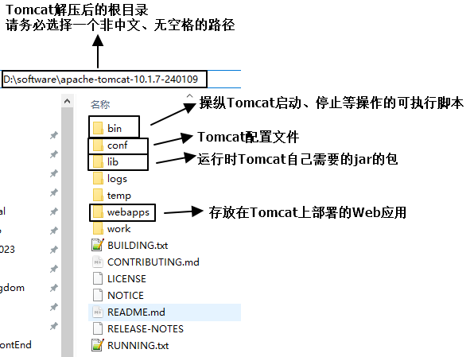
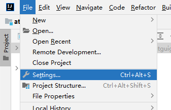

# Tomcat

# 一、简介

## 1、作用

Tomcat在整个体系中扮演的角色是：<span style="color:blue;font-weight:bolder;">服务器</span>


> 友情提示：虽然Tomcat上可以运行多个Web应用，但是实际生产环境下，为了让每一个Web应用能够得到尽可能多的软硬件资源，通常一个Tomcat上只运行一个Web应用。


## 2、官网


[Tomcat官网地址](https://tomcat.apache.org/)


下载地址：


# 二、部署Tomcat

## 1、确认JAVA_HOME

Tomcat本身就是用Java语言开发的，所以启动Tomcat需要调用 Java 程序，而找 Java 程序则需要通过 JAVA_HOME 环境变量来找。


<span style="color:blue;font-weight:bolder;">注意</span>：Tomcat 10 要求必须使用 JDK 17 才可以运行。


## 2、解压

apache-tomcat-10.1.7-windows-x64.zip解压到非中文没有空格的目录




## 3、启动Tomcat

### ①启动

我们先不做任何自己开发的Web应用的部署，单纯启动Tomcat本身，看看前面所做的操作是否都OK。

```shell
# 切换盘符
d:

# 进入Tomcat解压目录的根目录
cd D:\software\apache-tomcat-10.1.7-240109\bin

# 启动Tomcat
catalina run
```

看启动过程中打印的日志里面没有抛出异常，就算是正确。


### ②停止

```shell
# 简单粗暴的方式：Ctrl+c
# 优雅方式，运行脚本：shutdown.bat
shutdown
```


## 4、访问Tomcat首页

首页地址：http://localhost:8080/


## 5、解决日志乱码问题

- ❤找到安装目录下\apache-tomcat-10.1.7\conf\logging.properties文件
- ❤用文本编辑器打开这个文件
- ❤把所有UTF-8替换为GBK
- ❤Tomcat需要重新启动才能让配置生效


# 三、部署Web应用

## 1、关键


## 2、可部署的Web应用目录的结构


## 3、部署的操作

demo目录整体复制到Tomcat的webapps目录下


## 4、访问demo这个Web应用

### ①访问路径说明

整体路径：http://localhost:8080/demo/index.html

- http表示当前使用HTTP协议访问互联网上的资源
- localhost是 IP 地址部分，意思是在网络上找到一个具体的服务器
- 8080是端口号部分，意思是在服务器上众多进程中找到Tomcat
- /demo表示在Tomcat的webapps目录下进入demo目录
- /index.html表示在demo目录中访问index.html


### ②路径映射

Tomcat帮我们把浏览器访问的地址映射到了硬盘上：

- 浏览器访问地址：http://localhost:8080/demo/static/tank.jpg
- 硬盘上文件路径：D:\software\apache-tomcat-10.1.7-240109\webapps\demo\static\tank.jpg


基于这个映射关系，我们可以这么说：

- 硬盘上文件实际存储的路径是<span style="color:blue;font-weight:bolder;">物理路径</span>
- 浏览器访问的地址是<span style="color:blue;font-weight:bolder;">虚拟路径</span>


# 四、IDEA操作

## 1、关联Tomcat




## 2、创建Web module


如果上面操作没有问题，会看到生成了下面资源：


## 3、添加Tomcat依赖


## 4、把Web应用部署到Tomcat


Tomcat启动后，IDEA会自动打开指定的浏览器访问下面的URL地址：


<span style="color:blue;font-weight:bolder;">要求</span>：运行Web应用都使用debug模式，方便随时调试


# 五、扩展的点

## 1、JSP

### ①名称

全称：Java Server Page


### ②渲染


开发时无法确定、固定、写死项目运行过程中的动态数据。比如：

- 电商网站需要发布的广告、商品、活动……
- 页面上用户登录的信息
- 购物车中的购物项……

其实可以说我们从数据库里动态查询到的数据都不能在 HTML 页面写死，不能写死却又需要在页面上显示！

为了解决这个矛盾，我们要求 HTML 代码中必须能够加入动态表达式，从而通过执行表达式动态计算出动态数据的值。

所以基于上面的需求，仅靠 HTML 技术是不够的，HTML 必须能够执行<span style="color:blue;font-weight:bolder;">『渲染』</span>的操作。

所谓渲染就是执行动态表达式。

- 后端渲染：JSP、Velocity、Freemarker、<span style="color:blue;font-weight:bolder;">Thymeleaf</span>……
  - 表达式在服务器端执行
- 前端渲染：JavaScript DOM操作、<span style="color:blue;font-weight:bolder;">Vue框架</span>……


### ③技术选型说明

为什么我们使用 Thymeleaf 而不是 JSP 呢？

因为SpringBoot官方表示不建议使用 JSP，而默认支持 Thymeleaf。


## 2、关于IDEA中的artifact

### ①单词的含义


### ②在IDEA中的含义

- 开发：在module中编写代码
- 在Tomcat上部署运行：用的是artifact


### ③module到artifact的演变


- Java源程序经过编译之后，放入WEB-INF/classes目录下，包结构变成了目录结构
- module中的web目录变成了artifact中的module02_Web_war_exploded目录
- web目录中原来的资源都还在，目录结构没变


### ④IDEA管理artifacts的界面


### ⑤手动创建artifact

通常不需要我们自己手动创建，IDEA会自动执行。如果偶尔没有自动生成，我们可以手动操作：


## 3、类路径

- 真正的类路径：WEB-INF/classes目录
- 扩展延伸出来的类路径：src目录

为什么可以这么扩展呢？因为src目录下的内容经过编译、部署等操作后，必然进入classes目录


## 4、虚拟路径和IDEA中资源的对应关系

- 虚拟路径和Web module的目录结构没有任何关系
- 虚拟路径参照artifact的目录结构


## 5、WEB-INF目录不可直接访问


WEB-INF目录中保存的都是非常重要的资源，所以不允许浏览器直接访问！


## 6、修改端口号
### ①原生Tomcat
Tomcat解压目录/conf/server.xml配置文件中找到第一个Connector标签：
```xml
    <Connector port="8080" protocol="HTTP/1.1"
               connectionTimeout="20000"
               redirectPort="8443" />
```

<br/>

### ②IDEA整合的Tomcat
- 修改原生Tomcat，IDEA中会自动同步新配置
- 仅仅只是修改IDEA中的配置，那么原生Tomcat不会被修改
