# 一、概述
## 1、Servlet简介
- 字面意思：Server+applet=Servlet是一个服务器端的小程序
- 实际作用：处理前端请求的 Java 类

<br/>

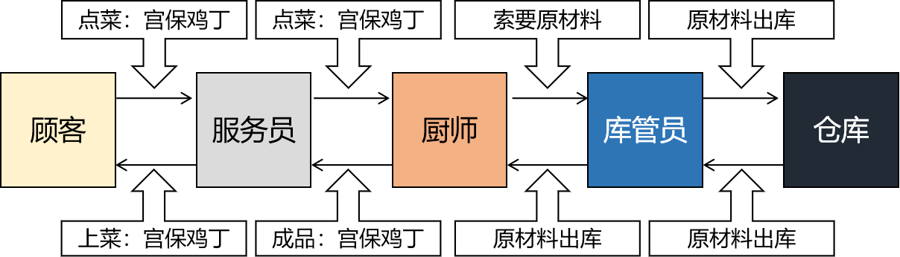

<br/>

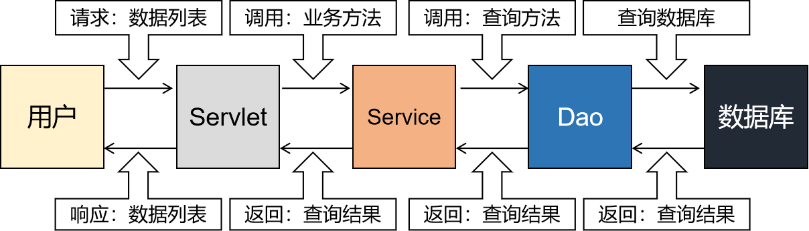

<br/>

## 2、学习目标
- 目标1：把Java类中的方法和前端请求关联起来
- 目标2：接收请求参数
- 目标3：请求转发
- 目标4：请求重定向
- 目标5：学会编写绝对路径
- 目标6：ServletParent

<br/>

# 二、First Blood
## 1、创建module
- 创建普通module
- 生成web\\WEB-INF\\web.xml
- 添加Tomcat依赖
- 删除index.jsp
- 创建index.html

<br/>

## 2、创建Servlet01FirstBlood
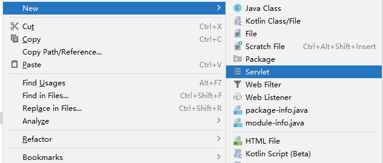

<br/>

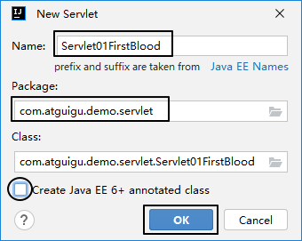

<br/>

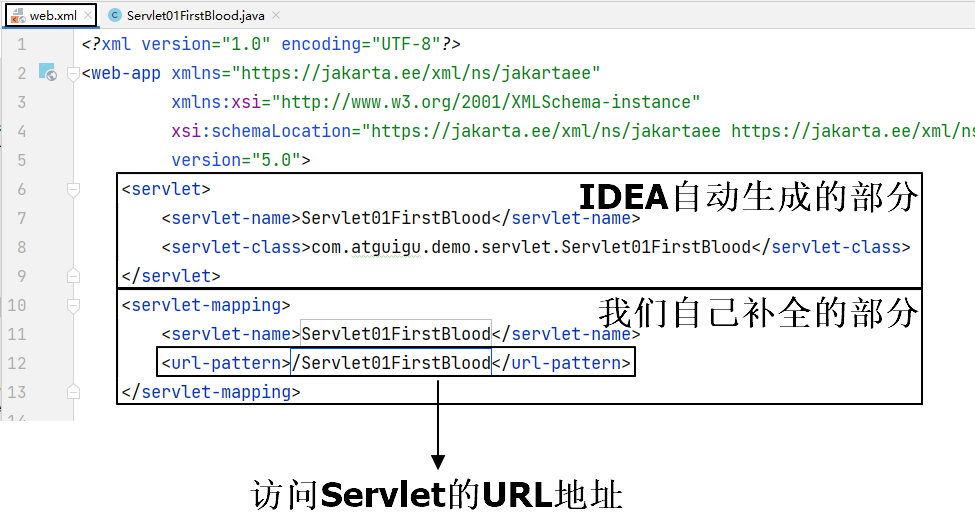

<br/>

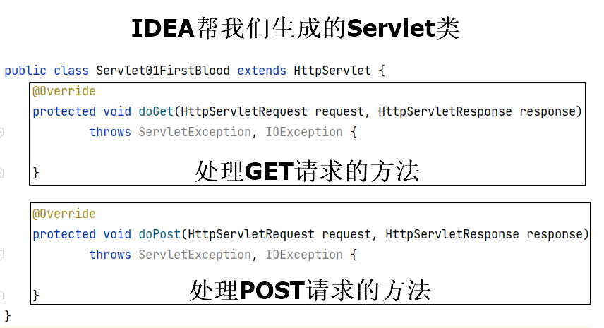

## 3、给Servlet01FirstBlood发送GET请求
### ①前端
在index.html编写超链接
```html
<a href="Servlet01FirstBlood">给Servlet01FirstBlood发送GET请求</a>
```

<br/>

### ②后端
在doGet()方法中做两件事：
```java
@Override  
protected void doGet(HttpServletRequest request, HttpServletResponse response)  
        throws ServletException, IOException {  
    // 控制台打印，证明 doGet() 方法执行了  
    System.out.println("Servlet01FirstBlood doGet() worked ...");  
  
    // 给浏览器返回响应  
    // 1、获取字符输出流对象  
    PrintWriter writer = response.getWriter();  
  
    // 2、往字符输出流中写入响应数据  
    writer.write("doGet() Server response ...");  
}
```

<br/>

## 4、给Servlet01FirstBlood发送POST请求
### ①前端
```html
<form action="Servlet01FirstBlood" method="post">  
    <button type="submit">给Servlet01FirstBlood发送POST请求</button>  
</form>
```

<br/>

### ②后端
```java
@Override  
protected void doPost(HttpServletRequest request, HttpServletResponse response) throws ServletException, IOException {  
    System.out.println("Servlet01FirstBlood doPost() worked ...");  
    response.getWriter().write("Servlet01FirstBlood response ...");  
}
```

<br/>


## 5、注意

不要再通过下面方式访问HTML：

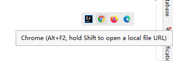

上面这种方式是通过 IDEA 内置的静态资源服务器访问 HTML 本身。而现在我们需要通过 Tomcat 来访问 Web 应用：

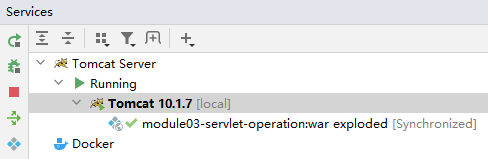


# 三、接收请求参数
## 1、概念
为了实现具体业务功能，前端肯定有数据需要发送给后端Servlet：
- 删除一条数据时发送这条数据的 id
- 提交新增数据的表单
- 提交更新数据的表单
- ……

<br/>

这些前端发送给后端的数据就是请求参数。

<br/>

## 2、数据结构
看下面方法返回值（获取全部的请求参数）：
```java
Map<String, String[]> parameterMap = request.getParameterMap();
```

<br/>

从这个方法可以看出，请求参数总体是一个Map：
- key：String类型，对应请求参数的名字
- value：String数组类型，对应通过请求参数名字携带的请求参数值（因为有的时候，可以多选）

<br/>

## 3、获取单个值的请求参数
一个名字只携带一个值的情况：
```java
String paramValue = request.getParameter("paramName");
```

<br/>

## 4、获取多个值的请求参数
一个名字携带多个值的情况：
```java
String[] paramValues = request.getParameterValues("paramName");
```

<br/>

# 四、编写请求路径
## 1、路径整体构成


<br/>

- localhost或IP地址：帮助我们在网络上找到服务器所在的电脑
- 端口号：在电脑操作系统里找到Tomcat这个进程
- contextPath：在Tomcat里找到某一个具体Web应用

<br/>

逐级、按照范围从大到小越来越精确的方式查找某个具体资源：


<br/>

## 2、为什么相对路径不可靠【不重要】
### ①故障现象
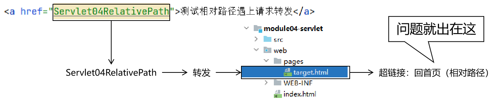

<br/>

结论：相对路径在请求转发的情况下，有可能有问题，所以以后我们都不要写相对路径。

<br/>

### ②回首页的相对路径
```html
<a href="../index.html">回首页</a>
```

<br/>

### ③相对路径的基准
```text
http://localhost:8080/demo/Servlet04RelativePath
```

<br/>

相对路径实际上是以浏览器地址中的当前资源作为参照基准，也就是这里的Servlet04RelativePath。

<br/>

而Servlet04RelativePath所在的目录是demo，../找上一级目录就到http://localhost:8080这里了。

<br/>

所以最终的访问地址是：http://localhost:8080/index.html

<br/>

这个地址是错的，所以我们看到了404错误页面

<br/>

本质上是因为请求转发导致了相对路径参照的基准发生了变化。

<br/>

## 3、解决方案
### ①绝对路径
使用绝对路径就可以确保路径参照的基准不变。<br/>

绝对路径是以<span style="color:blue;font-weight:bolder;">斜杠开头</span>的路径，开头的斜杠在不同环境代表的基准不同：
- 服务器端：Web应用根目录（比如：路径开头斜杠代表http://localhost:8080/demo）
- 浏览器端：服务器根目录（比如：路径开头斜杠代表http://localhost:8080）

<br/>

所以写绝对路径的时候，<span style="color:blue;font-weight:bolder;">浏览器端比服务器端多写一个contextPath</span>。

<br/>

### ②绝对路径写法
- 第一步：先写一个斜杠
- 第二步：判断当前路径谁来解析
	- 服务器端解析：路径开头不用写contextPath
	- 浏览器端解析：路径开头需要写contextPath
- 第三步：
	- 实体资源：按照Web应用中资源的实际情况写具体路径
	- 虚拟资源：按照web.xml中url-pattern的配置情况写具体路径

<br/>

- 实体资源：xxx.html、xxx.jpg、xxx.css……这些在物理磁盘上保存的文件就是实体资源，它们的访问路径是由目录结构决定的
- 虚拟资源：Servlet在处理请求时，用的是内存里创建的对象，调用对象的方法，所以Servlet这样的资源并不在硬盘上，是虚拟的——硬盘上Servlet对应的xxx.class文件没有能力处理请求，它需要被加载到内存中，通过反射创建对象，然后才能处理请求

<br/>

- 服务器端解析的路径：
	- 所有web.xml中涉及的路径
	- 所有请求转发的路径
- 浏览器端解析的路径：
	- 所有HTML代码中的路径
	- 所有请求重定向的路径

<br/>

### ③浏览器解析路径的具体例子


<br/>

### ④服务器解析路径的具体例子


<br/>

### ⑤服务器端动态获取contextPath
因为contextPath可以随意设置，所以最好能动态获取：
```java
response.sendRedirect(request.getContextPath() + "/pages/target.html");
```

<br/>

# 五、请求转发
## 1、概念
Servlet接收到一个请求，自己处理完之后并不马上返回响应，而是把请求“转交”给服务器端的另一个资源继续处理，由第二个资源负责返回响应。

<br/>

这里另一个资源可以是各种形式，比如：
- 另一个Servlet
- 一个HTML文件
- ……

<br/>


<br/>

应用场景举例：登录过滤器中检查到当前请求没有登录，把请求转发到登录页面<br/>


<br/>

## 2、代码实现
### ①前端
```html
<a href="Servlet02RequestDispatch">测试请求转发</a>
```

<br/>

### ②后端
```java
@Override  
protected void doGet(HttpServletRequest request, HttpServletResponse response) throws ServletException, IOException {  
  
    // 1、获取转发器对象，设置转发的目标地址  
    RequestDispatcher requestDispatcher = request.getRequestDispatcher("/pages/target.html");  
      
    // 2、执行转发  
    requestDispatcher.forward(request, response);  
}
```

<br/>

## 3、特点
- 请求转发发生在服务器内部，浏览器感知不到
- 整个过程中浏览器只发出了<span style="color:blue;font-weight:bolder;">一个请求</span>
- 浏览器地址栏不变，仍然是第一个资源的地址，不会变成第二个资源的地址
- 请求转发的目标资源必须是当前Web应用内部的，例如：转发到WEB-INF目录下

<br/>

## 4、类比
- 我跟栋哥借钱，但是其实栋哥也没有钱。
- 栋哥就背着我不知道，找锐哥借到了这笔钱。
- 栋哥把从锐哥这借的钱拿给了我。
- 整个过程我只开口了一次（只发送了一次请求）
- 我并不知道这钱实际上是来自于锐哥

<br/>

## 5、应用场景
- 检查到用户发送的请求没有登录，跳转到登录页面时使用转发

<br/>

# 六、请求重定向
## 1、概念
Servlet处理请求之后，给浏览器返回一个<span style="color:blue;font-weight:bolder;">特殊的响应</span>。这个特殊的响应告诉浏览器继续访问另一个资源。

<br/>


<br/>

## 2、代码实现
### ①前端
```html
<a href="Servlet03RequestRedirect">测试请求重定向</a>
```

<br/>

### ②后端
```java
@Override  
protected void doGet(HttpServletRequest request, HttpServletResponse response) throws ServletException, IOException {  
    // 直接调用 response 对象的 sendRedirect() 方法  
    // 注意：路径开头需要加上 contextPath    response.sendRedirect("/demo/pages/target.html");  
}
```

<br/>

## 3、特点
- 重定向过程中，服务器和浏览器都有参与
- 在整个过程中浏览器发送了<span style="color:blue;font-weight:bolder;">两次请求</span>
- 浏览器地址栏最终显示的是第二个资源的地址
- 重定向的目标资源不能是WEB-INF目录下的资源
- 重定向的目标资源可以是项目外部的

<br/>

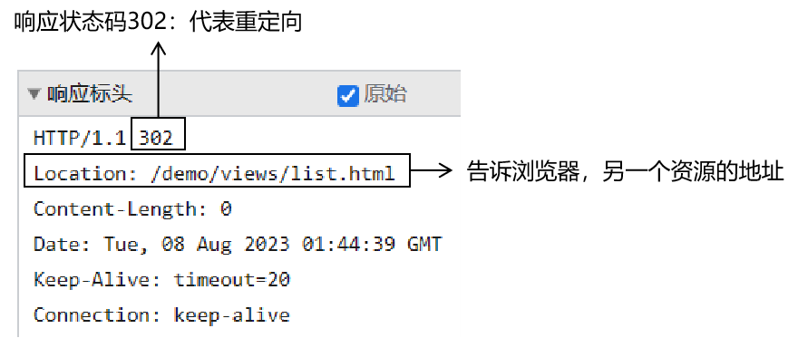

<br/>

## 4、应用场景
- 最典型的一个场景：增删改操作成功后，回到列表页面，此时使用重定向。
- 对比：
	- 如果增删改操作之后转发到列表页面
		- 浏览器地址栏还是增删改的地址
		- 用户刷新浏览器需要做两个操作：
			- 增删改操作本身重复做一遍
			- 查询列表数据
		- 危害1：已经做过一次的增删改操作，再做一次浪费性能
		- 危害2：像增加这样的操作，多做一次，多保存一条记录，导致数据错误
	- 如果增删改操作之后重定向到列表页面
		- 浏览器地址栏就变成显示列表功能地址
		- 用户刷新浏览器只做一个动作：重新查询列表数据
		- 而查询操作是可以通过加缓存功能来优化的

<br/>

# 七、ServletParent【只管用即可】
## 1、提出问题
目前我们借助IDEA生成的Servlet，分别使用doGet()、doPost()方法处理GET请求、POST请求。

<br/>

而我们实际业务中需要的是每个模块创建一个Servlet，一个Servlet负责该模块下所有请求：

|模块名|Servlet名|处理请求的方法|
|---|---|---|
|用户管理|UserServlet|login()<br/>register()<br/>logout()<br/>toLoginPage()<br/>toRegisterPage()|
|员工管理|EmpServlet|showList()<br/>toAddPage()<br/>saveEmp()<br/>toEditPage()<br/>updateEmp()<br/>removeEmp()|
|部门管理|DeptServlet|showList()<br/>toAddPage()<br/>saveDept()<br/>toEditPage()<br/>updateDept()<br/>removeDept()|

<br/>

## 2、解决方案
### ①父类完整代码
```java
package com.atguigu.demo.servlet.parent;  
  
import jakarta.servlet.ServletException;  
import jakarta.servlet.http.HttpServlet;  
import jakarta.servlet.http.HttpServletRequest;  
import jakarta.servlet.http.HttpServletResponse;  
  
import java.io.IOException;  
import java.lang.reflect.Method;  
  
public class ServletParent extends HttpServlet {  
  
    @Override  
    protected void doGet(HttpServletRequest req, HttpServletResponse resp) throws ServletException, IOException {  
        doPost(req, resp);  
    }  
  
    @Override  
    protected void doPost(HttpServletRequest request, HttpServletResponse response) throws ServletException, IOException {  
        try {  
            String requestURI = request.getRequestURI();
			if (requestURI.contains(";")) {  
			    requestURI = requestURI.substring(0, requestURI.indexOf(";"));  
			}
            String[] split = requestURI.split("/");  
            String methodName = split[split.length - 1];  
            Method method = this.getClass().getDeclaredMethod(methodName, HttpServletRequest.class, HttpServletResponse.class);  
            method.setAccessible(true);  
            method.invoke(this, request, response);  
        } catch (Throwable e) {  
            throw new RuntimeException(e);  
        }  
    }  
}
```

### ②具体用法
- 父类不负责处理具体请求
- 每个模块声明自己的Servlet，继承父类
- 每个模块Servlet中声明子类方法处理具体请求
- 子类方法的方法名和请求地址的最后一段一致

### ③用法举例：Servlet06EmpServlet
#### 【1】Java代码
```java
public class Servlet06EmpServlet extends ServletParent {  
  
    protected void showList(
	    HttpServletRequest request, 
	    HttpServletResponse response) 
		    throws ServletException, IOException {  
        System.out.println("Hello, I am Servlet06EmpServlet showList...");  
        response.getWriter().write("Hello, I am Servlet06EmpServlet showList...");  
    }  
}
```

<br/>

#### 【2】web.xml配置
```xml
<servlet>  
    <servlet-name>Servlet06EmpServlet</servlet-name>  
    <servlet-class>com.atguigu.demo.servlet.Servlet06EmpServlet</servlet-class>  
</servlet>  
<servlet-mapping>  
    <servlet-name>Servlet06EmpServlet</servlet-name>  
    <url-pattern>/employee/*</url-pattern>  
</servlet-mapping>
```

#### 【3】请求地址
> http://localhost:8080/demo/employee/showList

<br/>

#### 【4】对应关系
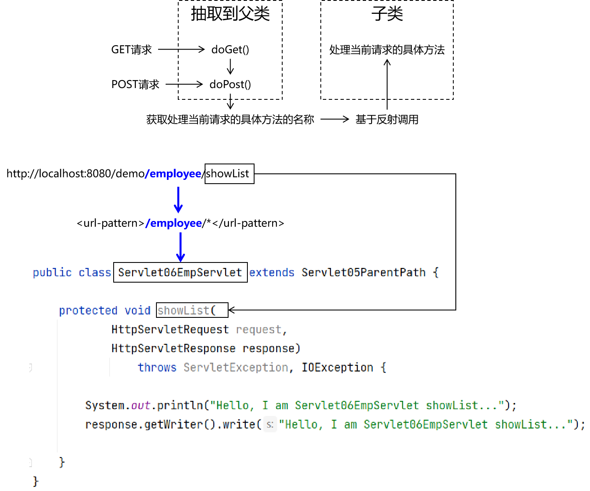

<br/>

## 3、方案原理（扩展阅读）
Servlet父类会用就行，原理是否理解都可以，因为目前暂时没有钱买房，暂时搭个茅草棚子遮风挡雨。将来有房就不住茅草棚子了。<br/>

### ①总体思路


<br/>

### ②子类方法举例
```java
protected void showList(
	HttpServletRequest request, 
	HttpServletResponse response) throws ServletException, IOException {  
  
}
```

<br/>

### ③多个请求地址访问同一个Servlet
创建Servlet之后，进行模糊匹配：
```xml
<servlet-mapping>  
    <servlet-name>EmpServlet</servlet-name>  
    <url-pattern>/employee/*</url-pattern>  
</servlet-mapping>
```

按照上面的匹配方式，下面请求地址都会访问EmpServlet：
- http://localhost:8080/demo/employee/<span style="color:red;font-weight:bolder;">showList</span>
- http://localhost:8080/demo/employee/<span style="color:red;font-weight:bolder;">toAddPage</span>
- http://localhost:8080/demo/employee/<span style="color:red;font-weight:bolder;">saveEmp</span>
- http://localhost:8080/demo/employee/<span style="color:red;font-weight:bolder;">toEditPage</span>
- http://localhost:8080/demo/employee/<span style="color:red;font-weight:bolder;">updateEmp</span>
- http://localhost:8080/demo/employee/<span style="color:red;font-weight:bolder;">removeEmp</span>

<br/>

### ④获取请求地址的最后一段
```java
String requestURI = request.getRequestURI();  
String[] split = requestURI.split("/");  
String methodName = split[split.length - 1];
```

<br/>

### ⑤基于反射调用方法
```java
Method method = this.getClass().getDeclaredMethod(methodName, HttpServletRequest.class, HttpServletResponse.class);  
method.setAccessible(true);  
method.invoke(this, request, response);
```

<br/>

这里的this在程序实际运行时是子类对象，因为这里实际运行时是子类对象调用了父类方法。

<br/>