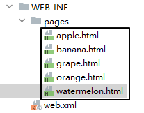
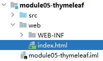
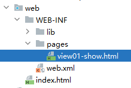
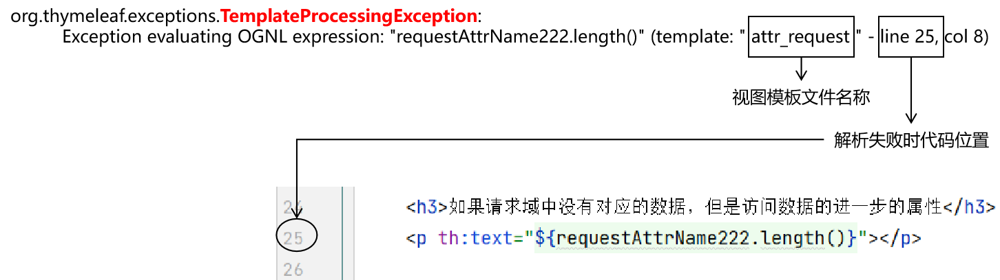
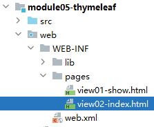

# 零、学习目标
- 目标1：理解页面渲染的概念
- 目标2：搭建Thymeleaf环境
- 目标3：掌握Thymeleaf基本用法
- 目标4：在Thymeleaf页面上读取域对象
- 目标5：在Thymeleaf页面上显示集合数据
- 目标6：通过Thymeleaf访问项目首页

<br/>

# 一、提出问题
## 1、HTML的局限
所有在<span style="color:blue;font-weight:bolder;">HTML</span>代码中写的数据都是<span style="color:blue;font-weight:bolder;">写死</span>的。但很显然实际开发时，很多数据不能写死，而是要动态展示：<br/>

```html
<!-- 那李四登录的时候怎么办？ -->
<p>欢迎您：张三</p>
```

<br/>

结论：项目运行时，<span style="color:blue;font-weight:bolder;">数据必须动态获取</span>，不能写死！

<br/>

## 2、页面渲染
```html
<p>欢迎您：<span th:text="session.loginUser.nickName">用户昵称</span></p>
```

<br/>

为了实现动态获取数据，在显示数据的地方写表达式：
- 开发时：<span style="color:blue;font-weight:bolder;">编写</span>表达式
- 运行时：<span style="color:blue;font-weight:bolder;">执行</span>表达式背后的代码，从而得到具体数据

<br/>

这个过程我们就称之为：<span style="color:blue;font-weight:bolder;">页面渲染</span>。

<br/>

一个使用表达式来渲染的页面也可以看作是一个“视图模板”，所以包含渲染视图表达式的文件通常也称为“视图模板文件”。

<br/>

## 3、页面渲染的两种方式

|渲染方式|表达式背后|常用技术|
|---|---|---|
|后端渲染|Java代码|<span style="color:blue;font-weight:bolder;">Thymeleaf</span><br/>JSP<br/>Velocity<br/>Freemarker<br/>……|
|前端渲染|JavaScript代码|<span style="color:blue;font-weight:bolder;">Vue</span><br/>JavaScript原生DOM操作<br/>……|

<br/>

# 二、Thymeleaf开发与运行环境
## 1、导入jar包
- attoparser-2.0.7.RELEASE.jar
- javassist-3.29.0-GA.jar
- ognl-3.3.4.jar
- slf4j-api-2.0.7.jar
- thymeleaf-3.1.2.RELEASE.jar
- unbescape-1.1.6.RELEASE.jar

<br/>

## 2、重构ServletParent
```java
package com.atguigu.demo.servlet.parent;  
  
import jakarta.servlet.ServletContext;  
import jakarta.servlet.ServletException;  
import jakarta.servlet.http.HttpServlet;  
import jakarta.servlet.http.HttpServletRequest;  
import jakarta.servlet.http.HttpServletResponse;  
import org.thymeleaf.TemplateEngine;  
import org.thymeleaf.context.WebContext;  
import org.thymeleaf.templatemode.TemplateMode;  
import org.thymeleaf.templateresolver.WebApplicationTemplateResolver;  
import org.thymeleaf.web.IWebApplication;  
import org.thymeleaf.web.servlet.IServletWebExchange;  
import org.thymeleaf.web.servlet.JakartaServletWebApplication;  
  
import java.io.IOException;  
import java.lang.reflect.Method;  
  
public class ServletParent extends HttpServlet {  
  
    private TemplateEngine templateEngine;  
  
    // view：视图  
    // prefix：前缀  
    private String viewPrefix = "/WEB-INF/pages/";
    
    // suffix：后缀  
    private String viewSuffix = ".html";
    
    @Override  
    public void init() throws ServletException {

        // 1.获取ServletContext对象    
		ServletContext servletContext = this.getServletContext();  

        // 2.创建Thymeleaf解析器对象
		IWebApplication webApplication = JakartaServletWebApplication.buildApplication(servletContext);  
        WebApplicationTemplateResolver templateResolver = new WebApplicationTemplateResolver(webApplication);  
  
        // 3.给解析器对象设置参数    
		// ①HTML是默认模式，明确设置是为了代码更容易理解    
		templateResolver.setTemplateMode(TemplateMode.HTML);  
		  
		 // ②设置视图前缀    
		templateResolver.setPrefix(viewPrefix);  
		  
		// ③设置视图后缀    
		templateResolver.setSuffix(viewSuffix);  
		  
		// ④设置缓存过期时间（毫秒）    
		templateResolver.setCacheTTLMs(60000L);  
		  
		// ⑤设置是否缓存    
		templateResolver.setCacheable(true);  
		  
		// ⑥设置服务器端编码方式    
		templateResolver.setCharacterEncoding("utf-8");  
		  
		// 4.创建模板引擎对象    
		templateEngine = new TemplateEngine();  
		  
		// 5.给模板引擎对象设置模板解析器    
		templateEngine.setTemplateResolver(templateResolver);  
  
    }  
  
    protected void processTemplate(String templateName, HttpServletRequest req, HttpServletResponse resp) throws IOException {  
        // 1.设置响应体内容类型和字符集    
resp.setContentType("text/html;charset=UTF-8");  
  
        // 2.创建WebContext对象    
JakartaServletWebApplication jakartaServletWebApplication = JakartaServletWebApplication.buildApplication(getServletContext());  
        IServletWebExchange webExchange = jakartaServletWebApplication.buildExchange(req, resp);  
  
        WebContext webContext = new WebContext(webExchange, req.getLocale(), jakartaServletWebApplication.getAttributeMap());  
  
        // 3.处理模板数据    
templateEngine.process(templateName, webContext, resp.getWriter());  
    }  
  
    @Override  
    protected void doGet(HttpServletRequest req, HttpServletResponse resp) throws ServletException, IOException {  
        doPost(req, resp);  
    }  
  
    @Override  
    protected void doPost(HttpServletRequest request, HttpServletResponse response) throws ServletException, IOException {  
        try {  
            String requestURI = request.getRequestURI();  
            if (requestURI.contains(";")) {  
                requestURI = requestURI.substring(0, requestURI.indexOf(";"));  
            }  
            String[] split = requestURI.split("/");  
            String methodName = split[split.length - 1];  
            Method method = this.getClass().getDeclaredMethod(methodName, HttpServletRequest.class, HttpServletResponse.class);  
            method.setAccessible(true);  
            method.invoke(this, request, response);  
        } catch (Throwable e) {  
            e.printStackTrace();  
            throw new RuntimeException(e);  
        }  
    }  
  
}
```

<br/>

## 3、视图前缀和后缀



<br/>

当我们把Thymeleaf的视图模板文件统一存放在WEB-INF/pages目录下时，它们转发的路径就有规律了：
- <span style="color:blue;font-weight:bolder;">/WEB-INF/pages/</span>apple<span style="color:red;font-weight:bolder;">.html</span>
- <span style="color:blue;font-weight:bolder;">/WEB-INF/pages/</span>banana<span style="color:red;font-weight:bolder;">.html</span>
- <span style="color:blue;font-weight:bolder;">/WEB-INF/pages/</span>grape<span style="color:red;font-weight:bolder;">.html</span>
- <span style="color:blue;font-weight:bolder;">/WEB-INF/pages/</span>orange<span style="color:red;font-weight:bolder;">.html</span>
- <span style="color:blue;font-weight:bolder;">/WEB-INF/pages/</span>watermelon<span style="color:red;font-weight:bolder;">.html</span>

<br/>

- 路径开头：都是/WEB-INF/pages/（正好是我们设置的viewPrefix）
- 路径结尾：都是.html（正好是我们设置的viewSuffix）

<br/>

- 物理视图：完整的转发路径
	- 例如：<span style="color:blue;font-weight:bolder;">/WEB-INF/pages/</span>watermelon<span style="color:red;font-weight:bolder;">.html</span>
- 逻辑视图：去除前缀、后缀之后剩余的部分
	- 例如：watermelon

<br/>

## 4、为什么放在WEB-INF目录下？
WEB-INF目录<span style="color:red;font-weight:bolder;">禁止浏览器直接访问</span>！所以视图模板文件放在WEB-INF目录下可以避免未经解析直接访问，必须经过Java程序才能访问，这样也可以更好的实现权限控制。

<br/>

# 三、First Blood
## 1、创建index.html


<br/>

```html
<a href="/demo/Servlet01Thymeleaf/test01ShowView">测试01：显示Thymeleaf视图</a><br/><br/>
```

<br/>

## 2、创建Servlet01Thymeleaf
### ①Java代码

```java
public class Servlet01Thymeleaf extends ServletParent {  
  
    protected void test01ShowView(HttpServletRequest request, HttpServletResponse response) throws ServletException, IOException {  
  
        // 1、声明现在要前往的逻辑视图名称  
        String viewName = "view01-show";  
  
        // 2、执行视图渲染，把渲染结果作为响应体返回给浏览器  
        processTemplate(viewName, request, response);  
    }  
}
```

<br/>

### ②web.xml配置
```xml
<servlet>  
    <servlet-name>Servlet01Thymeleaf</servlet-name>  
    <servlet-class>com.atguigu.demo.servlet.module.Servlet01Thymeleaf</servlet-class>  
</servlet>  
<servlet-mapping>  
    <servlet-name>Servlet01Thymeleaf</servlet-name>  
    <url-pattern>/Servlet01Thymeleaf/*</url-pattern>  
</servlet-mapping>
```

<br/>

## 3、目标视图


<br/>

```html
<!DOCTYPE html>  
<html lang="en" xmlns:th="http://www.thymeleaf.org">  
<head>  
    <meta charset="UTF-8">  
    <title>Title</title>  
</head>  
<body>  
  
    <h3>目标页面</h3>  
  
</body>  
</html>
```

<br/>

# 四、Thymeleaf常用表达式语法
## 1、引入th名称空间
```html
<html lang="en" xmlns:th="http://www.thymeleaf.org">
```

<br/>

## 2、渲染文本标签体
### ①插值表达式
```html
<p>[[10*10]]</p>
```

<br/>

### ②th:text属性
```html
<p th:text="22+44">原来的文本标签体会被覆盖</p>
```

<br/>

## 3、渲染HTML属性
想要渲染什么属性，就在th冒号后面写属性名（任何属性都可以）：
```html
<input type="text" name="userName" th:value="88-22" />
```

<br/>

## 4、给字符串附加contextPath
当我们编写绝对路径时，由浏览器解析的路径需要在开头先写contextPath，而Thymeleaf可以帮我们动态获取，自动生成：
```html
<!-- 给字符串前面动态附加 contextPath --><!-- 渲染之后，代码如下： -->  
<!-- <p>/demo/aaa/bbb/ccc</p> -->  
<p th:text="@{/aaa/bbb/ccc}"></p>  
  
<!-- 渲染之后，代码如下： -->  
<!-- <a href="/demo/aaa/bbb/ccc">这是一个假的超链接</a> -->  
<a th:href="@{/aaa/bbb/ccc}">这是一个假的超链接</a>  
  
<!-- 渲染之后，代码如下： -->  
<!-- <form action="/demo/aaa/bbb/ccc"> -->  
<form th:action="@{/aaa/bbb/ccc}">  
    <button>这上一个假的表单</button>  
</form>
```

<br/>

## 5、超链接附带请求参数
### ①一个请求参数
```html
<!-- 渲染之后，代码如下： -->  
<!-- href="/demo/aaa/bbb/ccc?userName=tom" -->  
<a th:href="@{/aaa/bbb/ccc(userName=tom)}">超链接附带一个请求参数</a><br/><br/>
```

<br/>

### ②多个请求参数
```html
<!-- href="/demo/aaa/bbb/ccc?userName=tom&amp;userPwd=123456" -->  
<a th:href="@{/aaa/bbb/ccc(userName=tom, userPwd=123456)}">超链接附带多个请求参数</a>
```

<br/>

# 五、访问域对象
## 1、什么是域对象？
一个方法调用另一个方法，我们可以通过传参数的方式传递数据。但Web应用中下面几种情况怎么传递数据呢：
- 从Servlet到Thymeleaf视图模板文件
- 从A Servlet到B Servlet
- 整个Web应用范围共享数据

<br/>

所以在方法传参之外，我们还需要其它方式传递数据、共享数据。这个时候就必须使用域对象了。

<br/>

## 2、三种域对象
|有效范围|API|
|---|---|
|请求域|HttpServletRequest|
|会话域|HttpSession|
|应用域|ServletContext|

<br/>

- 请求：去饭馆吃饭，每叫一次服务员就是发送一个请求
- 会话：去饭馆吃饭，从进饭馆到离开的全过程。在这个过程中，你可能叫了服务员好几次（也就是发送过很多次请求）
- 应用：去饭馆吃饭，整个饭馆就是一个应用

<br/>

## 3、Java代码获取域对象
|域对象|获取方式|
|---|---|
|request|参数传入，直接使用|
|session|request.getSession()|
|servletContext|super.getServletContext()|

<br/>

## 4、Java代码读写属性域
|操作|方法|
|---|---|
|在域中存入数据|域对象.setAttribute("属性名", Object类型属性值);|
|从域中获取数据|域对象.getAttribute("属性名");|

<br/>

必须要先存入才能读取，且属性名必须一致。

<br/>

## 5、Thymeleaf读取属性域
```html
<!-- 读取请求域就是在 ${} 中直接写属性名 -->  
<p th:text="${attrName}">原来的文本标签体会被覆盖</p>

<!-- 读取会话域需要在 ${} 中写 session.属性名 -->  
<p th:text="${session.attrSessionName}">原来的文本标签体会被覆盖</p>

<!-- 读取应用域需要在 ${} 中写 application.属性名 -->  
<p th:text="${application.attrAppName}">原来的文本标签体会被覆盖</p>
```

<br/>

## 6、读取属性域失败
<br/>



## 7、读取实体类属性
本质：调用实体类属性对应的getXxx()方法。
```html
<!-- 底层调用：getNickName()方法 -->
<p th:text="${session.loginUser.nickName}"></p>
```

<br/>

属性名称规则：
- getXxx()、setXxx()方法名去掉get、set
- 剩下的部分首字母小写

<br/>

以nickName为例说明：
- getNickName()方法名是：getNickName
- 去掉get以后：NickName
- 首字母小写：nickName

<br/>

属性名和成员变量的关系：
- 本质上没有关系
- 并没有要求让属性名和成员变量名一致

<br/>

# 六、显示集合数据
## 1、判断集合是否为空
### ①Java代码
```java
protected void showList(HttpServletRequest request, HttpServletResponse response) throws ServletException, IOException {  
    // 1、准备数据  
    List<User> userList = new ArrayList<>();  
    userList.add(new User(1, "userName01", "123456", "nickName01"));  
    userList.add(new User(2, "userName02", "123456", "nickName02"));  
    userList.add(new User(3, "userName03", "123456", "nickName03"));  
    userList.add(new User(4, "userName04", "123456", "nickName04"));  
    userList.add(new User(5, "userName05", "123456", "nickName05"));  
  
    // 2、把数据存入请求域  
    // 有三个域可以选择，用来携带数据，那么具体选择哪一个呢？  
    // 原则：在能够满足功能需要的前提下，选择范围最小的域  
    // 原因：在越大的范围内存储数据，数据存在的时间越长，如果存在的时间超过了业务功能正常的需要  
    // 那么数据多存在的这些时间，数据占用内存就是一种浪费  
    request.setAttribute("userList", userList);  
  
    // 3、渲染视图  
    processTemplate("attr_list", request, response);  
}
```

### ②页面代码
```html
<!-- #lists是Thymeleaf的一个内置对象，可以直接使用 -->
<!-- #lists对象的isEmpty()方法判断集合是否为空 -->
<!-- 返回true：说明集合为空 -->
<!-- 返回false：说明集合非空 -->
th:if="${#lists.isEmpty(stuList)}"

<table>  
    <tr>  
        <th>id</th>  
        <th>name</th>  
        <th>password</th>  
        <th>nickname</th>  
    </tr>  
    <!-- 表达式含义说明： -->  
    <!-- 第一步：根据 userList2 到请求域查找数据 -->  
    <!-- 第二步：在请求域没有查询到数据 -->  
    <!-- 第三步：isEmpty()方法就判定为空，返回 true -->    
    <!-- 第四步：th:if 所在的标签就执行渲染，在结果中显示 -->  
    <tr th:if="${#lists.isEmpty(userList2)}">  
        <td colspan="4">抱歉！没有查询到您要的数据！</td>  
    </tr>  
  
    <!-- 表达式含义说明： -->  
    <!-- 第一步：根据 userList 到请求域查找数据 -->  
    <!-- 第二步：请求域能够查询到数据，返回集合对象 -->  
    <!-- 第三步：isEmpty() 判定集合对象非空，返回 false -->    
    <!-- 第四步：false 被 not 取反，变成 true -->    <!-- 第五步：th:if 所在标签就执行渲染，在结果中显示 -->  
    <tr th:if="${not #lists.isEmpty(userList)}">  
        <td colspan="4">恭喜！您查询到了一些数据！</td>  
    </tr>  
  
    <!-- 效果一样 -->  
    <tr th:unless="${#lists.isEmpty(userList)}">  
        <td colspan="4">恭喜！您查询到了一些数据！</td>  
    </tr>  
  
    <!-- 效果一样 -->  
    <tr th:if="${!#lists.isEmpty(userList)}">  
        <td colspan="4">恭喜！您查询到了一些数据！</td>  
    </tr>  
</table>
```

<br/>

## 2、遍历显示集合
```html
<!-- 语法说明 1：在多次出现的标签上使用 th:each -->
<!-- 语法说明 2：th:each="为便于引用给遍历出来的每一个对象命名 : ${获取集合数据的表达式}" --> 
<tr th:if="${not #lists.isEmpty(userList)}" th:each="user : ${userList}">  
    <!-- th:each 中声明的每个对象的名称，在下面表达式中直接使用即可 -->  
    <td th:text="${user.userId}"></td>  
    <td th:text="${user.userName}"></td>  
    <td th:text="${user.userPwd}"></td>  
    <td th:text="${user.nickName}"></td>  
</tr>
```

<br/>

## 3、完整代码
```html
<table>  
    <tr>  
        <th>ID</th>  
        <th>NAME</th>  
        <th>SCORE</th>  
    </tr>  
    <tr th:if="${#lists.isEmpty(stuList)}">  
        <td colspan="3">抱歉，没有查询到数据！</td>
    </tr>  
    <tr th:if="${not #lists.isEmpty(stuList)}" th:each="stu : ${stuList}">  
        <td th:text="${stu.stuId}"></td>  
        <td th:text="${stu.stuName}"></td>  
        <td th:text="${stu.stuScore}"></td>  
    </tr>  
</table>
```

<br/>

## 4、status
```html
<table>  
    <!-- 如果有需要，还可以额外声明 status，通过 status 访问遍历过程中的相关数据 -->  
    <tr th:if="${not #lists.isEmpty(userList)}" th:each="user,status : ${userList}">  
        <td th:text="${user.userId}"></td>  
        <td th:text="${user.userName}"></td>  
        <td th:text="${user.userPwd}"></td>  
        <td th:text="${user.nickName}"></td>  
          
        <!-- 当前遍历的元素的索引 -->  
        <td th:text="${status.index}"></td>  
          
        <!-- 当前遍历的元素的计数 -->  
        <td th:text="${status.count}"></td>  
          
        <!-- 当前集合中元素的总数量 -->  
        <td th:text="${status.size}"></td>  
          
        <!-- 当前遍历得到的集合元素对象 -->  
        <td th:text="${status.current.nickName}"></td>  
    </tr>  
</table>
```

<br/>

# 七、首页解析问题
## 1、提出问题
index.html放在web目录下，运行后可以直接访问到。但此时并没有经过Thymeleaf解析，所以不能使用@{}语法。

<br/>

## 2、解决办法
把index.html放在WEB-INF/pages目录下，通过Servlet访问。

<br/>

## 3、具体实现
### ①创建Servlet
```java
public class Servlet02Portal extends ServletParent {  
    protected void doGet(HttpServletRequest request, HttpServletResponse response) throws ServletException, IOException {  
        doPost(request, response);  
    }  
  
    protected void doPost(HttpServletRequest request, HttpServletResponse response) throws ServletException, IOException {  
        processTemplate("view02-index", request, response);  
    }  
}
```

<br/>

### ②配置Servlet
```xml
<servlet>  
    <servlet-name>Servlet02Portal</servlet-name>  
    <servlet-class>com.atguigu.demo.servlet.module.Servlet02Portal</servlet-class>  
</servlet>  
<servlet-mapping>  
    <servlet-name>Servlet02Portal</servlet-name>  
    <url-pattern>/index.html</url-pattern>  
</servlet-mapping>
```

<br/>

### ③创建视图模板文件


<br/>

```html
<!DOCTYPE html>  
<html lang="en" xmlns:th="http://www.thymeleaf.org">  
<head>  
    <meta charset="UTF-8">  
    <title>首页</title>  
</head>  
<body>  
  
    <p th:text="@{/aaa/bbb}"></p>  
  
</body>  
</html>
```