> <span style="color:red;font-weight:bold;">特别提示</span>：每个人都必须能做出来，而且没有思路、照抄出来不算！除了环境搭建的部分，具体功能开发必须每个人都会！

<br/>

# 一、三层架构理论
## 1、总述
- <span style="color:blue;font-weight:bolder;">表述层</span>（表示层、表现层）：负责和浏览器打交道
	- <span style="color:blue;font-weight:bolder;">控制层</span>（Servlet）：处理请求、跳转页面
	- <span style="color:blue;font-weight:bolder;">视图层</span>（Thymeleaf、HTML）：在用户界面上显示数据
- <span style="color:blue;font-weight:bolder;">业务逻辑层</span>：负责执行业务逻辑
- <span style="color:blue;font-weight:bolder;">持久化层</span>：负责和数据库打交道

<br/>

如果不理解业务逻辑层的作用可以看看下面执行登录检查的业务代码：
```java
@Override  
public Result doLogin(NewsUser newsUserFromFront) {  
  
    // 1、检查用户名  
    // [1]获取用户名数据  
    String username = newsUserFromFront.getUsername();  
  
    // [2]根据用户名到数据库查询 NewsUser 对象  
    NewsUser newsUserFromDB = newsUserDao.selectUserByName(username);  
  
    // [3]判断 newsUserFromDB 是否为空  
    if (newsUserFromDB == null) {  
        // [4]如果 newsUserFromDB 对象为空，则直接返回用户名错误的 Result，流程结束  
        return Result.build(null, ResultCodeEnum.USERNAME_ERROR);  
    }  
  
    // 2、检查密码  
    // [1]获取明文密码数据：来自于前端请求  
    String userPwdNotEncoded = newsUserFromFront.getUserPwd();  
  
    // [2]获取密文密码数据：来自于数据库查询结果  
    String userPwdEncoded = newsUserFromDB.getUserPwd();  
  
    // [3]对 userPwdEncoded 做判空保护  
    if (userPwdEncoded == null || userPwdEncoded.length() == 0) {  
        // ※返回一个系统错误：程序正常运行的时候不应该发生的问题  
        return Result.build(null, ResultCodeEnum.SYSTEM_ERR);  
    }  
  
    // [4]对明文密码做加密操作，然后比较两个密文  
    if (!userPwdEncoded.equals(MD5Util.encrypt(userPwdNotEncoded))) {  
        return Result.build(null, ResultCodeEnum.PASSWORD_ERROR);  
    }  
  
    // 3、登录成功  
    // [1]调用“从数据库查询出来的 NewsUser 对象”的 getUserId() 方法获取 userId    Integer uid = newsUserFromDB.getUid();  
  
    // [2]调用工具方法生成 token 值  
    String token = JwtHelper.createToken(uid.longValue());  
  
    // [3]根据前端所需要的响应数据格式，把 token 存入 Map 中  
    Map<String, String> tokenMap = new HashMap<>();  
    tokenMap.put("token", token);  
  
    // [4]根据 Map 创建 Result 对象  
    return Result.ok(tokenMap);  
}
```

<br/>

## 2、意义
- 架构层面的意义：实现<span style="color:blue;font-weight:bolder;">组件化开发</span>，让整个项目由各个组件组装得到。
- 代码层面的意义：各个组件各司其职，『<span style="color:blue;font-weight:bolder;">高内聚、低耦合</span>』，有利于开发、维护、排障

<br/>

什么是架构？
> 架构就是项目的结构。

<br/>

怎么理解组件拼装？
> 电脑里面CPU、内存、硬盘如果都焊到主板上，那么系统就会非常复杂，研发、生产、维修都会非常困难。

<br/>

怎么理解高内聚、低耦合？
> 肿瘤如果在早期边界清晰，和其它器官没有粘连，那么切除就好；<br/>
> 肿瘤晚期的时候扩散了，和周围器官粘连在一起（耦合在一起了），此时就无法手术治疗了，靶向药、放疗、化疗……<br/>
> <br/>
> 汽车里各个组件各司其职，做到高内聚、低耦合，哪个坏了换哪个：
>
> - 油车三大件：发动机、变速箱、底盘
> - 电车三大件：电池、电机、电控
> 而如果做不到，那么任何组件坏了都整体换车……

<br/>

## 3、图示


<br/>

## 4、MVC
MVC理念是<span style="color:blue;font-weight:bolder;">表述层</span>开发的指导思想。目的是在表述层进一步实现解耦。
- M（Model）：模型
- V（View）：视图
- C（Controller）：控制器

<br/>


<br/>

MVC三者分开，想调整显示界面只修改View视图即可，页面跳转方面的问题找Controller控制器，数据结构的问题看Model模型。

<br/>

MVC各司其职，仍然是实现高内聚、低耦合。

<br/>

# 二、搭建环境
> 很多时候大家分不清什么样的代码可以粘，什么样的代码自己写？
> - 环境搭建相关的通常复制粘贴
> - 业务功能开发都要自己写

<br/>

## 1、创建module
- 创建module
- Add Framework Support生成web.xml
- 添加Tomcat 10依赖

<br/>

## 2、建模
### ①物理建模
```sql
create database if not exists db_demo240109;  
use db_demo240109;  
drop table if exists t_soldier;  
create table t_soldier  
(  
    soldier_id     int auto_increment primary key,  
    soldier_name   char(100),  
    soldier_salary double,  
    soldier_gender enum ('male', 'female') default 'male'  
);  
INSERT INTO t_soldier (soldier_name, soldier_salary, soldier_gender)  
VALUES ('John Smith', 50000.00, 'male');  
INSERT INTO t_soldier (soldier_name, soldier_salary, soldier_gender)  
VALUES ('Emily Johnson', 55000.00, 'female');  
INSERT INTO t_soldier (soldier_name, soldier_salary, soldier_gender)  
VALUES ('Michael Davis', 60000.00, 'male');  
INSERT INTO t_soldier (soldier_name, soldier_salary, soldier_gender)  
VALUES ('Jessica Anderson', 52000.00, 'female');  
INSERT INTO t_soldier (soldier_name, soldier_salary, soldier_gender)  
VALUES ('William Brown', 48000.00, 'male');  
INSERT INTO t_soldier (soldier_name, soldier_salary, soldier_gender)  
VALUES ('Sophia Wilson', 53000.00, 'female');  
INSERT INTO t_soldier (soldier_name, soldier_salary, soldier_gender)  
VALUES ('Christopher Taylor', 57000.00, 'male');  
INSERT INTO t_soldier (soldier_name, soldier_salary, soldier_gender)  
VALUES ('Olivia Martinez', 60000.00, 'female');  
INSERT INTO t_soldier (soldier_name, soldier_salary, soldier_gender)  
VALUES ('Daniel Anderson', 51000.00, 'male');  
INSERT INTO t_soldier (soldier_name, soldier_salary, soldier_gender)  
VALUES ('Ava Thompson', 54000.00, 'female');  
INSERT INTO t_soldier (soldier_name, soldier_salary, soldier_gender)  
VALUES ('Matthew Garcia', 59000.00, 'male');  
INSERT INTO t_soldier (soldier_name, soldier_salary, soldier_gender)  
VALUES ('Isabella Robinson', 56000.00, 'female');  
INSERT INTO t_soldier (soldier_name, soldier_salary, soldier_gender)  
VALUES ('Joseph Rodriguez', 53000.00, 'male');  
INSERT INTO t_soldier (soldier_name, soldier_salary, soldier_gender)  
VALUES ('Mia Wright', 52000.00, 'female');  
INSERT INTO t_soldier (soldier_name, soldier_salary, soldier_gender)  
VALUES ('David Walker', 58000.00, 'male');  
INSERT INTO t_soldier (soldier_name, soldier_salary, soldier_gender)  
VALUES ('Sofia Hill', 55000.00, 'female');  
INSERT INTO t_soldier (soldier_name, soldier_salary, soldier_gender)  
VALUES ('Andrew Young', 57000.00, 'male');  
INSERT INTO t_soldier (soldier_name, soldier_salary, soldier_gender)  
VALUES ('Charlotte Mitchell', 59000.00, 'female');  
INSERT INTO t_soldier (soldier_name, soldier_salary, soldier_gender)  
VALUES ('James Clark', 51000.00, 'male');  
INSERT INTO t_soldier (soldier_name, soldier_salary, soldier_gender)  
VALUES ('Harper Thompson', 53000.00, 'female');  
INSERT INTO t_soldier (soldier_name, soldier_salary, soldier_gender)  
VALUES ('Benjamin Lewis', 60000.00, 'male');  
INSERT INTO t_soldier (soldier_name, soldier_salary, soldier_gender)  
VALUES ('Amelia Lee', 55000.00, 'female');  
INSERT INTO t_soldier (soldier_name, soldier_salary, soldier_gender)  
VALUES ('Henry Hall', 52000.00, 'male');  
INSERT INTO t_soldier (soldier_name, soldier_salary, soldier_gender)  
VALUES ('Ella Baker', 54000.00, 'female');  
INSERT INTO t_soldier (soldier_name, soldier_salary, soldier_gender)  
VALUES ('Alexander Turner', 56000.00, 'male');  
INSERT INTO t_soldier (soldier_name, soldier_salary, soldier_gender)  
VALUES ('Lily Adams', 53000.00, 'female');  
INSERT INTO t_soldier (soldier_name, soldier_salary, soldier_gender)  
VALUES ('Sebastian Allen', 57000.00, 'male');  
INSERT INTO t_soldier (soldier_name, soldier_salary, soldier_gender)  
VALUES ('Grace Wright', 52000.00, 'female');  
INSERT INTO t_soldier (soldier_name, soldier_salary, soldier_gender)  
VALUES ('Jack Perez', 58000.00, 'male');  
INSERT INTO t_soldier (soldier_name, soldier_salary, soldier_gender)  
VALUES ('Victoria Rivera', 55000.00, 'female');  
INSERT INTO t_soldier (soldier_name, soldier_salary, soldier_gender)  
VALUES ('Owen Collins', 59000.00, 'male');  
INSERT INTO t_soldier (soldier_name, soldier_salary, soldier_gender)  
VALUES ('Zoe Cooper', 56000.00, 'female');  
INSERT INTO t_soldier (soldier_name, soldier_salary, soldier_gender)  
VALUES ('Samuel Reed', 53000.00, 'male');  
INSERT INTO t_soldier (soldier_name, soldier_salary, soldier_gender)  
VALUES ('Nora Ward', 52000.00, 'female');
```

<br/>

### ②逻辑建模
```java
public class Soldier {  
  
    private Integer soldierId;  
    private String soldierName;  
    private Double soldierSalary;  
    private String soldierGender;
```

<br/>

## 3、导入jar包

- Thymeleaf所需 jar 包
- 持久化层功能所需 jar 包
  - MySQL驱动
  - 数据库连接池
  - DBUtils工具包

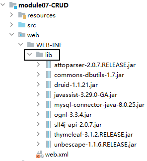

<br/>

## 4、连接数据库
### ①jdbc.properties

jdbc.properties文件所在的目录，src和resources都可以。为了适应以后使用Maven，建议放在resources目录下。先手动创建一个普通的目录命名为resources，然后把resources目录标记为资源目录：

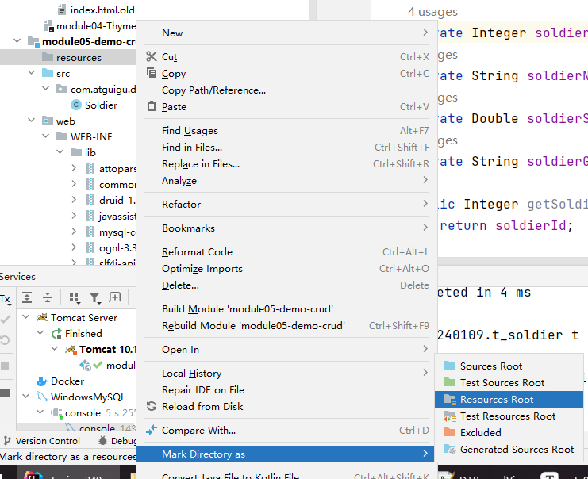


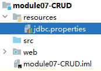

<br/>

```properties
url=jdbc:mysql://localhost:3306/db_demo240109?serverTimezone=Asia/Shanghai
username=root
password=atguigu
initialSize=3
maxActive=5
maxWait=2000
driverClassName=com.mysql.cj.jdbc.Driver
```

<br/>

### ②JDBCUtils
```java
package com.atguigu.demo.utils;  
  
import com.alibaba.druid.pool.DruidDataSourceFactory;  
  
import javax.sql.DataSource;  
import java.io.InputStream;  
import java.sql.Connection;  
import java.sql.SQLException;  
import java.util.Properties;  
  
/**  
 * 管理数据库连接的工具类  
 * 功能1：从数据源中获取数据库连接  
 * 功能2：把数据库连接放回数据源  
 */  
public class JDBCUtils {  
  
    // 数据源对象声明为成员变量  
    private static DataSource dataSource;  
  
    static {  
        try {  
            // 在静态代码块中初始化数据源  
            // 1、创建 Properties 对象  
            Properties properties = new Properties();  
  
            // 2、加载外部属性文件  
            InputStream inputStream = JDBCUtils.class.getClassLoader().getResourceAsStream("jdbc.properties");  
  
            // 3、加载外部属性文件  
            properties.load(inputStream);  
  
            // 4、给数据源成员变量赋值  
            dataSource = DruidDataSourceFactory.createDataSource(properties);  
        } catch (Exception e) {  
            throw new RuntimeException(e);  
        }  
    }  
  
    /**  
     * 从数据源中获取数据库连接  
     * @return  
     */    public static Connection getConnection() {  
        try {  
            return dataSource.getConnection();  
        } catch (SQLException e) {  
            throw new RuntimeException(e);  
        }  
    }  
  
    /**  
     * 释放数据库连接，本质上是把数据库连接标记为空闲  
     * @param connection  
     */  
    public static void releaseConnection(Connection connection) {  
        try {  
            if (connection != null) {  
                connection.close();  
            }  
        } catch (SQLException e) {  
            throw new RuntimeException(e);  
        }  
    }  
  
}
```

<br/>

### ③单元测试
```java
package com.atguigu.demo.test;  
  
import com.atguigu.demo.util.JDBCUtils;  
import org.junit.Test;  
  
import java.sql.Connection;  
  
public class DemoTest {  
  
    @Test  
    public void test01Connection() {  
        Connection connection = JDBCUtils.getConnection();  
        System.out.println("connection = " + connection);  
    }  
  
}
```

<br/>

### ④引入BaseDao
```java
package com.atguigu.demo.dao.impl;  
  
import com.atguigu.demo.utils.JDBCUtils;  
import org.apache.commons.dbutils.QueryRunner;  
import org.apache.commons.dbutils.ResultSetHandler;  
import org.apache.commons.dbutils.handlers.BeanHandler;  
import org.apache.commons.dbutils.handlers.BeanListHandler;  
import org.apache.commons.dbutils.handlers.ScalarHandler;  
  
import java.sql.*;  
import java.util.List;  
  
public class BaseDao<T> {  
  
    private QueryRunner queryRunner = new QueryRunner();  
  
    /**  
     * 借助DBUtils实现的通用增删改方法  
     * @param sql 执行增删改操作的 SQL 语句  
     * @param params 以可变参数形式传入的 SQL 语句的参数  
     * @return 执行 SQL 语句之后，受影响的行数  
     */  
    public int commonUpdate(String sql, Object ... params) {  
  
        // 1、获取数据库连接  
        Connection connection = JDBCUtils.getConnection();  
  
        try {  
            // 2、调用 QueryRunner 方法执行 SQL 语句  
            return queryRunner.update(connection, sql, params);  
        } catch (SQLException e) {  
            throw new RuntimeException(e);  
        } finally {  
  
            // 3、释放资源  
            JDBCUtils.releaseConnection(connection);  
        }  
    }  
  
    /**  
     * 借助DBUtils实现的通用批量增删改方法  
     * @param sql  
     * @param paramArrays 二维数组  
     *        二维数组中的每一个数组对应 SQL 语句执行一次  
     *        insert into t_employee(emp_name, emp_age, emp_salary) values(?,?,?); ["name01", 21, 1000]  
     *        insert into t_employee(emp_name, emp_age, emp_salary) values(?,?,?); ["name02", 22, 2000]     *        insert into t_employee(emp_name, emp_age, emp_salary) values(?,?,?); ["name03", 23, 3000]     */    public void batchUpdate(String sql, Object[][] paramArrays) {  
        // 1、获取数据库连接  
        Connection connection = JDBCUtils.getConnection();  
  
        try {  
            // 2、调用 QueryRunner 方法执行批量操作  
            queryRunner.batch(connection, sql, paramArrays);  
        } catch (SQLException e) {  
            throw new RuntimeException(e);  
        } finally {  
  
            // 3、释放资源  
            JDBCUtils.releaseConnection(connection);  
        }  
    }  
  
    /**  
     * 由于 DBUtils 不支持获取 insert 操作的自增主键  
     * 所以我们自己手动实现  
     * @param sql  
     * @param params  
     * @return 自增主键值  
     */  
    public Integer insertWithGeneratedKey(String sql, Object ... params) {  
        // 1、声明变量  
        Connection connection = JDBCUtils.getConnection();  
        PreparedStatement preparedStatement = null;  
  
        try {  
            // 2、创建 PreparedStatement 对象  
            preparedStatement = connection.prepareStatement(sql, Statement.RETURN_GENERATED_KEYS);  
  
            // 3、遍历可变参数数组，给 SQL 设置参数  
            for (int i = 0; params != null && i < params.length; i++) {  
                // 4、从数组中取出具体参数值  
                Object param = params[i];  
  
                // 5、设置参数，参数索引从 1 开始，所以是 i + 1                preparedStatement.setObject(i + 1, param);  
            }  
  
            // 6、执行 SQL 语句  
            preparedStatement.executeUpdate();  
  
            // ※获取自增的主键所在的结果集  
            ResultSet resultSet = preparedStatement.getGeneratedKeys();  
  
            // 解析结果集  
            if (resultSet.next()) {  
                // 获取自增主键  
                int generatedKey = resultSet.getInt(1);  
  
                // 把自增主键作为返回值返回  
                return generatedKey;  
            } else {  
                return null;  
            }  
  
        } catch (SQLException e) {  
  
            // ※把编译时异常转换为运行时异常继续抛出，这么做是为了避免掩盖问题  
            throw new RuntimeException(e);  
        } finally {  
  
            // 7、释放资源  
            if (preparedStatement != null) {  
                try {  
                    preparedStatement.close();  
                } catch (SQLException e) {  
                    throw new RuntimeException(e);  
                }  
            }  
  
            JDBCUtils.releaseConnection(connection);  
  
        }  
    }  
  
    /**  
     * 借助DBUtils实现的查询数据库表，每一条记录封装一个实体类对象，多条记录组成 List 集合  
     * @param sql  如果数据库表中字段名和实体类属性名不一致，需要写别名
     * @param clazz 当前要查询的实体类对象的 Class 对象  
     * @param params  
     * @return 查询结果组成的 List 集合  
     */  
    public List<T> getBeanList(String sql, Class<T> clazz, Object ... params) {  
  
        // 1、获取数据库连接  
        Connection connection = JDBCUtils.getConnection();  
  
        try {  
            // 2、创建 ResultSetHandler 对象  
            ResultSetHandler<List<T>> resultSetHandler = new BeanListHandler(clazz);  
  
            // 3、调用 QueryRunner 方法执行查询操作  
            List<T> beanList = queryRunner.query(connection, sql, resultSetHandler, params);  
  
            return beanList;  
        } catch (SQLException e) {  
            throw new RuntimeException(e);  
        } finally {  
  
            // 4、释放资源  
            JDBCUtils.releaseConnection(connection);  
        }  
    }  
    /**  
     * 借助DBUtils实现的查询单个实体类对象  
     * @param sql  
     * @param clazz 当前要查询的实体类对象的 Class 对象  
     * @param params  
     * @return 单个实体类对象  
     */  
    public T getSingleBean(String sql, Class<T> clazz, Object ... params) {  
  
        // 1、获取数据库连接  
        Connection connection = JDBCUtils.getConnection();  
  
        try {  
            // 2、创建 ResultSetHandler 对象  
            ResultSetHandler<T> resultSetHandler = new BeanHandler(clazz);  
  
            // 3、调用 QueryRunner 方法执行查询操作  
            T bean = queryRunner.query(connection, sql, resultSetHandler, params);  
  
            return bean;  
        } catch (SQLException e) {  
            throw new RuntimeException(e);  
        } finally {  
  
            // 4、释放资源  
            JDBCUtils.releaseConnection(connection);  
        }  
    }  
  
    /**  
     * 查询单一值需要使用 ScalarHandler，所以需要单独写一个方法  
     * @param sql  select count(*) from xxx;
     * @param params  
     * @param <V> 方法级的泛型参数，在方法调用时才知道具体类型是什么
     * @return  
     */  
    public <V> V getSingleValue(String sql, Object ... params) {  
  
        // 1、获取数据库连接  
        Connection connection = JDBCUtils.getConnection();  
  
        try {  
            // 2、调用 QueryRunner 方法执行单一值的查询操作  
            return queryRunner.query(connection, sql, new ScalarHandler<>(), params);  
        } catch (SQLException e) {  
            throw new RuntimeException(e);  
        } finally {  
  
            // 3、释放资源  
            JDBCUtils.releaseConnection(connection);  
        }  
    }  
  
}
```

<br/>

## 5、创建各层组件
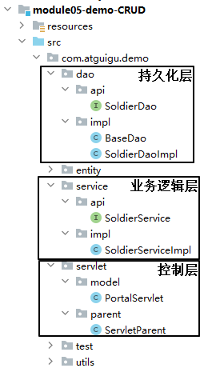

<br/>

组件之间进行组装：

<br/>

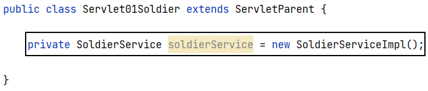

<br/>

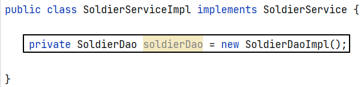

<br/>

# 三、具体功能
## 1、访问首页
### ①思路与流程
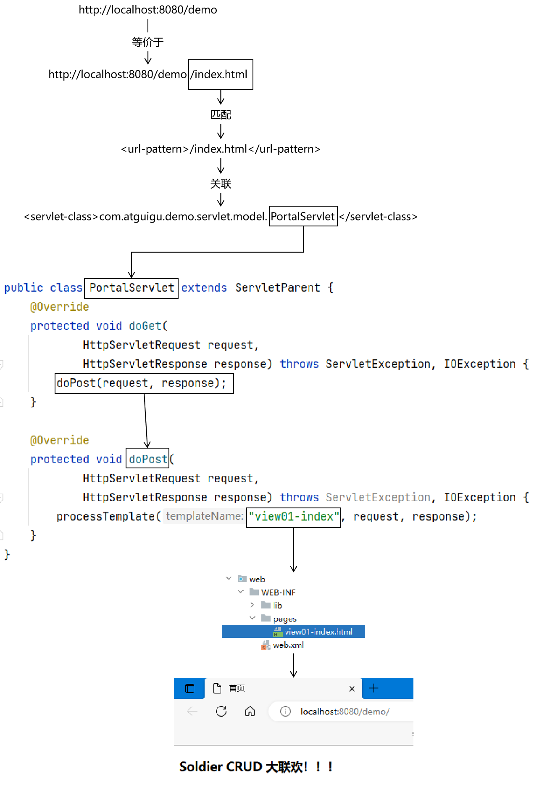

<br/>

### ②Java代码
- 重写doGet()、doPost()方法，不做请求路径最后一段的解析
```java
package com.atguigu.demo.servlet.model;  
  
import com.atguigu.demo.servlet.parent.ServletThymeleafParent;  
import jakarta.servlet.*;  
import jakarta.servlet.http.*;  
  
import java.io.IOException;  
  
public class PortalServlet extends ServletParent {
    @Override
    protected void doGet(
            HttpServletRequest request,
            HttpServletResponse response) throws ServletException, IOException {  
        doPost(request, response);  
    }  
  
    @Override  
    protected void doPost(  
            HttpServletRequest request,  
            HttpServletResponse response) throws ServletException, IOException {  
        processTemplate("view01-index", request, response);  
    }  
}
```

<br/>

### ③web.xml配置
```xml
<servlet>  
    <servlet-name>PortalServlet</servlet-name>  
    <servlet-class>com.atguigu.demo.servlet.model.PortalServlet</servlet-class>  
</servlet>  
<servlet-mapping>  
    <servlet-name>PortalServlet</servlet-name>  
    <url-pattern>/index.html</url-pattern>  
</servlet-mapping>
```

<br/>

### ④视图模板文件
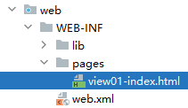

<br/>

```html
<!DOCTYPE html>
<html lang="en" xmlns:th="http://www.thymeleaf.org">
<head>
    <meta charset="UTF-8">
    <title>首页</title>
</head>
<body>

    <h3>Soldier CRUD 大联欢！！！</h3>
    
</body>
</html>
```

<br/>

## 2、显示列表
### ①需求
把t_soldier数据库表中所有数据查询出来到页面上显示

<br/>

### ②思路与流程
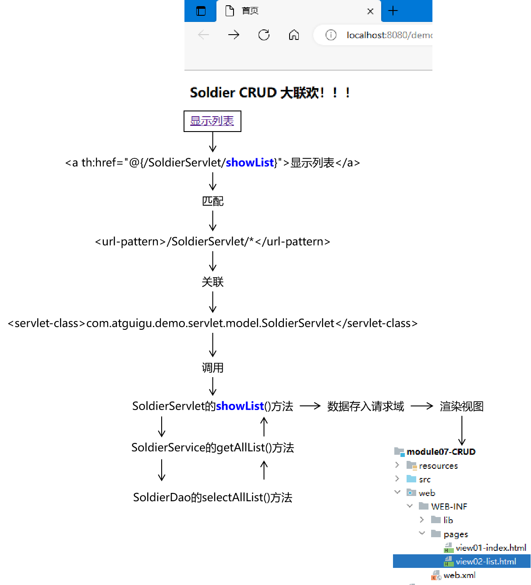

<br/>

### ③web.xml配置SoldierServlet
```xml
<servlet>  
    <servlet-name>SoldierServlet</servlet-name>  
    <servlet-class>com.atguigu.demo.servlet.model.SoldierServlet</servlet-class>  
</servlet>  
<servlet-mapping>  
    <servlet-name>SoldierServlet</servlet-name>  
    <url-pattern>/SoldierServlet/*</url-pattern>  
</servlet-mapping>
```

<br/>

### ④SoldierServlet的showList()方法
```java
protected void showList(  
        HttpServletRequest request,  
        HttpServletResponse response) throws ServletException, IOException {  
  
    // 1、调用 Service 方法获取集合数据  
    List<Soldier> soldierList = soldierService.getAllList();  
  
    // 2、把集合数据存入请求域  
    request.setAttribute("soldierList", soldierList);  
  
    // 3、声明目标逻辑视图名称  
    String viewName = "view02-list";  
  
    // 4、渲染视图  
    super.processTemplate(viewName, request, response);  
  
}
```

<br/>

### ⑤SoldierService的getAllList()方法
```java
@Override  
public List<Soldier> getAllList() {  
    return soldierDao.selectAllList();  
}
```

<br/>

### ⑥SoldierDao的selectAllList()方法
```java
@Override  
public List<Soldier> selectAllList() {  
    String sql = "select soldier_id soldierId,soldier_name soldierName,soldier_salary soldierSalary,soldier_gender soldierGender from t_soldier";  
    return getBeanList(sql, Soldier.class);  
}
```

<br/>

### ⑦视图模板文件
```html
<table>  
    <tr>  
        <th>ID</th>  
        <th>NAME</th>  
        <th>SALARY</th>  
        <th>GENDER</th>  
        <th>OPERATION</th>  
    </tr>  
    <tr th:if="${#lists.isEmpty(soldierList)}">  
        <td colspan="5">抱歉！没有查询到数据！</td>  
    </tr>  
    <tr th:if="${not #lists.isEmpty(soldierList)}" th:each="soldier : ${soldierList}">  
        <td th:text="${soldier.soldierId}"></td>  
        <td th:text="${soldier.soldierName}"></td>  
        <td th:text="${soldier.soldierSalary}"></td>  
        <td th:text="${soldier.soldierGender}"></td>  
        <td>operation</td>  
    </tr>  
</table>
```

<br/>

## 3、删除数据
### ①需求
- 点击超链接删除数据
- 删除成功后还回到列表页面

<br/>

### ②思路与流程
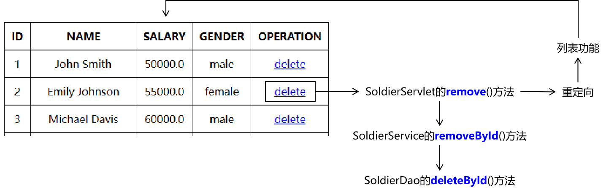

<br/>

### ③超链接
```html
<td>  
    <a th:href="@{/Servlet01Soldier/remove(soldierId=${soldier.soldierId})}">delete</a>
</td>
```

<br/>

### ④SoldierServlet的remove()方法
```java
protected void remove(HttpServletRequest request, HttpServletResponse response) throws ServletException, IOException {  
    // 1、获取请求参数  
    String soldierId = request.getParameter("soldierId");  
  
    // 2、调用 Service 方法执行删除  
    soldierService.removeById(soldierId);  
  
    // 3、重定向到列表功能  
    response.sendRedirect(request.getContextPath() + "/SoldierServlet/showList");  
}
```

<br/>

### ⑤SoldierService的removeById()方法
```java
@Override  
public void removeById(String soldierId) {  
    soldierDao.deleteById(soldierId);  
}
```

<br/>

### ⑥SoldierDao的deleteById()方法
```java
@Override  
public void deleteById(String soldierId) {  
    String sql = "delete from t_soldier where soldier_id=?";  
    commonUpdate(sql, soldierId);  
}
```

<br/>

## 4、显示新增数据的表单
### ①思路与流程
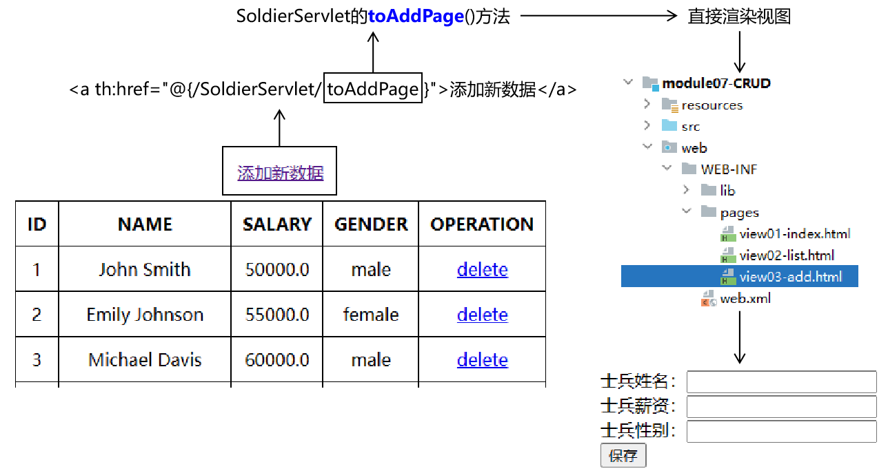

<br/>

### ②SoldierServlet的toAddPage()方法
```java
protected void toAddPage(HttpServletRequest request, HttpServletResponse response) throws ServletException, IOException {  
    // 1、直接渲染视图  
    processTemplate("view03-add", request, response);  
}
```

<br/>

### ③视图模板文件
```html
<form th:action="@{/SoldierServlet/save}" method="post">  
    士兵姓名：<input type="text" name="soldierName" /><br/>  
    士兵薪资：<input type="text" name="soldierSalary" /><br/>  
    士兵性别：<input type="text" name="soldierGender" /><br/>  
    <button type="submit">保存</button>  
</form>
```

<br/>

## 5、执行保存操作
### ①思路与流程
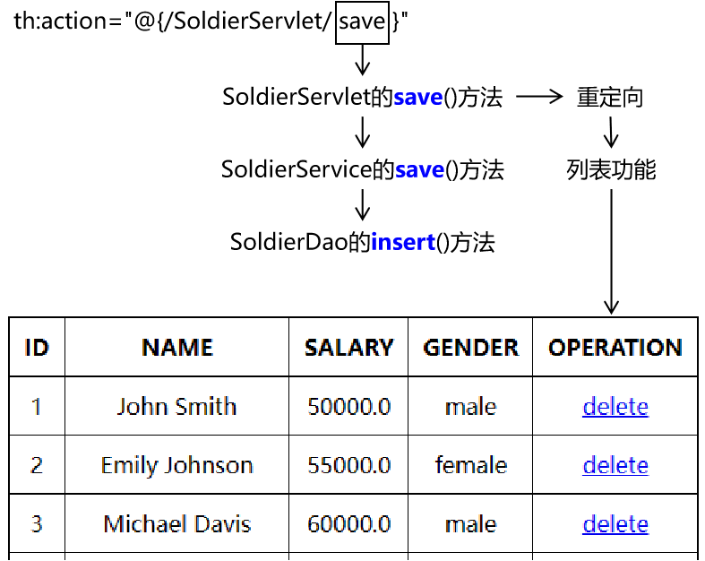

<br/>

### ②SoldierServlet的save()方法
```java
protected void save(HttpServletRequest request, HttpServletResponse response) throws ServletException, IOException {  
    // 1、接收请求参数  
    String soldierName = request.getParameter("soldierName");  
    String soldierSalary = request.getParameter("soldierSalary");  
    String soldierGender = request.getParameter("soldierGender");  
      
    // 2、封装实体类对象  
    Soldier soldier = new Soldier(null, soldierName, Double.parseDouble(soldierSalary), soldierGender);  
      
    // 3、调用 Service 方法执行保存操作  
    soldierService.save(soldier);  
      
    // 4、重定向到列表功能  
    response.sendRedirect(request.getContextPath() + "/SoldierServlet/showList");  
}
```

<br/>

### ③SoldierService的save()方法
```java
@Override  
public void save(Soldier soldier) {  
    soldierDao.insert(soldier);  
}
```

<br/>

### ④SoldierDao的insert()方法
```java
@Override  
public void insert(Soldier soldier) {  
    String sql = "INSERT INTO t_soldier (soldier_name, soldier_salary, soldier_gender) VALUES (?,?,?)";  
    commonUpdate(sql, soldier.getSoldierName(), soldier.getSoldierSalary(), soldier.getSoldierGender());  
}
```

<br/>

## 6、显示更新数据的表单
### ①需求
在表单中<span style="color:blue;font-weight:bolder;">回显</span>被更新的旧数据

<br/>

### ②思路与流程
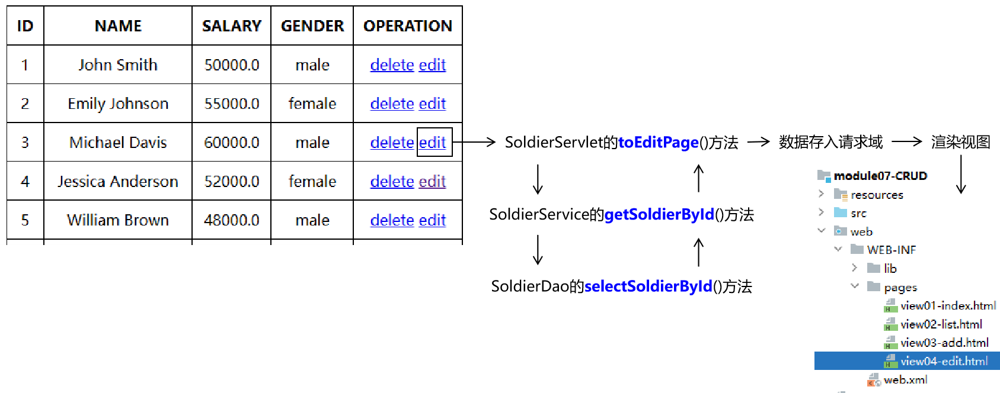

<br/>

### ③SoldierServlet的toEditPage()方法
```java
protected void toEditPage(HttpServletRequest request, HttpServletResponse response) throws ServletException, IOException {  
    // 1、获取请求参数  
    String soldierId = request.getParameter("soldierId");  
  
    // 2、调用 Service 方法查询数据  
    Soldier soldier = soldierService.getSoldierById(soldierId);  
  
    // 3、把 Soldier 对象存入请求域  
    request.setAttribute("soldier", soldier);  
  
    // 4、渲染视图  
    processTemplate("view04-edit", request, response);  
}
```

<br/>

### ④SoldierService的getSoldierById()方法
```java
@Override  
public Soldier getSoldierById(String soldierId) {  
    return soldierDao.selectSoldierById(soldierId);  
}
```

<br/>

### ⑤SoldierDao的selectSoldierById()方法
```java
@Override  
public Soldier selectSoldierById(String soldierId) {  
    String sql = "select soldier_id soldierId,soldier_name soldierName,soldier_salary soldierSalary,soldier_gender soldierGender from t_soldier where soldier_id=?";  
    return getSingleBean(sql, Soldier.class, soldierId);  
}
```

<br/>

### ⑥视图模板文件
```html
<form th:action="@{/SoldierServlet/update}" method="post">  
    <input type="hidden" name="soldierId" th:value="${soldier.soldierId}" />  
    士兵姓名：<input type="text" name="soldierName" th:value="${soldier.soldierName}" /><br/>  
    士兵薪资：<input type="text" name="soldierSalary" th:value="${soldier.soldierSalary}" /><br/>  
    士兵性别：<input type="text" name="soldierGender" th:value="${soldier.soldierGender}" /><br/>  
    <button type="submit">更新</button>  
</form>
```

<br/>

## 7、执行更新操作
### ①思路与流程
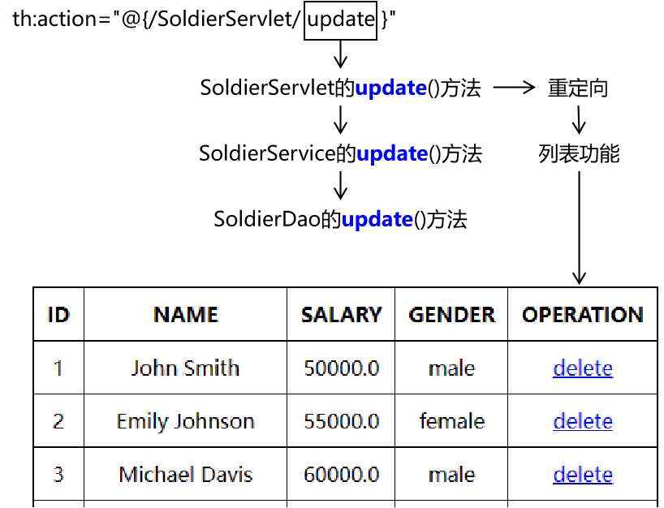

<br/>

### ②SoldierServlet的update()方法
```java
protected void update(HttpServletRequest request, HttpServletResponse response) throws ServletException, IOException {  
    // 1、接收请求参数  
    String soldierId = request.getParameter("soldierId");  
    String soldierName = request.getParameter("soldierName");  
    String soldierSalary = request.getParameter("soldierSalary");  
    String soldierGender = request.getParameter("soldierGender");  
  
    // 2、封装实体类对象  
    Soldier soldier = new Soldier(  
            Integer.parseInt(soldierId),   
            soldierName,   
            Double.parseDouble(soldierSalary),   
            soldierGender);  
  
    // 3、调用 Service 方法执行保存操作  
    soldierService.update(soldier);  
  
    // 4、重定向到列表功能  
    response.sendRedirect(request.getContextPath() + "/SoldierServlet/showList");  
}
```

<br/>

### ③SoldierService的update()方法
```java
@Override  
public void update(Soldier soldier) {  
    soldierDao.update(soldier);  
}
```

<br/>

### ④SoldierDao的update()方法
```java
@Override  
public void update(Soldier soldier) {  
    String sql = "update t_soldier set soldier_name=?, soldier_salary=?, soldier_gender=? where soldier_id=?";  
    commonUpdate(sql, soldier.getSoldierName(), soldier.getSoldierSalary(), soldier.getSoldierGender(), soldier.getSoldierId());  
}
```