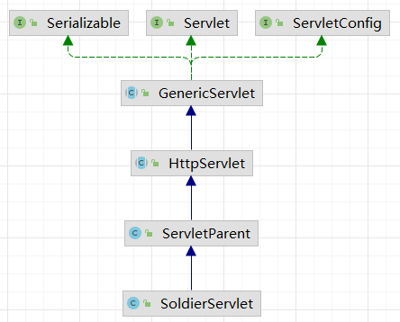
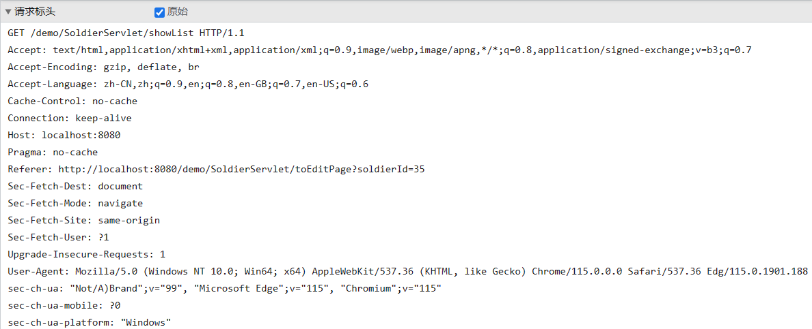
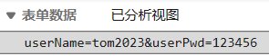
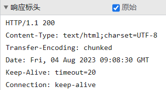

# 一、Servlet生命周期
## 1、Servlet的API体系


<br/>

## 2、Servlet生命周期
### ①从Servlet接口说起
```java
public interface Servlet {
    // 做初始化操作（生命周期方法）
    void init(ServletConfig var1) throws ServletException;  

    // 获取 ServletConfig 对象
    ServletConfig getServletConfig();  

    // 每一次接收到请求都调用这个 service() 方法来处理请求（生命周期方法）
    void service(ServletRequest request, ServletResponse response) throws ServletException, IOException;  

    // 获取 Servlet 相关信息
    String getServletInfo();  

    // 在 Web 应用卸载之前执行清理操作（生命周期方法）
    void destroy();  
}
```

<br/>

### ②生命周期
#### [1]创建对象
- Tomcat根据Servlet的全类名（通过web.xml中的配置告诉了Tomcat）基于反射技术创建了Servlet的对象
- 在Servlet第一次接收到请求时创建对象，而且只创建一个。也就是说，在整个Web应用范围内，Servlet是单例的。
- 创建对象调用的是Servlet的无参构造器。

<br/>

#### [2]初始化
- 调用init(ServletConfig servletConfig)方法执行初始化操作
- 在创建对象之后立即执行
- 在整个生命周期中只执行一次

<br/>

#### [3]处理请求
- 每一次处理前端请求的时候执行
- 调用的方法
	- 从Servlet接口的角度来说：调用的是service()方法
	- 从继承HttpServlet的类来说：调用的是doXxx()方法
- 处理请求的操作可以执行多次

<br/>

#### [4]销毁or清理
- 调用destroy()方法执行销毁、清理操作
- 在Web应用卸载的过程中，Servlet对象被销毁之前执行
- 只执行一次

<br/>

#### [5]提出问题
在第一次接收到请求的时候，才执行创建对象、初始化的操作，这样的做法在特定场景下不合适。<br/><br/>

如果初始化环节要做的操作比较多，耗时较长，那么就会导致第一个请求的用户等待时间太长，用户体验很差。<br/><br/>

所以初始化操作最好是在Web应用启动的时候来做更合适。特别是将来我们使用框架之后。<br/><br/>

以后我们使用SpringMVC这个框架，它的核心就是一个名叫DispatcherServlet的组件。这个组件的初始化方法中要做的事情就很多：读取并解析配置文件、根据配置文件创建对象、组装各个组件……<br/><br/>

操作：
```xml
<!-- servlet 标签：配置 Servlet 本身 -->  
<servlet>  
    <!-- servlet-name 标签：由于全类名太长，为了便于其它地方引用，声明一个简短、友好的名称 -->  
    <servlet-name>HelloServlet</servlet-name>  
  
    <!-- servlet-class 标签：指定 Servlet 全类名 -->  
    <servlet-class>com.atguigu.servlet.HelloServlet</servlet-class>  
      
    <!-- 改变 Servlet 的启动顺序 -->  
    <load-on-startup>1</load-on-startup>  
</servlet>
```

<br/>

## 3、Servlet容器
### ①类比生活中的容器
|容器类别|生活中|代码中|
|---|---|---|
|简单容器|水杯|数组、List集合、Set集合|
|复杂容器|养鸡场|Servlet容器、Spring 框架中的IOC容器|

<br/>

复杂的容器不仅仅是存放对象，而且负责对象的一生：
- 创建对象
- 对象初始化
- 对象工作、干活儿
- 对象销毁

<br/>

负责管理Servlet生命周期的就是Servlet容器。具体来说，我们现在使用的Servlet容器就是Tomcat。

<br/>

Servlet的生命周期方法也都是Servlet容器调用的：
- 通过构造器创建对象（基于反射技术）
- 调用init()方法初始化
- 调用service()方法处理请求，传入request、response对象（request、response对象也是容器创建的）
- 调用destroy()方法清理

<br/>

### ②Servlet标准和Servlet容器
类比JDBC：
- JDBC标准是为了屏蔽不同数据库产品之间的差异，让Java程序可以以相同的方式操作数据库
- JDBC标准是由一系列接口组成的
	- Connection：代表数据库连接
	- Statement：代表SQL语句
	- PreparedStatement：预编译的SQL语句
	- ResultSet：代表结果集
	- DataSource：代表数据源，也就是数据库连接池

<br/>

Servlet也包含一系列接口：
- jakarta.servlet.Servlet
- jakarta.servlet.Filter
- jakarta.servlet.ServletContextListener
- jakarta.servlet.http.HttpServletRequest
- jakarta.servlet.http.HttpServletResponse
- jakarta.servlet.http.HttpSession
- jakarta.servlet.ServletContext

<br/>

基于上述的接口，Servlet也是一套完备的标准。这套标准是为了屏蔽不同Servlet容器之间的差异。
- Tomcat
- Jetty
- JBoss
- Glassfish
- Weblogic
- WebSphere
- ……

<br/>

只要Servlet容器和Web应用都遵循同一个版本的标准，就可以在不同容器之间平滑、无缝迁移。Servlet标准中的接口由各个Servlet容器提供实现。<br/>

例如：HttpServletRequest接口在Tomcat10的实现类是org.apache.catalina.connector.RequestFacade

<br/>

## 4、从service()到doGet()


# 二、Servlet字符集设定
## 1、编码和解码
一个字符，我们看到的是字符本身：'a'，但是在计算机底层实际是二进制的方式存储。
- 编码：把字符转换成对应的二进制数据就是编码。
- 解码：把二进制数据恢复为对应的字符就是解码。

<br/>

乱码的原因就是：编码和解码用的不是同一个字符集。
- 编码：GBK（'中'：2233）
- 解码：UTF-8（2233：'大'）

<br/>

## 2、请求参数
### ①GET请求
Tomcat版本≤7，需要修改配置。修改方式：在conf/server.xml配置文件中找到第一个Connector，新增属性：
```xml
<Connector URIEncoding="UTF-8" ... />
```
对GET请求来说，设置一次一劳永逸。

<br/>

### ②POST请求
在获取请求参数前，设置请求体解码字符集为：UTF-8。每一个请求需要单独设置，做不到一劳永逸。Tomcat10不需要设置。<br/>

```java
// 设置请求体解码字符集为：UTF-8
request.setCharacterEncoding("UTF-8");

String yourName = request.getParameter("yourName");
```

<br/>

> 提前剧透：将来我们学习的过滤器（Filter）可以用来执行统一的字符集设置

<br/>

## 3、返回响应
注意：如果 Tomcat 版本较低（比如 Tomcat7），必须先设置响应体内容类型，然后再获取 PrintWriter！<br/>

```java
// 设置响应体的编码字符集，但是并没有告诉浏览器用什么字符集解码
// response.setCharacterEncoding("UTF-8");

// 设置响应体内容类型，告诉浏览器使用 UTF-8 来解码
// 底层隐含的，服务器会自动使用相同字符集编码
response.setContentType("text/html;charset=UTF-8");
PrintWriter writer = response.getWriter();
writer.write("大西瓜，圆又圆。");
```

<br/>

# 三、HTTP协议
## 1、概述
- HTTP：Hyper Text Transfer Protocol 超文本传输协议
- HTTP交互方式：
  - 建立连接（TCP协议）
  - 发送请求
  - 返回响应
  - 关闭连接
- HTTP1.0和1.1区别
  - 1.0每个请求建立一个连接，效率较低
  - 1.1下载网页、下载网页中的图片等资源使用的是同一个连接

<br/>


<br/>

## 2、请求报文格式
### ①总体格式说明
- 报文首部：对当前请求和报文主体进行相关说明
- 空行：表示下面即将开始报文的正文
- 报文主体：当前请求主要要发送给服务器的部分

<br/>



<br/>


<br/>

### ②报文首部
- 请求行：对当前请求进行简要说明
  - 请求方式：GET或POST
  - 请求地址：比如/module03_web_war_exploded/index.jsp
  - 协议名称和版本：HTTP/1.1
- 请求消息头：对当前请求、请求体进行详细说明
  - 格式都是键值对，键和值之间用冒号分开的
  - 常用需要留意的请求消息头：
    - Cookie：当前请求携带的Cookie信息
    - Referer：表示当前页面是从哪个页面来的
    - Content-Type：对请求体的数据类型进行说明

<br/>

### ③GET请求和POST请求的区别
- <span style="color:blue;font-weight:bolder;">GET请求没有请求体，POST请求有请求体</span>
- 因为没有请求体，所以GET请求只能把请求参数附着在URL地址后面
- 因为附着在URL地址的后面
  - URL地址后面能够附着请求参数的数量是有限的
  - 敏感信息也会明文显示出来，不安全
- POST请求把请求参数放在请求体中，浏览器地址栏看不到
  - 请求体没有容量限制
  - 请求体不会被直接看到，更安全
- 表单建议使用POST方式提交
- 文件上传操作：必须使用POST请求，不能使用GET请求

<br/>

- 从TCP协议的角度来看，GET请求和POST请求没有区别，都是TCP协议要传输的数据而已

### ④请求参数格式
本质上浏览器发送请求参数的格式都是下面这样：
```text
userName=tom2023&userPwd=123456
```

<br/>

GET请求和POST请求的区别在于：
- GET请求需要把请求参数附着在URL地址后面，所以URL地址和请求参数直接需要使用问号（?）隔开
- POST请求的请求参数就在请求体中，所以不需要使用问号

<br/>



<br/>

## 3、响应报文
### ①总体格式说明
- 报文首部：对当前响应和报文主体进行相关说明
- 空行：表示下面即将开始报文的正文
- 报文主体：当前响应主要要返回给浏览器的部分

<br/>



<br/>


②响应状态行

- 协议名称和版本号：HTTP/1.1
- 响应状态码：有很多，每一个码都有特定的含义
  - 比如：200表示请求处理成功，能够返回有效响应
- 响应状态码的说明信息
  - 比如：OK通常是对200进行说明

<br/>

### ③响应消息头
- 总体格式和请求头一样，都是键值对格式，键和值之间用冒号分开
- Content-Type：说明响应体的内容类型
- Set-Cookie：服务器端给浏览器端返回Cookie信息

<br/>

### ④响应体
浏览器拿到响应体就是要在浏览器窗口中显示的。例如：
```html
<!DOCTYPE html>
<html lang="en">
<head>
    <meta charset="UTF-8">
    <title>目标页面</title>
</head>
<body>

    <h3>目标页面</h3>

</body>
</html>
```

<br/>

### ⑤响应状态码
- 200：请求成功，浏览器会把响应体内容（通常是html）显示在浏览器中；
- 302：重定向，当响应码为302时，表示服务器要求浏览器重新再发一个请求，服务器会发送一个响应头Location指定新请求的URL地址；
- 304：使用了本地缓存
- 403：没有权限
- 404：请求的资源没有找到，说明客户端错误的请求了不存在的资源；
- 405：请求的方式不允许
- 500：请求资源找到了，但服务器内部出现了错误；

<br/>

### ⑥404问题解决
- 请求路径不正确，根据请求路径无法找到目标资源。
- 访问了WEB-INF目录下的资源
- Web应用启动时就抛出了异常，整个Web应用不可用，即使是正确的路径访问资源也是404<span style="color:blue;font-weight:bolder;">【概率最大的情况】</span>
- 如果上面的方向都检查过了，没有问题，那么可能部署目录下不是按最新的代码运行的。此时重新构建、重新部署试试。
  - 把Tomcat停止
  - 到Edit Configurations...这里把Tomcat上现在部署的应用去掉
  - 到Build菜单下点Build Artifacts...
  - 然后在需要重新构建的Artifact子菜单中执行clean
  - 执行clean之后再执行build
  - 重新部署应用

<br/>


### ⑦web.xml中常见错误配置举例

#### [1]使用*号不当

web.xml中配置url-pattern时，不允许中间使用*号，下面示例是错误的：

```xml
<url-pattern>/xxx/*.html</url-pattern>
```


使用*号正确的示例：

```xml
<!-- 前缀匹配 -->
<url-pattern>/SoldierServlet/*</url-pattern>

<!-- 后缀匹配 -->
<url-pattern>*.html</url-pattern>
<url-pattern>*.atguigu</url-pattern>
```


#### [2]多个Servlet映射同一个地址

```xml
    <servlet>
        <servlet-name>Servlet03Char</servlet-name>
        <servlet-class>com.atguigu.demo.servlet.Servlet03Char</servlet-class>
    </servlet>
    <servlet-mapping>
        <servlet-name>Servlet03Char</servlet-name>
        <url-pattern>/samePath</url-pattern>
    </servlet-mapping>

    <servlet>
        <servlet-name>Servlet04Headers</servlet-name>
        <servlet-class>com.atguigu.demo.servlet.Servlet04Headers</servlet-class>
    </servlet>
    <servlet-mapping>
        <servlet-name>Servlet04Headers</servlet-name>
        <url-pattern>/samePath</url-pattern>
    </servlet-mapping>
```


异常信息局部如下：

> Caused by: java.lang.IllegalArgumentException: 名为 [Servlet03Char]和 [Servlet04Headers] 的servlet不能映射为一个url模式(url-pattern) [/samePath]
> 		at org.apache.tomcat.util.descriptor.web.WebXml.addServletMappingDecoded(WebXml.java:354)
> 		at org.apache.tomcat.util.descriptor.web.WebXml.addServletMapping(WebXml.java:347)
