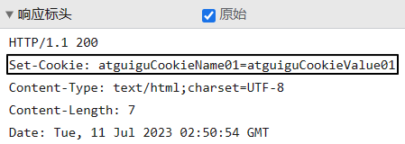
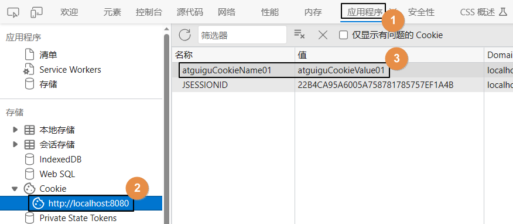
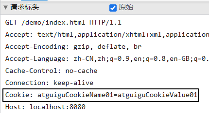
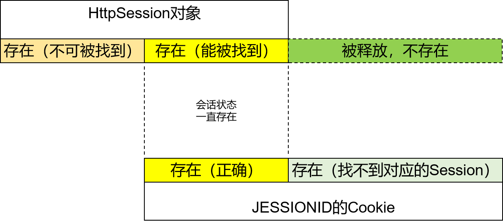

# 一、理论基础
## 1、会话控制核心操作（重中之重）
- 会话域写操作：session.<span style="color:blue;font-weight:bolder;">setAttribute</span>(字符串类型的属性名, Object类型的属性值);
- 会话域读操作：Object value = session.<span style="color:blue;font-weight:bolder;">getAttribute</span>(字符串类型的属性名);

<br/>

- 想要在一个会话的范围内保持某个状态，就把数据存入会话域即可
- 例如：用户登录就是把用户对象保存到会话域，代表用户已登录这个状态

<br/>

- 我们常用的是HttpSession来保持会话状态，但Session是基于Cookie生效的

<br/>

HTTP协议本身是『无状态』的，怎么理解这个『无状态』呢？就是说：HTTP协议本身是不存储用户状态的，每个请求都是独立的。这样一来，HTTP协议就只负责定义请求、响应的报文的格式即可。
- 好处：HTTP协议本身更简单，基于HTTP协议设计项目架构更简单
- 坏处：为了保持会话状态，需要额外另想办法

<br/>

## 2、Cookie的工作机制
### ①设定场景
咖啡店发布了一个促销活动：消费五杯咖啡，赠送一杯。<br/>
又不能要求用户一次性消费完这五杯，用户肯定是不同的日期来店里消费，累积够五杯之后，再赠送。<br/>
可是店员不认识顾客，不能单凭顾客的一面之词就相信他消费了五杯。<br/>
所以咖啡店设计了一个卡片，顾客每消费一杯，就在卡片上盖一个印章。<br/>
集齐五个印章，赠送一杯。<br/>
本质上这里解决的是识别用户身份的问题。<br/>
对于我们服务器端程序，也有相同的问题：如何识别上一个、下一个请求是来自同一个浏览器。<br/>

### ②Cookie工作机制要点
- Cookie数据是在服务器端生成的
- 服务器端生成Cookie之后通过响应消息头返回给浏览器
- 浏览器保存Cookie信息
- 浏览器以后访问服务器都会自动携带Cookie
- 服务器端可以从请求对象中读取Cookie信息

<br/>

### ③操作：服务器创建并返回Cookie
```java
// 1、创建 Cookie 对象  
Cookie cookie = new Cookie("atguiguCookieName01", "atguiguCookieValue01");  
  
// 2、把 Cookie 对象添加到响应中  
// 底层会在响应消息头中附加下面内容：  
// Set-Cookie: atguiguCookieName01=atguiguCookieValue01  
response.addCookie(cookie);  
  
// 3、返回响应  
response.setContentType("text/html;charset=UTF-8");  
response.getWriter().write("success");
```

<br/>

响应消息头截图：<br/>



<br/>



<br/>

### ④观察：浏览器再次访问服务器自动携带Cookie



<br/>

### ⑤操作：服务器端读取Cookie信息
```java
response.setContentType("text/html;charset=UTF-8");  
PrintWriter writer = response.getWriter();  
  
// 1、通过 request 对象获取 Cookie 数组  
// ※注意：这个 Cookie 数组不一定有值，只有浏览器发送请求时携带的 Cookie 才有  
Cookie[] cookies = request.getCookies();  
  
// 2、对 Cookie 数组做一个判空保护  
if (cookies != null && cookies.length > 0) {  
  
    // 3、遍历 Cookie 数组  
    for (int i = 0; i < cookies.length; i++) {  
        Cookie cookie = cookies[i];  
        writer.write("Cookie Name:" + cookie.getName());  
        writer.write("<br/>");  
        writer.write("Cookie Value:" + cookie.getValue());  
    }  
} else {  
    writer.write("没有获取到任何Cookie信息。");  
}
```

<br/>

### ⑥理论：Cookie时效性
#### [1]从时效性角度Cookie分成两种
- 会话级：保存在浏览器的内存中，只要浏览器开着就一直在。浏览器关闭的时候释放。这是默认情况。
- 持久化：保存在浏览器的硬盘中，此时必然是服务器端设定的过期时间。到过期时间时被释放。

<br/>

#### [2]setMaxAge()方法
- expire参数是正数情况：设置 Cookie 以秒为单位作为过期时间
- expire参数是0情况：告诉浏览器删除这个 Cookie
- expire参数是负数情况：把 Cookie 设置为会话级

<br/>

```java
// 1、创建 Cookie 对象  
Cookie cookie = new Cookie("timedCookieName", "timedCookieValue");  
  
// 2、给 Cookie 设置过期时间  
// expire参数是正数情况：设置 Cookie 以秒为单位作为过期时间  
// expire参数是0情况：告诉浏览器删除这个 Cookie
// expire参数是负数情况：把 Cookie 设置为会话级  
cookie.setMaxAge(-10);  
  
// 3、在响应中添加 Cookieresponse.addCookie(cookie);  
  
// 4、返回响应  
response.setContentType("text/html;charset=UTF-8");  
response.getWriter().write("success");
```

<br/>

### ⑦、Cookie的使用建议
- Cookie有如下限制：
	- 单个Cookie能够保存的数据非常有限
	- 浏览器保存Cookie时，属于不同网站的Cookie的数量也是有限的
	- 来自于同一个网站的Cookie也只能保存有限的个数（约20个）
	- 用户随时可能删除浏览器端的所有Cookie
	- 用户也可以禁用浏览器端的Cookie
- Cookie的开发建议
	- 不要在Cookie中保存太多数据
	- 同一个域名下，Cookie保存的数量不要太多
	- 不要过于依赖Cookie作为数据保存的手段
	- Cookie主要是用来保存那些能够识别用户身份的数据

<br/>

## 3、Session的工作机制
### ①咖啡买五送一
参见PPT<br/>

### ②代码演示Session工作机制
调用 request.getSession(); 方法获取 HttpSession 对象时：
- 当前请求中没有携带 JSESSIONID 的 Cookie
	- 服务器端创建新的 HttpSession 对象
	- 每一个 HttpSession 对象都有一个唯一标识：JSESSIONID
	- 基于 JSESSIONID 创建 Cookie
	- Cookie的名字是 "JSESSIONID"这个字符串，值就是 JESSIONID 对应的唯一值
	- 然后这个名叫 JSESSIONID 的 Cookie 会随着响应返回给浏览器
- 当前请求中携带了 JSESSIONID 的 Cookie
	- 根据 JSESSIONID 在服务器端查找对应的 HttpSession 对象
		- 能找到：把找到的 HttpSession 对象作为 getSession() 方法的返回值
		- 找不到：服务器端创建新的 HttpSession 对象……

<br/>

```java
response.setContentType("text/html;charset=UTF-8");  
PrintWriter writer = response.getWriter();  
  
// 1、尝试获取 HttpSession 对象  
HttpSession session = request.getSession();  
  
// 2、调用 HttpSession 对象的 isNew() 方法查看这个 HttpSession 对象是否为新创建的  
boolean isNew = session.isNew();  
writer.write(isNew?"当前HttpSession对象是新创建的":"当前HttpSession对象是旧的，以前创建的");  
writer.write("<br/>");  
// 3、获取当前 HttpSession 对象的 id 值  
String id = session.getId();  
writer.write("当前HttpSession对象的id=" + id);
```

### ③时效性
#### [1]介绍
- 服务器端做 HttpSession 对象的管理有个目标：不能无限创建 HttpSession 对象。
- 一旦浏览器端 JSESSIONID 的 Cookie 丢失，留在服务器端的 HttpSession 对象就再也用不上了。
- 用不上的 HttpSession 对象留在服务器端就只是白白占用内存空间，时间长了会把内存耗尽。
- 所以我们不允许 HttpSession 对象永远保存在服务器。
- 具体做法是：一旦 HttpSession 对象空闲达到指定的时间，就会强行把它释放。
- 在Tomcat的conf/web.xml中可以看到默认设置：
```xml
  <!-- ==================== Default Session Configuration ================= -->
  <!-- You can set the default session timeout (in minutes) for all newly   -->
  <!-- created sessions by modifying the value below.                       -->

    <session-config>
        <session-timeout>30</session-timeout>
    </session-config>
```

<br/>

#### [2]测试代码
```java
// 1、获取 HttpSession 对象  
HttpSession session = request.getSession();  
  
// 2、修改最大空闲时间，以秒为单位
// Inactive：不活跃的  
// Interval：时间间隔  
session.setMaxInactiveInterval(10);
```

<br/>

#### [3]让Session立即失效
```java
session.invalidate();
```

<br/>

使用场景举例：用户退出登录时，把HttpSession对象彻底干掉，整个会话域全部释放。<br/>
所以要结合业务需求考虑清楚，是“一锅端”还是“定点清除”。

- 一锅端：session.invalidate();
- 定点清除：session.removeAttribute("属性名");

<br/>

以登录为例：
- 登录：session.setAttribute("loginUser", user);
- 退出登录：
	- 一锅端：session.invalidate();// Session域的其它属性也都没了
	- 定点清除：session.removeAttribute("loginUser");// Session域的其它属性都还在

<br/>

## 4、到底啥叫会话？



<br/>

# 二、登录功能
## 1、建模
### ①物理建模
```sql
create table t_user(  
    user_id int auto_increment primary key ,  
    user_name char(100),  
    user_pwd char(100),  
    user_nick_name char(100)  
);  
insert into t_user(user_name, user_pwd, user_nick_name) VALUES ("tom2023", "123456", "tom");
```

<br/>

### ②逻辑建模
```java
public class User {  
  
    private Integer userId;  
    private String userName;  
    private String userPwd;  
    private String userNickName;
```

<br/>

## 2、创建组件
- UserDao
- UserDaoImpl
- UserService
- UserServiceImpl
- UserServlet

<br/>

```xml
<servlet>  
    <servlet-name>UserServlet</servlet-name>  
    <servlet-class>com.atguigu.demo.servlet.model.UserServlet</servlet-class>  
</servlet>  
<servlet-mapping>  
    <servlet-name>UserServlet</servlet-name>  
    <url-pattern>/UserServlet/*</url-pattern>  
</servlet-mapping>
```

<br/>

## 3、显示登录页面
### ①编写超链接
```html
<a th:href="@{/UserServlet/toLoginPage}">登录</a>
```

<br/>

### ②UserServlet的toLoginPage()方法
```java
protected void toLoginPage(HttpServletRequest request, HttpServletResponse response) throws ServletException, IOException {  
    processTemplate("view05-login", request, response);  
}
```

<br/>

### ③登录的表单页面
```html
<!DOCTYPE html>  
<html lang="en">  
<head>  
    <meta charset="UTF-8">  
    <title>登录</title>  
</head>  
<body>  
  
    <form th:action="@{/UserServlet/login}" method="post">  
        <p th:text="${message}"></p>  
        账号：<input type="text" name="userName" /><br/>  
        密码：<input type="password" name="userPwd" /><br/>  
        <button type="submit">登录</button>  
    </form>  
  
</body>  
</html>
```

<br/>

## 4、登录验证
### ①Servlet方法
```java
protected void login(HttpServletRequest request, HttpServletResponse response) throws ServletException, IOException {  
    String userName = request.getParameter("userName");  
    String userPwd = request.getParameter("userPwd");  
  
    User user = userService.login(userName, userPwd);  
    if (user == null) {  
        request.setAttribute("message", "用户名、密码不正确！");  
        processTemplate("view05-login", request, response);  
    } else {  
        HttpSession session = request.getSession();  
        session.setAttribute("loginUser", user);  
        response.sendRedirect(request.getContextPath() + "/index.html");  
    }  
}
```

<br/>

### ②Service方法
```java
@Override  
public User login(String userName, String userPwd) {  
  
    return userDao.selectUserForLogin(userName, userPwd);  
}
```

<br/>

### ③Dao方法
```java
@Override  
public User selectUserForLogin(String userName, String userPwd) {  
    String sql = "select user_id userId, user_name userName, user_pwd userPwd, user_nick_name userNickName from t_user where user_name=? and user_pwd=?";  
    return getSingleBean(sql, User.class, userName, userPwd);  
}
```

<br/>

## 5、显示欢迎信息

```html
<!-- 用户未登录时，显示登录超链接 -->
<a th:if="${session.loginUser == null}" th:href="@{/UserServlet/toLoginPage}">登录</a>

<!-- 用户已登录时，显示欢迎信息和退出登录的超链接 -->
<p th:if="${session.loginUser != null}">欢迎您：[[${session.loginUser.userNickName}]]</p>
<a th:if="${session.loginUser != null}" th:href="@{/UserServlet/logout}">退出登录</a>
```

- 在各个页面都加上这部分代码，以证明会话域可以跨页面保持状态和数据


## 6、退出登录

```java
protected void logout(HttpServletRequest request, HttpServletResponse response) throws ServletException, IOException {
    // 1、获取 HttpSession 对象
    HttpSession session = request.getSession();

    // 2、执行退出登录的操作
    // 实现方式一：移除特定会话域数据
    // 会话域其它数据在用户退出登录后仍要保持
    session.removeAttribute("loginUser");

    // 实现方式二：将整个 HttpSession 对象释放
    // 会话域随着用户退出登录全部释放
    // session.invalidate();

    // 3、重定向回到首页
    response.sendRedirect(request.getContextPath() + "/index.html");
}
```

