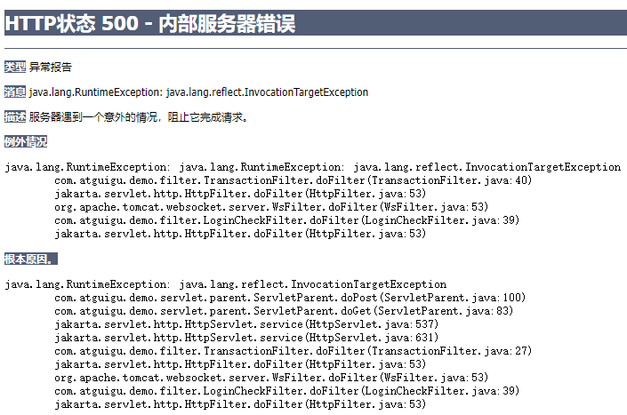
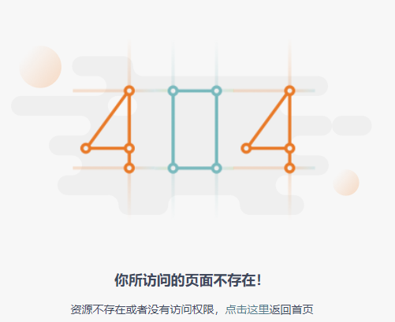
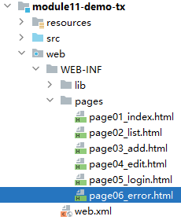
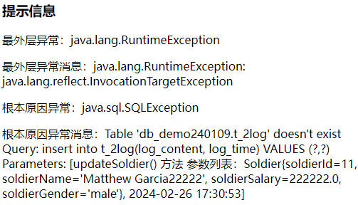

# 一、提出问题
## 1、增加日志功能
假设Soldier增删改之后都需要保存日志

<br/>

## 2、建模
### ①物理建模
```sql
create table t_log(  
    log_id int primary key auto_increment,  
    log_content char(200),  
    log_time char(100)  
);
```

<br/>

### ②逻辑建模
```java
public class MyDemoLog {  
      
    private Integer logId;
    private String logContent;
    private String logTime;
```

<br/>

## 3、创建组件
- LogDao接口
- LogDaoImpl实现类
- 在SoldierServiceImpl中创建LogDao类型的成员变量

<br/>

## 4、保存日志
分别在增删改方法中增加如下代码来创建并保存日志：
```java
SimpleDateFormat simpleDateFormat = new SimpleDateFormat("yyyy-MM-dd HH:mm:ss");  
String currentTime = simpleDateFormat.format(new Date());  
  
MyDemoLog myDemoLog = new MyDemoLog(null, "当前方法名 方法参数="+方法参数, currentTime);  
  
logDao.insertLog(myDemoLog);
```

<br/>

## 5、提出问题
以删除为例：我们希望把删除操作和它配套的日志保存操作放在一个事务中
- 提交：两个操都成功
- 回滚：两个操作有任何一个失败

<br/>

# 二、事务概念回顾
## 1、概念
在实际开发中，很可能<span style="color:blue;font-weight:bold;">多条SQL语句</span>，构成一个<span style="color:blue;font-weight:bold;">逻辑上的整体</span>。<br/>
这个逻辑整体中的SQL语句，要生效就一起生效，有任何一条执行失败，整个逻辑整体都应该撤销。

<br/>

下单操作：

- 保存订单数据
- 保存订单详情
- 更新销量数据
- 更新库存数据

<br/>

## 2、事务的ACID
- A：<span style="color:blue;font-weight:bold;">原子性</span> 事务作为一个逻辑的整体是不可再分的。整体缺少任何一条SQL语句，逻辑就不成立。
- C：<span style="color:blue;font-weight:bold;">一致性</span> 事务中的多个操作，要生效就一起生效，有任何一条执行失败，整个逻辑整体都应该撤销。
- I：<span style="color:blue;font-weight:bold;">隔离性</span> 事务在并发操作过程中，能够彼此隔离，互不影响。
- D：<span style="color:blue;font-weight:bold;">持久性</span> 事务一旦提交，就在数据库中永久保存，无法再撤销。

<br/>

## 3、事务的并发执行
### ①事务的并发问题
- <span style="color:blue;font-weight:bold;">脏读</span>：当前事务读取了其它事务尚未提交的修改，其它事务回滚之后，当前事务读取的数据就是错误的。
- <span style="color:blue;font-weight:bold;">不可重复读</span>：当前事务两次读取同一个数据，但是这两次读取的数据不相同，但数据都是正确的，是其它事务提交了的修改。
- <span style="color:blue;font-weight:bold;">幻读</span>：当前事务执行过程中，数据库表中的记录增加或减少了。

<br/>

### ②事务的隔离级别
- <span style="color:blue;font-weight:bold;">读未提交</span>：当前事务可以读取其它事务尚未提交的修改（不能解决任何并发问题）
- <span style="color:blue;font-weight:bold;">读已提交</span>：当前事务只读取其它事务已经提交的修改（能解决脏读的问题）
- <span style="color:blue;font-weight:bold;">可重复读</span>：当前事务执行过程中，要求多次读取到的数据都是一样的（能够解决脏读、不可重复读问题）
- <span style="color:blue;font-weight:bold;">串行化</span>：当前事务执行过程中，整个表不允许其它事务操作（能够解决所有并发问题，但是性能最差）

<br/>

# 三、Java代码中实现事务控制
## 1、事务代码本身
- 编程式事务：自己写代码实现
- 声明式事务：通过在框架中配置实现

<br/>

```java
// 1、获取数据库连接
Connection conn = ...;
try {
	
	// 2、开启事务（关闭事务的自动提交）
	conn.setAutoCommit(false);
	
	// 3、执行SQL语句
	// ...

	// 4、执行成功，提交事务
	conn.commit();
}catch(Exception e){
	// 5、执行失败，回滚事务
	conn.rollBack();
}finally{
	// 6、不管成功还是失败，释放资源……
	// ...
	if(conn != null) {
		conn.close();
	}
}

```

## 2、事务代码抽取
如果每个需要事务的方法，都单独加事务，那么会造成大量冗余、重复的代码：<br/>

```java
@Override
public void saveSoldier(Soldier soldier) {

	Connection connection = JDBCUtils.getConnection();

	try {
		soldierDao.insertSoldier(soldier);
		
		MyDemoLog myDemoLog = new MyDemoLog();  

		myDemoLog.setLogContent(soldier.getSoldierName()+" "+soldier.getSoldierSalary()+" "+soldier.getSoldierGender());
  
		logDao.insertLog(myDemoLog);
		
		connection.commit();
	} catch (Exception e) {
		connection.rollback();
		throw new RuntimeException(e);
	} finally {  
		JDBCUtils.releaseConnection(connection);
	}
	
}
```

<br/>

为了最大限度减少代码冗余，把事务代码抽取到了Filter：
```java
package com.atguigu.demo.filter;  

import com.atguigu.demo.utils.JDBCUtils;  
import jakarta.servlet.FilterChain;  
import jakarta.servlet.ServletException;  
import jakarta.servlet.http.HttpFilter;  
import jakarta.servlet.http.HttpServletRequest;  
import jakarta.servlet.http.HttpServletResponse;  
  
import java.io.IOException;  
import java.sql.Connection;  
import java.sql.SQLException;  
  
public class TransactionFilter extends HttpFilter {  
  
    @Override
    protected void doFilter(HttpServletRequest request, HttpServletResponse response, FilterChain chain) throws IOException, ServletException {  
        // 1、获取数据库连接  
        Connection connection = JDBCUtils.getConnection();  

        try {  
            // 2、开启事务（把事务自动提交关闭）  
            connection.setAutoCommit(false);  
  
            // 3、直接放行  
            chain.doFilter(request, response);  
  
            // 4、提交事务  
            connection.commit();  
  
        } catch (Throwable throwable) {  
  
            // 5、回滚事务  
            try {  
                connection.rollback();  
            } catch (SQLException e) {  
                throw new RuntimeException(e);  
            }  
  
            throw new RuntimeException(throwable);  
        } finally {  
  
            // 6、释放数据库连接  
            JDBCUtils.releaseConnection(connection);  
  
        }  
    }  
}
```

<br/>

但是运行结果发现，事务没有生效。原因是：底层实际执行SQL语句用的并不是TransactionFilter中获取的数据库连接。

<br/>

## 3、统一数据库连接
### ①需求
在一个事务中，执行各个SQL语句时，必须使用同一个数据库连接，事务才能生效。

<br/>

### ②困难
- 最初获取数据库连接：TransactionFilter
- 使用数据库连接：BaseDao
- 通过给方法传参的方式传递数据库连接对象，无法做到

<br/>

### ③解决思路
各个涉及数据库连接的方法虽然不能直接调用的，但是它们都在同一个线程上。
所以我们把数据库连接对象绑定到当前线程即可：
- TransactionFilter：
	- 放行前：把数据库连接对象绑定到当前线程
	- 放行后：把数据库连接对象从当前线程移除并关闭
- BaseDao：从当前线程获取数据库连接

<br/>


<br/>


<br/>

### ④具体实现
重构现有的两个类：
- JDBCUtils
- BaseDao

<br/>

#### [1]JDBCUtils
- 增加了ThreadLocal：
```java
private static ThreadLocal<Connection> threadLocal = new ThreadLocal<>();

/**  
 * 从数据源中获取数据库连接  
 * @return  
 */public static Connection getConnection() {  
    try {  
  
        // 1、尝试从当前线程获取数据库连接  
        Connection connection = threadLocal.get();  
  
        // 2、判断数据库连接释放为空  
        if (connection == null) {  
            // 3、从数据源中获取数据库连接  
            connection = dataSource.getConnection();  
  
            // 4、绑定到当前线程上  
            threadLocal.set(connection);  
        }  
  
        return connection;  
    } catch (SQLException e) {  
        throw new RuntimeException(e);  
    }  
}

/**  
 * 释放数据库连接，本质上是把数据库连接标记为空闲  
 * @param connection  
 */  
public static void releaseConnection(Connection connection) {  
    try {  
        if (connection != null) {  
            connection.close();  
            threadLocal.remove();  
        }  
    } catch (SQLException e) {  
        throw new RuntimeException(e);  
    }  
}
```

<br/>

#### [2]BaseDao
- 不做关闭数据库连接的操作，关闭数据库连接是在事务过滤器中统一执行
```java
/**  
 * 借助DBUtils实现的查询数据库表，每一条记录封装一个实体类对象，多条记录组成 List 集合  
 * @param sql  
 * @param clazz 当前要查询的实体类对象的 Class 对象  
 * @param params  
 * @return 查询结果组成的 List 集合  
 */  
public List<T> getBeanList(String sql, Class<T> clazz, Object ... params) {  
  
    // 1、获取数据库连接  
    Connection connection = JDBCUtils.getConnection();  
  
    try {  
        // 2、创建 ResultSetHandler 对象  
        ResultSetHandler<List<T>> resultSetHandler = new BeanListHandler(clazz);  
  
        // 3、调用 QueryRunner 方法执行查询操作  
        List<T> beanList = queryRunner.query(connection, sql, resultSetHandler, params);  
  
        return beanList;  
    } catch (SQLException e) {  
        throw new RuntimeException(e);  
    } /*finally {  
  
        // 4、释放资源  
        JDBCUtils.releaseConnection(connection);
    }*/
}
```

<br/>

体现关闭资源的原则：谁开的谁关。

创建资源的方法，把资源发给其它方法使用，其它方法用完统一关闭；

如果其它方法中某个方法把资源关闭了那么后面别的资源都用不了了。

<br/>

# 四、全局异常处理

## 1、提出问题

现在我们抛出的异常都会显示到页面上，用户体验非常不好：




我们看一个体验较好的错误信息提示：




## 2、异常管理Filter

### ①创建Filter类

```java
package com.atguigu.demo.filter;

import jakarta.servlet.FilterChain;
import jakarta.servlet.ServletException;
import jakarta.servlet.http.HttpFilter;
import jakarta.servlet.http.HttpServletRequest;
import jakarta.servlet.http.HttpServletResponse;

import java.io.IOException;

public class ErrorFilter extends HttpFilter {

    @Override
    protected void doFilter(HttpServletRequest request, HttpServletResponse response, FilterChain chain) throws IOException, ServletException {
        try {
            // 后续所有操作
            chain.doFilter(request, response);
        } catch (Throwable throwable) {

            // 获取最外层异常的全类名
            String errorClassName = throwable.getClass().getName();

            // 获取最外层异常的消息
            String message = throwable.getMessage();

            // 存入请求域
            request.setAttribute("errorClassName", errorClassName);
            request.setAttribute("message", message);

            // 尝试获取最外层异常的原因（因为异常不一定有原因）
            Throwable cause = throwable.getCause();

            // 只要异常的原因不为空，就进一步获取原因的异常信息
            while (cause != null) {

                request.setAttribute("cause", cause.getClass().getName());
                request.setAttribute("causeMessage", cause.getMessage());

                // 尝试获取原因的原因
                cause = cause.getCause();
            }

            // 转发到专门的页面显示异常信息
            request.getRequestDispatcher("/ErrorServlet/showErrorMessage").forward(request, response);
        }
    }
}
```


### ②web.xml配置

```xml
<filter>
    <filter-name>ErrorFilter</filter-name>
    <filter-class>com.atguigu.demo.filter.ErrorFilter</filter-class>
</filter>
<!-- 当前 Filter 放在最外层，这样才能管理整个项目中的全部异常 -->
<filter-mapping>
    <filter-name>ErrorFilter</filter-name>
    <servlet-name>UserServlet</servlet-name>
    <servlet-name>SoldierServlet</servlet-name>
</filter-mapping>
```


## 3、ErrorServlet

Filter没有渲染视图的能力，所以我们需要在捕获到异常后携带着相关数据转发到一个Servlet

```java
package com.atguigu.demo.servlet;

import com.atguigu.demo.servlet.parent.ServletParent;
import jakarta.servlet.*;
import jakarta.servlet.http.*;

import java.io.IOException;

public class ErrorServlet extends ServletParent {
    protected void showErrorMessage(HttpServletRequest request, HttpServletResponse response) throws ServletException, IOException {
        processTemplate("page06_error", request, response);
    }
}
```


```xml
<servlet>
    <servlet-name>ErrorServlet</servlet-name>
    <servlet-class>com.atguigu.demo.servlet.ErrorServlet</servlet-class>
</servlet>
<servlet-mapping>
    <servlet-name>ErrorServlet</servlet-name>
    <url-pattern>/ErrorServlet/*</url-pattern>
</servlet-mapping>
```


## 4、页面代码



```html
<h3>提示信息</h3>
<p>最外层异常：[[${errorClassName}]]</p>
<p>最外层异常消息：[[${message}]]</p>
<p>根本原因异常：[[${cause}]]</p>
<p>根本原因异常消息：[[${causeMessage}]]</p>
```


显示效果：


