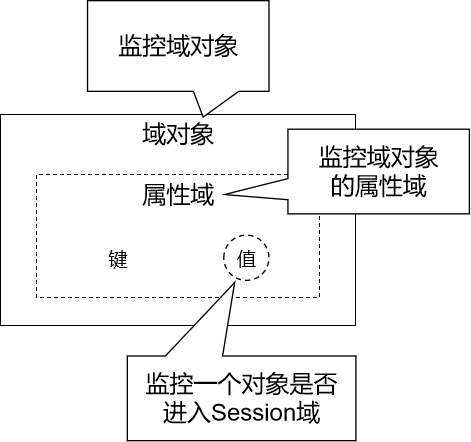
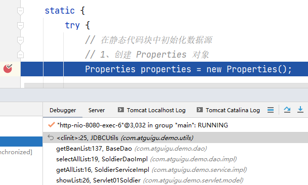
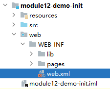

# 一、观察者模式

二十三种设计模式之一：<br/>


<br/>

- 观察者：监控『被观察者』的行为，一旦发现『被观察者』触发了事件，就会调用事先准备好的方法执行操作。
- 被观察者：『被观察者』一旦触发了被监控的事件，就会被『观察者』发现。

<br/>

# 二、监听器
## 1、概念

监听器：专门用于对其他对象身上发生的事件或状态改变进行监听和相应处理的对象，当被监视的对象发生情况时，立即采取相应的行动。<br/>
<span style="color:blue;font-weight:bold;">Servlet监听器</span>：Servlet规范中定义的一种特殊类，它用于监听Web应用程序中的ServletContext，HttpSession 和HttpServletRequest等域对象的创建与销毁事件，以及监听这些域对象中的属性发生修改的事件。

<br/>

## 2、分类



- 域对象监听器
- 域对象的属性域监听器
- Session域中数据的监听器

## 3、监听器列表

### ①ServletContextListener

作用：监听ServletContext对象的创建与销毁

| 方法名                                      | 作用                     |
| ------------------------------------------- | ------------------------ |
| contextInitialized(ServletContextEvent sce) | ServletContext创建时调用 |
| contextDestroyed(ServletContextEvent sce)   | ServletContext销毁时调用 |

ServletContextEvent对象代表从ServletContext对象身上捕获到的事件，通过这个事件对象我们可以获取到ServletContext对象。

<br/>

### ②HttpSessionListener

作用：监听HttpSession对象的创建与销毁<br/>

| 方法名                                 | 作用                      |
| -------------------------------------- | ------------------------- |
| sessionCreated(HttpSessionEvent hse)   | HttpSession对象创建时调用 |
| sessionDestroyed(HttpSessionEvent hse) | HttpSession对象销毁时调用 |

<br/>

HttpSessionEvent对象代表从HttpSession对象身上捕获到的事件，通过这个事件对象我们可以获取到触发事件的HttpSession对象。

### ③ServletRequestListener

作用：监听ServletRequest对象的创建与销毁

| 方法名                                      | 作用                         |
| ------------------------------------------- | ---------------------------- |
| requestInitialized(ServletRequestEvent sre) | ServletRequest对象创建时调用 |
| requestDestroyed(ServletRequestEvent sre)   | ServletRequest对象销毁时调用 |

ServletRequestEvent对象代表从HttpServletRequest对象身上捕获到的事件，通过这个事件对象我们可以获取到触发事件的HttpServletRequest对象。另外还有一个方法可以获取到当前Web应用的ServletContext对象。

### ④ServletContextAttributeListener

作用：监听ServletContext中属性的创建、修改和销毁

| 方法名                                               | 作用                                 |
| ---------------------------------------------------- | ------------------------------------ |
| attributeAdded(ServletContextAttributeEvent scab)    | 向ServletContext中添加属性时调用     |
| attributeRemoved(ServletContextAttributeEvent scab)  | 从ServletContext中移除属性时调用     |
| attributeReplaced(ServletContextAttributeEvent scab) | 当ServletContext中的属性被修改时调用 |

ServletContextAttributeEvent对象代表属性变化事件，它包含的方法如下：

| 方法名              | 作用                     |
| ------------------- | ------------------------ |
| getName()           | 获取修改或添加的属性名   |
| getValue()          | 获取被修改或添加的属性值 |
| getServletContext() | 获取ServletContext对象   |

### ⑤HttpSessionAttributeListener

作用：监听HttpSession中属性的创建、修改和销毁

| 方法名                                        | 作用                              |
| --------------------------------------------- | --------------------------------- |
| attributeAdded(HttpSessionBindingEvent se)    | 向HttpSession中添加属性时调用     |
| attributeRemoved(HttpSessionBindingEvent se)  | 从HttpSession中移除属性时调用     |
| attributeReplaced(HttpSessionBindingEvent se) | 当HttpSession中的属性被修改时调用 |

HttpSessionBindingEvent对象代表属性变化事件，它包含的方法如下：

| 方法名       | 作用                          |
| ------------ | ----------------------------- |
| getName()    | 获取修改或添加的属性名        |
| getValue()   | 获取被修改或添加的属性值      |
| getSession() | 获取触发事件的HttpSession对象 |

### ⑥ServletRequestAttributeListener

作用：监听ServletRequest中属性的创建、修改和销毁

| 方法名                                               | 作用                                 |
| ---------------------------------------------------- | ------------------------------------ |
| attributeAdded(ServletRequestAttributeEvent srae)    | 向ServletRequest中添加属性时调用     |
| attributeRemoved(ServletRequestAttributeEvent srae)  | 从ServletRequest中移除属性时调用     |
| attributeReplaced(ServletRequestAttributeEvent srae) | 当ServletRequest中的属性被修改时调用 |

ServletRequestAttributeEvent对象代表属性变化事件，它包含的方法如下：

| 方法名               | 作用                             |
| -------------------- | -------------------------------- |
| getName()            | 获取修改或添加的属性名           |
| getValue()           | 获取被修改或添加的属性值         |
| getServletRequest () | 获取触发事件的ServletRequest对象 |

### ⑦HttpSessionBindingListener

作用：监听某个对象在Session域中的创建与移除

| 方法名                                      | 作用                              |
| ------------------------------------------- | --------------------------------- |
| valueBound(HttpSessionBindingEvent event)   | 该类的实例被放到Session域中时调用 |
| valueUnbound(HttpSessionBindingEvent event) | 该类的实例从Session中移除时调用   |

HttpSessionBindingEvent对象代表属性变化事件，它包含的方法如下：

| 方法名       | 作用                          |
| ------------ | ----------------------------- |
| getName()    | 获取当前事件涉及的属性名      |
| getValue()   | 获取当前事件涉及的属性值      |
| getSession() | 获取触发事件的HttpSession对象 |

### ⑧HttpSessionActivationListener

作用：监听某个对象在Session中的序列化与反序列化。

| 方法名                                    | 作用                                  |
| ----------------------------------------- | ------------------------------------- |
| sessionWillPassivate(HttpSessionEvent se) | 该类实例和Session一起钝化到硬盘时调用 |
| sessionDidActivate(HttpSessionEvent se)   | 该类实例和Session一起活化到内存时调用 |

HttpSessionEvent对象代表事件对象，通过getSession()方法获取事件涉及的HttpSession对象。

<br/>

# 三、案例
## 1、提出需求

目前JDBCUtils中创建数据源对象是在第一次访问数据库时：<br/>



<br/>

JDBCUtils这个类初始化时需要执行静态代码块：
- 读取jdbc.properties文件（I/O操作）
- 创建DataSource对象（大对象）

<br/>

上面提到的两个操作都比较耗时，最好能改成Web应用启动时执行

<br/>

## 2、创建监听器
### ①创建监听器类

```java  
import jakarta.servlet.ServletContextEvent;  
import jakarta.servlet.ServletContextListener;  
  
public class ListenerDataSourceInit implements ServletContextListener {  
  
    @Override  
    public void contextInitialized(ServletContextEvent sce) {  
        try {  
            // 通过反射加载类，由于类中有静态代码块，所以加载类就能够执行静态代码块  
            Class.forName("com.atguigu.demo.utils.JDBCUtils");  
        } catch (ClassNotFoundException e) {  
            throw new RuntimeException(e);  
        }  
    }  
}
```

<br/>

### ②注册监听器类
```xml
<listener>  
    <!-- 注册监听器：专门负责在 Web 应用启动时初始化数据源 -->  
    <listener-class>com.atguigu.demo.listener.ListenerDataSourceInit</listener-class>  
</listener>
```

<br/>

## 3、提出进一步的问题
- jdbc.properties文件路径写在Java代码中，如果有修改，需要经过编译、重新部署才能生效
- 如果把jdbc.properties文件路径在web.xml中配置，那么web.xml是文本文件，可以在服务器端直接修改，不必经过编译这个环节

<br/>

> 将来我们使用框架，也是更多的以配置的方式管理那些会变化的项目运行参数数据，业务数据保存在数据库。
> Java代码中仅包含要执行的逻辑。

### ①配置Web应用初始化参数



```xml
<!-- 设定 Web 应用初始化参数 -->  
<context-param>  
    <!-- 初始化参数名称 -->  
    <param-name>jdbcConfigLocation</param-name>  
  
    <!-- 初始化参数值 -->  
    <param-value>classpath:jdbc.properties</param-value>  
</context-param>
```

<br/>

### ②重构JDBCUtils代码
```java
// 数据源对象声明为成员变量  private static DataSource dataSource;  
private static ThreadLocal<Connection> threadLocal = new ThreadLocal<>();  
  
private static String jdbcConfigLocation;  
  
public static void setJdbcConfigLocation(String jdbcConfigLocation) {  
    JDBCUtils.jdbcConfigLocation = jdbcConfigLocation;  
}  
  
public static void initDataSource() {  
    try {  
        // 1、创建 Properties 对象  
        Properties properties = new Properties();  
  
        // 2、加载外部属性文件  
        InputStream inputStream = JDBCUtils.class.getClassLoader().getResourceAsStream(jdbcConfigLocation);  
  
        // 3、加载外部属性文件  
        properties.load(inputStream);  
  
        // 4、给数据源成员变量赋值  
        dataSource = DruidDataSourceFactory.createDataSource(properties);  
    } catch (Exception e) {  
        throw new RuntimeException(e);  
    }  
}
```

### ③重构监听器代码
```java  
import jakarta.servlet.ServletContext;  
import jakarta.servlet.ServletContextEvent;  
import jakarta.servlet.ServletContextListener;  
  
public class ListenerDataSourceInit implements ServletContextListener {  
  
    @Override  
    public void contextInitialized(ServletContextEvent sce) {  
        // 加载 JDBCUtils 类
        // 通过反射加载类，由于类中有静态代码块，所以加载类就能够执行静态代码块
        // Class.forName("com.atguigu.demo.util.JDBCUtils");

        // 读取 Web 应用初始化参数
        // 1、获取 ServletContext 对象
        ServletContext servletContext = sce.getServletContext();

        // 2、通过 ServletContext 对象获取 Web 应用初始化参数
        // 根据名字取值
        String jdbcConfigLocation = servletContext.getInitParameter("jdbcConfigLocation");

        // 3、如果 jdbcConfigLocation 的值开头是 classpath:，那么就去掉
        if (jdbcConfigLocation != null && jdbcConfigLocation.startsWith("classpath:")) {
            jdbcConfigLocation = jdbcConfigLocation.replace("classpath:", "");
        }

        // 4、把 jdbcConfigLocation 传入到 JDBCUtils 中
        JDBCUtils.setJdbcConfigLocation(jdbcConfigLocation);

        // 5、调用专门的初始化方法，初始化数据源
        JDBCUtils.initDataSource();
    }  
}
```

<br/>

## 4、ContextLoaderListener
这是我们在 Spring、SpringMVC、Mybatis 三大框架整合时需要使用的一个监听器。<br/>
使用这个监听器需要我们在web.xml配置它。<br/>
然后为了配合 ContextLoaderListener，需要在 context-param 中指定 Spring 配置文件的位置。<br/>
所以我们设定上面 JDBCUtils 这个场景，是为了把监听器和 context-param 用一下，将来到框架里面用到的时候，有个印象。

<br/>

# 四、Web后端内容总结

<br/>


# 五、内容预告

