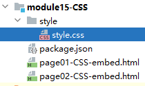

# 一、简介
- 全称：Cascading Style Sheets层叠样式表
- 作用：HTML页面的布局和美化

<br/>

CSS Zen-garden的例子不仅体现了CSS的作用，同时体现了一个解耦的思想：
- HTML：只负责定义网页的结构
- CSS：只负责定义页面的表现

<br/>

解耦的好处：
- 代码会更清晰
- 同一类的代码集中到一起便于维护，例如：CSS的代码集中到一起，一处修改处处生效
- 统一修改可以避免遗漏、提高开发效率

<br/>

# 二、CSS代码嵌入方式
## 1、嵌入HTML标签内
```html
<!-- 嵌入方式一：写在 HTML 标签中，使用 style 属性 -->  
<p style="color:blue;font-size: 100px;">这里是一个段落</p>  
<p style="color:blue;font-size: 100px;font-weight: bolder;">这里是一个段落</p>
```

<br/>

评价：这就是 HTML 和 CSS 耦合在一起的写法，通常不建议这么写。

<br/>

## 2、统一在style标签内写
### ①被修饰的HTML代码
```html
<div>div01</div>  
<div>div02</div>  
<div>div03</div>  
<div>div04</div>  
<div>div05</div>
```

<br/>

### ②style标签代码
```html
<!-- 在 style 标签中对当前 HTML 文档做统一设置，通常写在 head 标签里 -->  
<style>  
    div {  
        width: 100px;  
        height: 100px;  
        border: 1px black solid;  
        background-color: beige;  
    }  
</style>
```

<br/>

## 3、引入外部样式文件
### ①准备外部样式文件



<br/>

```css
span {  
    color: red;  
    font-size: 30px;  
    display: block;  
    width: 100px;  
    height: 100px;  
    border: 1px black solid;  
    background-color: chartreuse;  
}
```

<br/>

### ②在HTML文档中引入
```html
<!-- 引入外部 CSS 样式文件 -->
<!-- rel 属性：固定设置为 stylesheet，表示当前引入的是 CSS 样式文件 -->  
<!-- href 属性：外部样式文件所在的路径 -->
<link rel="stylesheet" href="style/style.css" />
```

> link标签的rel属性用于定义当前文档与被链接文档之间的关系。它告诉浏览器被链接文档的类型，以及如何处理链接。
>
> 常见的rel属性值包括：
> - stylesheet：指示当前文档是一个样式表文件，用于引入外部CSS文件。
> - icon：指示当前文档的图标，通常用于网站的favicon。
> - preconnect：指示浏览器预连接到被链接的URL，以提前建立网络连接，加快页面加载速度。
> - dns-prefetch：指示浏览器在加载完当前文档后，提前解析被链接URL的域名，加快后续资源加载速度。
> - alternate：指示当前文档的不同版本，例如语言翻译、移动版等。
> - next/prev：用于分页内容，指示当前文档的下一页或上一页。
>
> 除了这些常见的rel属性值，还有许多其他可用的值，每个值都具有特定的作用。通过使用正确的rel属性，可以帮助浏览器和搜索引擎更好地理解和处理链接关系，提高用户体验和网站性能。
>
> rel属性可以省略。如果省略了rel属性，浏览器会将其默认为"stylesheet"（样式表）或"alternate"（备用版本）。具体的默认行为取决于标签的上下文和使用情况。
>
> 然而，为了确保代码的可读性和可维护性，建议在link标签中明确指定rel属性，并根据需要选择合适的属性值。这有助于提供更清晰的意图，使开发人员和浏览器能够准确理解链接之间的关系。

# 三、CSS选择器

## 1、作用说明
当我们把CSS样式设置从 HTML 标签中提取出来，那么CSS样式设置就必须通过某种形式来确定，它修饰的是哪些（或哪个）HTML标签。

<br/>

## 2、标签选择器
```html
<style>  
    /* p就是一个标签选择，表示对所有 p 标签应用样式 */    p {  
        color: blue;  
        font-weight: bolder;  
    }  
</style>
```

<br/>

## 3、id选择器
### ①HTML代码
```html
<div>div01</div>  
<div>div02</div>  
<!-- id 属性给 HTML 标签设置唯一标识，在整个文档内不能重复 -->  
<div id="greenDiv">div03</div>  
<div>div04</div>
```

<br/>

### ②CSS代码
```css
/* id 选择器对 id 值匹配的标签应用样式 */#greenDiv {  
    background-color: green;  
}
```

<br/>

## 4、类选择器
### ①HTML代码
```html
<div>div04</div>  
  
<!-- class 属性给一组 HTML 标签设置一个统一的名称 -->  
<div class="pinkDiv">div05</div>  
<div class="pinkDiv">div06</div>  
<div class="pinkDiv">div07</div>
```

<br/>

### ②CSS代码
```css
/* 类选择器针对所有设置了 class 属性的标签应用样式 */.pinkDiv {  
    background-color: pink;  
}
```

<br/>

# 四、CSS布局
## 1、文档流
HTML标签在没有CSS干预的情况下，默认的显示、排列顺序<br/>

## 2、两种框
### ①块框
块框：前后有换行，自己独占一行，默认从上到下排列
- div
- p
- h1~h6
- ……

<br/>

### ②行内框
行内框：前后没有换行，在行内从左到右按顺序排列
- a
- img
- input
- span
- ……

<br/>

行内框无法直接设置高度、宽度。如果想要设置，那么就需要把行内框修改为块框：
```css
display: block;
```

<br/>

还可以设置为行内块，效果是还在同一行排列，但是可以设置高度和宽度：
```css
display: inline-block;
```

<br/>

## 3、浮动
### ①概念
一个块设置浮动之后，就会离开它原来所在的位置（脱离文档流）<br/>
它原来所在的位置会被其它元素给占据

<br/>

### ②代码
```html
<div id="div01">块框 1</div>  
<div id="div02">块框 2</div>  
<div>块框 3</div>  
<div>块框 4</div>  
<div>块框 5</div>
```

```css
div {  
    width: 200px;  
    height: 200px;  
    border: 1px black solid;  
}  
  
#div01 {  
    /* 向右浮动：在父元素限定的范围内，来到最右边 */    float: right;  
}  
  
#div02 {  
    /* 向左浮动：在父元素限定的范围内，来到最左边 */    float: left;  
    width: 100px;  
    height: 100px;  
    background-color: chartreuse;  
}
```

<br/>

