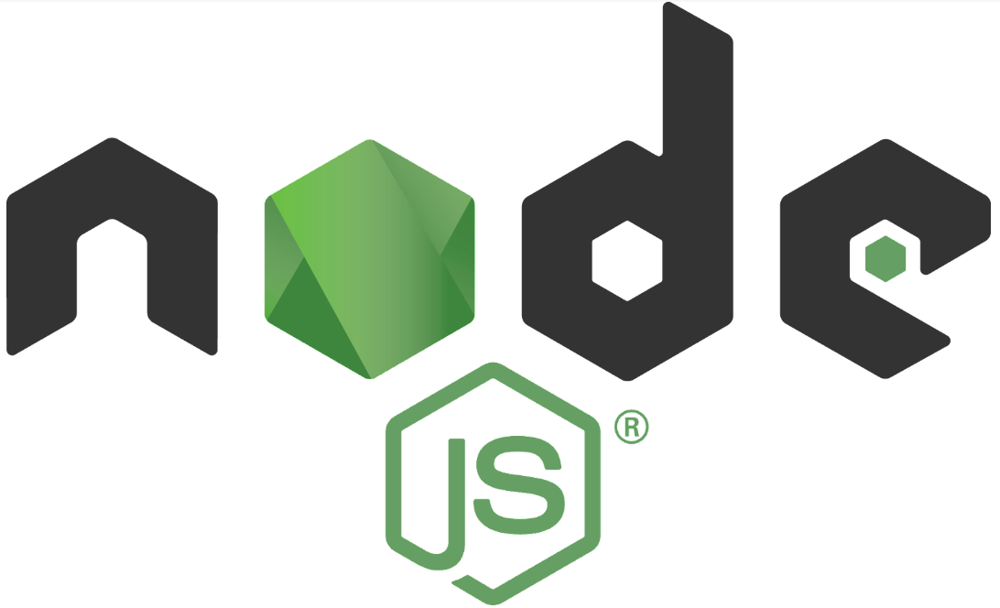
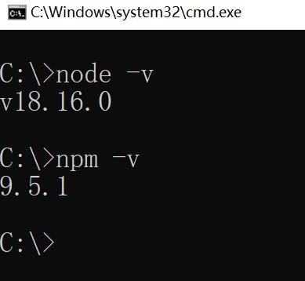
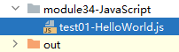
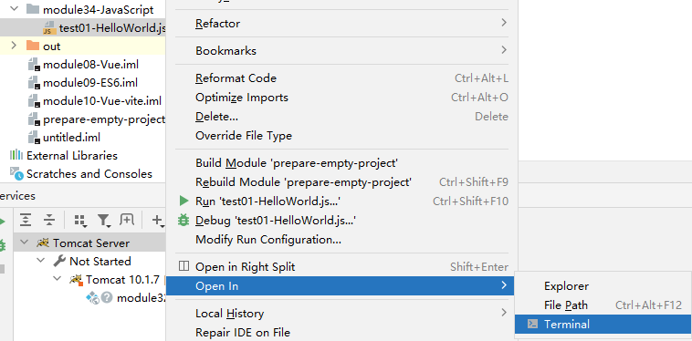
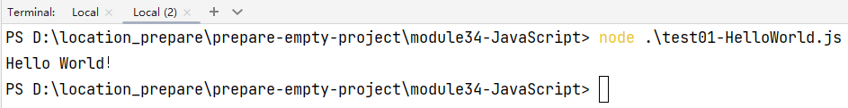
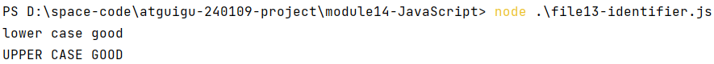
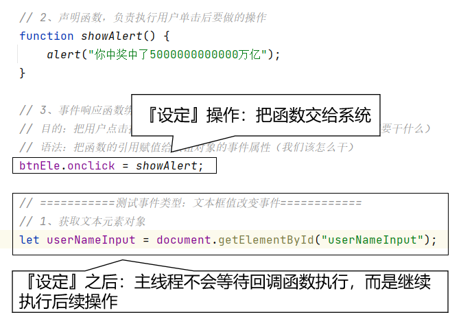
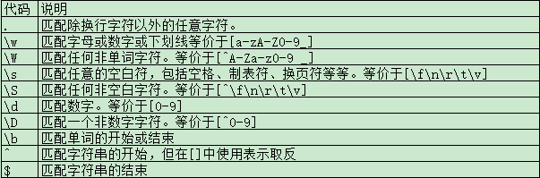
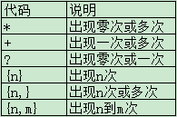

<br/>

# 一、JavaScript运行环境
## 1、简介



|      | Java       | JavaScript     |
| ---- | ---------- | -------------- |
| 开发 | 源文件     | 源文件         |
| 编译 | 字节码文件 | 无             |
| 执行 | JVM        | JavaScript引擎 |


> Node.js 是一个基于 Chrome V8 引擎的 JavaScript 运行时环境，可以使 JavaScript 运行在服务器端。使用 Node.js，可以方便地开发服务器端应用程序，如 Web 应用、API、后端服务，还可以通过 Node.js 构建命令行工具等。相比于传统的服务器端语言（如 PHP、Java、Python 等），Node.js 具有以下特点：

-   单线程，但是采用了事件驱动、异步 I/O 模型，可以处理高并发请求。
-   轻量级，使用 C++ 编写的 V8 引擎让 Node.js 的运行速度很快。
-   模块化，Node.js 内置了大量模块，同时也可以通过第三方模块扩展功能。
-   跨平台，可以在 Windows、Linux、Mac 等多种平台下运行。

> Node.js 的核心是其管理事件和异步 I/O 的能力。Node.js 的异步 I/O 使其能够处理大量并发请求，并且能够避免在等待 I/O 资源时造成的阻塞。此外，Node.js 还拥有高性能网络库和文件系统库，可用于搭建 WebSocket 服务器、上传文件等。`在 Node.js 中，我们可以使用 JavaScript 来编写服务器端程序，这也使得前端开发人员可以利用自己已经熟悉的技能来开发服务器端程序，同时也让 JavaScript 成为一种全栈语言。`Node.js 受到了广泛的应用，包括了大型企业级应用、云计算、物联网、游戏开发等领域。常用的 Node.js 框架包括 Express、Koa、Egg.js 等，它们能够显著提高开发效率和代码质量。


> 在2023年4月，各个主流浏览器中内置的JavaScript引擎的名称如下：
>
> 1. Chrome浏览器使用的是V8引擎。
> 2. Firefox浏览器使用的是SpiderMonkey引擎。
> 3. Safari浏览器使用的是JavaScriptCore引擎。
> 4. Edge浏览器使用的是Chakra引擎（在2020年底之前版本）或者V8引擎（2020年底之后版本）。
>
> 请注意，以上信息截止到2023年4月，未来可能会有更新和变化。


## 2、安装

1.  打开官网https://nodejs.org/en下载对应操作系统的 LTS 版本。
2.  双击安装包进行安装，安装过程中遵循默认选项即可(或者参照https://www.runoob.com/nodejs/nodejs-install-setup.html )。安装完成后，可以在命令行终端输入 `node -v` 和 `npm -v` 查看 Node.js 和 npm 的版本号。



<br/>

# 二、HelloWorld
## 1、目标
运行JavaScript代码，在控制台输出Hello World！。<br/>

## 2、创建JavaScript文件

module就新建一个普通的目录即可



<br/>

## 3、JavaScript代码
```javascript
// 1、声明变量  
let message = "Hello World！"  
  
// 2、在控制台打印变量  
console.log(message)
```

<br/>

## 4、运行
从命令行进入JavaScript文件所在目录：<br/>



<br/>

```bash
# 运行JavaScript程序
node .\test01-HelloWorld.js
```

<br/>



<br/>

# 三、基础语法
## 1、数据类型
### ①基本数据类型
- 字符串：JavaScript中不区分字符和字符串，单引号、双引号定义的都是字符串
- 数值类型：JavaScript中不区分整数和小数
- 布尔类型：true和false

<br/>

### ②引用类型
- 对象
- 数组
- 函数：JavaScript中函数也是一种特殊的对象
- 正则表达式

<br/>

### ③类型之间的转换
- 字符串转换为布尔类型的规则是：非空字符串转换为true，空字符串转换为false
- 数值类型转换为布尔类型：非零的数值（哪怕是负数）：转换为true，为零的数值：转换为false
- 字符串可以自动转换为数值：在数学运算中转换
    - 但是注意：+号和字符串在一起会被理解为字符串连接
- 使用双等号比较两个数据时也会自动类型转换
```javascript
var a = "100"
var b = 100
console.log(a == b) // 返回 true
console.log(a === b) // 返回 false，三个等号表示绝对相等，要求数据类型也必须一致
```

<br/>

### ④两个特殊值
- NaN：not a number，意思是“非数字”，用来表示当前计算结果不是数字。
- undefined：未定义。

<br/>

## 2、let关键字
声明变量使用 let 比 var 更严谨

- 使用 let 声明的变量，作用域就是从声明的地方开始
- let 不能重复声明变量
- let 变量只能在花括号内部访问

<br/>

```javascript
    // 1、使用 let 关键字声明变量
    let a = 10;
    console.log("a=" + a);

    // 2、使用 let 比 var 更严谨
    console.log(b);
    var b = 5;

    // 使用 let 声明的变量，作用域就是从声明的地方开始
    // 如果在声明前使用，会报错：Uncaught ReferenceError: Cannot access 'c' before initialization
    // console.log(c);
    // let c = 10;

    // let 不能重复声明变量
    var m = 10;
    console.log(m);

    var m = 10;
    console.log(m);

    let n = 100;
    console.log(n);

    // Uncaught SyntaxError: Identifier 'n' has already been declared
    // let n = 100;
    // console.log(n);

    // let 变量只能在花括号内部访问
    if (true) {
        var x = 88;
    }
    console.log(x);

    if (true) {
        let y = 99;
    }
    // console.log(y);
```

<br/>

## 3、const关键字
使用const关键字可以声明常量，常量只能被赋值一次

```javascript
// 使用 const 声明常量
const PI = 3.1415926;
console.log(PI);
// PI = 5;

const arr = [5, 13, 27];
arr.push(188);
```

<br/>

## 4、分支结构
注意：其它数据类型可以转回为布尔类型，例如："false"坑。<br/>

<br/>

## 5、循环结构
```javascript
// 1、声明一个数组
let numbers = [10, 100, 1000, 10000];

// 2、使用下标遍历数组
for (let i = 0; i < numbers.length; i++) {
    let number = numbers[i];
    console.log(number);
}

// 3、增强的 for 循环
// 遍历数组时，in 左边得到的是数组的下标
// 遍历数组时，in 右边要遍历的数组
for (let index in numbers) {
    let number = numbers[index];
    console.log(number + "~");
}

let student = {
    "stuId": 23454,
    "stuName": "tom",
    "subject": "Java"
};
// 遍历对象时，in 左边得到的是对象中的属性名
// 遍历对象时，in 右边要遍历的对象
for (let studentKey in student) {
    // 根据对象的属性名获取对应的属性值
    let studentValue = student[studentKey];
    console.log(studentValue);
}
```

<br/>


## 6、标识符严格区分大小写

```javascript
// 1、声明变量：小写
let good = "lower case good";

// 2、声明变量：大写
let GOOD = "UPPER CASE GOOD";

// 3、分别打印两个变量
console.log(good);
console.log(GOOD);
```





# 四、对象
## 1、创建对象
```javascript
// 1、创建对象方式一
var obj01 = new Object();

// 3、创建对象方式二
var obj02 = {
    "weaponId":666,
    "weaponName":"大狙",
    "weaponPrice":1000.22
};
```

<br/>

## 2、给对象属性赋值
```javascript
// 2、给对象属性赋值就直接操作即可
obj01.soldierId = 5;
obj01.soldierName = "Jack";
obj01.soldierJob = "cooker";
```

<br/>

# 五、数组
```javascript
// 1、创建数组方式一
let arr01 = new Array();
console.log(arr01);

// 2、创建数组方式二
let arr02 = ["aaa", "bbb", "ccc"];
console.log(arr02);

// 3、调用push()方法向数组存入元素（相当于堆栈操作中的压栈）
arr01.push("apple");
arr01.push("banana");
arr01.push("orange");
console.log(arr01);

arr02.push("ddd");
arr02.push("eee");
arr02.push("fff");
console.log(arr02);

// 4、和压栈对应的操作是弹栈
let popValue = arr02.pop();
console.log(popValue);
console.log(arr02);

// 5、调用reverse()方法把数组元素倒序排列
arr02.reverse();
console.log(arr02);

// 6、把数组元素连成字符串
let arr02Str = arr02.join(",");
console.log(arr02Str);

// 7、把字符串根据指定的符号拆分为数组
arr02 = arr02Str.split(",");
console.log(arr02);

// 8、在指定索引位置删除指定个数的数组元素
arr02.splice(2, 2);
console.log(arr02);

// 9、数组切片
arr02.push("uuu", "vvv", "www", "xxx", "yyy", "zzz");
console.log(arr02);

// 从 start 参数指定的索引开始，到 end 参数指定的索引结束
// 选取半闭半开区间进行切片（也就是说不包括end索引指向的元素）
let arr03 = arr02.slice(2, 5);
console.log(arr03);
```

<br/>
# 六、JSON格式
## 1、语法
- JSON格式边界的符号只有两种：
    - {}表示这个JSON数据是一个JSON对象
    - []表示这个JSON数据是一个JSON数组
- JSON对象的语法
    - {}中是由多组key:value对组成的
    - key:value对之间用逗号分开
    - key和value之间用冒号分开
    - key固定就是字符串类型
- JSON数组的语法
    - []中是由多组value组成的
    - value之间用逗号分开
- value的类型：不管在JSON对象还是JSON数组中，value类型都适用下面的规则
    - value可以是基本数据类型
    - value可以是引用数据类型
        - JSON对象
        - JSON数组

<br/>

```json
# JSON对象
{"stuId":10, "stuName":"tom"}

# JSON数组
["aaa", "bbb", "ccc"]

# 嵌套的JSON对象
{
    "stuId":10, 
    "stuName":"tom",
    "school": {
        "schoolName": "atguigu",
        "schoolAge": 10,
        "subjectArr": ["Java", "H5", "Big Data"]
    }
}

# 嵌套的JSON数组
[
    {
        "shenzhen":"number one"
    },
    {
        "wuhan":"number two"
    },
    {
        "shanghai":"number three"
    }
]
```

<br/>

JSON格式和Java类型的对应关系：
- JSON对象：对应Map、对应实体类对象
- JSON数组：对应Java的数组、List集合、Set集合

<br/>

## 2、JSON对象转字符串
```javascript
JSON.stringify(jsonObj);
```

<br/>

## 3、字符串转JSON对象
```javascript
JSON.parse(jsonStr);
```

<br/>

# 七、函数
## 1、系统内置函数
- alert()：弹出一个警告框（必须嵌入HTML，在浏览器运行）
- confirm()：弹出一个确认框（必须嵌入HTML，在浏览器运行）
- prompt()：弹出输入框（必须嵌入HTML，在浏览器运行）
- isNaN()：判断传入的参数是否是非数字

<br/>

## 2、用户自定义函数
```javascript
// 1、声明函数
// 形参列表只需要指定变量名，不需要写类型或let关键词
function sum(i, j) {
    return i+j;
}

// 2、调用函数
var sumResult = sum(5, 6);
console.log("sumResult="+sumResult);

// 3、以另一种方式声明函数
// 函数引用赋值给一个变量，此时函数本身不需要命名
// 没有起名字的函数，我们叫匿名函数
var showMessage = function(){
    console.log("I am a message.");
};

// 4、调用函数：变量名就相当于函数名
showMessage();
```

<br/>

## 3、this关键字
函数中的this关键字指向调用函数的那个对象。
```javascript
// 12、声明一个函数测试this关键字
function showName() {
    console.log(this.stuName);
}

var stu01 = new Object();
stu01.stuName = "peter";

var stu02 = new Object();
stu02.stuName = "mary";

// 函数的引用赋值给对象的属性
stu01.showName = showName;
stu02.showName = showName;

// 调用函数
stu01.showName();
stu02.showName();
```

<br/>

# 八、嵌入HTML
- 引入方式一：内嵌到HTML标签
- 引入方式二：内嵌到script标签
- 引入方式三：引入外部JS文件
```html
<!DOCTYPE html>
<html lang="en">
<head>
    <meta charset="UTF-8">
    <title>JavaScript嵌入HTML</title>

    <!-- 引入外部 JavaScript 文件 -->
    <script src="scripts/showMoney.js"></script>

    <!-- 错误写法一：把 script 标签当做单标签结束了 -->
    <!--<script src="scripts/showMoney.js"/>-->

    <!-- 错误写法二：在 script 标签中又写了别的 JavaScript 代码 -->
    <!--<script src="scripts/showMoney.js">
        console.log("小刚爱上了小强~~~~")
    </script>-->
</head>
<body>

    <h3>嵌入方式一：直接写在 HTML 标签内部</h3>
    <!-- 不建议使用：JavaScript 代表的行为和 HTML 代表的结构耦合在一起 -->
    <button onclick="alert('哈哈！你上当了，你是猪头！')">点我你会开心</button>

    <h3>嵌入方式二：写在 script 标签内</h3>
    <button id="btnBoom">点我你会爆炸</button>
</body>
<script>
    // 浏览器加载 HTML 文档中的标签是按照从上到下的顺序加载
    // 遇到 script 标签的时候，就会来执行里面的 JavaScript 代码
    // 但是此时后面的 body 标签还没有加载到浏览器的内存
    // 解决这个问题只需要把 script 标签放到 body 标签后面
    // 1、把点击按钮之后需要执行的操作封装到函数中
    function doClick() {
        alert("你爆炸了！script标签中的代码");
    }

    // 2、获取按钮在 JavaScript 代码中对应的对象
    let btnEle = document.getElementById("btnBoom");
    console.log("btnEle = " + btnEle);

    // 3、把上面的函数和按钮的单击事件关联起来
    // 把函数的引用赋值给按钮对象的事件属性
    btnEle.onclick = doClick;

</script>
</html>
```

# 九、BOM
## 1、概念
BOM：Browser Object Model 浏览器对象模型。这是为了方便我们在 JavaScript 程序中操作浏览器的特定功能而封装的一系列对象。
<br/>

## 2、思想
现实世界的事物要体现到 IT 系统中，就需要把现实世界的事物进行抽象，抽取现实事物的主要特征，然后在IT系统中创建一个模型来对应。模型在代码中通过对象来体现。<br/>
比如：现实世界中的一个人，我们开发员工档案管理系统就只关注这个人作为员工的这方面。<br/>
在员工信息中，我们提取下面数据到程序中：

- 员工编号
- 员工姓名
- 员工籍贯
- 员工所在部门

<br/>

有了这些信息就可以声明一个类来代表现实世界的员工。

<br/>

总结：现实世界事物 --> 抽象出模型 --> 封装为对象 --> 通过对象操作数据

## 3、操作举例
```javascript
// 1、认识 window 对象：代表当前浏览器窗口
// 不需要创建，可以直接使用
console.log(window);

// 2、window 对象里面有一个属性：location
// 代表当前窗口所在的位置
// location 对象里面有一个属性：href
// 代表当前窗口所在位置对应的 URL 地址
// 例如：http://localhost:63342/atguigu-240109-project/module14-JavaScript/file14-BOM.html
console.log(window.location.href);

// 3、给 window.location.href 赋值就可以改变当前窗口所在位置
// 效果相当于点了超链接
// 所以以后如果我们需要在 JavaScript 代码中实现页面跳转，就可以这么做
// window.location.href = "http://www.baidu.com";

// 4、所有访问 window 对象的操作，代码中“window.”部分都可以省略
window.alert("你好BOM");
alert("你好BOM 省略了 window 对象");
```

# 十、DOM [重点]

> 说明：这里虽然标记了『重点』，但它仅仅是当前 JavaScript 这一章内的重点。
> 我们使用 DOM API 实际上是为了实现页面渲染，而页面渲染将来实际开发中都是使用 Vue 等框架负责。
> 我们学习 DOM 只是体验一下页面渲染的效果，给 Vue 框架的学习打基础。


## 1、概念
DOM：Document Object Model文档对象模型。<br/>
- 模型：把整个<span style="color:blue;font-weight:bolder;">HTML文档</span>作为一个模型
- 对象：用<span style="color:blue;font-weight:bolder;">window.document</span>对象来代表HTML文档
- 浏览器加载机制：浏览器把HTML文档加载到内存的过程中，每读取一个HTML标签就创建一个元素对象，这个元素对象会存入document对象中。

<br/>

<span style="color:blue;font-weight:bolder;">根本目标</span>：实现页面渲染。以后都是用框架来做，这里我们只是看看框架底层是怎么做的

<br/>

## 2、节点
HTML文档中所有对象都被看作节点（Node）。节点再进一步细分：
- 元素节点（Element）：对应HTML标签
- 属性节点（Attr）：对应HTML标签中的属性
- 文本节点（Text）：对应文本标签体

<br/>

> 这几个类型之间是父子关系。Element、Attr、Text都可以看做是Node的子类。<br/>
> 这个说法是帮助我们理解，实际上JavaScript这门语言中没有“类”的概念。

<br/>


## 3、DOM树


<br/>

### ①元素之间的关系
- 纵向：
    - 父子关系
    - 先辈和后代的关系
- 横向：兄弟关系

<br/>

### ②元素和属性的关系
把HTML标签封装为元素对象，HTML标签的属性就是元素对象的属性。<br/>
HTML标签中属性叫什么名字，元素对象中，属性就是什么名字。<br/>
```html
<button id="btnEle">点我有惊喜</button>
```

<br/>

```javascript
// 元素对象
var btnEle = document.getElementById("btnEle");  

// 访问元素对象的属性，属性名就是HTML标签中属性的名字
console.log(btnEle.id);
```

### ③元素和文本的关系
元素对象和它里面的文本节点对象也是父子关系。<br/>

## 4、元素查找
### ①整个文档范围内查找
使用document对象调用getElementByXxx()方法就是在整个文档范围内查找。
- document.getElementById("id值") 返回id值对应的单个对象。
- document.getElementsByTagName("标签名") 返回标签名对应的多个对象。
- document.getElementsByName("表单标签的name属性值") 根据表单标签的name属性值查询对象。

<br/>

### ②指定元素范围内查找
- 全部子节点：元素对象.childNodes
- 全部子元素：元素对象.children
- 第一个子元素：元素对象.firstElementChild
- 最后一个子元素：元素对象.lastElementChild

<br/>

### ③查找元素的父元素
- 方式一：parentElement
- 方式二：parentNode

<br/>

### ④查找元素的兄弟元素
- 前一个兄弟元素：previousElementSibling
- 后一个兄弟元素：nextElementSibling

<br/>

## 5、读写元素属性
- 读操作：元素对象.属性名
- 写操作：元素对象.属性名=新属性值

<br/>

## 6、读写文本标签体
### ①innerText属性
- 读操作：元素对象.innerText
- 写操作：元素对象.innerText=新文本值
注意：新文本值中如果包含HTML标签代码，不会被解析

<br/>

### ②innerHTML属性
- 读操作：元素对象.innerHTML
- 写操作：元素对象.innerHTML=新文本值
注意：新文本值中如果包含HTML标签代码，能够被解析

<br/>

# 十一、事件驱动 [重点]
## 1、类比
|生活中的例子|事件驱动|
|---|---|
|地雷|事件响应函数|
|兵工厂生产地雷|声明事件响应函数|
|找到埋地雷的位置|把绑定事件响应函数的元素对象给查出来|
|埋地雷|把事件响应函数绑定到元素上|
|触发引信|用户在浏览器窗口进行操作的时候触发了事件|
|地雷爆炸|事件响应函数执行|

<br/>

## 2、事件类型
### ①文本框值改变事件
```javascript
// 1、查找文本框元素对象
var inputEle = document.getElementsByName("username")[0];

// 2、声明事件响应函数
function showUsername() {
    // 我们希望在这个函数中获取到用户输入的新值
    // this 在事件响应函数中代表触发事件的元素对象
    console.log("用户输入的新数据：" + this.value);
}

// 3、事件绑定
// 事件类型：值改变
// ※特殊说明：值改变事件要触发需要满足两个条件
// 条件1：当前控件失去焦点
// 条件2：值确实发生了改变
inputEle.onchange = showUsername;
```

<br/>

### ②失去焦点
```javascript
// 事件类型：失去焦点
inputEle.onblur = function() {
    console.log("文本框失去了焦点。");
};
```

<br/>

### ③鼠标移动事件
HTML设置：
```html

```

<br/>

CSS样式设置：
```css
img {
    display: none;
}
```

<br/>

JavaScript代码：
```javascript
// 1、获取div元素对象
var divEle = document.getElementById("swimmingPool");
var imgEle = document.getElementById("dongGe");

// 2、绑定事件响应函数
divEle.onmousemove = function() {
    // 3、打印事件对象
    // console.log(event);

    // 4、通过事件对象获取鼠标的坐标
    // console.log(event.clientX + " " + event.clientY);

    // 5、把鼠标坐标信息写入div中，作为它的文本值
    this.innerText = event.clientX + " " + event.clientY;

    // 6、让图片显示
    imgEle.style = "display:block;position:absolute;top:"+(event.clientY+10)+"px;left:"+(event.clientX+10)+"px;";
};
```

<br/>

## 3、回调函数
### ①普通函数
我们自己声明一个函数，我们自己调用。<br/>

### ②回调函数的形式
我们自己声明一个函数，交给系统来调用。<br/>
```javascript
// 这里我们声明的函数，仅仅只是声明了，我们自己并没有在后面的代码中去调用它。
// 函数的引用赋值给onclick属性之后，我们就没有再管它了
// 浏览器在监听到用户单击的事件之后，才调用这个函数
document.getElementById("outerDiv").onclick = function() {
    alert("你点击了【外层】div");
};
```

<br/>

```javascript
// setTimeout(回调函数,以毫秒为单位的延迟时间)函数可以在指定的延迟时间之后执行回调函数
setTimeout(function(){
	// 代表浏览器窗口的 window 对象
	console.log("hello time out");
}, 3000);
```

<br/>


### ③为什么需要回调函数

因为我们自己并不知道该在什么时候来调用某些特定函数，所以交给系统来调用它们。例如：

- 用户在浏览器窗口上点击按钮，我们给按钮绑定单击响应函数。此时用户点击按钮这个动作是由系统来监听的，所以就应该是让系统在监听到『点击事件』时调用我们事先绑定的函数


- 在Servlet中声明doGet()方法，同样不知道什么时候用户会发送一个GET请求，所以此时doGet()方法也是所在系统平台：Tomcat来调用的
- new Thread(Runnable对象).start()启动一个新线程，操作系统负责进程、线程的调度，线程得到CPU的时间片才能够执行，我们同样无法得知线程什么时候得到CPU时间片
- setTimeout(回调函数, 延迟时间)是系统内部的时钟到达我们指定的时间，就相当于触发了『到时间啦』这个事件，于是这个时候来调用我们指定的回调函数

更进一步拔高维度和视角来看：目前计算机程序还没有自己独立的意识，所以本质上所有程序都是『事件驱动』的，这么看来几乎可以说所有函数都是回调函数。


### ④回调函数的特点

- 都是因为某个特定<span style="color:blue;font-weight:bolder;">事件</span>来触发的，或者可以说是和某个特定事件绑定的。例如：
  - 按钮的单击响应函数：和『单击』事件绑定的
  - Servlet中的doGet()方法：和『接收到GET请求』事件绑定的
  - Listener中的contextInitialize()方法：和『ServletContext对象创建』事件绑定的
  - Filter中的doFilter()方法：和『拦截到指定请求』事件绑定的
  - new Thread(Runnable对象).start()启动一个新线程，Runnable类型对象run()方法：和『线程得到了CPU时间片』事件绑定的
  - setTimeout(回调函数, 延迟时间)中作为参数传入的回调函数：和『到时间啦』事件绑定的
- 回调函数都是<span style="color:blue;font-weight:bolder;">异步</span>的，都是系统在主线程之外的其它线程中执行的
  - 主线程只负责回调函数的设定，而什么时候调用回调函数是所在系统环境负责
  - 从主线程角度看：主线程不管回调函数什么时候调用，做完『设定』操作之后，就<span style="color:blue;font-weight:bolder;">不再等待</span>，去执行下一步操作了
  
  - 从代码所在系统环境角度看：执行主体代码和事件监听是放在不同线程中，并发执行的，它们分属于系统的不同功能

<br/>


# 十二、正则表达式[选学]
## 1、概念
根据功能的需求，在原始字符串数据中，把我们想要的匹配出来。

## 2、应用场景
- 模式验证：用正则表达式规定一个格式，检查字符串是否满足这个格式。比如：检查手机号、邮箱、身份证号……
- 匹配读取：在原始字符串数据中，把我们需要的字符串读取出来。
- 匹配替换：在原始字符串数据中，把匹配固定模式的字符串替换成指定的数据。

## 3、创建正则表达式
### ①对象形式
```javascript
var source = "Hello tom,good afternoon.";

// 1、创建正则表达式对象
// 方式一：对象方式
// reg 是 regular 的缩写，意思是正规的、常规的
// exp 是 expression 的缩写，意思是表达式
// 在 RegExp 构造器中传入正则表达式本身
// "a" 正则表达式表示：被检测的字符串，有a这个字符就匹配，否则不匹配
var reg = new RegExp("a");

var checkResult = reg.test(source);
console.log("checkResult = " + checkResult);
```

### ②直接量形式
```javascript
// 方式二：直接量方式
// 类似的，JSON 对象、JSON 数组也相当于是用直接量的方式创建
// {"userName":"tom"} ["a","b","c"]
reg = /w/;
checkResult = reg.test(source);
console.log("checkResult = " + checkResult);
```

## 4、正则表达式语法
### ①正则表达式的组成
#### [1]普通字符
用字符本身进行匹配。
```javascript
reg = /Hello/;
checkResult = reg.test(source);
console.log("checkResult = " + checkResult);
```

#### [2]元字符
使用一些在正则表达式中有特定含义的字符，来检测字符串
```javascript
// ^ 表示：要求目标字符串以指定内容开头
// ^T 表示：要求目标字符串以T开头
reg = /^T/;
checkResult = reg.test(source);
console.log("checkResult = " + checkResult);
```

<br/>



<br/>

### ②字符集合
如果我们想要设定的规则，是一组字符中的某一个，那么就可以使用字符集合来设置。字符集合用[]定义。

#### [1]匹配列表中任何一个
```javascript
reg = /[oda]/;
checkResult = reg.test(source);
console.log("checkResult = " + checkResult);

reg = /[xyz]/;
checkResult = reg.test(source);
console.log("checkResult = " + checkResult);
```

#### [2]匹配列表外任何一个
```javascript
// [^oda]表示：目标字符串不能包含o、d、a中的任何一个
reg = /[^oda]/;
checkResult = reg.test(source);
console.log("checkResult = " + checkResult);
```

#### [3]用字符范围定义集合
```javascript
// [A-Z]表示：包含大写字母中的任何一个即可
// [a-z]表示：包含小写字母中的任何一个即可
// [0-9]表示：包含数字中的任何一个即可
// [A-Za-z]表示：包含字母中的任何一个即可
// [A-Za-z0-9]表示：包含字母、数字中的任何一个即可
reg = /[A-Z]/;
checkResult = reg.test(source);
console.log("checkResult = " + checkResult);
```

### ③字符出现次数
<br/>



<br/>

## 5、举例
### ①格式验证
注意：此时是使用正则表达式对象调用方法
```javascript
var source = "Hello tom!Good morning!";
var reg = /W/;
var checkResult = reg.test(source);
console.log("checkResult = " + checkResult);

reg = /G/;
checkResult = reg.test(source);
console.log("checkResult = " + checkResult);
```

### ②匹配读取
注意：此时是使用字符串对象调用方法
```javascript
reg = /[A-Z]/;
var matchArray = source.match(reg);
console.log(matchArray);
```

### ③替换
注意：此时是使用字符串对象调用方法
```javascript
reg = /o/;
var replaceResult = source.replace(reg, "*");
console.log(replaceResult);
```

### ④全文查找
```javascript
reg = /[A-Z]/g;
matchArray = source.match(reg);
console.log(matchArray);

reg = /o/g;
replaceResult = source.replace(reg, "*");
console.log(replaceResult);
```

### ⑤忽略大小写
```javascript
reg = /[A-Z]/gi;
matchArray = source.match(reg);
console.log(matchArray);
```

### ⑥使用元字符
```javascript
reg = /^H/;
checkResult = reg.test(source);
console.log("checkResult = " + checkResult);

reg = /^U/;
checkResult = reg.test(source);
console.log("checkResult = " + checkResult);

// ^H\.$表示要求目标字符串以H开头，以点结尾。
// ^符号必须写在前面，$符号必须写在后面
// \.表示对.进行转义，因为.本身是匹配任意一个字符
// .*表示任意字符可以出现零次或多次
reg = /^H.*\.$/;
checkResult = reg.test(source);
console.log("checkResult = " + checkResult);
```

### ⑦使用字符集合
```javascript
var splitArr = source.split(" ");
reg = /^[a-z].*[a-z]$/;
for (var i = 0; i < splitArr.length; i++) {
    var value = splitArr[i];
    console.log("value = " + value + " " + reg.test(value));
}
```