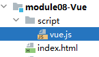
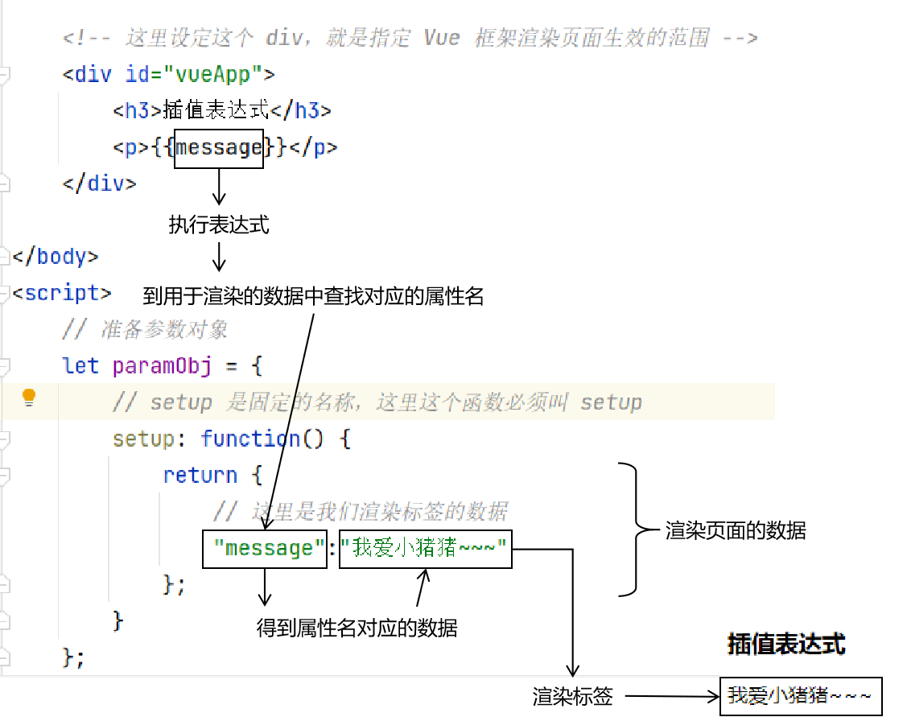

# 一、简介
## 1、Vue简介
- 核心：基于JavaScript语言的页面渲染框架
- 官网：https://cn.vuejs.org

<br/>


<br/>

- 尤雨溪（Evan You），毕业于科尔盖特大学，前端框架Vue.js的作者、HTML5版Clear的打造人、独立开源开发者。曾就职于Google Creative Labs和Meteor Development Group。由于工作中大量接触开源的JavaScript项目，最后自己也走上了开源之路，现全职开发和维护Vue.js
  
- 尤雨溪毕业于上海复旦附中，在美国完成大学学业，本科毕业于Colgate University，后在Parsons设计学院获得Design & Technology艺术硕士学位，任职于纽约Google Creative Lab。
  
- 尤雨溪大学专业并非是计算机专业，在大学期间他学习专业是室内艺术和艺术史，后来读了美术设计和技术的硕士，正是在读硕士期间，他偶然接触到了JavaScript，从此被这门编程语言深深吸引，开启了自己的前端生涯。

<br/>

## 2、框架
### ①开发实践角度
- 没有框架的时候：使用原生代码，编写程序，开发功能
- 在开发中不断积累经验：特定的功能场景，编写的程序是有套路的
- 在开发中积累最佳实践：把常用的套路代码提取出来，封装工具类、工具方法
- 整合得到框架：把各个领域的最佳实践整合到一起，形成比较全面的解决方案
- Java语言：框架体现为一组jar包+配置文件
- JavaScript语言：框架体现为一组js文件+配置文件
- 使用框架：通过在配置文件中编写配置，来指挥框架

<br/>

### ②使用体验角度
- 框架已经针对常见的场景，把固定套路式的代码已经写好了
- 我们往里面填充细节，细节就是为了实现我们自己的功能需求而编写的代码
- 生活中的框架
  - 洗衣机：洗衣服的框架
  - 汽车：出行的框架
  - 手机：通信的框架
  - ……


<br/>

# 二、搭建环境
## 1、引入vue.js

<br/>



<br/>

```html
<script src="script/vue.js"></script>
```

<br/>

## 2、创建div
```html
<!-- Vue 负责渲染这个范围内的标签 -->  
<div id="vueAppAtguigu"></div>
```

<br/>

## 3、创建Vue对象
下面代码就是固定套路，大家复制即可：
```html
<script>  
  
    // 准备参数对象  
    let paramObj = {  
        // setup 是固定的名称，这里这个函数必须叫 setup
        setup: function() {  
            return {  
                // 这里是我们渲染标签的数据
            };  
        }  
    };  
  
    // 调用 Vue 调用静态方法：createApp(参数对象)  
    let vueApp = Vue.createApp(paramObj);  
  
    // vueApp 和 HTML 标签之间需要做一个挂载的操作：
    // #id 值
    vueApp.mount("#vueAppAtguigu");
</script>
```

<br/>

# 三、页面渲染
## 1、插值表达式
### ①准备数据
```javascript
// 准备参数对象  
let paramObj = {  
    // setup 是固定的名称，这里这个函数必须叫 setup    
    setup: function() {  
        return {  
            // 这里是我们渲染标签的数据  
            "message": "我是一头小猪猪"  
        };  
    }  
};
```

<br/>



<br/>

### ②被渲染的HTML标签
```html
<!-- Vue 负责渲染这个范围内的标签 -->  
<div id="vueAppAtguigu">  
    <!-- 使用插值表达式渲染文本标签体 -->  
    <p>{{message}}</p>  
</div>
```

<br/>

## 2、v-text
```html
<p v-text="message"></p>
```

<br/>

## 3、v-html
```html
<p v-html="message"></p>
```

<br/>

区别是v-html能够解析数据中的HTML代码：
```javascript
return {  
    // 这里是我们渲染标签的数据  
    "message": "我是一头小猪猪",  
    "info":"我是一头<span style='color:blue;'>小猪猪</span>"  
};
```

<br/>

```html
<p v-html="info"></p>
```

<br/>

## 4、v-bind
渲染HTML标签的属性

### ①准备数据
```javascript
return {  
    // 这里是我们渲染标签的数据  
    "message": "我是一头小猪猪",  
    "info":"我是一头<span style='color:blue;'>小猪猪</span>",  
    "styleValue": "color:green;font-weight:bolder;"  
};
```

<br/>

### ②被渲染的标签
格式是v-bind:原本HTML属性名
```html
<p v-html="message" v-bind:style="styleValue"></p>
```

<br/>

### ③简化写法
:原本HTML属性名
```html
<p v-html="message" :style="styleValue"></p>
```

<br/>

# 四、事件绑定
## 1、声明事件响应函数
```javascript
return {
    // 这里是我们渲染标签的数据
    "message": "我是一头小猪猪",
    "info":"我是一头<span style='color:blue;'>小猪猪</span>",
    "styleValue": "color:blue;font-weight:bolder;",
    "doClick": function (){
        alert("请你吃肉！"); 
    }
};
```

<br/>

## 2、在标签内绑定事件响应函数
```html
<button v-on:click="doClick()">点我</button>
```

<br/>

## 3、简化写法
```html
<button @click="doClick()">点我吃肉</button>
```

<br/>

## 4、取消控件默认行为
### ①提出问题
- 删除记录的超链接：点击后我们希望弹出确认框，用户如果点击取消，则不发送请求、不跳转页面。
- 表单验证：点击提交按钮之后，执行表单验证，表单验证如果通不过，那么就不提交表单。

<br/>

### ②默认行为
- 超链接点击之后会跳转页面
- 表单的提交按钮点击之后会提交表单

<br/>

### ③实现方式
Vue里面通过事件属性实现的取消，是一种彻底取消，所以如果需要根据不同逻辑决定是否跳转，需要自己写代码实现
```html
<a href="http://www.baidu.com" @click.prevent="doClick()">点我不吃肉</a>
```

<br/>

```javascript
"doRemove":function(){  
    var confirmResult = confirm("你真的要删除吗？");  
    if (confirmResult) {  
        // 如果用户在确认框点击了确定，那么我们自己跳转页面  
        window.location.href = "http://www.baidu.com";  
    }  
}
```

<br/>


### ④表单的操作

```html
<form id="myForm" action="http://www.baidu.com" method="post">
    <button @click.prevent="doSubmit()" type="submit">提交表单</button>
</form>
```


```javascript
doSubmit: function (){
    // 1、弹出确认框，接收用户确认的结果
    let confirmResult = confirm("您真的要跳转到百度吗？");

    // 2、如果用户点击了确定，那么我们自己手动提交表单
    if (confirmResult) {
        // 3、获取到表单对应的元素对象之后，手动提交
        document.getElementById("myForm").submit();
    }
}
```


# 五、流程控制
## 1、条件渲染
```html
<div id="vueApp">  
    <!-- v-if 中指定的表达式，如果条件满足，那么就显示这个标签 -->  
    <p v-if="age>50">该退休了<span v-text="age"></span></p>  
    <!-- v-if 和 v-else 之间的部分，逻辑上不好说要不要显示 -->  
    <h3>aaa</h3>  
    <!-- v-else 中指定的表达式，如果条件不满足，那么就显示这个标签 -->  
    <p v-else>继续工作<span v-text="age"></span></p>  
  
    <p v-if="age>50">该退休了<span v-text="age"></span></p>  
    <p v-else-if="age>20 && age<=50">好好工作<span v-text="age"></span></p>  
    <p v-else>好好学习<span v-text="age"></span></p>  
</div>
```

<br/>

```html
<p v-show="age>50">该退休了<span v-text="age"></span></p>
```

<br/>

二者底层的差别如下（不用记）：

- v-if：页面初始化时已经渲染完成（适用于数据变化不频繁的情况）
- v-show：数据改变时才渲染，判断是否满足条件（适用于数据变化频繁的情况）

<br/>

## 2、列表渲染
### ①准备数据
```javascript
return {
    // 这里是我们渲染标签的数据
    "message": "我是一头小猪猪",
    "info":"我是一头<span style='color:blue;'>小猪猪</span>",
    "styleValue": "color:blue;font-weight:bolder;",
    "doClick": function (){
        alert("请你吃肉！");
    },
    "age":20,
    "itemList": [
        {
            "itemId":1,
            "itemName":"name01"
        },
        {
            "itemId":2,
            "itemName":"name02"
        },
        {
            "itemId":3,
            "itemName":"name03"
        }
    ]
};
```

<br/>

### ②渲染
```html
<table>  
    <tr>  
        <th>ID</th>  
        <th>NAME</th>  
    </tr>  
    <tr v-if="itemList != null && itemList.length > 0" v-for="item in itemList">  
        <td v-text="item.itemId"></td>  
        <td v-text="item.itemName"></td>  
    </tr>  
</table>
```

<br/>