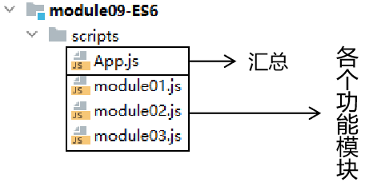
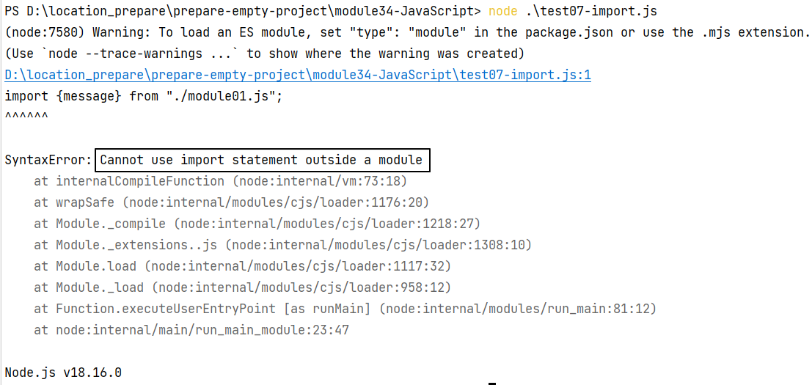

# 一、为什么要学习ES6语法
因为ES6语法是Vue组件化开发的基础，而只有在组件化开发的环境下才能实现双向绑定，也就是获取表单中用户输入的数据。

<br/>

# 二、ES6标准简介
> ECMAScript 6，简称ES6，是**JavaScript**语言的一次重大更新。它于**2015**年发布，是原来的ECMAScript标准的第六个版本。ES6带来了大量的新特性，包括箭头函数、模板字符串、let和const关键字、解构、默认参数值、模块系统等等，大大提升了JavaScript的开发体验。`由于Vue3中大量使用了ES6的语法,所以ES6成为了学习Vue3的门槛之一`
> ES6对JavaScript的改进在以下几个方面：

1.  更加简洁：ES6引入了一些新的语法，如箭头函数、类和模板字符串等，使代码更加简洁易懂。
2.  更强大的功能：ES6引入了一些新的API、解构语法和迭代器等功能，从而使得JavaScript更加强大。
3.  更好的适用性：ES6引入的模块化功能为JavaScript代码的组织和管理提供了更好的方式，不仅提高了程序的可维护性，还让JavaScript更方便地应用于大型的应用程序。

> 总的来说，ES6在提高JavaScript的核心语言特性和功能方面取得了很大的进展。由于ES6已经成为了JavaScript的标准，它的大多数新特性都已被现代浏览器所支持，因此现在可以放心地使用ES6来开发前端应用程序。

**历史版本：**

| 标准版本                                                | 发布时间                                                   | 新特性                                                       |
| ------------------------------------------------------- | ---------------------------------------------------------- | ------------------------------------------------------------ |
| ES1                                                     | 1997年                                                     | 第一版 ECMAScript                                            |
| ES2                                                     | 1998年                                                     | 引入setter和getter函数，增加了try/catch，switch语句允许字符串 |
| ES3                                                     | 1999年                                                     | 引入了正则表达式和更好的字符串处理                           |
| ES4                                                     | 取消                                                       | 取消，部分特性被ES3.1和ES5继承                               |
| ES5                                                     | 2009年                                                     | Object.defineProperty，JSON，严格模式，数组新增方法等        |
| ES5.1                                                   | 2011年                                                     | 对ES5做了一些勘误和例行修订                                  |
| <span style="color:blue;font-weight:bolder;">ES6</span> | <span style="color:blue;font-weight:bolder;">2015年</span> | <span style="color:blue;font-weight:bolder;">箭头函数、模板字符串、解构、let和const关键字、类、模块系统等</span> |
| ES2016                                                  | 2016年                                                     | 数组.includes，指数操作符（\*\*），Array.prototype.fill等    |
| ES2017                                                  | 2017年                                                     | 异步函数async/await，Object.values/Object.entries，字符串填充 |
| ES2018                                                  | 2018年                                                     | 正则表达式命名捕获组，几个有用的对象方法，异步迭代器等       |
| ES2019                                                  | 2019年                                                     | Array.prototype.{flat,flatMap}，Object.fromEntries等         |
| ES2020                                                  | 2020年                                                     | BigInt、动态导入、可选链操作符、空位合并操作符               |
| ES2021                                                  | 2021年                                                     | String.prototype.replaceAll，逻辑赋值运算符，Promise.any等   |
| ... ...                                                 |                                                            |                                                              |

<br/>

# 三、ES6语法细节
## 1、模板字符串
```javascript
// 1、多行普通字符串
let ulStr =
'<ul>'+
'<li>JAVA</li>'+
'<li>html</li>'+
'<li>VUE</li>'+
'</ul>';
console.log(ulStr);

// 2、多行模板字符串
let ulStr2 = `
	<ul>
		<li>JAVA</li>
		<li>html</li>
		<li>VUE</li>
	</ul>`;
console.log(ulStr2);

// 3、普通字符串拼接
let name ='张小明';
let infoStr =name+'被评为本年级优秀学员';
console.log(infoStr);

// 4、模板字符串拼接
let infoStr2 =`${name}被评为本年级优秀学员`;
console.log(infoStr2)
```

<br/>

## 2、解构表达式
> ES6 的解构赋值是一种方便的语法，可以快速将数组或对象中的值拆分并赋值给变量。解构赋值的语法使用花括号 `{}` 表示对象，方括号 `[]` 表示数组。通过解构赋值，函数更方便进行参数接受

<br/>

### ①数组中使用
可以通过数组解构将数组中的值赋值给变量

```javascript
    // 1、使用数组形式的解构表达式
    let [a1, b1, c1] = ["w", "e", "t"];
    console.log(a1);
    console.log(b1);
    console.log(c1);

    // 2、在解构表达式中指定默认值
    let [a2, b2, c2, d2 = "u"] = ["w", "e", "t"];
    console.log(a2);
    console.log(b2);
    console.log(c2);
    console.log(d2);
```

<br/>

### ②对象中使用
使用对象中的属性给解构表达式中同名的变量赋值

```javascript
    let {stuName, stuAge} = {stuName: "tom", stuAge: 528};
    console.log(stuName);
    console.log(stuAge);
```

也可以在解构表达式中，给对象属性设置新的名称

此时冒号前面部分负责从后面的对象中取值，冒号后面就是对象属性的新的名称

```javascript
let {soldierName:soldierNameNew, soldierAge:soldierAgeNew} = {soldierName:"jerry", soldierAge:324};
console.log(soldierNameNew);
console.log(soldierAgeNew);
```

<br/>

### ③在函数中使用
```javascript
// 以解构表达式的形式声明函数的形参
function sum([x, y]) {
    console.log(arguments);
    return x+y;
}

// 使用数组作为调用函数的实参
var sumResult = sum([100, 50]);
console.log(sumResult);
```

<br/>

## 3、箭头函数
### ①基础语法
```javascript
// 1、传统方式声明函数
let fun01 = function(){};

// 2、箭头函数方式声明函数
let fun02 = ()=>{
	console.log("初步编写箭头函数。");
};
fun02();

// 3、箭头函数中只有一行代码可以省略大括号
let fun03 = ()=>console.log("编写箭头函数。省略大括号");
fun03();

// 4、只有一个参数时可以省略小括号
let fun04 = p=>console.log("编写箭头函数。只有一个参数时可以省略小括号 p=" + p);
fun04(5);

// 5、箭头函数中只有一行代码可以省略大括号和return
let fun05 = p=>p+100;
let fun05Result = fun05(80);
console.log("箭头函数中只有一行代码可以省略大括号和return fun05Result = " + fun05Result);
```

<br/>

### ②回调函数中的this
内外两层回调函数中this不同，会给我们开发带来很大的不便：<br/>

```html
<button id="btn01">点我你会发财！</button>
<button id="btn02">点我你会幸福！</button>
<button id="btn03">点我你会优雅！</button>
```

```javascript
// this 本身的含义：函数中的 this 指向调用当前函数的对象  
let obj01 = {  
    "objName": "我是小猪猪~~~",  
    "showName": function () {  
        console.log(this.objName);  
    }  
};  
  
obj01.showName();  
  
// 探讨情况一：this 所在的函数是个回调函数  
setTimeout(function (){  
    // 执行后发现，this 是代表浏览器窗口的 window 对象  
    console.log(this);  
}, 3000);  
  
// 探讨情况二：this 所在的函数是按钮的单击响应函数  
document.getElementById("btn01").onclick = function (){  
    // 执行后发现，this 是当前单击事件点击的按钮  
    console.log(this);  
};  
  
// 探讨情况三：多层回调函数中，this 指向了不同的对象  
// 目标：点击按钮之后，延迟 3 秒，打印按钮上显示的文字  
document.getElementById("btn02").onclick = function (){  
    // 先直接打印按钮上显示的文字  
    // console.log(this.innerText);  
  
    // 在单击响应函数中，this 仍然是指向当前事件点击的按钮  
    console.log(this);  
  
    // 由于延迟操作中的 this 无法指向按钮，所以为了让延迟操作中能够拿到按钮对象，  
    // 声明一个变量保存一下 this    
    var btnEle = this;  
  
    // 延迟 3 秒  
    setTimeout(function (){  
        // 在延迟操作回调函数中，this 仍然是指向 window 对象  
        console.log(this);  
  
        // 通过变量引用按钮对象  
        console.log(btnEle.innerText);  
    }, 3000);  
}  
  
// 使用箭头函数实现同样的效果  
document.getElementById("btn03").onclick = function () {  
    setTimeout(()=>{  
        // 相当于箭头函数没有自己的 this，this 和外层的函数指向的对象一样  
        console.log(this);  
        console.log(this.innerText);  
    }, 3000);  
};
```

<br/>

# 四、模块化
## 1、简介
> 模块化是一种组织和管理前端代码的方式，将代码拆分成小的模块单元，使得代码更易于维护、扩展和复用。它包括了定义、导出、导入以及管理模块的方法和规范。前端模块化的主要优势如下：

1.  提高代码可维护性：通过将代码拆分为小的模块单元，使得代码结构更为清晰，可读性更高，便于开发者阅读和维护。
2.  提高代码可复用性：通过将重复使用的代码变成可复用的模块，减少代码重复率，降低开发成本。
3.  提高代码可扩展性：通过模块化来实现代码的松耦合，便于更改和替换模块，从而方便地扩展功能。

> 目前，前端模块化有多种规范和实现，包括 CommonJS、AMD 和 ES6 模块化。ES6 模块化是 JavaScript 语言的模块标准，使用 import 和 export 关键字来实现模块的导入和导出。现在，大部分浏览器都已经原生支持 ES6 模块化，因此它成为了最为广泛使用的前端模块化标准. `

+ ES6模块化的几种暴露和导入方式
    1. 分别导出
    2. 统一导出
    3. 默认导出
+ ES6中无论以何种方式导出,导出的都是一个对象,导出的内容都可以理解为是向这个对象中添加属性或者方法
+ 导出也可以称之为暴露

<br/>

## 2、用法说明
### ①创建模块文件


<br/>

### ②功能模块代码
```javascript
let message = "hello";  
let showMessage = function () {  
    alert(message);  
};
```

<br/>

### ③代码导出
在需要导出的变量、常量或函数前加export即可：
```javascript
export let message = "hello";  
export let showMessage = function () {  
    alert(message);  
};
```

<br/>

### ④代码导入
在需要使用那些导出资源的文件里使用import导入，例如我们在App.js中导入：
```javascript
import {message} from "./module01.js";  
import {showMessage} from "./module01.js";  
  
console.log(message);  
showMessage();
```

<br/>导入、导出功能不能脱离module独立使用：<br/>



<br/>

### ⑤App.js嵌入HTML
把App.js嵌入HTML时，script标签必须把type属性设置为module：
```html
<script src="scripts/App.js" type="module"></script>
```

## 3、代码改进
### ①批量导出
```javascript
let morning = "good morning";  
let showMorning = function (){  
    alert(morning);  
};  
  
export {  
    morning,  
    showMorning  
}
```

<br/>


### ②全部导入
导入时使用星号可以表示全部导入，但此时必须使用as指定一个变量名<br/>
指定变量名后，导入的资源全部作为这个变量的属性来访问：

```javascript
import * as module2 from "./module02.js";

console.log(module2.hello);  
module2.showHello();
```

<br/>


### ③默认导出
每一个 xxx.js 文件有一次机会进行默认导出：
```javascript
let food = "hamburger222";  
  
export default food;
```

<br/>

默认导出的资源，就失去自己的名字了，导入时通过default关键词导入而且需要起别名：
```javascript
import {default as elephant} from "./module04.js";
```

<br/>

可以简化写：
```javascript
import elephant from "./module04.js";
```