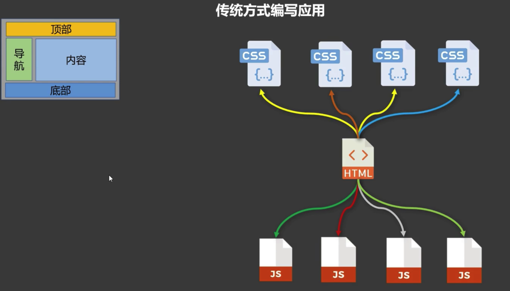
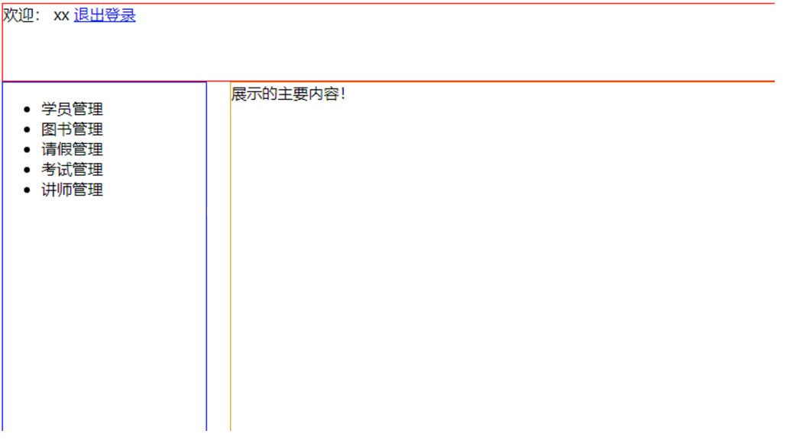

# 一、npm 配置和使用
## 1、npm介绍


NPM全称Node Package Manager，是Node.js包管理工具，是全球最大的模块生态系统，里面所有的模块都是开源免费的；也是Node.js的包管理工具，相当于后端的 Maven。

如何理解包管理？因为前端开发过程中，需要使用很多第三方框架、工具包等等。

### ①依赖

A程序里面需要用到B程序中声明的变量、函数等等，那么我们就可以说A依赖B。

此时如果我们不导入B，A不能正常工作。

用 Java 来举例：

- 我们基于 JDBC 技术连数据库，需要 MySQL 驱动的 jar 包
- 我们想要使用 DBUtils 工具包，需要 DBUtils 的 jar 包
- 我们想要使用 Thymeleaf 渲染页面，需要 Thymeleaf 的 jar 包
- ……


### ②npm包管理机制


<br/>

## 2、npm升级

Node.js自带npm，无须单独安装，但如果版本较低，则需要升级

```shell
# 查看 npm 版本
npm -v

# 升级 npm
npm install -g npm@9.6.6
```


## 3、修改npm默认镜像源


不是必须配置，如果官方默认源仓库访问很慢可以尝试修改：

```shell
npm config set registry https://registry.npmmirror.com
```


配置之后使用下面命令查看：

```shell
npm config get registry
```


使用下面命令恢复官方源：

```shell
npm config set registry https://registry.npmjs.org/
```


## 4、npm常用命令

### ①npm init

- 作用：初始化一个前端工程
- 参数：-y表示所有选项都使用默认值

- 举例：

> D:\temple\module_test>npm init
> This utility will walk you through creating a package.json file.
> It only covers the most common items, and tries to guess sensible defaults.
>
> See `npm help init` for definitive documentation on these fields
> and exactly what they do.
>
> Use `npm install <pkg>` afterwards to install a package and
> save it as a dependency in the package.json file.
>
> Press ^C at any time to quit.
> package name: (module_test)
> version: (1.0.0)
> description: my module test
> entry point: (index.js)
> test command:
> git repository:
> keywords:
> author: peter
> license: (ISC)
> About to write to D:\temple\module_test\package.json:
>
> {
>   "name": "module_test",
>   "version": "1.0.0",
>   "description": "my module test",
>   "main": "index.js",
>   "scripts": {
>     "test": "echo \"Error: no test specified\" && exit 1"
>   },
>   "author": "peter",
>   "license": "ISC"
> }
>
>
> Is this OK? (yes)
>
> D:\temple\module_test>


- 效果：在工程目录下生成了package.json文件

```json
{
  "name": "module_test",
  "version": "1.0.0",
  "description": "my module test",
  "main": "index.js",
  "scripts": {
    "test": "echo \"Error: no test specified\" && exit 1"
  },
  "author": "peter",
  "license": "ISC"
}
```

> 稍后专门介绍package.json文件


### ②npm install


- 作用：安装工程所需第三方依赖，例如axios、Pinia、Vue……等等
- 参数：-g表示把依赖包作为全局依赖安装，通常只有npm、cnpm等全局指令才需要这样安装

```shell
# 升级 npm
npm install -g npm@9.6.6
```


- 格式：依赖包@版本号，如果没有指定版本则安装最新版
- 举例：单独执行某一个包的安装

```shell
npm install vue@3.4.4
```

- 运行效果如下：


- 举例：一次性安装多个所需的包

```shell
npm install vue@3.3.4 ^
vue-router@4.2.4 ^
axios@1.5.0 ^
element-plus@2.3.14 ^
pinia@2.1.6 ^
sass@1.71.1 ^
less@4.2.0
```

> 上面例子中^符号的意思是告诉命令行窗口：命令还没有输入完，先不要执行


- 基于dependencies安装

```shell
# 省略包名称时，表示基于dependencies列出的包执行安装
npm install
```


- 简略写法：把 install 简写为 i

```shell
npm i
```


- IDEA更新依赖的索引


当npm管理包发生变化时，IDEA会更新依赖的索引，此时不要阻止IDEA做这个操作。

IDEA完整更新了依赖的索引之后，就能够在我们写代码时给出更好的提示


### ③npm ls

- 作用：查看依赖
- 参数：-g表示查看全局依赖


## 5、package.json文件

### ①作用

package.json文件是整个前端工程的核心配置文件，描述了整个工程各个方面的基本信息


### ②预定义脚本

对每个工程来说，都会有很多常用操作。例如：

- 测试
- 构建
- 预处理
- 清理

这些操作通常都包含很多命令，而且每次都是运行相同的命令，所以非常适合封装为脚本作为固定流程在每次需要时直接调用。

npm运行预定义脚本的语法结构是：

```shell
npm run <脚本名称>
```


# 二、Vue3脚手架工具：Vite

## 1、Vite简介


<br/>


- 功能：自动生成Vue3开发环境，包括工程的完整的目录结构


## 2、操作

### ①创建工程

<span style="color:blue;font-weight:bolder;">进入Project目录</span>执行如下命令：

```shell
npm create vite@4.4.0
```


第一次使用vite时会提示下载vite,输入y回车即可,下次使用vite就不会出现了


### ②进入工程目录

```shell
cd module_vite01
```


### ③安装所需依赖

#### [1]初始依赖

```json
"dependencies": {
	"vue": "^3.3.4"
},
"devDependencies": {
	"@vitejs/plugin-vue": "^4.2.3",
	"vite": "^4.4.0"
}
```

- dependencies：工程的运行时依赖
- devDependencies：工程的开发时依赖

运行npm install按照package.json中的上述配置安装对应的依赖


也可以点击 IDEA 自动弹出的按钮框：


#### [2]其它依赖

- 根据需要一个一个安装，用到哪个装哪个

```shell
npm install vue-router@4.2.4
npm install axios@1.5.0
npm install element-plus@2.3.14
npm install pinia@2.1.6
npm install sass@1.71.1
npm install less@4.2.0
```


- 一次性安装多个依赖

```shell
npm install vue-router@4.2.4 ^
axios@1.5.0 ^
element-plus@2.3.14 ^
pinia@2.1.6 ^
sass@1.71.1 ^
less@4.2.0
```


### ④启动项目

启动项目可以分以下两种情况：

- 开发过程中本地启动项目，查看功能
- 功能开发完成部署到服务器上运行

```shell
# 本地启动运行
npm run dev

# 执行项目打包部署
npm run build
```


### ⑤调用流程


### ⑥vite命令找不到


如果看到上述错误提示，那么说明忘记了执行npm install


# 三、Vue组件化开发思维
## 1、简介
组件允许我们将 UI 划分为独立的、可重用的部分，并且可以对每个部分进行单独的开发。<br/>
组件就是实现应用中局部功能代码和资源的集合！在实际应用中，组件常常被组织成层层嵌套的树状结构：


<br/>

这和我们嵌套 HTML 元素的方式类似，Vue 实现了自己的组件模型，使我们可以在每个组件内封装自定义内容与逻辑。

<br/>

## 2、传统开发方式


<br/>

## 3、组件化开发方式


<br/>

- 组件化：对 js/css/html 统一封装，这是VUE中的概念
- 模块化：对 js 的统一封装，这是ES6中的概念
- 组件化中，对 js 部分代码的处理使用ES6中的模块化

<br/>

## 4、Vue组件文件

```vue
<template>
	<!-- 编写 HTML 代码 -->
</template>

<script setup>
	// 编写 JavaScript 代码
</script>

<style scoped>
	/* 编写 CSS 代码 */
</style>
```


# 四、组件化开发入门
## 1、显示效果


<br/>

## 2、创建组件

首先需要安装 IDEA 的 Vue 插件：


### ①头部
```html
<template>  
  <div>  
    欢迎： xx <a href="#">退出登录</a>  
  </div>  
</template>
```

<br/>

### ②导航栏
```html
<template>  
  <div>  
    <ul>  
      <li>学员管理</li>  
      <li>图书管理</li>  
      <li>请假管理</li>  
      <li>考试管理</li>  
      <li>讲师管理</li>  
    </ul>  
  </div>  
</template>
```

<br/>

### ③内容
```html
<template>  
  <div>  
    展示的主要内容！  
  </div>  
</template>
```

<br/>

## 3、整合组件
在App.vue文件中：
```html
<script setup>  
import Header from './components/Header.vue';  
import Navigator from './components/Navigator.vue';  
import Content from './components/Content.vue';
</script>  
  
<template>  
  <div>  
    <Header class="header"></Header>  
    <Navigator class="navigator"></Navigator>  
    <Content class="content"></Content>  
  </div>  
</template>  
  
<style scoped>  
.header {  
  height: 80px;  
  border: 1px solid red;  
}  
  
.navigator {  
  width: 15%;  
  height: 800px;  
  display: inline-block;  
  border: 1px blue solid;  
  float: left;  
}  
  
.content {  
  width: 83%;  
  height: 800px;  
  display: inline-block;  
  border: 1px goldenrod solid;  
  float: right;  
}  
  
</style>
```

<br/>

## 4、调整样式
在main.js中：把默认样式文件的导入注释掉
```javascript
import { createApp } from 'vue'  
// import './style.css'  
import App from './App.vue'  
  
createApp(App).mount('#app')
```