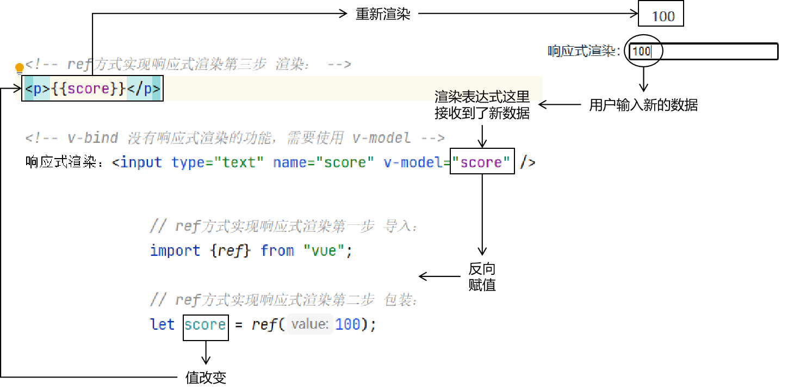
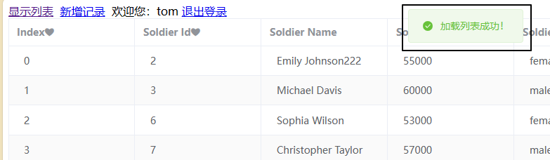
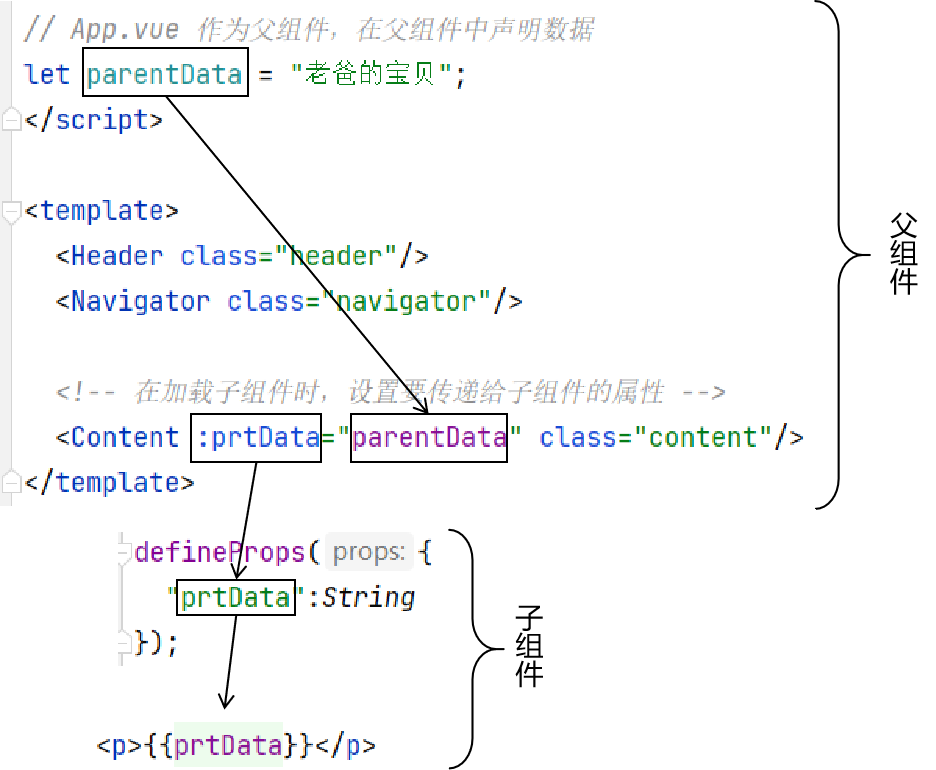
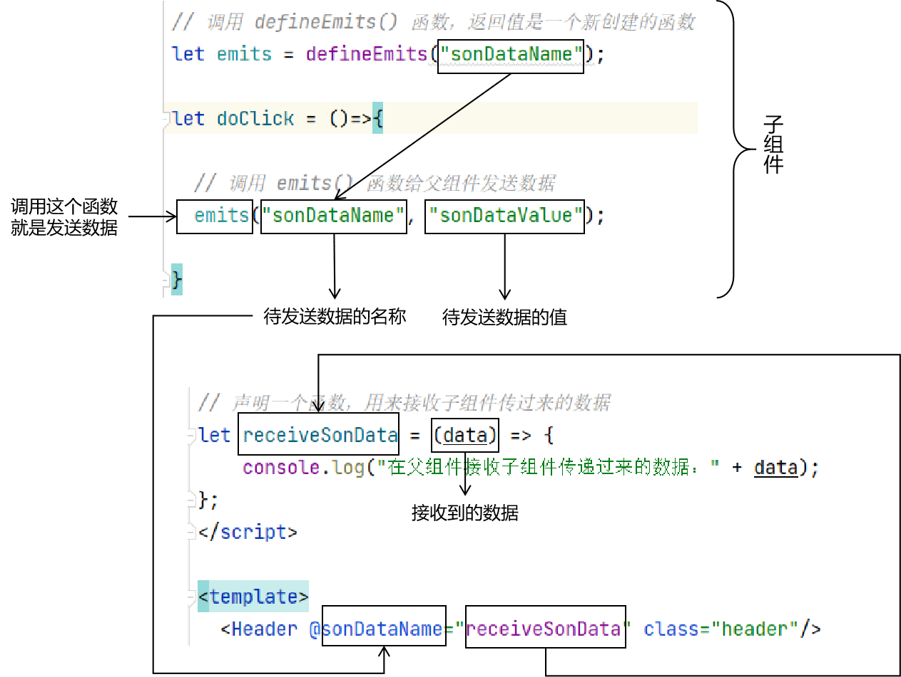

# 一、基础渲染技术
## 1、创建前端工程
```bash
npm create vite
cd 刚才创建的工程目录
npm install
npm run dev
```

然后在浏览器打开http://localhost:5173这个地址<br/>


## 2、script标签设置setup属性

使用`<script setup>`标签相当于在普通的`<script>`标签内使用`setup()`函数。这是Vue 3新增的语法糖。

- 不加setup：script标签中只能写普通的 JavaScript 代码，如果需要设置渲染页面的对象，那么就需要声明setup()函数
- 加上setup：script标签内声明的变量就可以直接用于页面渲染


## 3、插值表达式

```html
<script setup>
    let message = "hello";
</script>

<template>
    <p>{{message}}</p>
</template>

<style scoped>
</style>
```

<br/>

## 4、v-text
```html
<script setup>  
    let message = "hello222";  
</script>  
  
<template>  
    <p v-text="message"></p>  
</template>  
  
<style scoped>  
</style>
```

<br/>

## 5、v-bind
```html
<script setup>  
    let message = "hello333";  
</script>  
  
<template>  
    <input type="text" name="userName" v-bind:value="message" />  
    <input type="text" name="userName" :value="message" />  
</template>  
  
<style scoped>  
</style>
```

<br/>

## 6、v-on
```html
<script setup>  
    let showAlert = function (){  
        alert("Hello");  
    };  
    let showFoo = ()=>{  
        alert("Foo");  
    };  
</script>  
  
<template>  
    <button type="submit" v-on:click="showAlert()">点我</button>  
    <button type="submit" v-on:click="showFoo()">点我foofoo</button>  
    <button type="submit" @click="showFoo()">点我foofoo</button>  
</template>  
  
<style scoped>  
</style>
```

<br/>

## 7、条件渲染
```html
<script setup>  
    let age = 80;  
</script>  
  
<template>  
    <p v-if="age>50">该退休了<span v-text="age"></span></p>  
    <p v-else-if="age>20 && age<=50">好好工作<span v-text="age"></span></p>  
    <p v-else>好好学习<span v-text="age"></span></p>  
    <p v-show="age>50">该退休了<span v-text="age"></span></p>  
</template>  
  
<style scoped>  
</style>
```

<br/>

## 8、列表渲染
```html
<script setup>  
    let itemList = [  
        {  
            "itemId":1,  
            "itemName":"name01"  
        },  
        {  
            "itemId":2,  
            "itemName":"name02"  
        },  
        {  
            "itemId":3,  
            "itemName":"name03"  
        }  
    ];  
</script>  
  
<template>  
    <table>  
        <tr>  
            <th>ID</th>  
            <th>NAME</th>  
        </tr>  
        <tr v-if="itemList != null && itemList.length > 0" v-for="item in itemList">  
            <td v-text="item.itemId"></td>  
            <td v-text="item.itemName"></td>  
        </tr>  
    </table>  
</template>  
  
<style scoped>  
</style>
```


<br/>

# 二、响应式渲染[重要]
## 1、概念
响应式渲染也叫双向绑定<br/>
前面我们执行的渲染操作，都是：JavaScript代码 ---> HTML代码<br/>
现在我们需要：HTML代码 ---> JavaScript代码<br/>
也就是把用户在<span style="color:blue;font-weight:bolder;">表单</span>里输入的<span style="color:blue;font-weight:bolder;">数据拿到</span>！<br/>

## 2、使用ref实现
### ①基本用法
```html
<script setup>  
    // 1、导入  
    import {ref} from 'vue';  
      
    // 2、包装  
    let message = ref("pig2023");  
</script>  
  
<template>  
    <!-- 3、使用 -->  
    <p>{{message}}</p>  
    <input type="text" name="userName" v-model="message" />  
</template>
```

<br/>

### ②访问原始值
- 在 JavaScript 代码中访问被 ref 包装的对象的原始值，需要通过 value 属性
- 在渲染过程中不必通过value属性
```html
<script setup>  
    // 1、导入  
    import {ref} from 'vue';
  
    // 2、包装  
    let message = ref("pig2023");  
  
    let showMessage = function(){  
        alert(message.value);  
    };  
</script>  
  
<template>  
    <!-- 3、使用 -->  
    <p>{{message}}</p>  
    <input type="text" name="userName" v-model="message" />  
    <button @click="showMessage()">点我打印message</button>  
</template>
```

<br/>



<br/>

## 3、使用reactive实现
```html
<script setup>
    // 1、导入  
    import {reactive} from 'vue';
    
    // 2、包装  
    let message = reactive({
        "msgName":"tiger2023"
    });  
  
    let showMessage = function(){
        // 正常按照被包装对象的结构访问属性即可，不需要加value属性
        alert(message.msgName);
    };  
</script>

<template>  
    <!-- 3、使用 -->  
    <p>{{message.msgName}}</p>  
    <input type="text" name="userName" v-model="message.msgName" />  
    <button @click="showMessage()">点我打印message</button>  
</template>
```

<br/>

# 三、计算属性
## 1、应用场景
在渲染页面的过程中，有些数据需要通过计算得到，那么计算过程与其在表达式中多次重复，不如统一提取到一处
```html
<script setup>
    let number = 10;
</script>

<template>
    <!-- 重复的表达式代码 -->
    <p>{{number*100}}</p>
    <p>{{number*10.0}}</p>
    <p>{{number*10}}</p>
</template>
```

<br/>

## 2、计算属性

一处修改，处处生效

```html
<script setup>  
    import {computed} from 'vue';  
    let number = 10;
    let result = computed(()=>number*1000);
</script>  
  
<template>  
    <!-- 重复的表达式代码 -->  
    <p>{{result}}</p>
    <p>{{result}}</p>
    <p>{{result}}</p>
</template>
```

<br/>

# 四、数据监听
监控数据，数据变化时触发回调函数：<br/>

```html
<script setup>
    import {ref, watch} from 'vue';  
    let message = ref("hello message");  
    watch(message, (newValue, oldValue)=>{
        console.log("newValue="+newValue);
        console.log("oldValue="+oldValue);
    });  
</script>  
  
<template>  
    <p>{{message}}</p>  
    <input type="text" name="userName" v-model="message" />  
</template>
```

<br/>

# 五、Vue对象生命周期

## 1、生命周期功能应用场景



上面例子：页面打开（初始化）时就加载数据，既不是点超链接触发，也不是点某个按钮触发。


## 2、概念
Vue对象生命周期包括很多环节，借助这些环节我们可以在特定时间执行特定操作。<br/>
例如：在Vue对象完成挂载操作后，从服务器端获取数据


## 3、生命周期各个环节


<br/>

## 4、测试

```javascript
// 仅测试 onMounted() 方法参考如下代码：
// 第一步：把我们要执行的操作封装到回调函数中
// 第二步：把我们声明的回调函数作为参数传入 onMounted() 方法
import {onMounted} from "vue";

onMounted(()=>{
  alert("页面初始化完成了~~~")
});
```


```html
<!-- 想测试其它环节参考如下代码： -->
<script setup>  
    import {ref, onUpdated, onMounted, onBeforeUpdate} from 'vue';  
    let message = ref("hello message");  
    onMounted(()=>{  
        console.log("--------onMounted--------");  
        console.log(document.getElementById("pEle").innerText);  
    });  
    onBeforeUpdate(()=>{  
        console.log("--------onBeforeUpdate--------");  
        console.log("用于渲染的数据：" + message.value);  
        console.log("渲染目标：" + document.getElementById("pEle").innerText);  
    });  
    onUpdated(()=>{  
        console.log("--------onUpdated--------");  
        console.log("用于渲染的数据：" + message.value);  
        console.log("渲染目标：" + document.getElementById("pEle").innerText);  
    });  
</script>  
  
<template>  
    <p id="pEle">{{message}}</p>  
    <input type="text" name="userName" v-model="message" />  
</template>
```


# 六、组件之间传递数据
## 1、父传子


### ①父组件
```html
<script setup>  
import Header from './components/Header.vue'  
import Navigator from './components/Navigator.vue'  
import Content from './components/Content.vue'  
  
// App.vue 作为父组件，在父组件中声明数据  
let parentData = "老爸的宝贝";  
</script>  
  
<template>  
  <Header class="header"/>  
  <Navigator class="navigator"/>  
  
  <!-- 在加载子组件时，设置要传递给子组件的属性 -->  
  <Content :prtData="parentData" class="content"/>  
</template>
```

<br/>

### ②子组件
```html
<template>  
  <div>  
    展示的主要内容！  
    <p>{{message}}</p>  
    <p>{{prtData}}</p>  
  </div>  
</template>  
  
<script setup>  
let message = "我爱懒洋洋~~~"  
  
// 从父组件接收数据，需要使用 defineProps() 函数  
defineProps({  
  "prtData":String  
});  
</script>
```

<br/>

## 2、子传父

### ①代码：子组件代码
```html
<script setup>  
let message = "我小猪猪~~~";  
  
// 调用 defineEmits() 函数，返回值是一个新创建的函数  
let emits = defineEmits("sonDataName");  
  
let doClick = ()=>{  
  
  // 调用 emits() 函数给父组件发送数据  
  emits("sonDataName", "sonDataValue");  
  
}  
</script>  
  
<template>  
  <div>  
    欢迎： xx <a href="#">退出登录</a>  
    <p>{{message}}<button @click="doClick()">子组件传递数据给父组件</button></p>  
  </div>  
</template>
```

<br/>

### ②代码：父组件代码
```html
<script setup>  
import Header from './components/Header.vue'  
import Navigator from './components/Navigator.vue'  
import Content from './components/Content.vue'  
  
// 声明一个函数，用来接收子组件传过来的数据  
let receiveSonData = (data) => {  
    console.log("在父组件接收子组件传递过来的数据：" + data);  
};  
</script>  
  
<template>  
  <Header @sonDataName="receiveSonData" class="header"/>  
  <Navigator class="navigator"/>  
  <Content class="content"/>  
</template>
```

<br/>

### ③代码分析


<br/>

## 3、兄传弟
- 方案一：兄传父，父传弟
- 方案二：PubSub发布订阅机制
  - PubSub作为数据中转的中心
  - 数据发送端：把数据发布到中转中心
  - 数据接收端：订阅中转中心上维护的某个数据名称
  - Pub：Publish发布
  - Sub：Subscribe订阅


<br/>