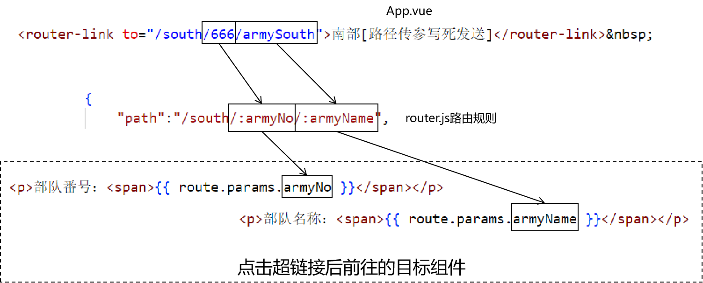

<br/>

# 一、路由初步
## 1、功能和效果
让页面跳转功能不再是传统的超链接跳转页面，而是Vue通过不同组件的切换，在浏览器本地就完成不同内容的显示。<br/>

整个浏览器窗口没有重新加载，视觉效果上屏幕没有闪动，用户体验更好。<br/>

## 2、操作步骤
### ①创建新module
```shell
# 创建新前端工程
npm create vite

# 进入新工程目录
cd xxx

# 安装vue依赖
npm install

# 安装vue-router依赖
npm install vue-router@4
```

<br/>

### ②准备所需的各个组件
参考课堂代码

<br/>

### ③配置路径和组件之间的对应关系


<br/>

```javascript
// 导入创建路由对象所需的 API
import {createRouter, createWebHashHistory} from 'vue-router';
import Page01Home from '../components/Page01Home.vue';

import Page02Add from '../components/Page02Add.vue';

import Page03Delete from '../components/Page03Delete.vue';

import Page04Update from '../components/Page04Update.vue';

import Page05Query from '../components/Page05Query.vue';

// 创建路由对象
const router = createRouter({
    history: createWebHashHistory(),

    // 指定路径和组件之间的对应关系
    routes: [
        {
            path: "/",
            component: Page01Home
        },
        {
            path: "/add",
            component: Page02Add
        },
        {
            path: "/delete",
            component: Page03Delete
        },
        {
            path: "/update",
            component: Page04Update
        },
        {
            path: "/query",
            component: Page05Query
        }
    ]
});

// 暴露路由对象
export default router;
```

<br/>

### ④在main.js中引入router.js
```javascript
import { createApp } from 'vue'
import './style.css'
import App from './App.vue'

// 导入路由规则
import router from './router/router.js';

let app = createApp(App);

// 应用路由规则
app.use(router);

app.mount('#app');
```

<br/>

### ⑤在App.vue中创建路由超链接
```html
<script setup>
</script>

<template>
  <div>
    <router-link to="/">首页</router-link>&nbsp;
    <router-link to="/add">添加操作</router-link>&nbsp;
    <router-link to="/delete">删除操作</router-link>&nbsp;
    <router-link to="/update">更新操作</router-link>&nbsp;
    <router-link to="/query">查询操作</router-link>&nbsp;
    <router-view></router-view>
  </div>
</template>
```

<br/>

# 二、组件之间通过路由跳转
## 1、路由重定向
访问A地址，通过路由规则跳转到B地址：
```html
<router-link to="/">首页</router-link>&nbsp;
<router-link to="/east">东部</router-link>&nbsp;
<router-link to="/west">西部</router-link>&nbsp;
<router-link to="/south">南部</router-link>&nbsp;
<router-link to="/north">北部</router-link>&nbsp;
<router-link to="/show/west">测试路由重定向</router-link>&nbsp;
```

<br/>

```javascript
{
    "path":"/show/west",
    "redirect":"/west"
}
```

<br/>

## 2、动态路由
### ①应用场景
动态指定要访问的路由地址，让路由目标地址除了可以通过超链接指定，也可以通过 JavaScript 代码指定。<br/>

### ②实现方式
```html
<button @click="testDynamicRouting()">测试动态路由</button>
```

<br/>

```javascript
  // 导入动态路由所需要的 useRouter() 函数
  import {useRouter} from "vue-router";

  // 调用 useRouter() 函数得到 router 对象
  let router = useRouter();

  // 在单击响应函数中完成动态路由功能
  let testDynamicRouting = function() {
    let targetPath = prompt("你想去哪？");

    // 把当前要前往的目标地址压入 router 中
    router.push({
      "path":targetPath
    });
  };
```

<br/>

## 3、路由传参
### ①发生的场景
点击链接，加载一个新的组件，此时给新组件传递参数数据。

<br/>

### ②两种传参的形式
#### [1]键值对形式
```html
<a href="/demo/remove?empId=5&empName=tom">删除一条记录</a>
```

<br/>

这就是我们熟悉的在URL地址后面附着请求参数的形式。

<br/>

#### [2]路径传参
```html
<a href="/demo/remove/5/tom">删除一条记录</a>
```

<br/>

对比两种传参方式区别：
- 路径传参看不到参数的名字了
- 因为看不到参数名字，所以：整个URL地址更简洁、更优雅
- 因为看不到参数名字，所以：和参数相关的信息更隐晦，不容易被猜到
- 由于格式发生了变化，路径传参已经不能叫做“请求参数”了

<br/>

### ③各种情况测试
#### [1]键值对传参：写死
```html
<!-- 发送请求参数的写法 -->
<router-link to="/east?armyNo=1&armyName=eastArmy">东部</router-link>
```

<br/>

来到目标组件，接收请求参数：
```html
<script setup>
// 导入创建 route 对象所需的 useRoute() 函数
import {useRoute} from 'vue-router';

// 调用 useRoute() 函数得到 route 对象
let route = useRoute();
    
// 在 JavaScript 代码中读取请求参数值写法也是一样的
console.log(route.query.armyNo);
console.log(route.query.armyName);
</script>
<template>
    <div>
        <p>东部战区</p>
        <!-- 在插值表达式中访问 route 对象的 query 属性，获取键值对形式的请求参数 -->
        <p>部队番号：<span>{{ route.query.armyNo }}</span></p>
        <p>部队名称：<span>{{ route.query.armyName }}</span></p>
    </div>
</template>
```

<br/>

导入时注意：<br/>


<br/>

#### [2]键值对传参：超链接跳转
```html
<script setup>
  let queryParamPath = {
    "path":"/east",
    "query":{
      "armyNo":"001", // 这里 "001" 部分将来就可以动态替换为实时的数据
      "armyName":"super east army" // 这里 "super east army" 部分将来就可以动态替换为实时的数据
    }
  };
</script>

<template>
  <div>
    <!-- 相当于渲染了 to 这个属性 -->
    <router-link v-bind:to="queryParamPath">东部[键值对动态发送][写法一]</router-link>&nbsp;
    <router-view></router-view>
  </div>
</template>
```

<br/>

#### [3]键值对传参：代码跳转
```javascript
// 声明一个对象，用来封装发送键值对请求参数的对象
// 动态发送键值对数据写法一：拿这里声明的对象直接渲染 to 属性
let queryParamPath = {
  "path":"/east",
  "query":{
    "armyNo":"002", // 这里 "001" 部分将来就可以动态替换为实时的数据
    "armyName":"super super east army" // 这里 "super east army" 部分将来就可以动态替换为实时的数据
  }
};

// 单击响应函数
let sendQueryParamDynamic = function(){
  // 动态发送键值对数据写法二：把上面声明的对象压入 router 对象中
  router.push(queryParamPath);
};
```

<br/>

#### [4]路径传参：写死
```html
<!-- App.vue -->
<router-link to="/south/666/armySouth">南部[路径传参写死发送]</router-link>&nbsp;
```

<br/>

```javascript
{
    "path":"/south/:armyNo/:armyName",
    "component": Cmp04South
},
```

<br/>

```html
<script setup>
import { useRoute } from 'vue-router';
let route = useRoute();
</script>
<template>
    <div>
        <p>南部战区</p>
        <!-- 在插值表达式中访问 route 对象的 params 属性，获取路径参数 -->
        <p>部队番号：<span>{{ route.params.armyNo }}</span></p>
        <p>部队名称：<span>{{ route.params.armyName }}</span></p>
    </div>
</template>
```

<br/>



<br/>

#### [5]路径传参：动态写法一
```html
<button @click="sendPathParamDynamic01()">南部[路径传参动态发送][写法一]</button>
```

<br/>

```javascript
let sendPathParamDynamic01 = function() {

  let armyNo = 333;
  let armyName = "good south army";

  // 1、准备一下要访问的路径
  let path = `/south/${armyNo}/${armyName}`;

  // 2、把准备好的路径压入 router 对象中
  router.push(path);
};
```

<br/>

#### [6]路径传参：动态写法二
```html
<!-- App.vue -->
<button @click="sendPathParamDynamic02()">南部[路径传参动态发送][写法二]</button>
```

<br/>

```javascript
// App.vue
let sendPathParamDynamic02 = function() {
  let armyNo = 888;
  let armyName = "good good south army";

  // 在 router 对象中压入一个对象
  router.push({
    // 根据 name 属性指定路由规则
    "name":"Cmp04SouthName",

    // 在 params 属性中设置路径中的参数
    "params":{
      "armyNo": armyNo,
      "armyName": armyName
    }
  });
};
```

<br/>

```javascript
// router.js：在路由规则中增加name属性
{
    "path":"/south/:armyNo/:armyName",
    "component": Cmp04South,
    "name":"Cmp04SouthName"
},
```

<br/>


<br/>


# 三、路由守卫
## 1、概念
- 在路由切换到目标组件之前：执行类似登录检查这样的操作
	- 满足条件：放行
	- 不满足条件：转向到其它组件
- 在路由切换到目标组件之后：执行类似渲染页面这样的操作

<br/>

## 2、开发位置
路由守卫放在路由规则文件中开发

<br/>


<br/>

## 3、可用API
```javascript
// 设定全局前置路由守卫
router.beforeEach((to, from, next)=>{
    // to 参数：代表目标组件，是一个被包装的对象。通过to.path获取目标组件的访问地址
    // from 参数：代表来源组件，是一个被包装的对象。通过from.path获取来源组件的访问地址
    // next 参数：这是一个函数，调用这个函数前往指定的组件
    //     next() 不传参数：相当把当前请求放行到目标组件
    //     next(path) 传参数：相当把当前转到path指定的目标组件
    console.log("[前置路由守卫]来源地址：" + from.path);
    console.log("[前置路由守卫]目标地址：" + to.path);
    console.log("[前置路由守卫]请求参数：" + to.query.armyName);
    console.log("[前置路由守卫]路径参数：" + to.params.armyName);
    console.log("[前置路由守卫]next()函数引用：" + next);

    // 执行放行操作
    next();
});

// 设定全局后置路由守卫
router.afterEach((to, from) => {
    console.log("[后置路由守卫]来源地址：" + from.path);
    console.log("[后置路由守卫]目标地址：" + to.path);
});
```

<br/>

## 4、案例：检测身份
```javascript
// 设定全局前置路由守卫
router.beforeEach((to, from, next)=>{
    // =======================Demo：检查身份是不是中国人=======================
    // 1、获取请求参数（代表身份）
    let country = to.query.country;

    // ※"/" 和 "/foreigner"不需要做身份检查，如果目标地址是这个，则直接放行
    if(to.path == "/foreigner" || to.path == "/") {
        // 放行操作
        next();

        // 放行之后，当前方法结束
        return ;
    }

    // 2、判断身份是否是中国人
    if(country == "China") {
        // 3、如果是则放行
        next();
    } else {
        // 4、如果不是，则跳转到专门的组件
        next("/foreigner");
    }
});
```
