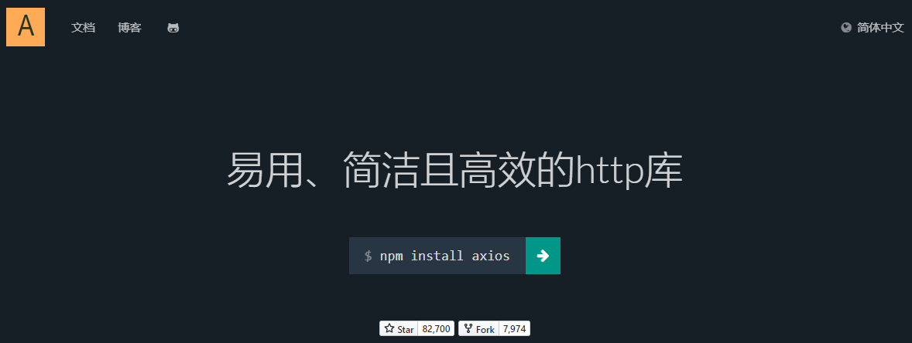

# 一、Ajax初步

## 1、服务器端渲染


## 2、Ajax渲染（局部更新）


## 3、Ajax名词解释
- 名称：<span style="color:blue;">**A**</span>synchronous <span style="color:blue;">**J**</span>avaScript <span style="color:blue;">**a**</span>nd <span style="color:blue;">**X**</span>ML（异步的 JavaScript 和 XML）

<br/>

## 4、对比
|&nbsp;|非Ajax|Ajax|
|---|---|---|
|发出请求|超链接、表单|JavaScript代码|
|响应格式|HTML页面|数据本身（通常是JSON格式）|
|页面渲染|后端渲染|前端渲染|
|用户体验|中规中矩|较好|

<br/>

开发方式：
- 服务器端渲染：页面渲染主要由服务器端渲染实现
- 前后端分离：所有请求和响应都基于Ajax技术实现
  - 分工明确：前端工程师不必关心数据的来源；后端工程师不必关心数据的显示
  - 代码解耦：前端代码和后端代码充分解耦，分别开发，易于维护


<br/>

# 二、Axios框架

## 框架简介



官方文档：https://www.axios-http.cn/docs/intro<br/>


## 搭建环境

```bash
# 创建前端工程
npm create vite

# 进入工程目录
cd xxx

# 安装vue
npm install

# 安装axios
npm install axios@1.5.0
```


## 操作1：前端发送请求
```html
<script setup>  
  
  import axios from 'axios';  
  
  let operation01SendRequest = ()=>{  
    axios({  
      "url":"http://localhost:8080/demo/AjaxServlet/operation01SendRequest", // 请求的目标地址
      "method":"post" // 请求方式
    });  
  };  
</script>  
  
<template>  
  <div>  
    <p><button @click="operation01SendRequest()">操作1：发送请求</button></p>  
  </div>  
</template>
```

<br/>

## 操作2：后端接收请求
### ①创建后端工程
- 创建module
- 添加web.xml
- 添加Tomcat依赖
- 创建Servlet（继承ServletPathParent）

<br/>

### ②创建具体方法处理请求
```java
public class AjaxServlet extends ServletPathParent {  
    protected void operation01SendRequest(  
            HttpServletRequest request,   
            HttpServletResponse response) throws ServletException, IOException {  
        System.out.println("AjaxServlet 接收到了 Ajax 请求");  
    }  
}
```

<br/>

## 操作3：解决跨域问题
### ①概念
- 在<span style="color:blue;font-weight:bolder;">A网站</span>下发送<span style="color:blue;font-weight:bolder;">Ajax请求</span>，访问<span style="color:blue;font-weight:bolder;">B网站</span>，这样的操作有安全隐患
- 以下情况我们判断为跨域：
	- IP地址不同
		- A网站：47.36.211.6
		- B网站：39.106.55.47
	- 域名不同（二级域名不同）
		- A网站：www.jd.com
		  - 下面情况是二级域名相同，三级域名不同，不属于跨域
		  - product.jd.com
		  - cart.jd.com
		  - order.jd.com
		- B网站：www.tmall.com
	- 端口号不同
		- A网站：www.jd.com:8000
		- B网站：www.jd.com:9000
	- 协议不同
		- A网站：http协议
		- B网站：https协议

<br/>

### ②解决办法


- 在前端解决：在vite.config.js文件配置代理（使用Vite服务器做一个代理）
- 在后端解决：CORS（把跨域的网址信息加入到后端服务器的信任列表中）

<br/>

找到vite.config.js文件：


<br/>

增加配置：

```javascript
import { defineConfig } from 'vite'
import vue from '@vitejs/plugin-vue'

// https://vitejs.dev/config/
export default defineConfig({
  plugins: [vue()],
  server: {   // 针对 Vite 启动的服务器进行配置
    proxy: {  // 配置 Vite 服务器的代理功能
      "/api": { // 使用代理功能的请求的地址的前缀
        target: 'http://localhost:8080',  // 目标访问地址
        rewrite: (path) => path.replace(/^\/api/, ''),  // 把 /api 从请求地址中去掉
      }
    }
  }
})
```

<br/>

注意：做了上面这个配置，以后所有前端请求都必须以/api开头！

<br/>

### ③修改Ajax请求地址
```text
"url":"/api/demo/AjaxServlet/operation01SendRequest"
```

<br/>

## 操作4：后端返回数据：普通文本
```java
protected void operation01SendRequest(  
        HttpServletRequest request,  
        HttpServletResponse response) throws ServletException, IOException {  
    System.out.println("AjaxServlet 接收到了 Ajax 请求");  
  
    response.setContentType("text/html;charset=UTF-8");  
    response.getWriter().write("快到中午吃饭的时间了！");  
}
```

<br/>

## 操作5：前端接收服务器端返回的响应
```javascript
axios({  
  "url":"/api/demo/AjaxServlet/operation01SendRequest", // 请求的目标地址  
  "method":"post" // 请求方式  
}).then((response)=>{ // then() 函数在参数中传入了一个回调函数  
  // 回调函数在服务器返回成功响应的时候调用  
  // 回调函数的参数 response 就是对服务器返回响应的封装  
  console.log(response);  
  
  // 访问 response 对象的 data 属性，获得服务器返回响应的响应体
  console.log(response.data);  
});
```

<br/>

## 操作6：后端返回数据：JSON格式
### ①JSON格式回顾
- 最外层的符号
	- {}：JSON对象
	- \[]：JSON数组
- JSON对象
	- 逗号分开的一组键值对
	- 键和值之间使用冒号隔开
- JSON数组
	- 逗号分开的一组值
- 键的类型：固定就是字符串
- 值的类型：
	- 基本数据类型
	- 引用类型
		- JSON对象
		- JSON数组

<br/>

- JSON对象：Java的Map类型、Java的实体类类型
- JSON数组：Java的List集合、Set集合、数组

<br/>

### ②后端操作JSON数据的类库
- 阿里：FastJSON
- XXX：Jackson
- 谷歌：Gson
	- Java类型 --> JSON字符串
	- JSON字符串 --> Java类型

<br/>

### ③后端代码

- 首先在后端工程中导入 Gson jar包


```java
protected void operation02ReceiveJSON(HttpServletRequest request, HttpServletResponse response) throws ServletException, IOException {  
    // 1、创建集合  
    List<Company> companyList = new ArrayList<>();  
  
    // 2、在集合中添加对象  
    companyList.add(new Company(1, "name01", 100.00));  
    companyList.add(new Company(2, "锤子科技", 200.00));  
    companyList.add(new Company(3, "name03", 300.00));  
  
    // 3、创建 Gson 对象（前提是把 gson-2.2.4.jar 导入）  
    Gson gson = new Gson();  
  
    // 4、把 Java 类型转换为 JSON 字符串  
    String json = gson.toJson(companyList);  
  
    // 5、为 JSON 格式的响应体设置内容类型  
    response.setContentType("application/json;charset=UTF-8");  
  
    // 6、把 JSON 字符串作为响应体返回给前端  
    response.getWriter().write(json);
}
```

<br/>

### ④前端代码
```javascript
axios({  
  "url":"/api/demo/AjaxServlet/operation02ReceiveJSON",  
  "method":"get"  
});
```

<br/>

## 操作7：前端从JSON数据中读取属性
```javascript
axios({  
  "url":"/api/demo/AjaxServlet/operation02ReceiveJSON",  
  "method":"get"  
}).then((response)=>{  
  // 获取响应体对象  
  let companyList = response.data;  
  
  // ※axios框架，底层已经帮我们把 JSON 字符串转换为了 JSON 数组  
  // JSON.parse(JSON字符串) 解析得到 JSON 对象或数组  
  // 所以对于服务器端返回的 JSON 数据，直接操作即可  
  // JSON 对象：JSON 对象.属性名  
  // JSON 数组：JSON 数组[index]  
  // 遍历数组  
  for (let i = 0; i < companyList.length; i++) {  
    let company = companyList[i];  
    console.log(company.companyId);  
    console.log(company.companyName);  
    console.log(company.companyPrice);  
  }  
});
```

<br/>

## 操作8：前端发送请求参数
### ①前端代码
```javascript
axios({  
  "url":"/api/demo/AjaxServlet/operation03SendParam",  
  "method":"post",  
  "params":{  
    "userName":"pig2023",  
    "userPwd":"smallPig"  
  }  
});
```

<br/>
即使是使用POST请求方式，axios在通过params发送请求参数的情况下，仍然是把请求参数放在URL地址后面<br/>


<br/>

### ②后端代码
```java
protected void operation03SendParam(HttpServletRequest request, HttpServletResponse response) throws ServletException, IOException {  
    // 1、接收请求参数  
    String userName = request.getParameter("userName");  
    String userPwd = request.getParameter("userPwd");  
  
    // 2、打印  
    System.out.println("userName = " + userName);  
    System.out.println("userPwd = " + userPwd);  
  
}
```

<br/>

## 操作9：前端发送JSON数据
### ①前端代码
```javascript
axios({  
  "url":"/api/demo/AjaxServlet/operation04SendJSON",  
  "method":"post",  
  "data":{  
    "companyId": 8,  
    "companyName": "小猪猪肉联厂",  
    "companyPrice": 100000.00  
  }  
});
```

<br/>

### ②请求体
请求体是JSON格式：


<br/>

以POST请求方式提交普通表单：


<br/>

所以服务器端接收这样的参数就不能再使用传统的方式了：request.getParameter("xxx")

<br/>

### ③后端代码
```java
protected void operation04SendJSON(HttpServletRequest request, HttpServletResponse response) throws ServletException, IOException {  
    // 1、通过 request 对象获取能够读取请求体的字符输入流  
    BufferedReader reader = request.getReader();  
  
    // 2、创建 StringBuffer 对象用于保存请求体读取过程中每一行的数据  
    StringBuffer stringBuffer = new StringBuffer("");  
  
    // 3、声明一个字符串类型变量，用来临时保存读取到的每一行  
    String line = null;  
  
    // 4、循环读取请求体  
    while ((line = reader.readLine()) != null) {  
        stringBuffer.append(line);  
    }  
  
    // 5、把 StringBuffer 转为 String 类型  
    String requestBody = stringBuffer.toString();  
    System.out.println("requestBody = " + requestBody);  
  
    // 6、创建 Gson 对象  
    Gson gson = new Gson();  
  
    // 7、从请求体 JSON 字符串中解析得到 Java 类型  
    Company company = gson.fromJson(requestBody, Company.class);  
    System.out.println("company = " + company);
}
```

<br/>

## 操作10：后端处理请求失败
```javascript
axios({
  "url":"/api/demo/AjaxServlet/not/found"
}).catch((axiosError)=>{ // 服务器端处理请求失败，执行 catch() 里面设置的回调函数  
  
  // 回调函数的参数这里会传入 axios 封装的错误信息对象  
  console.log(axiosError);  
  
  // 访问 axiosError 的 response 属性得到响应对象  
  console.log(axiosError.response);  
  
  // 访问响应对象的 status 属性得到响应状态码  
  console.log(axiosError.response.status);  
  
  // 访问响应对象的 statusText 属性得到响应状态码的说明信息  
  console.log(axiosError.response.statusText);
});
```


## 操作11：封装统一响应结果

### ①提出问题
- 不同功能模块：返回的数据不同
- 不同开发人员：返回的数据不同

造成：前端工程师针对每个请求的响应都需要进行识别，增加了工作量

<br/>

### ②解决方案
开发一个通用的类型，从而保证项目中每个模块、每个功能、每个请求返回的数据，结构都是一样的

<br/>

- 后端声明一个类：Result
- 每个请求处理的结果，封装到Result对象中
- 把Result对象转换为JSON字符串
- 把JSON字符串作为响应返回给前端

<br/>

### ③声明Result
```java  
/**  
 * 开发一个通用的类型，从而保证项目中每个模块、每个功能、每个请求返回的数据，结构都是一样的  
 */  
public class Result<T> {  
  
    // 声明常量，表示请求处理成功这个状态  
    public static final String SUCCESS = "SUCCESS";  
  
    // 声明常量，表示请求处理失败这个状态  
    public static final String FAILED = "FAILED";  
  
    // 请求处理的结果，是成功还是失败  
    private String processResult;  
  
    // 查询结果  
    private T queryResultData;  
  
    // 请求处理失败时，错误消息  
    private String errorMessage;  
  
    /**  
     * 工具方法：处理请求成功，没有查询结果需要返回  
     * @return  
     */    
     public static Result ok() {  
  
        Result result = new Result();  
          
        result.setProcessResult(SUCCESS);  
  
        return result;  
    }  
  
    /**  
     * 工具方法：处理请求成功，并且有查询结果需要封装  
     * @param queryResultData  
     * @return  
     * @param <T>  
     */  
    public static <T> Result<T> ok(T queryResultData) {  
  
        Result result = new Result();  
  
        result.setProcessResult(SUCCESS);  
        result.setQueryResultData(queryResultData);  
          
        return result;  
    }  
  
    /**  
     * 工具方法：处理请求失败  
     * @param errorMessage  
     * @return  
     */    public static Result failed(String errorMessage) {  
  
        Result result = new Result();  
    
		result.setProcessResult(FAILED);
        result.setErrorMessage(errorMessage);  
  
        return result;  
    }  
  
    public String getProcessResult() {  
        return processResult;  
    }  
  
    public void setProcessResult(String processResult) {  
        this.processResult = processResult;  
    }  
  
    public T getQueryResultData() {  
        return queryResultData;  
    }  
  
    public void setQueryResultData(T queryResultData) {  
        this.queryResultData = queryResultData;  
    }  
  
    public String getErrorMessage() {  
        return errorMessage;  
    }  
  
    public void setErrorMessage(String errorMessage) {  
        this.errorMessage = errorMessage;  
    }  
  
    @Override  
    public String toString() {  
        return "Result{" +  
                "processResult='" + processResult + '\'' +  
                ", queryResultData=" + queryResultData +  
                ", errorMessage='" + errorMessage + '\'' +  
                '}';  
    }  
  
    public Result(String processResult, T queryResultData, String errorMessage) {  
        this.processResult = processResult;  
        this.queryResultData = queryResultData;  
        this.errorMessage = errorMessage;  
    }  
  
    public Result() {  
    }  
}
```

<br/>

## 操作12：封装工具方法从请求体读取JSON数据
```java
/**  
 * 当请求体是 JSON 格式时，使用这个工具方法，把请求体转换为 Java 类型  
 * @param request  
 * @param clazz  
 * @return  
 * @param <T>  
 */  
public static <T> T readRequestBody(HttpServletRequest request, Class<T> clazz) {  
  
    try {  
        // 1、通过请求对象获取字符输入流  
        BufferedReader reader = request.getReader();
  
        // 2、创建 stringBuilder 对象  
        StringBuilder stringBuilder = new StringBuilder();  
  
        // 3、声明变量，接收读取到的每一行  
        String line = null;  
  
        // 4、读取请求体  
        while ((line = reader.readLine()) != null) {  
            stringBuilder.append(line);  
        }  
  
        // 5、把 StringBuffer 转换为 String        
		String requestBody = stringBuilder.toString();  
  
        // 6、创建 Gson 对象  
        Gson gson = new Gson();  
  
        // 7、把 JSON 字符串解析为 Java 对象  
        T t = gson.fromJson(requestBody, clazz);  
  
        // 8、返回解析得到的 Java 对象  
        return t;  
  
    } catch (IOException e) {  
        throw new RuntimeException(e);  
    }  
}
```

<br/>

## 操作13：封装工具方法把Result对象作为响应体返回
```java
/**  
 * 每一次返回响应时，Servlet 方法只需要创建 Result 对象即可，当前方法负责把 Result 对象转换为 JSON  
 * 然后作为响应体返回  
 * @param result  
 * @param response  
 */  
public static void generateResponseBody(Result result, HttpServletResponse response) {  
  
    // 0、判空保护  
    if (result == null || response == null) {  
        throw new RuntimeException("result或response对象不能为空！");  
    }  
  
    try {  
        // 1、给响应体设置内容类型  
        response.setContentType("application/json;charset=UTF-8");  
  
        // 2、把 Result 对象转换为 JSON 字符串  
        Gson gson = new Gson();  
        String responseBody = gson.toJson(result);  
  
        // 3、返回响应体  
        response.getWriter().write(responseBody);  
    } catch (IOException e) {  
        throw new RuntimeException(e);  
    }  
  
}
```