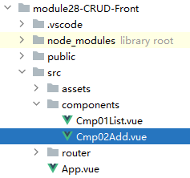

# 一、后端工程搭建环境
## 1、搭建环境
### ①创建module
- 创建module
- 添加web.xml
- 删除index.jsp
- 添加Tomcat 10依赖

<br/>

### ②导入jar包
- commons-dbutils-1.7.jar
- druid-1.1.21.jar
- mysql-connector-java-8.0.25.jar
- gson-2.2.4.jar

<br/>

### ③jdbc.properties
```properties
url=jdbc:mysql://localhost:3306/db_demo230628?serverTimezone=Asia/Shanghai
username=root
password=atguigu
initialSize=3
maxActive=5
maxWait=2000
driverClassName=com.mysql.cj.jdbc.Driver
```

<br/>

### ④复制代码


<br/>

- 删除ServletThymeleafParent
- 删除Servlet01Soldier
- 删除Servlet02Index
- 删除Servlet03User
- 删除FilterLoginCheck

<br/>

### ⑤web.xml
```xml
<filter>  
    <filter-name>filterTransaction</filter-name>  
    <filter-class>com.atguigu.demo.filter.FilterTransaction</filter-class>  
</filter>  
<filter-mapping>  
    <filter-name>filterTransaction</filter-name>  
    <url-pattern>/*</url-pattern>  
</filter-mapping>  
  
<listener>  
    <listener-class>com.atguigu.demo.listener.ListenerDataSourceInit</listener-class>  
</listener>  
  
<context-param>  
    <param-name>jdbcConfigLocation</param-name>  
    <param-value>jdbc.properties</param-value>  
</context-param>
```

### ⑥加入工具类
#### 【1】Result
```java  
/**  
 * 开发一个通用的类型，从而保证项目中每个模块、每个功能、每个请求返回的数据，结构都是一样的  
 */  
public class Result<T> {  
  
    // 声明常量，表示请求处理成功这个状态  
    public static final String SUCCESS = "SUCCESS";  
  
    // 声明常量，表示请求处理失败这个状态  
    public static final String FAILED = "FAILED";  
  
    // 请求处理的结果，是成功还是失败  
    private String processResult;  
  
    // 查询结果  
    private T queryResultData;  
  
    // 请求处理失败时，错误消息  
    private String errorMessage;  
  
    /**  
     * 工具方法：处理请求成功，没有查询结果需要返回  
     * @return  
     */    public static Result ok() {  
  
        Result result = new Result();  
  
        result.setProcessResult(SUCCESS);  
  
        return result;  
    }  
  
    /**  
     * 工具方法：处理请求成功，并且有查询结果需要封装  
     * @param queryResultData  
     * @return  
     * @param <T>  
     */  
    public static <T> Result<T> ok(T queryResultData) {  
  
        Result result = new Result();  
  
        result.setProcessResult(SUCCESS);  
        result.setQueryResultData(queryResultData);  
  
        return result;  
    }  
  
    /**  
     * 工具方法：处理请求失败  
     * @param errorMessage  
     * @return  
     */
    public static Result failed(String errorMessage) {
  
        Result result = new Result();
    
		result.setProcessResult(FAILED);
        result.setErrorMessage(errorMessage);
  
        return result;  
    }  
  
    public String getProcessResult() {  
        return processResult;  
    }  
  
    public void setProcessResult(String processResult) {  
        this.processResult = processResult;  
    }  
  
    public T getQueryResultData() {  
        return queryResultData;  
    }  
  
    public void setQueryResultData(T queryResultData) {  
        this.queryResultData = queryResultData;  
    }  
  
    public String getErrorMessage() {  
        return errorMessage;  
    }  
  
    public void setErrorMessage(String errorMessage) {  
        this.errorMessage = errorMessage;  
    }  
  
    @Override  
    public String toString() {  
        return "Result{" +  
                "processResult='" + processResult + '\'' +  
                ", queryResultData=" + queryResultData +  
                ", errorMessage='" + errorMessage + '\'' +  
                '}';  
    }  
  
    public Result(String processResult, T queryResultData, String errorMessage) {  
        this.processResult = processResult;  
        this.queryResultData = queryResultData;  
        this.errorMessage = errorMessage;  
    }  
  
    public Result() {  
    }  
}
```

<br/>

#### 【2】JSONUtils
```java  
import com.google.gson.Gson;  
import jakarta.servlet.http.HttpServletRequest;  
import jakarta.servlet.http.HttpServletResponse;  
  
import java.io.BufferedReader;  
import java.io.IOException;  
  
public class JSONUtils {  
  
    /**  
     * 当请求体是 JSON 格式时，使用这个工具方法，把请求体转换为 Java 类型  
     * @param request  
     * @param clazz  
     * @return  
     * @param <T>  
     */  
    public static <T> T readRequestBody(HttpServletRequest request, Class<T> clazz) {  
  
        // 0、判空保护  
        if (request == null || clazz == null) {  
            throw new RuntimeException("request或clazz对象不能为空！");  
        }  
  
        try {  
            // 1、通过请求对象获取字符输入流  
            BufferedReader reader = request.getReader();  
  
            // 2、创建 stringBuilder 对象  
            StringBuilder stringBuilder = new StringBuilder();  
  
            // 3、声明变量，接收读取到的每一行  
            String line = null;  
  
            // 4、读取请求体  
            while ((line = reader.readLine()) != null) {  
                stringBuilder.append(line);  
            }  
  
            // 5、把 StringBuffer 转换为 String            
			String requestBody = stringBuilder.toString();  
  
            // 6、创建 Gson 对象  
            Gson gson = new Gson();  
  
            // 7、把 JSON 字符串解析为 Java 对象  
            T t = gson.fromJson(requestBody, clazz);  
  
            // 8、返回解析得到的 Java 对象  
            return t;  
  
        } catch (IOException e) {  
            throw new RuntimeException(e);  
        }  
    }  
  
    /**  
     * 每一次返回响应时，Servlet 方法只需要创建 Result 对象即可，当前方法负责把 Result 对象转换为 JSON  
     * 然后作为响应体返回  
     * @param result  
     * @param response  
     */  
    public static void generateResponseBody(Result result, HttpServletResponse response) {  
  
        // 0、判空保护  
        if (result == null || response == null) {  
            throw new RuntimeException("result或response对象不能为空！");  
        }  
  
        try {  
            // 1、给响应体设置内容类型  
            response.setContentType("application/json;charset=UTF-8");  
  
            // 2、把 Result 对象转换为 JSON 字符串  
            Gson gson = new Gson();  
            String responseBody = gson.toJson(result);  
  
            // 3、返回响应体  
            response.getWriter().write(responseBody);  
        } catch (IOException e) {  
            throw new RuntimeException(e);  
        }  
  
    }  
  
}
```

<br/>

## 2、创建Servlet
### ①Java代码
```java
public class SoldierServlet extends ServletParent {  
  
}
```

<br/>

### ②web.xml配置
```xml
<servlet>  
    <servlet-name>SoldierServlet</servlet-name>  
    <servlet-class>com.atguigu.demo.servlet.model.SoldierServlet</servlet-class>  
</servlet>  
<servlet-mapping>  
    <servlet-name>SoldierServlet</servlet-name>  
    <url-pattern>/soldier/*</url-pattern>  
</servlet-mapping>
```

<br/>

# 二、前端工程搭建环境
## 1、创建工程
```bash
npm create vite
cd 工程目录
npm install
npm install vue-router@4.3.0
npm install axios@1.5.0
npm install element-plus@2.3.14
```

<br/>

ElementPlus网址：https://element-plus.gitee.io

<br/>

## 2、初步配置
### ①路由规则
- 创建router.js文件
- 创建路由对象

<br/>

### ②main.js
```javascript
import { createApp } from 'vue'
import App from './App.vue'
// import './style.css'

// 导入路由规则
import router from './router/router'

// 导入 ElementPlus 组件库
import ElementPlus from 'element-plus'
import 'element-plus/dist/index.css'

// 应用路由规则：use(router)
// 应用组件库：use(ElementPlus)
createApp(App).use(router).use(ElementPlus).mount('#app')
```

<br/>

### ③vite.config.js
```javascript
import { defineConfig } from 'vite'
import vue from '@vitejs/plugin-vue'

// https://vitejs.dev/config/
export default defineConfig({
  plugins: [vue()],
  server: {
    proxy: {
      "/api": {
        target: 'http://localhost:8080',
        rewrite: (path) => path.replace(/^\/api/, ''),
      }
    }
  }
})
```

<br/>

# 三、显示列表功能
## 1、创建组件


<br/>

```html
<template>  
  
</template>  
  
<script>  
export default {  
  name: "Cmp01Home"  
}  
</script>  
  
<style scoped>  
  
</style>
```

<br/>

## 2、配置路由规则
所在文件：src/router/router.js

```javascript
// 路由规则  
"routes": [  
    {  
        "path":"/",  
        "component":Cmp01Home  
    }  
]
```

<br/>

## 3、编写超链接
所在文件：App.vue

```html
<template>
  <div>
    <router-link to="/">首页</router-link>
    <router-view></router-view>
  </div>
</template>
```

<br/>

## 4、开发组件代码
### ①思路
- 加载数据的方法应该独立出来，原因是下面两个场景都需要重新加载数据
	- 当前组件onMounted生命周期环节
	- 删除成功之后
- 使用ref()封装响应式数据，对应服务器返回的List数据
	- 接收服务器端查询结果
	- 渲染页面
- 使用ElementPlus显示数据表格
- 加载数据成功后，使用ElementPlus显示友好提示

<br/>

### ②封装响应式数据
作用：接收服务器返回的List数据
```javascript
import {ref} from "vue";  
  
// 封装响应式数据，被包装的数据是一个数组  
let soldierList = ref([]);
```

<br/>

### ③封装数据加载方法
```javascript
// 声明一个专门的方法，用来向服务器索取列表数据  
let loadSoldierList = ()=>{  
  // 发送 Ajax 请求  
  axios({  
    "url":"/api/demo/soldier/showList"  
  }).then((response)=>{  
    // 我们要求后端所有返回的数据都符合 Result 的数据结构  
    // response.data 是响应体，对应 Result 的数据结构  
    // response.data.processResult 就是成功或失败  
    if (response.data.processResult == "SUCCESS") {  
      // 弹出友好提示：加载数据成功  
      ElMessage({  
        message: '加载列表成功！',  
        type: 'success',  
      });  
  
      // response.data.queryResultData 就是查询结果数据  
      soldierList.value = response.data.queryResultData;  
  
      console.log(response.data.queryResultData);  
    }  
  
    if (response.data.processResult == "FAILED") {  
      // 弹出友好提示：加载数据失败  
      ElMessage.error(response.data.errorMessage);  
    }  
  
  });  
};
```

<br/>

### ④在onMounted环节加载数据
```javascript
// 页面初始化时加载数据：使用 Vue 生命周期的 onMounted 环境  
onMounted(()=>{  
  loadSoldierList();  
});
```

<br/>

### ⑤渲染页面
```html
<template>
  <div>
    <el-table :data="soldierList" border height="600" stripe style="width: 100%">
      <!-- ElementPlus 会自动遍历集合 -->
      <!-- 遍历集合得到的每一个对象通过 prop 指定的属性名访问属性值 -->
      <!-- label 属性设置表头的文字 -->
      <el-table-column prop="soldierId" label="士兵编号" width="180"/>
      <el-table-column prop="soldierName" label="士兵姓名" width="180"/>
      <el-table-column prop="soldierSalary" label="士兵工资"/>
      <el-table-column prop="soldierGender" label="士兵性别"/>
      <el-table-column label="操作">
        <template #default="scope">
          <el-button type="danger" size="large" @click="doRemove(scope.row)">删除</el-button>
        </template>
      </el-table-column>
    </el-table>
  </div>
</template>
```

## 5、后端代码
```java
public class SoldierServlet extends ServletPathParent {  
  
    private SoldierService soldierService = new SoldierServiceImpl();  
  
    protected void showList(HttpServletRequest request, HttpServletResponse response) throws ServletException, IOException {  
        try {  
            System.out.println(10/0);  
  
            // 1、调用 Service 方法查询全部数据  
            List<Soldier> soldierList = soldierService.getAllList();  
  
            // 2、封装一个处理请求成功的 Result 对象  
            Result<List<Soldier>> result = Result.ok(soldierList);  
  
            // 3、通过工具方法返回响应  
            JSONUtils.generateResponseBody(result, response);  
        } catch (Exception e) {  
  
            // 4、封装一个处理请求失败的 Result 对象  
            Result result = Result.failed(e.getMessage());  
  
            // 5、通过工具方法返回响应  
            JSONUtils.generateResponseBody(result, response);  
        }
    }  
}
```

<br/>

# 四、删除功能
### ①声明删除按钮单击响应函数
```javascript
// 点击删除按钮的单击响应函数  
// index 参数：当前行在 soldierList 中的下标  
// row 参数：当前行要显示的数据，可以直接通过属性名访问实体类对象中的属性值  
let handleDelete = (index, row) => {  
  
  // 获取当前删除按钮所在行的 soldierName 和 soldierId  let soldierName = row.soldierName;  
  let soldierId = row.soldierId;  
  
  // 弹出确认框  
  // 细节 1：ElMessageBox 需要导入才能使用  
  // 细节 2：ElMessageBox 调用 confirm() 方法弹出确认框  
  ElMessageBox.confirm(  
      // 细节 3：confirm() 方法的第一个参数主要要显示的提示信息  
      `您真的要删除${soldierName}这条记录吗？`,  
  
      // 细节 4：confirm() 方法的第二个参数设置确认框的左上角标题  
      'Warning',  
  
      // 细节 5：confirm() 方法的第三个参数设置按钮上显示的文字和图标类型  
      {  
        confirmButtonText: '我想好了，删！',  
        cancelButtonText: '不不，我再想想...',  
        type: 'warning',  
      }  
  )  
  // 细节 6：用户点击确认按钮后调用 then() 函数中设置的回调函数  
  .then(() => {  
  
    // ★发送 Ajax 请求，执行数据删除  
    axios({  
      "url":"/api/demo/soldier/remove",  
      "params":{  
        "soldierId":soldierId  
      }  
    }).then((response)=>{  
      if (response.data.processResult == "SUCCESS") {  
        // 删除成功之后，弹出提示信息  
        ElMessage({  
          type: 'success',  
          message: '删除成功！',  
        });  
  
        // 重新加载列表数据  
        loadSoldierList();  
      }  
  
      if (response.data.processResult == "FAILED") {  
        ElMessage.error(response.data.errorMessage);  
      }  
    });
  })  
  
  // 细节 7：用户点击取消按钮后调用 catch() 函数中设置的回调函数  
  .catch(() => {  
    ElMessage({  
      type: 'info',  
      message: '行，您再想想！',  
    })  
  })  
};
```

<br/>

### ②后端代码
```java
protected void remove(HttpServletRequest request, HttpServletResponse response) throws ServletException, IOException {  
    try {  
        // 1、从请求参数中获取 soldierId        String soldierId = request.getParameter("soldierId");  
  
        // 2、调用 Service 方法执行删除  
        soldierService.removeById(soldierId);  
  
        // 3、封装 Result 对象代表操作成功  
        Result result = Result.ok();  
  
        // 4、返回响应  
        JSONUtils.generateResponseBody(result, response);  
    } catch (Exception e) {  
        // 5、封装 Result 对象代表操作失败  
        Result result = Result.failed(e.getMessage());  
  
        // 6、返回响应  
        JSONUtils.generateResponseBody(result, response);  
  
    }  
}
```

<br/>

### ③遗留问题


<br/>

过去测试事务功能的时候，故意把保存日志的 SQL 改错了，现在我们需要改回来<br/>

异常信息：
> Unknown column 'log_2_content' in 'field list' Query: insert into t_log(log_2_content, log_time) values(?,?) Parameters: [removeById 方法参数=9, 2023-08-21 10:39:43]

<br/>

```java
@Override  
public void insertLog(MyDemoLog myDemoLog) {  
    String sql = "insert into t_log(log_content, log_time) values(?,?)";  
    commonUpdate(sql, myDemoLog.getLogContent(), myDemoLog.getLogTime());  
}
```

<br/>

# 五、显示新增的表单
## 1、新增功能的总体思路
- 显示新增的表单
- 提交新增的表单
	- 执行保存
	- 回到列表页面（组件）

<br/>

## 2、创建表单组件


<br/>

```html
<template>  
  
</template>  
  
<script setup>  
  
</script>  
  
<style scoped>  
  
</style>
```

<br/>

## 3、显示表单
```html
<template>  
  <!-- :model 属性：指定和表单进行双向绑定的数据 -->  
  <el-form :model="soldier" label-width="120px">  
    <el-form-item label="Soldier Name">  
      <!-- 生成单行文本框，在 v-model 属性中指定具体的响应式渲染属性 -->  
      <el-input v-model="soldier.soldierName" />  
    </el-form-item>  
    <el-form-item label="Soldier Salary">  
      <!-- 生成单行文本框，在 v-model 属性中指定具体的响应式渲染属性 -->  
      <el-input v-model="soldier.soldierSalary" />  
    </el-form-item>  
    <el-form-item label="Soldier Gender">  
      <el-radio-group v-model="soldier.soldierGender">  
        <!-- 生成单选框，label 属性设置的是将来提交给服务器的值 -->  
        <!-- 文本标签体是显示给用户看的数据 -->  
        <el-radio label="female">女士</el-radio>  
        <el-radio label="male">男士</el-radio>  
      </el-radio-group>  
    </el-form-item>  
    <el-form-item>  
      <el-button type="primary" @click="onSubmit">Create</el-button>  
      <el-button>Cancel</el-button>  
    </el-form-item>  
  </el-form>  
</template>  
  
<script setup>  
import { reactive } from 'vue'  
  
// do not use same name with ref  
const soldier = reactive({  
  "soldierName":"",  
  "soldierSalary":"",  
  "soldierGender":""  
})  
  
const onSubmit = () => {  
  console.log('submit!')  
}  
</script>
```

<br/>

## 4、配置路由规则


<br/>

```javascript
import Cmp02Add from "../components/Cmp02Add.vue";

// ……

{  
    "path":"/add",  
    "component":Cmp02Add  
}

```

<br/>

## 5、在App.vue编写超链接
```html
<router-link to="/add">新增记录</router-link>&nbsp;
```

<br/>

# 六、提交新增表单
## 1、发送Ajax请求
```javascript
import axios from "axios";

// ...

const onSubmit = () => {  
  axios({  
    "url":"/api/demo/soldier/saveSoldier",  
    "method":"post",  
    "data": soldier  
  });  
}
```

<br/>

## 2、后端执行保存
```java
protected void saveSoldier(HttpServletRequest request, HttpServletResponse response) throws ServletException, IOException {  
    try {  
        // 1、读取 JSON 格式的请求体并封装为 Soldier 类型  
        Soldier soldier = JSONUtils.readRequestBody(request, Soldier.class);  
  
        // 2、调用 Service 方法执行保存  
        soldierService.saveSoldier(soldier);  
          
        // 3、封装 Result 对象代表操作成功  
        Result result = Result.ok();  
  
        // 4、返回响应  
        JSONUtils.generateResponseBody(result, response);  
    } catch (Exception e) {  
        // 5、封装 Result 对象代表操作失败  
        Result result = Result.failed(e.getMessage());  
  
        // 6、返回响应  
        JSONUtils.generateResponseBody(result, response);  
  
    }  
}
```

<br/>

## 3、保存完成的后续处理
```javascript
axios({  
  "url":"/api/demo/soldier/saveSoldier",  
  "method":"post",  
  "data": soldier  
}).then((response)=>{  
  if (response.data.processResult == "SUCCESS") {  
  
    // 弹出提示信息  
    ElMessage({  
      "type":"success",  
      "message":"数据保存成功！"  
    });  
  
    // 回到列表页面  
    router.push("/");  
  
  }  
  
  if (response.data.processResult == "FAILED") {  
    ElMessage.error(response.data.errorMessage);  
  }  
});
```

# 七、更新功能
## 1、更新功能总体思路
- 显示更新表单
	- 创建组件
	- 编写路由规则
	- 在Edit按钮的单击响应函数中，实现路由跳转
	- 获取请求参数：soldierId
	- 根据soldierId到后端查询对应的Soldier对象
	- 拿到Soldier对象用来回显表单
- 提交更新表单
	- 前端发送Ajax请求
	- 后端执行更新操作
	- 前端判断操作是否成功
		- 成功：
			- 显示提示信息
			- 跳转回列表页面
		- 失败：显示提示信息

<br/>

## 2、跳转到更新页面
在Cmp01List.vue组件中，Edit按钮的单击响应函数里面：<br/>

```javascript
import {useRouter} from "vue-router";  
  
let router = useRouter();

// ...

// 为 Edit 按钮绑定单击响应函数  
let handleEdit = (index, row) => {  
  // 1、获取 soldierId  let soldierId = row.soldierId;  
  
  // 2、执行路由跳转  
  router.push({  
    "path":"/edit",  
    "query":{  
      "soldierId":soldierId  
    }  
  })  
};
```

<br/>

## 3、编写路由规则


<br/>

```javascript
import Cmp03Edit from "../components/Cmp03Edit.vue";

// ...

{  
    "path":"/edit",  
    "component":Cmp03Edit  
}
```

<br/>
## 4、创建表单组件
把Cmp02Add.vue文件复制一份：<br/>


<br/>

```javascript
// =================准备工作=================  
import {onMounted, ref} from 'vue'  
import axios from "axios";  
import {ElMessage} from "element-plus";  
import {useRouter,useRoute} from "vue-router";  
  
// 调用 useRouter() 方法得到 router 对象，用来实现页面跳转  
let router = useRouter();  
  
// 从请求参数中获取 soldierIdlet routeParam = useRoute();  
let soldierId = routeParam.query.soldierId;  
  
// do not use same name with ref  
const soldier = ref({  
  "soldierId":soldierId,  
  "soldierName":"",  
  "soldierSalary":"",  
  "soldierGender":""  
})  
  
// =================根据 soldierId 把用来回显表单的数据查询出来，渲染表单=================  
// 在页面初始化时向后端发送请求，查询 Soldier 对象  
onMounted(()=>{  
  axios({  
    "url":"/api/demo/soldier/getSoldierById",  
    "method":"get",  
    "params":{  
      "soldierId":soldierId  
    }  
  }).then((response)=>{  
    if (response.data.processResult == "SUCCESS") {  
      // 把服务器端返回的数据，复制给双向绑定数据的 value 属性，渲染表单，显示数据  
      soldier.value = response.data.queryResultData;  
    }  
  
    if (response.data.processResult == "FAILED") {  
      ElMessage.error(response.data.errorMessage);  
    }  
  });  
});  
  
// =================提交表单，执行更新操作=================  
const onSubmit = () => {  
  axios({  
    "url":"/api/demo/soldier/updateSoldier",  
    "method":"post",  
    "data": soldier.value  
  }).then((response)=>{  
    if (response.data.processResult == "SUCCESS") {  
  
      // 弹出提示信息  
      ElMessage({  
        "type":"success",  
        "message":"数据更新成功！"  
      });  
  
      // 回到列表页面  
      router.push("/");  
  
    }  
  
    if (response.data.processResult == "FAILED") {  
      ElMessage.error(response.data.errorMessage);  
    }  
  });  
}
```

<br/>

## 5、后端代码
```java
protected void getSoldierById(HttpServletRequest request, HttpServletResponse response) throws ServletException, IOException {  
    try {  
        // 1、从请求参数中获取 soldierId        String soldierId = request.getParameter("soldierId");  
  
        // 2、调用 Service 方法查询 Soldier 对象  
        Soldier soldier = soldierService.getSoldierById(soldierId);  
  
        // 3、封装 Result 对象代表操作成功  
        Result result = Result.ok(soldier);  
  
        // 4、返回响应  
        JSONUtils.generateResponseBody(result, response);  
    } catch (Exception e) {  
        // 5、封装 Result 对象代表操作失败  
        Result result = Result.failed(e.getMessage());  
  
        // 6、返回响应  
        JSONUtils.generateResponseBody(result, response);  
  
    }  
}  
  
protected void updateSoldier(HttpServletRequest request, HttpServletResponse response) throws ServletException, IOException {  
    try {  
        // 1、读取 JSON 格式的请求体并封装为 Soldier 类型  
        Soldier soldier = JSONUtils.readRequestBody(request, Soldier.class);  
  
        // 2、调用 Service 方法执行更新  
        soldierService.updateSoldier(soldier);  
  
        // 3、封装 Result 对象代表操作成功  
        Result result = Result.ok();  
  
        // 4、返回响应  
        JSONUtils.generateResponseBody(result, response);  
    } catch (Exception e) {  
        // 5、封装 Result 对象代表操作失败  
        Result result = Result.failed(e.getMessage());  
  
        // 6、返回响应  
        JSONUtils.generateResponseBody(result, response);  
  
    }  
}
```
