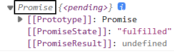
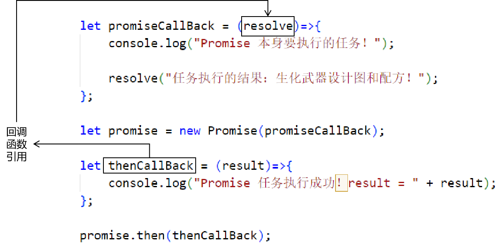
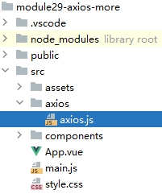
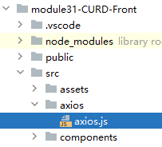
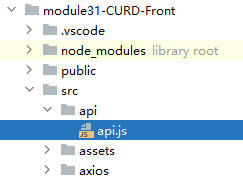

# 一、提出问题
## 1、回调地狱
下面代码回调函数层层嵌套，太繁复了：<br/>

```javascript
let handleDelete = (index, row) => {  
  let soldierName = row.soldierName;  
  ElMessageBox.confirm(  
      `您真的要删除${soldierName}这条记录吗？`,  
      'Warning',  
      {  
        confirmButtonText: 'OK',  
        cancelButtonText: 'Cancel',  
        type: 'warning',  
      }  
  ).then(() => {  
    axios({  
      "url": "/api/demo/soldier/remove",  
      "params": {  
        "soldierId": row.soldierId  
      }  
    }).then((response) => {  
      // 我们要求后端所有返回的数据都符合 Result 的数据结构  
      // response.data 是响应体，对应 Result 的数据结构  
      // response.data.processResult 就是成功或失败  
      if (response.data.processResult == "SUCCESS") {  
        // 弹出友好提示：加载数据成功  
        ElMessage({  
          message: '删除记录成功！',  
          type: 'success',  
        });  
  
        loadSoldierList();  
      }  
  
      if (response.data.processResult == "FAILED") {  
        // 弹出友好提示：删除记录失败，原因是：XXX  
        ElMessage.error("删除记录失败，原因是：" + response.data.errorMessage);  
      }  
    });  
  }).catch(() => {  
    ElMessage({  
      type: 'info',  
      message: '好嘞，你再想想！',  
    })  
  })  
};
```

<br/>

解决办法：探索axios底层原理，寻找解决办法

<br/>

## 2、axios()返回值



<br/>

<span style="color:blue;font-weight:bold;">axios底层原理</span>=<span style="color:blue;font-weight:bold;">JavaScript原生Ajax</span>+<span style="color:blue;font-weight:bold;">Promise</span>

<br/>

# 二、Promise
## 1、简介
Promise是ES6新语法标准的一部分，相当于Java语言中的Thread。也就是说：Promise可以用来在JavaScript中开发多线程<br/>

## 2、HelloWorld
```javascript
// 1、“主线程”每隔1秒打印信息
// setInterval(回调函数,以毫秒为单位的时间间隔);
setInterval(() => {

    console.log("-----------主线程打印信息-----------" + Math.trunc(Math.random()*100));

}, 1000);

// 2、创建 Promise 对象执行类似操作
new Promise(()=>{

    // 线程内要执行的操作
    setInterval(() => {

        console.log("***************子线程打印信息***************" + Math.trunc(Math.random()*100));

    }, 1000);

});
```

<br/>

## 3、then()方法
### ①代码
```javascript
// 1、创建 Promise 对象
let promise = new Promise((resolve)=>{

    // Promise 对象要执行的任务
    console.log("Promise 本身要执行的任务！");

    // 调用 resolve 代表的方法，在参数位置传入任务执行的结果
    resolve("任务执行的结果：生化武器设计图和配方！");
});

// 2、Promise执行任务成功之后，如果我们需要再做一个后续操作，那么就可以封装到 then() 方法中
promise.then((result)=>{
    console.log("Promise 任务执行成功！result = " + result);
});
```

<br/>

### ②分析
#### [1]为了便于分析调整代码
```javascript
let promiseCallBack = (resolve)=>{
    console.log("Promise 本身要执行的任务！");
    resolve("任务执行的结果：生化武器设计图和配方！");
};

let promise = new Promise(promiseCallBack);

let thenCallBack = (result)=>{
    console.log("Promise 任务执行成功！result = " + result);
};

promise.then(thenCallBack);
```

<br/>

#### [2]result是怎么传的？


<br/>

#### [3]回调函数的设定


<br/>

## 4、catch()方法
```javascript
// 1、创建 Promise 对象

let promise = new Promise((resolve, reject)=>{
    console.log("Promise 子线程任务*************");
    let flag = false;
    if(flag) {
        resolve("子线程任务执行结果！●●●");
    } else {
        reject("出错了！救命！○○○");
    }
});

// 2、指定子线程任务成功后要做的操作
promise.then((result)=>{
    console.log("Promise 子线程任务*************成功了！result = " + result);
});

// 3、指定子线程任务失败后要做的操作
promise.catch((errorMessage)=>{
    console.log("Promise 子线程任务-------------失败了！errorMessage = " + errorMessage);
});
```

<br/>

## 5、Promise对象的三个状态【了解】
### ①介绍
|状态|含义|
|---|---|
|pending|子线程任务正在执行、处理的过程中|
|fulfilled|子线程任务成功处理完成|
|rejected|子线程任务处理失败|

<br/>

### ②测试

如果看不到效果尝试切换不同浏览器。

```javascript
// 1、创建 Promise 对象
let promise = new Promise((resolve, reject)=>{
    setTimeout(() => {
        console.log("子线程任务正在执行……");
        let flag = false;
        if(flag) {
            resolve("子线程任务执行结果！●●●");
        } else {
            reject("出错了！救命！○○○");
        }
    }, 5000);
});

// 打印内容：Promise { <state>: "pending" }
// 说明 Promise 对象的状态是：pending
// 表示任务正在执行
console.log(promise);

// 2、指定子线程任务成功后要做的操作
promise.then((result)=>{
    // 打印内容：Promise { <state>: "fulfilled", <value>: "子线程任务执行结果！●●●" }
    // 说明 Promise 对象的状态是：fulfilled
    // 表示任务已经执行完成
    console.log(promise);
});

// 3、指定子线程任务失败后要做的操作
promise.catch((errorMessage)=>{
    // 打印内容：Promise { <state>: "rejected", <reason>: "出错了！救命！○○○" }
    // 说明 Promise 对象的状态是：rejected
    // 表示任务失败了
    console.log(promise);
});
```

<br/>

三个状态是不可逆的：
- pending进入fulfilled就不能回到pending了。
- pending进入rejected就不能回到pending了。

<br/>

## 6、解决回调地狱问题
### ①基本思路
- 问题产生的原因：就是因为回调函数嵌套的层次太多，导致代码可读性下降，代码编写的顺序不是执行的顺序
- 问题解决的思路：不让回调函数进行嵌套，让它们按顺序编写和执行

<br/>

### ②await关键词
- 关键：await就是用来修饰一个Promise对象，然后直接获取任务成功后的结果

<br/>

```html
<body>  
  
    <button id="btn01">没有使用 await 关键词</button>  
    <button id="btn02">使用了 await 关键词</button>  
  
</body>  
<script>  
    document.getElementById("btn01").onclick = ()=>{  
        // ============没有使用 await 关键词============  
        // 1、创建 Promise 对象  
        let promise = new Promise((resolve, reject)=>{  
            let i = 10;  
            let j = 20;  
            let result = i + j;  
            resolve(result);  
        });  
  
        // 2、在 then() 方法中设定成功后的逻辑  
        promise.then((taskResult)=>{  
            console.log("使用await关键词之前：" +taskResult);  
        });  
    };  
  
    // ============使用了 await 关键词============  
    document.getElementById("btn02").onclick = async ()=>{  
        // await关键词的作用：直接获取 Promise 对象中封装的任务的结果  
        // 独立的功能模块：1  
        let taskResult = await new Promise((resolve, reject)=>{  
            let i = 10;  
            let j = 20;  
            let result = i + j;  
            resolve(result);  
        });  
  
        console.log("使用await关键词之后：" + taskResult);  
  
        // 独立的功能模块：2  
        taskResult = await new Promise((resolve, reject)=>{  
            let i = 10;  
            let j = 20;  
            let result = i + j;  
            resolve(result);  
        });  
  
        console.log("使用await关键词之后：" + taskResult);  
  
        // 独立的功能模块：3  
        taskResult = await new Promise((resolve, reject)=>{  
            let i = 10;  
            let j = 20;  
            let result = i + j;  
            resolve(result);  
        });  
  
        console.log("使用await关键词之后：" + taskResult);  
    };  
  
</script>
```

<br/>

### ③关键词语法说明
- await：就是为了直接拿到Promise对象执行任务成功后的结果
	- await右侧的表达式一般为一个Promise对象，但是也可以是一个其他值
	- 如果右侧表达式是Promise对象，await返回的是Promise主体操作成功的值
	- 如果右侧表达式不是Promise类型的对象，则直接返回该值本身
	- await会等右边的Promise对象把主体操作执行完，然后再获取结果，后续代码也会等待await的执行完成之后，再继续执行（本质上，是把异步操作，宏观上变成同步操作了）
	- await必须在async函数中，但是async函数中可以没有await
	- 如果await右边的Promise失败了，就会抛出异常，此时需要通过 try ... catch 捕获处理
- async：当一个函数内使用了await，那么这个函数必须使用async声明
	- async标识函数后，async函数的返回值会变成一个Promise对象
	- 如果函数内部返回的数据是一个非Promise对象，async函数的结果会返回一个成功状态的Promise对象
	- 如果函数内部返回的是一个Promise对象，则async函数返回的状态与结果由该对象决定
	- 如果函数内部抛出的是一个异常，则async函数返回的是一个失败的Promise对象

<br/>

## 7、axios()代码重构
```javascript
let handleDelete = async (index, row) => {  
  
  // 获取当前删除按钮所在行的 soldierName 和 soldierId  let soldierName = row.soldierName;  
  let soldierId = row.soldierId;  
  
  let confirmResult = await ElMessageBox.confirm(  
      `您真的要删除${soldierName}这条记录吗？`,  
      'Warning',  
      {  
        confirmButtonText: '我想好了，删！',  
        cancelButtonText: '不不，我再想想...',  
        type: 'warning',  
      }  
  ).then(() => true).catch(() => false);  
  
  if (confirmResult) {  
    // ★发送 Ajax 请求，执行数据删除  
    let response = await axios({  
      "url": "/api/demo/soldier/remove",  
      "params": { "soldierId": soldierId }  
    });  
  
    if (response.data.processResult == "SUCCESS") {  
      // 删除成功之后，弹出提示信息  
      ElMessage({type: 'success', message: '删除成功！',});  
  
      // 重新加载列表数据  
      loadSoldierList();  
    }  
  
    if (response.data.processResult == "FAILED") {  
      ElMessage.error(response.data.errorMessage);  
    }  
  
  } else {  
    ElMessage({type: 'info', message: '行，您再想想！',});  
  }  
};
```

<br/>

# 三、axios拦截器
## 1、简介
在前端这边，axios发送Ajax请求前、后可以通过拦截器执行我们指定的操作<br/>

axios拦截器和路由守卫有啥区别？还有Filter过滤器呢？<br/>

|&nbsp;|工作位置|拦截目标|
|---|---|---|
|axios拦截器|前端|Ajax请求|
|路由守卫|前端|前往组件的路由请求|
|Filter过滤器|后端|前端发送给后端的请求|


<br/>

## 2、基本用法
- axios就是我们发送Ajax请求时调用的axios()函数
- 之所以能这么做是因为JavaScript语言中，函数就是一种特殊的对象
- 此时把axios当对象看待，访问它的interceptors属性，得到拦截器对象
- 再进一步访问拦截器对象的两个属性：
	- request：调用use()方法设置请求发送前执行的操作
		- use()方法参数一：传入一个回调函数，封装请求发送前执行的操作，接收config对象（对请求进行配置，例如：设置请求消息头）
		- use()方法参数二：传入一个回调函数，封装请求发送失败后执行的操作，接收error对象（代表当前发生的错误）
	- response：调用use()方法设置收到响应之后执行的操作
		- use()方法参数一：传入一个回调函数，服务器端处理请求成功后执行（响应状态码2XX），回调函数接收response对象，拿到当前响应
		- use()方法参数二：传入一个回调函数，服务器端处理请求失败后执行（响应状态码不是2开头的那些），回调函数接收error对象，拿到封装了错误信息的对象

<br/>

Promise.reject(error)：
- Promise直接调用reject()函数，表示跳过创建对象、执行子线程任务...环节，直接返回一个失败状态的Promise对象
- Promise.reject(error)整体表示把现在得到的error对象封装到一个失败状态的Promise对象中

<br/>

```javascript
// 添加请求拦截器，在请求发送之前执行  
axios.interceptors.request.use(  
    function (config) {  
      // 在发送请求之前做些什么  
      console.log("[axios interceptor]before request normal")  
      return config;  
    },  
    function (error) {  
      // 对请求错误做些什么  
      console.log("[axios interceptor]before request error")  
      return Promise.reject(error);  
    }  
);  
// 添加响应拦截器，在数据响应回来之后执行  
axios.interceptors.response.use(  
    function (response) {  
      // 2xx 范围内的状态码都会触发该函数。  
      // 对响应数据做点什么  
      console.log("[axios interceptor]after response success");  
      return response;  
    },  
    function (error) {  
      // 超出 2xx 范围的状态码都会触发该函数。  
      // 对响应错误做点什么  
      console.log("[axios interceptor]after response error");  
      return Promise.reject(error);  
    }  
);
```

<br/>

## 3、功能抽取
由于拦截器一旦设定，就是在全局范围内针对所有请求，所以通常都会提取到外部来使用<br/>

### ①创建axios.js


<br/>

### ②编写通用代码
- 创建axios实例
- 设置请求拦截器
	- 之前做什么
	- 失败做什么
- 设置响应拦截器
	- 成功做什么
	- 失败做什么

<br/>

```javascript
// 导入 axios 备用  
import axios from "axios";  
  
// 创建 axios 对象实例  
var axiosInstance = axios.create({  
	// 在全局范围内抽取请求地址的前半截儿（前缀）  
	// baseURL 属性生效就是和具体请求的 URL 地址拼字符串  
	// 只要拼字符串的结果是正确的请求地址即可
    "baseURL": "/api/",  
    "timeout": 10000  
});  
  
// 设定请求拦截器，use() 方法传入两个回调函数  
// 回调函数一：请求发送成功后做什么，可以通过 config 设置请求头  
// 回调函数二：请求发送失败后做什么，可以通过 error 参数获取相关错误信息  
axiosInstance.interceptors.request.use(  
    config => {  
  
        console.log("[axios interceptor]before request success ...");  
  
        // 举例：设置前端能够接受的响应体内容类型  
        config.headers.Accept = "application/json, text/plain, text/html,*/*";  
  
        return config;  
    },  
    error => {  
        console.log("[axios interceptor]before request error ...");  
  
        console.log(error);  
  
        return Promise.reject(error);  
    });  
  
// 设定响应拦截器，use() 方法传入两个回调函数  
// 回调函数一：响应发送成功后做什么，可以通过 response 获取响应数据  
// 回调函数二：响应发送失败后做什么，可以通过 error 参数获取相关错误信息  
axiosInstance.interceptors.response.use(  
    response => {  
        console.log("[axios interceptor]after response success ...");  
        console.log(response);  
        return response;  
    },  
    error => {  
        console.log("[axios interceptor]after response failed ...");  
        console.log(error)  
        return Promise.reject(error);  
    }  
);  
  
// 把 axiosInstance 对象默认导出  
// 此后我们使用 axiosInstance 这个对象发送 Ajax 请求  
export default axiosInstance;
```

<br/>

## 4、抽取后用法
### ①导入axios实例
```javascript
import axiosInstance from "./axios/axios.js";
```

<br/>

### ②发送GET请求
```javascript
let response = 
	await axiosInstance
		.get(`demo/AjaxServlet/test?userName=${userName}&userPwd=${userPwd}`);

console.log(response.data + " ~~~~~~~");
```

<br/>

### ③发送POST请求
```javascript
let response = await axiosInstance.post("demo/AjaxServlet/testPost", {  
  "userName":"tom2023",  
  "userPwd":"123456"  
});

console.log(response.data + " ~~~~~~~");
```

<br/>

### ④考虑失败的情况

其实这部分也可以统一在拦截器中处理，因为我们返回响应已经统一设定为了Result类型，所以可以按照一致的标准统一处理。

```javascript
try {  
  let response = await axiosInstance.post("demo/AjaxServlet/testPost", {  
    "userName": "tom2023",  
    "userPwd": "123456"  
  });  
} catch (e) {  
  return await e;  
}  
console.log(response.data + " ~~~~~~~");
```

<br/>

# 四、重构CRUD demo
## 1、创建新工程
和之前一样<br/>

### ①迁移代码
复制src目录、vite.config.js、package.json<br/>
遇到同名的文件就覆盖<br/>

### ②安装依赖
```bash
npm i
```

<br/>

### ③启动测试
把当前前端工程启动起来，测试目前的状态是否各个功能都正常<br/>

## 2、创建axios.js


<br/>

```javascript
import axios from 'axios';  
  
// 创建 axios 实例  
const axiosInstance = axios.create({  
    "baseURL":"/api",  
    "timeout":10000  
})  
  
// 设定拦截器操作  
// 说明：暂时先以最简单的方式添加拦截器，没有编写任何逻辑  
axiosInstance.interceptors.request.use(config=>config, error=>Promise.reject(error))  
  
axiosInstance.interceptors.response.use(response=>response, error=>Promise.reject(error))  
  
// 导出 axios 实例  
export default axiosInstance
```

<br/>

## 3、重构Ajax代码
### ①思路
- 修改axios的import，现在要导入的axiosInstance
- 修改原来的axios Ajax代码

<br/>

### ②Cmp01List.vue
```javascript
// 修改axios导入
import axiosInstance from "../axios/axios.js"

// ...
// 修改原来的axios Ajax代码
let response = await axiosInstance.get("/soldier/showList")

// ...
let response = await axiosInstance.get(`/soldier/remove?soldierId=${soldierId}`)

```

<br/>

### ③Cmp02Add.vue
```javascript
import axiosInstance from "../axios/axios.js";

// ...

let response = await axiosInstance.post("/soldier/saveSoldier", soldier)
```

<br/>

### ④Cmp03Edit.vue
```javascript
import axiosInstance from "../axios/axios.js"

// ...

let response = await axiosInstance.get(`/soldier/getSoldierById?soldierId=${soldierId}`)

// ...

let response = await axiosInstance.post("/soldier/updateSoldier", soldier.value)
```

## 4、抽取API
### ①说明
- 本操作和axios拦截器无关
- 目标：
	- 把所有特定功能的代码集中到一个文件，统一维护
	- 让各个组件中的代码只负责和控件交互
		- 单击响应事件的绑定
		- 组件的路由跳转
		- 页面渲染

<br/>

### ②创建api.js


<br/>

```javascript
// 声明一个专门的方法，用来向服务器索取列表数据  
import axiosInstance from "../axios/axios.js";  
import {ElMessage, ElMessageBox} from "element-plus";  
  
export const loadSoldierList = async () => {  
    // 发送 Ajax 请求  
    let response = await axiosInstance.get("/soldier/showList")  
  
    // 我们要求后端所有返回的数据都符合 Result 的数据结构  
    // response.data 是响应体，对应 Result 的数据结构  
    // response.data.processResult 就是成功或失败  
    if (response.data.processResult == "SUCCESS") {  
        // 弹出友好提示：加载数据成功  
        ElMessage({message: '加载列表成功！', type: 'success',});  
  
        // response.data.queryResultData 就是查询结果数据  
        return response.data.queryResultData;  
    }  
  
    if (response.data.processResult == "FAILED") {  
        // 弹出友好提示：加载数据失败  
        ElMessage.error(response.data.errorMessage);  
    }  
};  
  
export const doSoldierRemove = async (row)=>{  
  
    // 获取当前删除按钮所在行的 soldierName 和 soldierId    let soldierName = row.soldierName;  
    let soldierId = row.soldierId;  
  
    let confirmResult = await ElMessageBox.confirm(  
        `您真的要删除${soldierName}这条记录吗？`,  
        'Warning',  
        {  
            confirmButtonText: '我想好了，删！~',  
            cancelButtonText: '不不，我再想想...~',  
            type: 'warning',  
        }  
    ).then(() => true).catch(() => false);  
  
    if (!confirmResult) {  
        ElMessage({type: 'info', message: '行，您再想想！',});  
        return false;  
    }  
  
    // ★发送 Ajax 请求，执行数据删除  
    let response = await axiosInstance.get(`/soldier/remove?soldierId=${soldierId}`)  
  
    if (response.data.processResult == "SUCCESS") {  
        // 删除成功之后，弹出提示信息  
        ElMessage({type: 'success', message: '删除成功！',});  
  
        return true;  
    }else{  
        ElMessage.error(response.data.errorMessage);  
        return false;  
    }  
}  
  
export const doSaveSoldier = async (soldier)=>{  
    let response = await axiosInstance.post("/soldier/saveSoldier", soldier)  
  
    if (response.data.processResult == "SUCCESS") {  
  
        // 弹出提示信息  
        ElMessage({"type":"success", "message":"数据保存成功！"});  
  
        return true;  
    }else{  
        ElMessage.error(response.data.errorMessage);  
  
        return false;  
    }  
}  
  
export const getSoldierById = async (soldierId)=>{  
    let response = await axiosInstance.get(`/soldier/getSoldierById?soldierId=${soldierId}`)  
  
    if (response.data.processResult == "SUCCESS") {  
  
        return response.data.queryResultData;  
    }else{  
        ElMessage.error(response.data.errorMessage);  
    }  
}  
  
export const doSoldierUpdate = async (soldier)=>{  
    let response = await axiosInstance.post("/soldier/updateSoldier", soldier)  
  
    if (response.data.processResult == "SUCCESS") {  
        // 弹出提示信息  
        ElMessage({"type":"success", "message":"数据更新成功！"});  
        return true;  
    }else{  
        ElMessage.error(response.data.errorMessage);  
        return false;  
    }  
}
```

<br/>

### ③Cmp01List.vue
```javascript
import {onMounted, ref} from "vue";  
import {useRouter} from "vue-router";  
import * as api from "../api/api.js";  
  
let router = useRouter();  
  
// 封装响应式数据，被包装的数据是一个数组  
let soldierList = ref([]);  
  
// 页面初始化时加载数据：使用 Vue 生命周期的 onMounted 环境  
onMounted(async () => {  
  soldierList.value = await api.loadSoldierList();  
});  
  
// 点击删除按钮的单击响应函数  
// index 参数：当前行在 soldierList 中的下标  
// row 参数：当前行要显示的数据，可以直接通过属性名访问实体类对象中的属性值  
let handleDelete = async (index, row) => {  
  let operationResult = await api.doSoldierRemove(row);  
  if (operationResult) {  
    soldierList.value = await api.loadSoldierList();  
  }  
};  
  
// 为 Edit 按钮绑定单击响应函数  
let handleEdit = (index, row) => {  
  // 1、获取 soldierId  let soldierId = row.soldierId;  
  
  // 2、执行路由跳转  
  router.push({  
    "path": "/edit",  
    "query": {  
      "soldierId": soldierId  
    }  
  })  
};
```

<br/>

### ④Cmp02Add.vue
```javascript
import {reactive} from 'vue'  
import {doSaveSoldier} from "../api/api.js"  
import {useRouter} from "vue-router";  
  
// 调用 useRouter() 方法得到 router 对象，用来实现页面跳转  
let router = useRouter();  
  
// do not use same name with ref  
const soldier = reactive({  
  "soldierName":"",  
  "soldierSalary":"",  
  "soldierGender":""  
})  
  
const onSubmit = async () => {  
  let operateResult = await doSaveSoldier(soldier);  
  
  if(operateResult) {  
    // 回到列表页面  
    router.push("/");  
  }  
}
```

<br/>

### ⑤Cmp03Edit.vue
```javascript
// =================准备工作=================  
import {onMounted, ref} from 'vue'  
import {useRoute, useRouter} from "vue-router";  
import {doSoldierUpdate, getSoldierById} from "../api/api.js";  
  
// 调用 useRouter() 方法得到 router 对象，用来实现页面跳转  
let router = useRouter();  
  
// do not use same name with ref  
const soldier = ref({})  
  
// 从请求参数中获取 soldierIdlet routeParam = useRoute();  
let soldierId = routeParam.query.soldierId;  
  
// =================根据 soldierId 把用来回显表单的数据查询出来，渲染表单=================  
// 在页面初始化时向后端发送请求，查询 Soldier 对象  
onMounted(async ()=>{  
  // 把服务器端返回的数据，复制给双向绑定数据的 value 属性，渲染表单，显示数据  
  soldier.value = await getSoldierById(soldierId);  
});  
  
// =================提交表单，执行更新操作=================  
const onSubmit = async () => {  
  
  let operateResult = await doSoldierUpdate(soldier.value);  
  
  if (operateResult) {  
    // 回到列表页面  
    router.push("/");  
  }  
  
}
```

<br/>