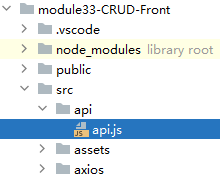

# 一、总述

## 1、登录验证机制


<br/>

- <span style="color:blue;font-weight:bold;">Pinia</span>是<span style="color:blue;font-weight:bold;">前端的全局状态中心</span>，可以用来维护全局状态。Pinia中维护的数据各个组件都能看到。
- <span style="color:blue;font-weight:bold;">localStorage</span>和<span style="color:blue;font-weight:bold;">
  sessionStorage</span>是H5中的新技术，可以在浏览器端保存数据，比Cookie存储数据量更大

<br/>

## 2、登录检查机制

- 登录成功后，浏览器端从后端拿到token，分别进行内存和硬盘两方面保存（双保险）
    - 内存：Pinia
    - 硬盘：localStorage
- 前端axios拦截器：如果检测到token存在，则通过请求消息头携带token，发送给后端
- 前端路由守卫：访问特定组件时，检查当前token是否有效
    - 有效：放行
    - 无效：跳转到登录页面
- 后端Filter：
    - 拦截：特定请求
    - 过滤：从请求消息头中读取token值，使用JWT工具检测是否有效
        - token不仅要有值，而且不能过期

<br/>

# 二、后端技术

## 1、MD5加密

### ①简介

- MD5是HASH加密算法中的一种
- HASH算法有如下特点：
    - 各种数据类型都可以作为HASH算法执行加密操作的输入数据
    - 不管输入数据有多大还是多小，HASH算法执行加密之后，输出的数据，长度是固定的
    - 只要输入数据不变，输出就不变
    - 只要输入有哪怕一丁点儿变化，输出就会发生变化
    - HASH算法不可逆：无法从密文反向解析得到明文
    - HASH算法有很多，不同算法加密强度不同

<br/>

### ②工具方法

```java
/**
 * 执行 MD5 加密的工具方法  
 * @param strSrc 待加密的明文字符串  
 * @return
 */
public static String encrypt(String strSrc){
    if (strSrc == null || strSrc.length() == 0) {
        throw new RuntimeException("明文字符串不能为空！");
    }

    try {
        // 1、获取明文字符串的字节数组  
        byte[] bytes = strSrc.getBytes();

        // 2、根据 MD5 算法名称获取 MessageDigest 实例  
        MessageDigest md = MessageDigest.getInstance("MD5");

        // 3、执行加密  
        md.update(bytes);
        bytes = md.digest();

        // 4、把加密结果中每一个字节整数转换为十六进制字符  
        int j = bytes.length;
        char[] chars = new char[j*2];
        int k = 0;

        char hexChars[] = {'0','1','2','3','4','5','6','7','8',
        '9','a','b','c','d','e','f'};
        for (int i = 0; i < bytes.length; i++){
            byte b = bytes[i];
            chars[k++] = hexChars[b>>>4&0xf];
            chars[k++] = hexChars[b&0xf];
        }

        // 5、封装为字符串返回  
        return new String(chars).toUpperCase();
    } catch(NoSuchAlgorithmException e) {
        e.printStackTrace();
        throw new RuntimeException("MD5加密出错！！+"+e);
    }
}
```

<br/>

## 2、JWT

### ①简介

JWT（JSON Web Token）是一种用于认证和授权的开放标准。它是在网络应用之间传递信息的一种安全方式，通常被用于身份验证和声明的传输。<br/>

JWT由三部分组成：头部（Header）、负载（Payload）和签名（Signature）。

- 头部包含了关于令牌的元数据，例如所使用的加密算法和令牌类型。
- 负载是实际存放数据的地方，可以放置一些标准字段如发行人（issuer）、主题（subject）、过期时间（expiration time）等，也可以自定义一些其他字段。
- 签名部分用于验证令牌的合法性，确保数据没有被篡改。

<br/>

使用 JWT 的流程大致如下：首先，服务器将用户的身份信息编码为一个 JWT，并将其发送给客户端作为凭证。客户端收到 JWT 后，将其保存在本地，每次向服务器发送请求时都会将 JWT 作为身份验证凭证附在请求头中。服务器收到请求后，会解析 JWT 并验证签名，如果验证通过，则允许相应的操作。<br/>

JWT的特点是无状态、可扩展和安全性高。由于令牌本身包含了用户的身份信息，服务器不需要在数据库中查询用户信息，从而提高了性能。同时，JWT还支持自定义字段，可以根据实际需求灵活扩展。另外，使用签名机制保证了令牌的完整性和真实性，防止了篡改和伪造。<br/>

总而言之，JWT是一种轻量级、安全可靠的身份验证和授权解决方案，广泛应用于Web应用和移动应用等场景。<br/>

### ②导入jar包

- JWT jar包
  - jaxb-api-2.3.0.jar
  - jjwt-0.9.1.jar

- 操作 JSON 数据的 Jackson
  - jackson-annotations-2.13.2.jar
  - jackson-core-2.13.2.jar
  - jackson-databind-2.13.2.jar


<br/>

### ③工具类

```java
import io.jsonwebtoken.*;

import java.util.Date;

public class JWTUtils {

    private static long tokenExpiration = 24 * 60 * 60 * 1000;
    private static String tokenSignKey = "123456";

    //生成token字符串  
    public static String createToken(Long userId) {
        String token = Jwts.builder()
                .setSubject("YYGH-USER")
                .setExpiration(new Date(System.currentTimeMillis() + tokenExpiration))
                .claim("userId", userId)
                .signWith(SignatureAlgorithm.HS512, tokenSignKey)
                .compressWith(CompressionCodecs.GZIP)
                .compact();
        return token;
    }

    //从token字符串获取userid  
    public static Long getUserId(String token) {
        if (token == null || token.length() == 0) throw new RuntimeException("token不能为空！");
        Jws<Claims> claimsJws = Jwts.parser().setSigningKey(tokenSignKey).parseClaimsJws(token);
        Claims claims = claimsJws.getBody();
        Integer userId = (Integer) claims.get("userId");
        return userId.longValue();
    }

    /**
     * 判断token是否有效  
     * @param token
     * @return
     *  返回 true：token有效  
     *  返回 false：token无效  
     */
    public static boolean isEffective(String token) {

        // token 是空字符串：判定为无效  
        if (token == null || token.length() == 0) return false;

        try {
            return Jwts.parser()
                    .setSigningKey(tokenSignKey)
                    .parseClaimsJws(token)
                    .getBody()
                    .getExpiration().after(new Date());
        } catch (Exception e) {
            // token 过期：判定为无效  
            return false;
        }
    }

}
```

<br/>

# 三、开发登录功能


## 1、前端创建登录表单组件


<br/>

```html

<template>
    <!-- :model 属性：指定和表单进行双向绑定的数据 -->
    <el-form :model="user" label-width="120px">
        <el-form-item label="账号">
            <!-- 生成单行文本框，在 v-model 属性中指定具体的响应式渲染属性 -->
            <el-input v-model="user.userName"/>
        </el-form-item>
        <el-form-item label="密码">
            <!-- 生成单行文本框，在 v-model 属性中指定具体的响应式渲染属性 -->
            <el-input type="password" v-model="user.userPwd"/>
        </el-form-item>
        <el-form-item>
            <el-button type="primary" @click="onSubmit()">登录</el-button>
        </el-form-item>
    </el-form>
</template>

<script setup>
    import {reactive} from "vue";
    import {useRouter} from "vue-router";

    let router = useRouter();

    let user = reactive({
        "userName": "",
        "userPwd": ""
    });

    // 登录按钮的单击响应函数  
    let onSubmit = async () => {
        // 调用 API 执行具体的登录逻辑  
        // 登录成功：返回 true  
        // 登录失败：返回 false
        let loginResult = await doUserLogin(user);

        if (loginResult) {
            // 跳转到显示列表页面  
            router.push("/");
        }
    }
</script>
```

<br/>

## 2、配置路由规则

```javascript
{
    path:"/login", 
    component:Cmp04Login
}
```

<br/>

## 3、App.vue增加超链接

```html
<template>
    <router-link to="/">显示列表</router-link>&nbsp;
    <router-link to="/add">新增记录</router-link>&nbsp;
    <router-link to="/login">登录</router-link>&nbsp;
    <router-view></router-view>
</template>
```

<br/>

## 4、API中执行登录的方法

```javascript
export const doUserLogin = async (user) => {
    // 1、给后端发送请求，提交账号、密码  
    let response = await axiosInstance.post("/user/doLogin", user)

    // 2、检查登录结果是否成功  
    if (response.data.processResult == "SUCCESS") {
        // 弹出提示信息  
        ElMessage({"type": "success", "message": "登录成功！"});
        return true;
    } else {
        ElMessage.error(response.data.errorMessage);
        return false;
    }
}
```

<br/>

## 5、后端UserServlet

```java
import jakarta.servlet.*;
import jakarta.servlet.http.*;

import java.io.IOException;
import java.util.HashMap;
import java.util.Map;

public class UserServlet extends ServletPathParent {

    private UserService userService = new UserServiceImpl();

    protected void doLogin(HttpServletRequest request, HttpServletResponse response) throws ServletException, IOException {
        // 1、读取请求体中的 JSON 数据，封装为 User 对象返回  
        User user = JSONUtils.readRequestBody(request, User.class);

        // 2、调用 Service 方法检查账号、密码是否正确  
        User userForLogin = userService.getUserForLogin(user.getUserName(), user.getUserPwd());

        // 3、判断 userForLogin 是否为空  
        if (userForLogin == null) {
            // 4、通过 Result 对象封装一个登录失败的结果  
            Result result = Result.failed("账号或密码不正确，登录失败！");

            // 5、返回响应  
            JSONUtils.generateResponseBody(result, response);

        } else {
            // 6、通过 userForLogin 获取用户昵称  
            String userNickName = userForLogin.getUserNickName();

            // 7、通过 userForLogin 获取用户 id            
            Integer userId = userForLogin.getUserId();  

            // 8、根据 userId 生成 token            
            String token = JWTUtils.createToken(userId.longValue());  

            // 9、把用户昵称和 token 封装到 Map 集合中  
            Map<String, Object> responseBodyMap = new HashMap<>();
            responseBodyMap.put("userNickName", userNickName);
            responseBodyMap.put("token", token);

            // 10、把 Map 集合封装到 Result 对象中  
            Result<Map<String, Object>> result = Result.ok(responseBodyMap);

            // 11、返回响应  
            JSONUtils.generateResponseBody(result, response);
        }

    }
}
```

<br/>

## 6、后端UserService

UserService接口中声明的抽象方法没有修改，只是修改了实现方法：<br/>

```java
@Override
public User getUserForLogin(String userName,String userPwd){
    // 1、明文的密码执行加密操作  
    // ※说明：因为 MD5 加密算法不可逆，  
    // 所以不是把密文恢复为明文，而是把明文加密为密文  
    // 对密文进行比较  
    String encryptedPwd=MD5Util.encrypt(userPwd);

    // 2、使用加密以后的密码查数据库  
    return userDao.selectUserForLogin(userName,encryptedPwd);
}
```

<br/>

# 四、保存登录状态

## 1、技术简介

### ①Pinia

Pinia官网：https://pinia.web3doc.top/

<br/>


<br/>

### ②localStorage

localStorage和sessionStorage都是HTML5 Web Storage API提供的用于在浏览器端存储数据的方法，它们的主要区别如下：
<br/>

1.作用域：localStorage的作用域是整个浏览器窗口，在同一个窗口的不同页面中可以共享数据；而sessionStorage的作用域是当前会话（session），仅在同一个窗口的同一个页面中共享数据，页面刷新或重新打开页面会创建新的会话。
<br/>

2. 生命周期：localStorage的数据没有过期时间，除非被手动删除，否则会一直保存在浏览器中；而sessionStorage的数据仅在当前会话有效，当会话关闭后数据会自动清除。
   <br/>
3. 存储容量：localStorage的存储容量较大，一般为5MB或更大；而sessionStorage的存储容量较小，一般为5MB左右。
   <br/>
4. 数据共享：由于localStorage的作用域是整个浏览器窗口，不同页面之间可以共享数据，因此适合用于存储全局数据；而sessionStorage的作用域仅限于当前页面，适合用于存储局部数据。

<br/>

总结来说，localStorage适合用于持久化存储需要长期保存、全局共享的数据；而sessionStorage适合用于临时存储、页面内部共享的数据。<br/>

## 2、搭建环境

### ①安装Pinia

```bash
npm install pinia@2.1.6
```

<br/>

### ②配置main.js

```javascript
import {createPinia} from "pinia";

let pinia = createPinia();

// 应用路由规则：use(router)  
// 应用组件库：use(ElementPlus)
// 应用存储库：use(pinia)
createApp(App).use(router).use(pinia).use(ElementPlus).mount('#app')
```

<br/>

## 3、设置数据保存

### ①定义Store对象


<br/>

```javascript
import {defineStore} from "pinia";

export const storedUser = defineStore("storedUser", {

    // state 后面赋值必须是一个箭头函数  
    state: () => {
        // 箭头函数的返回值就是全局范围内维护的状态数据  
        return {
            "userNickName": "",
            "token": ""
        }
    }
});
```

<br/>

### ②登录成功后存入数据



<br/>

```javascript
export const doUserLogin = async (user) => {
    // 1、给后端发送请求，提交账号、密码  
    let response = await axiosInstance.post("/user/doLogin", user)

    // 2、检查登录结果是否成功  
    if (response.data.processResult == "SUCCESS") {
        // 弹出提示信息  
        ElMessage({"type": "success", "message": "登录成功！"});

        // 获取 Pinia 中维护的对象  
        let piniaUser = storedUser();

        // 在 Pinia 中保存登录信息  
        piniaUser.userNickName = response.data.queryResultData.userNickName;
        piniaUser.token = response.data.queryResultData.token;

        // 在 localStorage 中保存登录信息  
        localStorage.setItem("userNickName", response.data.queryResultData.userNickName);
        localStorage.setItem("token", response.data.queryResultData.token);

        return true;
    } else {
        ElMessage.error(response.data.errorMessage);
        return false;
    }
}
```

<br/>

### ③首页欢迎

```html
<script setup>
    import {doLogout, findUserNickName} from "./api/api.js";
    import {onMounted, ref} from "vue";

    let userNickName = ref("");

    onMounted(() => {
        // 页面初始化时，检查此前是否登录  
        userNickName.value = findUserNickName();
    });

    let handleLogout = () => {
        doLogout();
        userNickName.value = null;
    };

    // 接收子组件传递来的数据，然后重新渲染视图  
    let receiveUserNickName = (data) => {
        userNickName.value = data;
    };
</script>

<template>
    <router-link to="/">显示列表</router-link>&nbsp;
    <router-link to="/add">新增记录</router-link>&nbsp;
    <router-link v-if="userNickName == null || userNickName.length == 0" to="/login">登录</router-link>&nbsp;
    <span v-if="userNickName != null && userNickName.length > 0">  
        欢迎您：<span>{{userNickName}}</span>&nbsp;  
        <a href="#" @click.prevent="handleLogout()">退出登录</a>  
    </span>

    <!-- 接收子组件传递来的数据 -->
    <router-view @sendNickName="receiveUserNickName"></router-view>
</template>
```

## 4、API方法


<br/>

```javascript
import {storedUser} from "../store/store.js";

export const findUserNickName = () => {
    // 获取 Pinia 中维护的对象  
    let piniaUser = storedUser();

    let userNickName = piniaUser.userNickName;

    if (userNickName == null || userNickName.length == 0) {
        userNickName = localStorage.getItem("userNickName");
    }

    return userNickName;
};

export const findToken = () => {
    // 获取 Pinia 中维护的对象  
    let piniaUser = storedUser();

    if (piniaUser.token == null || piniaUser.token.length == 0) {
        return localStorage.getItem("userNickName");
    } else {
        return piniaUser.token;
    }
};

export const doLogout = () => {
    let piniaUser = storedUser();
    piniaUser.userNickName = null;
    piniaUser.token = null;

    localStorage.removeItem("token");
    localStorage.removeItem("userNickName");
}
```

<br/>

## 5、axios拦截器请求携带token

### ①为啥用请求消息头携带

- 请求体不一定有，但是请求消息头一定有，所以通过请求头一定能够携带
- 那为什么不使用请求参数的形式携带呢？
    - 请求参数适用的场景：业务场景
    - 请求消息头适用的场景：对请求做统一、通用设置

<br/>

### ②代码实现


<br/>

```javascript
import {findToken} from "../api/api.js";

// 设定拦截器操作  
axiosInstance.interceptors.request.use(config => {

    // 1、检测当前浏览器端是否保存了 token 信息  
    let token = findToken();

    if (token != null && token.length > 0) {
        // 2、如果 token 存在，那么就设置到请求消息头中  
        // ※为什么不这么写：config.headers.token = token;  
        // 因为 HTTP 协议中其实并没有定义 token 这个请求消息头，  
        // 所以 headers 对象并没有 token 这个属性  
        // 所以现在这么写是强制设置进去  
        config.headers['token'] = token;
    }

    return config;
}, error => Promise.reject(error))
```

<br/>

# 五、检查登录

## 1、说明


<br/>

## 2、前端：路由守卫

### ①路由守卫本身代码


<br/>

```javascript
// 调用 router 对象的 beforeEach() 方法设定前置的路由守卫  
// to 参数：要前往的目标组件  
// from 参数：来源的组件  
// next 参数：放行或跳转的控制对象  
router.beforeEach((to, from, next) => {
    // ==========排除不需要登录的路径==========  
    if (to.path == "/login") {
        // 1、直接放行  
        next();

        // 2、流程结束  
        return;
    }

    // ==========查找用户登录的信息==========  
    // 1、查找 token    let token = findToken();  

    // 2、检查 token 是否为空  
    if (token == null || token.length == 0) {
        // 3、如果为空说明没有登录，我们需要跳转到登录页面  
        next("/login?message=请登录以后再操作！");
    } else {
        // 4、如果非空说明已经登录，直接放行  
        next();
    }
});
```

<br/>

### ②登录组件

#### 【1】导入所需资源

```javascript
import {useRouter, useRoute} from "vue-router";

let router = useRouter();
let route = useRoute();
```

<br/>

#### 【2】显示提示消息

```html

<el-form :model="user" label-width="120px">
    <el-form-item>
        <el-text size="large" type="warning" class="mx-1">{{route.query.message}}</el-text>
    </el-form-item>
    <el-form-item label="账号">
```

## 3、后端：Filter

```java
import jakarta.servlet.FilterChain;
import jakarta.servlet.ServletException;
import jakarta.servlet.http.HttpFilter;
import jakarta.servlet.http.HttpServletRequest;
import jakarta.servlet.http.HttpServletResponse;

import java.io.IOException;

/**
 * 所有访问 /soldier/* 地址的请求都需要做登录检查  
 * 后端登录过滤器：检查当前请求是否登录  
 *  登录（token有效）：放行  
 *  未登录（token无效）：通过 Result 封装失败信息返回  
 */
public class LoginCheckFilter extends HttpFilter {

    protected void doFilter(
            HttpServletRequest request,
            HttpServletResponse response, FilterChain chain)
            throws IOException, ServletException {
        // 1、从请求消息头中获取 token 值  
        String token = request.getHeader("token");

        // 2、检查 token 是否有效  
        boolean effective = JWTUtils.isEffective(token);
        if (!effective) {
            // 3、判断 token 无效  
            Result result = Result.failed("请登录以后再操作！");
            JSONUtils.generateResponseBody(result, response);

            // 4、流程结束  
            return;
        }

        // 5、前面所有代码排除了 token 无效的情况，到这里说明 token 有效，请求放行  
        chain.doFilter(request, response);
    }
}
```

<br/>

```xml

<filter>
    <filter-name>LoginCheckFilter</filter-name>
    <filter-class>com.atguigu.demo.filter.LoginCheckFilter</filter-class>
</filter>
<filter-mapping>
<filter-name>LoginCheckFilter</filter-name>
<servlet-name>SoldierServlet</servlet-name>
</filter-mapping>
```

<br/>

## 4、bug

### ①表现和分析

- 前端携带token访问后端
- 后端检测到token过期
- 前端token仍然存在
- 路由守卫不该放行，却放行
- 因为对于路由守卫来说，它不检查token是否过期，只是确认token存在即可

<br/>

### ②解决思路

- 后端返回Result时，携带一个明确的code值
- axios拦截器在收到响应后，检测code值
- 如果遇到代表“未登录，禁止访问”的code，那么就删除本地登录信息
- 跳转到首页

<br/>

- 为什么是使用code，而不是提示消息本身？
    - 原因1：提示消息是中文的，返回到浏览器存在中文乱码的隐患
    - 原因2：提示消息是给人看的，同样一个意思可以有无数中不同表单
        - 请登录以后再操作！
        - 该操作要求登录才可以访问！
        - 未登录，禁止访问！
        - ……

<br/>

### ③后端声明枚举类型

```java
public enum ResultCodeEnum {

    ACCESS_DENIE(7986342, "未登录禁止访问");

    // 我们这里的编码，和HTTP响应状态码是两码事，没有任何关系
    // 项目中我们自己自定义的错误码，都是针对特定业务场景的
    private int code;
    private String codeDescription;

    ResultCodeEnum(int code, String codeDescription) {
        this.code = code;
        this.codeDescription = codeDescription;
    }

    public int getCode() {
        return code;
    }

    public String getCodeDescription() {
        return codeDescription;
    }
}
```

<br/>

### ④后端重构Result类

增加code属性：

```java
private int code;

public int getCode() {
    return code;
}

public void setCode(int code) {
    this.code = code;
}

public Result(String processResult,T queryResultData,String errorMessage,int code) {
    this.processResult = processResult;
    this.queryResultData = queryResultData;
    this.errorMessage = errorMessage;
    this.code = code;
}
```

<br/>

重载failed()方法：

```java
/**
 * 工具方法：处理请求失败，带有结果码  
 * @param errorMessage
 * @param code 结果码，代表特定场景  
 * @return
 */
public static Result failed(int code,String errorMessage){
    Result result = new Result();
    result.setProcessResult(FAILED);
    result.setErrorMessage(errorMessage);
    result.setCode(code);
    return result;
}
```

<br/>

### ⑤后端重构LoginCheckFilter

```java
boolean effective=JWTUtils.isEffective(token);
if(!effective) {
    // 3、判断 token 无效  
    // 封装 Result 对象时，需要携带错误码，便于前端识别  
    Result result = Result.failed(
    ResultCodeEnum.ACCESS_DENIE.getCode(),
    ResultCodeEnum.ACCESS_DENIE.getCodeDescription());

    JSONUtils.generateResponseBody(result,response);

    // 4、流程结束  
    return;
}
```

<br/>

### ⑥前端重构axios拦截器

```javascript
axiosInstance.interceptors.response.use(response => {

    // 检测响应结果是否处理成功  
    if (response.data.processResult == "FAILED") {
        // 检测响应错误码
        if (response.data.code == 7986342) {
            // 删除浏览器端保存的登录信息  
            doLogout();

            // 由于用户没有登录，所以不能让用户留在当前界面，跳转回首页  
            window.location.href = "/login?message=请登录以后再操作！";
        }
    }

    return response;
}, error => Promise.reject(error))
```

# 六、项目的导出和部署
## 1、修改代码


<br/>


<br/>

## 2、前端操作
npm run build

<br/>

一共会生成三个文件，在dist目录下：

<br/>


<br/>


<br/>

## 3、后端操作
在IDEA的out/artifacts目录下找到当前工程对应的artifact：<br/>


<br/>