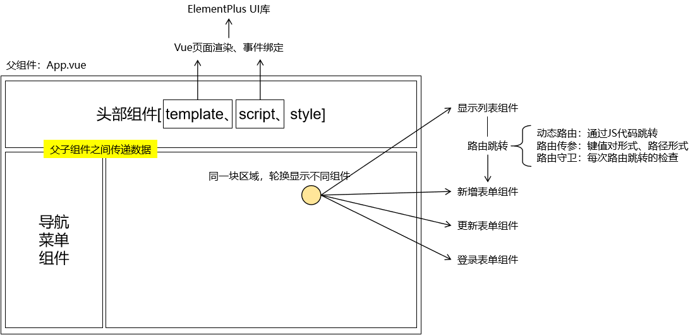
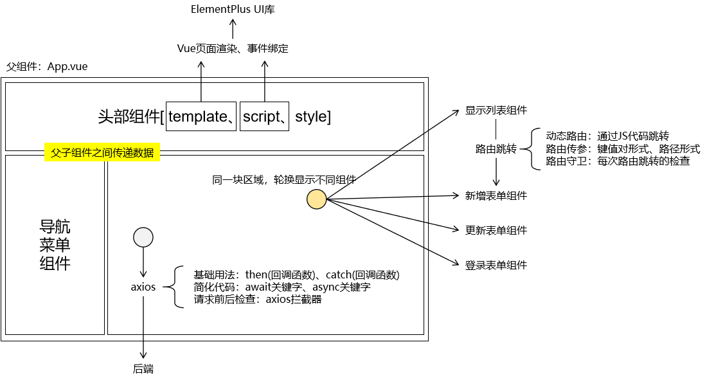
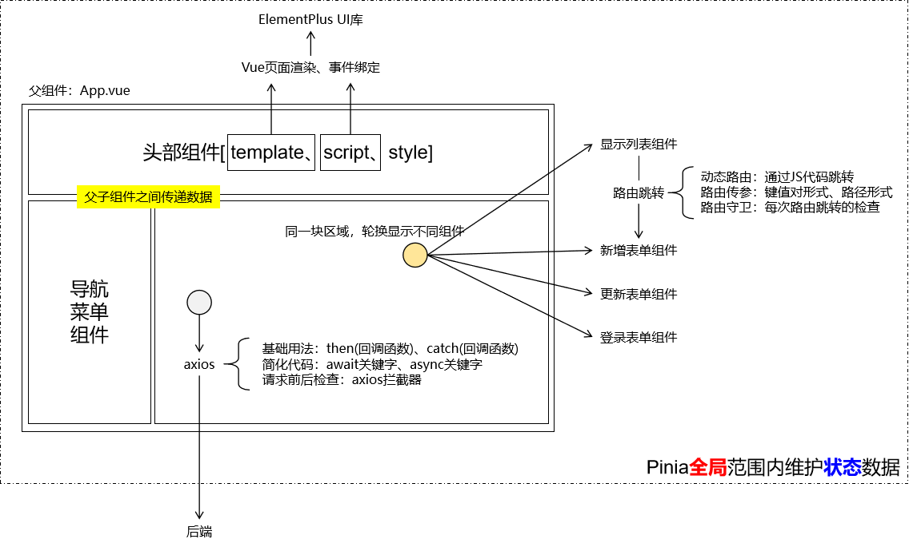
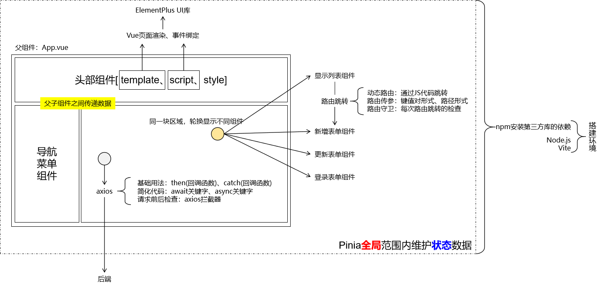
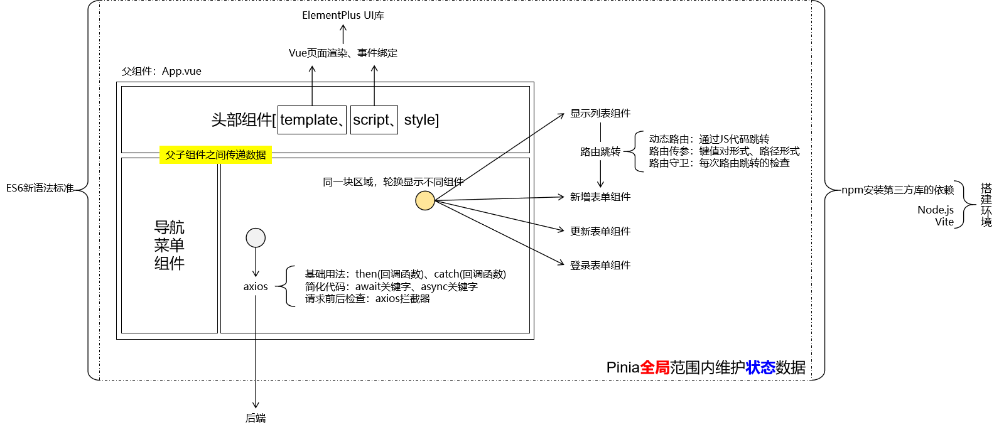

## 1、页面拆分，组件化开发


## 2、组件的组成部分
```html
<template>  
  <!-- HTML 代码（定义组件中的结构） -->  
</template>  
  
<script setup>  
  // JavaScript 代码（定义组件的行为）  
</script>  
  
<style scoped>  
  /* CSS 代码（定义组件的样式） */
</style>
```

## 3、页面渲染


## 4、双向绑定


## 5、Vue框架基础功能


## 6、组件之间的关系
- 静态：共同构成一个完整的网页
- 动态：路由跳转


## 7、前后端数据交互


## 8、Pinia



## 9、搭建环境


## 10、ES6语法支持
