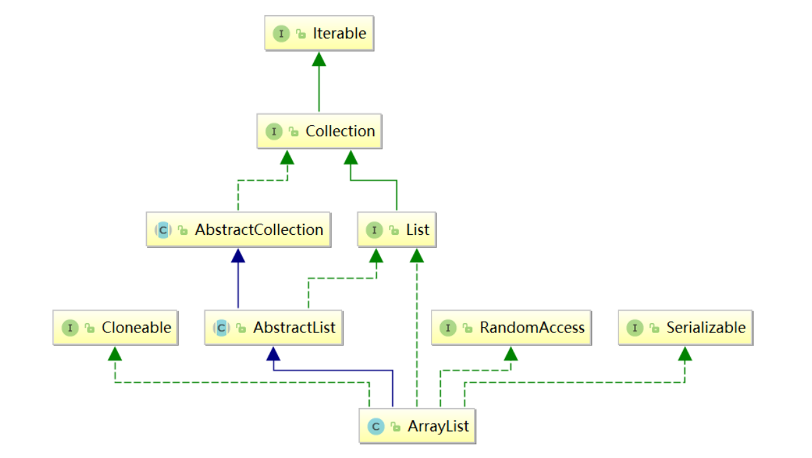
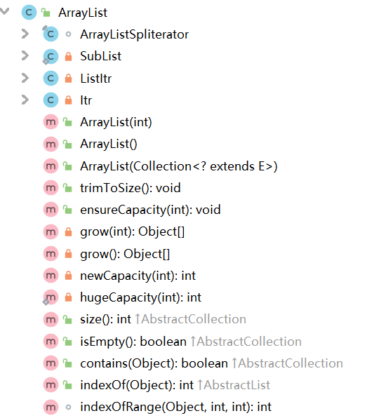
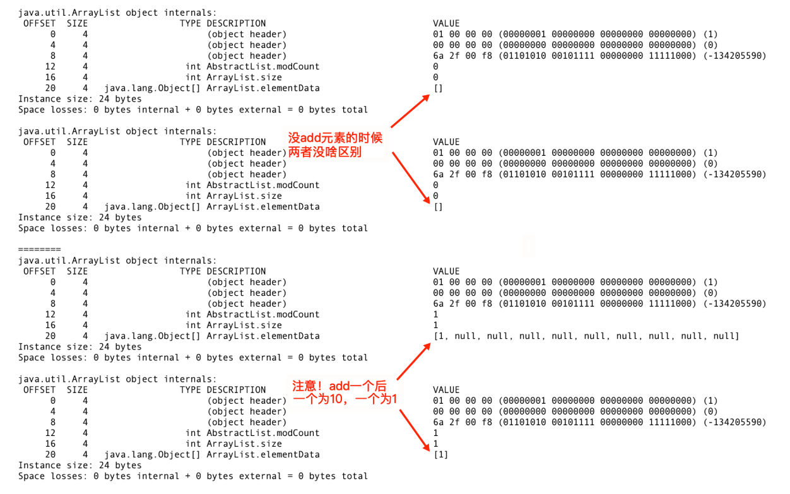
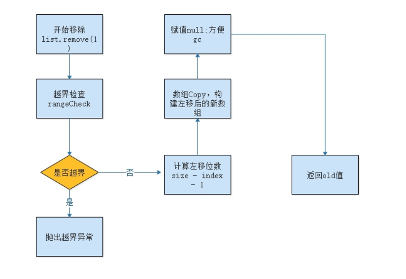

# ArrayList源码

## ArrayList类结构图

**ArrayList 是一个用数组实现的集合，支持随机访问，元素有序且可以重复。**

（1）ArrayList 是一种变长的集合类，基于定长数组实现。

（2）ArrayList 允许空值和重复元素，当往 ArrayList 中添加的元素数量大于其底层数组容量时，其会通过扩容机制重新生成一个更大的数组。

（3）ArrayList 底层基于数组实现，所以其可以保证在 O(1) 复杂度下完成随机查找操作。

（4）ArrayList 是非线程安全类，并发环境下，多个线程同时操作 ArrayList，会引发不可预知的异常或错误。

```java
public class ArrayList<E> extends AbstractList<E> implements List<E>, RandomAccess, Cloneable, java.io.Serializable
```



① 实现 RandomAccess 接口

这是一个标记接口，一般此标记接口用于 List实现，以表明它们支持快速（通常是恒定时间）的随机访问

② 实现 Cloneable 接口

Cloneable 和 RandomAccess 接口一样也是一个标记接口，接口内无任何方法体和常量的声明，也就是说如果想克隆对象，必须要  实现 Cloneable 接口，表明该类是可以被克隆的。

③ 实现 Serializable 接口

标记接口，表示能被序列化

④ 实现 List 接口

这个接口是 List 类集合的上层接口，定义了实现该接口的类都必须要实现的一组方法



## 字段属性
```java
// 集合的默认大小 
private static final int DEFAULT_CAPACITY = 10;
// 空的数组实例 
private static final Object[] EMPTY_ELEMENTDATA = {};
// 这也是一个空的数组实例，和EMPTY_ELEMENTDATA空数组相比是用于了解添加元素时数组膨胀多少
private static final Object[] DEFAULTCAPACITY_EMPTY_ELEMENTDATA = {};
// 存储 ArrayList集合的元素，集合的长度即这个数组的长度
// 1、当 elementData == DEFAULTCAPACITY_EMPTY_ELEMENTDATA 时将会清空 ArrayList
// 2、当添加第一个元素时，elementData 长度会扩展为 DEFAULT_CAPACITY=10
transient Object[] elementData;
// 表示集合的长度
private int size;
```

## 类构造器

### 无参构造
```java
public ArrayList() {
    this.elementData = DEFAULTCAPACITY_EMPTY_ELEMENTDATA;
}
```
此无参构造函数将创建一个 DEFAULTCAPACITY_EMPTY_ELEMENTDATA 声明的数组，注意此时初始容量是0，而不是大家以为的 10。

**注意：根据默认构造函数创建的集合，ArrayList list = new ArrayList();此时集合长度是0.**

### 重载：有参构造ArrayList(int initialCapacity)
```java
public ArrayList(int initialCapacity) {
    if (initialCapacity > 0) {
        this.elementData = new Object[initialCapacity];
    } else if (initialCapacity == 0) {
        this.elementData = EMPTY_ELEMENTDATA;
    } else {
        throw new IllegalArgumentException("Illegal Capacity: "+ initialCapacity);
    }
}
```

初始化集合大小创建 ArrayList 集合。当大于0时，给定多少那就创建多大的数组；当等于0时，创建一个空数组；当小于0时，抛出异常。

### 重载：ArrayList(Collection<? extends E> c)

```java
public ArrayList(Collection<? extends E> c) {
    elementData = c.toArray();
    if ((size = elementData.length) != 0) {
        // c.toArray might (incorrectly) not return Object[] (see 6260652)
        if (elementData.getClass() != Object[].class)
                elementData = Arrays.copyOf(elementData, size, Object[].class);
    } else {
        // replace with empty array.
        this.elementData = EMPTY_ELEMENTDATA;
    }
}
```

将已有的集合复制到 ArrayList 集合中

### 思考：无参构造和0长度构造有什么区别
```java
@Test
public void test(){
    // 两种方式构建list，有什么区别？
    ArrayList list1 = new ArrayList();
    ArrayList list2 = new ArrayList(0);

    // 打印对象头
    System.out.println(ClassLayout.parseInstance(list1).toPrintable());
    System.out.println(ClassLayout.parseInstance(list2).toPrintable());

    System.out.println("========");

    // add一个元素之后再来打印试试
    list1.add(1);
    list2.add(1);

    System.out.println(ClassLayout.parseInstance(list1).toPrintable());
    System.out.println(ClassLayout.parseInstance(list2).toPrintable());
}
```



原理：

```java
// calculateCapacity
// 每次元素变动，比如add，会调用该函数判断容量情况
private static int calculateCapacity(Object[] elementData, int minCapacity) {
    // 定义default empty数组的意义就在这里！用于扩容时判断当初采用的是哪种构造函数
    if (elementData == DEFAULTCAPACITY_EMPTY_ELEMENTDATA) {
        // 如果是无参的构造函数，用的就是该default empty
        // 那么第一次add时候，容量取default和min中较大者
        return Math.max(DEFAULT_CAPACITY, minCapacity);
    }
    // 如果是另外两个构造函数，比如指定容量为5，或者初始参数collection为5
    // 那就直接返回5，一定程度上，节约了内存空间
    return minCapacity;
}
```

## 添加元素
```java
// 思考：List集合底层是数组，为什么能添加到任意多个元素？
list1.add(1);
```

源码：
```java
public boolean add(E e) {
    ensureCapacityInternal(size + 1);  // 添加元素之前，首先要确定集合的大小(是否需要扩容)
    elementData[size++] = e;
    return true;
}
```

如上所示，在通过调用 add 方法添加元素之前，我们要首先调用 ensureCapacityInternal 方法来确定集合的大小，如果集合满了，则要进行扩容操作。

```java
// 这里的minCapacity 是集合当前大小+1
private void ensureCapacityInternal(int minCapacity) {
    // elementData 是实际用来存储元素的数组，注意数组的大小和集合的大小不是相等的，前面的size是指集合大小
    ensureExplicitCapacity(calculateCapacity(elementData, minCapacity));
} 

private static int calculateCapacity(Object[] elementData, int minCapacity) {
    // 如果数组为空，则从size+1的值和默认值10中取最大的
    if (elementData == DEFAULTCAPACITY_EMPTY_ELEMENTDATA) {
        return Math.max(DEFAULT_CAPACITY, minCapacity);
    }
    return minCapacity;//不为空，则返回size+1
}

private void ensureExplicitCapacity(int minCapacity) {
    modCount++;

    // overflow-conscious code
    if (minCapacity - elementData.length > 0)
        grow(minCapacity);
}
```

在 ensureExplicitCapacity 方法中，首先对修改次数modCount加一，这里的modCount给ArrayList的迭代器使用的，在并发操作被修改时，提供快速失败行为（保证modCount在迭代期间不变，否则抛出ConcurrentModificationException异常，可以查看源码865行），接着判断minCapacity是否大于当前ArrayList内部数组长度，大于的话调用grow方法对内部数组elementData扩容，grow方法代码如下：

```java
private void grow(int minCapacity) {
    // 得到原始数组的长度
    int oldCapacity = elementData.length;
    // 新数组的长度等于原数组长度的1.5倍
    int newCapacity = oldCapacity + (oldCapacity >> 1);
    // 当新数组长度仍然比minCapacity小，则为保证最小长度，新数组等于minCapacity
    if (newCapacity - minCapacity < 0)
        newCapacity = minCapacity;
    // MAX_ARRAY_SIZE = Integer.MAX_VALUE - 8 = 2147483639
    // 当得到的新数组长度比 MAX_ARRAY_SIZE 大时，调用 hugeCapacity 处理大数组
    if (newCapacity - MAX_ARRAY_SIZE > 0)
        newCapacity = hugeCapacity(minCapacity);
    // 调用 Arrays.copyOf 将原数组拷贝到一个大小为newCapacity的新数组（注意是拷贝引用）
    elementData = Arrays.copyOf(elementData, newCapacity);
}

private static int hugeCapacity(int minCapacity) {
    if (minCapacity < 0) //
        throw new OutOfMemoryError();
    // minCapacity > MAX_ARRAY_SIZE,则新数组大小为Integer.MAX_VALUE
    return (minCapacity > MAX_ARRAY_SIZE) ? Integer.MAX_VALUE : MAX_ARRAY_SIZE;
}
```

扩容的核心方法就是调用前面我们讲过的Arrays.copyOf 方法，创建一个更大的数组，然后将原数组元素拷贝过去即可

对于 ArrayList 集合添加元素，总结一下：

① 当通过 ArrayList() 构造一个空集合，初始长度是为0的，第 1 次添加元素，会创建一个长度为10的数组，并将该元素赋值到数组的第一个位置。

② 第 2 次添加元素，集合不为空，而且由于集合的长度size+1是小于数组的长度10，所以直接添加元素到数组的第二个位置，不用扩容。

③ 第 11 次添加元素，此时 size+1 = 11，而数组长度是10，这时候创建一个长度为10+10*0.5 = 15 的数组（扩容1.5倍），然后将原数组元素引用拷贝到新数组。并将第 11 次添加的元素赋值到新数组下标为10的位置。

④ 第 Integer.MAX_VALUE - 8 = 2147483639，然后 2147483639%1.5=1431655759（这个数是要进行扩容） 次添加元素，为了防止溢出，此时会直接创建一个 1431655759+1 大小的数组，这样一直，每次添加一个元素，都只扩大一个范围。

⑤ 第 Integer.MAX_VALUE - 7 次添加元素时，创建一个大小为 Integer.MAX_VALUE 的数组，在进行元素添加。

⑥ 第 Integer.MAX_VALUE + 1 次添加元素时，抛出 OutOfMemoryError 异常。

注意：能向集合中添加 null 的，因为数组可以有 null 值存在。

```java
Object[] obj = {null,1};

ArrayList list = new ArrayList();
list.add(null);
list.add(1);
System.out.println(list.size()); // 2
```

## 删除元素

```java
public E remove(int index) {
    // 判断给定索引的范围，超过集合大小则抛出异常
    rangeCheck(index);

    modCount++;
    // 得到索引处的删除元素
    E oldValue = elementData(index);

    int numMoved = size - index - 1;
    // size-index-1 > 0 表示 0<= index < (size-1),即索引不是最后一个元素
    if (numMoved > 0)
        // 通过 System.arraycopy()将数组elementData 的下标index+1之后长度为 numMoved的元素拷贝到从index开始的位置
        System.arraycopy(elementData, index+1, elementData, index,
                             numMoved);

    // 将数组最后一个元素置为 null，便于垃圾回收
    elementData[--size] = null; 

    return oldValue;
}
```

remove(int index) 方法表示删除索引index处的元素，首先通过 rangeCheck(index) 方法判断给定索引的范围，超过集合大小则抛出异常；接着通过 System.arraycopy 方法对数组进行自身拷贝



附：

```java
/*
 *　src:源数组
　　srcPos:源数组要复制的起始位置
　　dest:目的数组
　　destPos:目的数组放置的起始位置
　　length:复制的长度
　　注意：src 和 dest都必须是同类型或者可以进行转换类型的数组。
*/
public static native void arraycopy(Object src,  int  srcPos,
                                    Object dest, int destPos,
                                    int length);
```

## 修改元素

通过调用 set(int index, E element) 方法在指定索引 index 处的元素替换为 element。并返回原数组的元素。

```java
public E set(int index, E element) {
    // 判断索引合法性
    rangeCheck(index);

    // 获得原数组指定索引的元素
    E oldValue = elementData(index);
    // 将指定所引处的元素替换为 element
    elementData[index] = element;
    // 返回原数组索引元素
    return oldValue;
}
```

通过调用 rangeCheck(index) 来检查索引合法性
```java
private void rangeCheck(int index) {
    if (index >= size)
        throw new IndexOutOfBoundsException(outOfBoundsMsg(index));
}
```

当索引为负数时，会抛出 java.lang.ArrayIndexOutOfBoundsException 异常。当索引大于集合长度时，会抛出 IndexOutOfBoundsException 异常。

## 查找元素

```java
public E get(int index) {
    rangeCheck(index);

    return elementData(index);
}
```

同理，首先还是判断给定索引的合理性，然后直接返回处于该下标位置的数组元素。