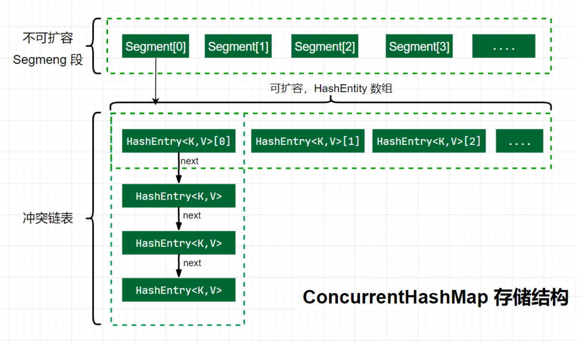
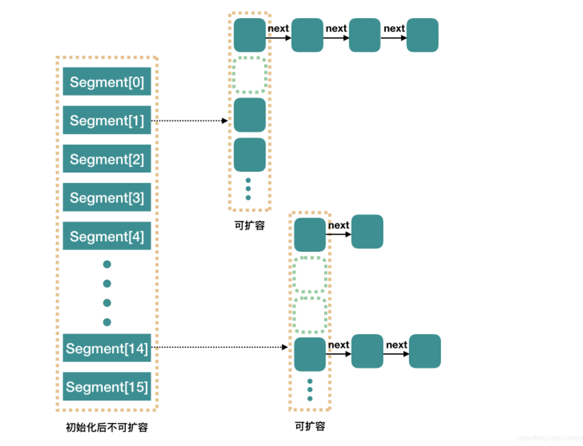

# ConcurrentHashMap

思考：HashTable是线程安全的，为什么不推荐使用？

HashTable是一个线程安全的类，它使用synchronized来锁住整张Hash表来实现线程安全，即每次锁住整张表让线程独占，相当于所有线程进行读写时都去竞争一把锁，导致效率非常低下。

# ConcurrentHashMap 1.7

在JDK1.7中ConcurrentHashMap采用了数组+分段锁的方式实现。

Segment(分段锁)-减少锁的粒度

ConcurrentHashMap中的分段锁称为Segment，它即类似于HashMap的结构，即内部拥有一个Entry数组，数组中的每个元素又是一个链表,同时又是一个ReentrantLock（Segment继承了ReentrantLock）。

## 存储结构

Java 7 版本 ConcurrentHashMap 的存储结构如图：

ConcurrnetHashMap 由很多个 Segment 组合，而每一个 Segment 是一个类似于 HashMap 的结构，所以每一个 HashMap 的内部可以进行扩容。但是 Segment 的个数一旦**初始化就不能改变**，默认 Segment 的个数是 16 个，所以可以认为 ConcurrentHashMap 默认支持最多 16 个线程并发。