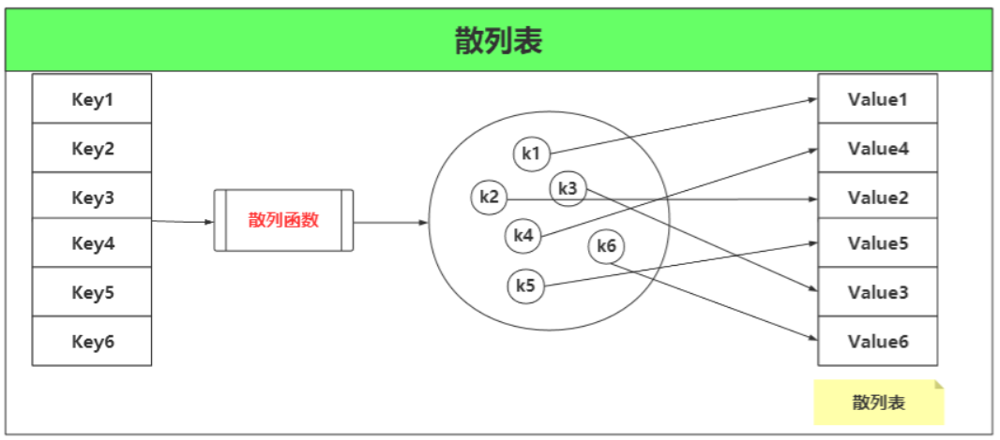
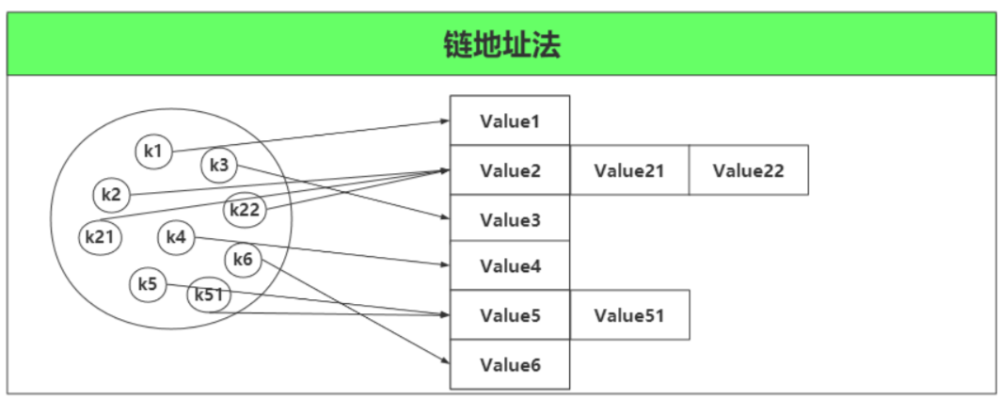
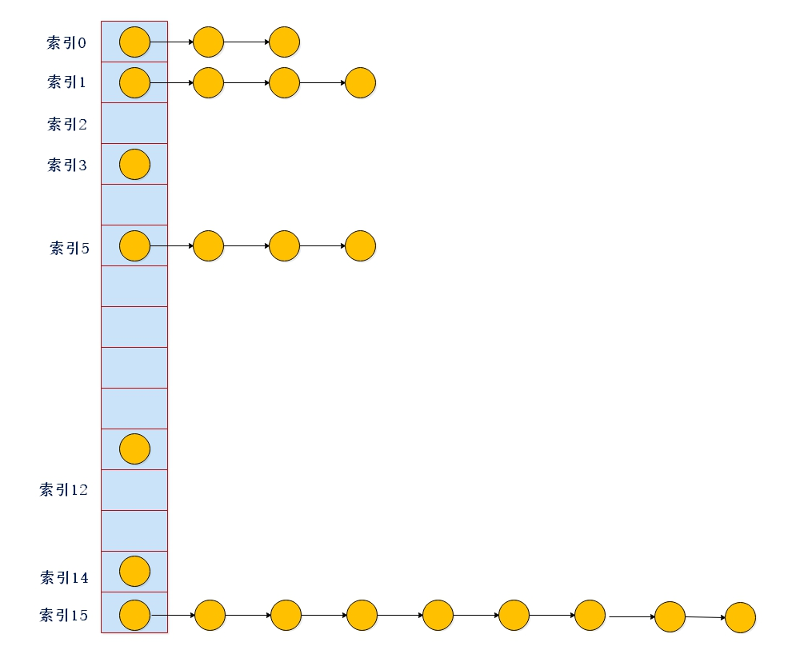
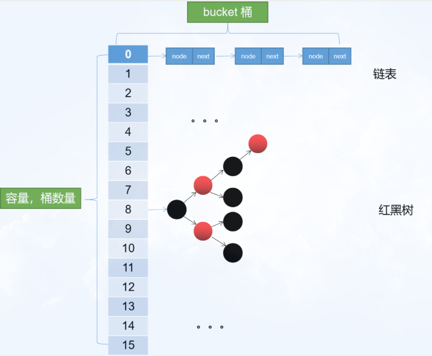
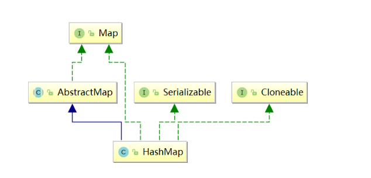

# HashMap源码分析

## 定义
HashMap基于哈希表的Map接口实现，是以key-value存储形式存在，即主要用来存放键值对。HashMap的实现不是同步的，这意味着它不是线程安全的。它的key、value都可以为null。此外，HashMap中的映射不是有序的。

- JDK1.7 HashMap数据结构：数组 + 链表
- JDK1.8 HashMap数据结构：数组 + 链表 / 红黑树
  
思考：为什么1.8之后，HashMap的数据结构要增加红黑树？

## 哈希表
Hash表也称为散列表，也有直接译作哈希表，Hash表是一种根据关键字值（key - value）而直接进行访问的数据结构。也就是说它通过把关键码值映射到表中的一个位置来访问记录，以此来加快查找的速度。在链表、数组等数据结构中，查找某个关键字，通常要遍历整个数据结构，也就是O(N)的时间级，但是对于哈希表来说，只是O(1)的时间级

哈希表，它是通过把关键码值映射到表中一个位置来访问记录，以加快查找的速度。这个映射函数叫做**散列函数**，存放记录的数组叫做**散列表**，只需要O(1)的时间级



思考：多个 key 通过散列函数会得到相同的值，这时候怎么办？

解决：

	（1）开放地址法

	（2）链地址法



对于开放地址法，可能会遇到二次冲突，三次冲突，所以需要良好的散列函数，分布的越均匀越好。

对于链地址法，虽然不会造成二次冲突，但是如果一次冲突很多，那么会造成子数组或者子链表很长，那么我们查找所需遍历的时间也会很长。

## JDK8前的数据结构
- JDK 8 以前 HashMap 的实现是 **数组+链表**，即使哈希函数取得再好，也很难达到元素百分百均匀分布。
- 当 HashMap 中有大量的元素都存放到同一个桶中时，这个桶下有一条长长的链表，极端情况HashMap 就相当于一个单链表，假如单链表有 n 个元素，遍历的时间复杂度就是 O(n)，完全失去了它的优势。



## JDK8后的数据结构

- JDK 8 后 HashMap 的实现是 **数组+链表+红黑树**
- 桶中的结构可能是链表，也可能是红黑树，当链表长度大于阈值(或者红黑树的边界值，默认为8)并且当前数组的长度大于64时，此时此索引位置上的所有数据改为使用红黑树存储。



## 类构造器

```java
public class HashMap<K,V> extends AbstractMap<K,V> implements Map<K,V>, Cloneable, Serializable {
```



JDK 为我们提供了一个抽象类 AbstractMap ，该抽象类继承 Map 接口，所以如果我们不想实现所有的 Map 接口方法，就可以选择继承抽象类 AbstractMap 。

HashMap 集合实现了 Cloneable 接口以及 Serializable 接口，分别用来进行对象克隆以及将对象进行序列化。

注意：HashMap 类即继承了 AbstractMap 接口，也实现了 Map 接口，这样做难道不是多此一举？
> 据 java 集合框架的创始人Josh Bloch描述，这样的写法是一个失误。在java集合框架中，类似这样的写法很多，最开始写java集合框架的时候，他认为这样写，在某些地方可能是有价值的，直到他意识到错了。显然的，JDK的维护者，后来不认为这个小小的失误值得去修改，所以就这样存在下来了。

## 字段属性
```java
// 序列化和反序列化时，通过该字段进行版本一致性验证
private static final long serialVersionUID = 362498820763181265L;
// 默认 HashMap 集合初始容量为16（必须是 2 的倍数）
static final int DEFAULT_INITIAL_CAPACITY = 1 << 4; // aka 16
// 集合的最大容量，如果通过带参构造指定的最大容量超过此数，默认还是使用此数
static final int MAXIMUM_CAPACITY = 1 << 30;
// 默认的填充因子
static final float DEFAULT_LOAD_FACTOR = 0.75f;
// 当桶(bucket)上的结点数大于这个值时会转成红黑树(JDK1.8新增)
static final int TREEIFY_THRESHOLD = 8;
// 当桶(bucket)上的节点数小于这个值时会转成链表(JDK1.8新增)
static final int UNTREEIFY_THRESHOLD = 6;
/**(JDK1.8新增)  
 * 当集合中的容量大于这个值时，表中的桶才能进行树形化 ，否则桶内元素太多时会扩容，
 * 而不是树形化 为了避免进行扩容、树形化选择的冲突，这个值不能小于 4 * TREEIFY_THRESHOLD
 */
static final int MIN_TREEIFY_CAPACITY = 64;

/**
 * 初始化使用，长度总是 2的幂
 */
transient Node<K,V>[] table;
 
/**  
 * 保存缓存的entrySet（）
 */
transient Set<Map.Entry<K,V>> entrySet;
 
/**
 * 此映射中包含的键值映射的数量。（集合存储键值对的数量）
 */
transient int size;

/**
 * 跟前面ArrayList和LinkedList集合中的字段modCount一样，记录集合被修改的次数
 * 主要用于迭代器中的快速失败
 */
transient int modCount;

/**  
 * 调整大小的下一个大小值（容量*加载因子）。capacity * load factor
 */
int threshold;

/**
 * 散列表的加载因子。
 */
final float loadFactor;
```

下面我们重点介绍上面几个字段：

① **Node<K,V>[] table**

我们说 HashMap 是由数组+链表+红黑树组成，这里的数组就是 table 字段。后面对其进行初始化长度默认是 DEFAULT_INITIAL_CAPACITY= 16。而且 JDK 声明数组的长度总是 2的n次方(一定是合数)，为什么这里要求是合数，一般我们知道哈希算法为了避免冲突都要求长度是质数，这里要求是合数，下面在介绍 HashMap 的hashCode() 方法(散列函数)，我们再进行讲解。

② **size**

集合中存放key-value 的实时对数。

③ **loadFactor**

装载因子，是用来衡量 HashMap 满的程度，计算HashMap的实时装载因子的方法为：size/capacity，而不是占用桶的数量去除以capacity。capacity 是桶的数量，也就是 table 的长度length。

默认的负载因子0.75 是对空间和时间效率的一个平衡选择，建议大家不要修改，除非在时间和空间比较特殊的情况下，如果内存空间很多而又对时间效率要求很高，可以降低负载因子loadFactor 的值；相反，如果内存空间紧张而对时间效率要求不高，可以增加负载因子 loadFactor 的值，这个值可以大于1。

④ **threshold**

计算公式：capacity * loadFactor。这个值是当前已占用数组长度的最大值。过这个数目就重新resize(扩容)，扩容后的 HashMap 容量是之前容量的两倍