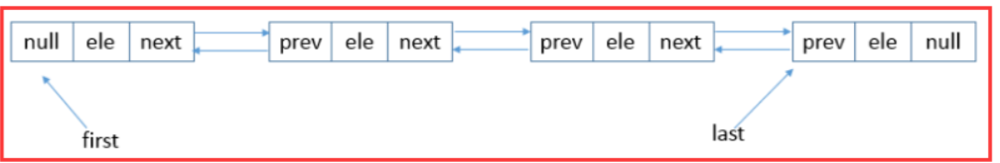
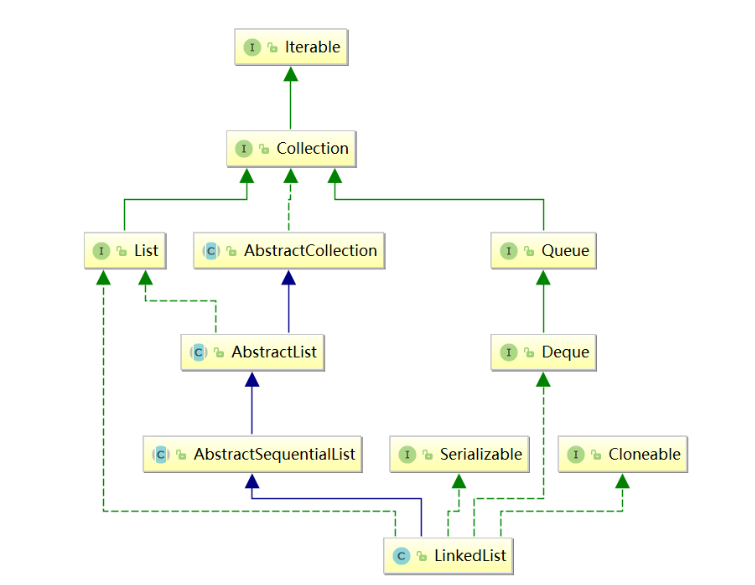
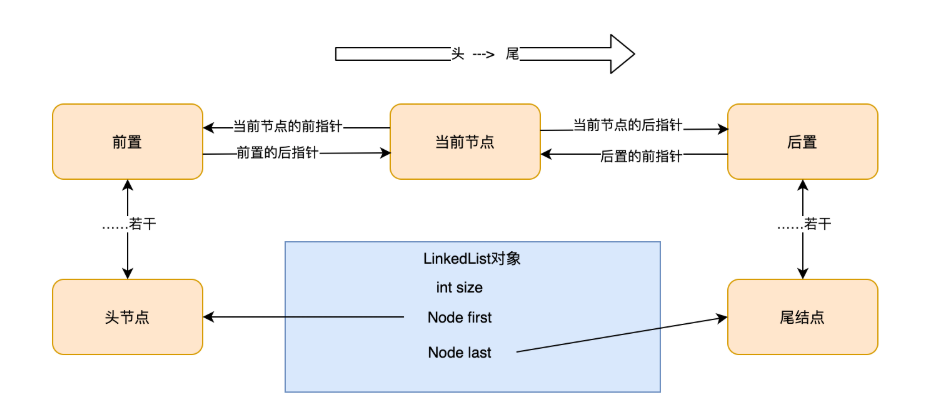
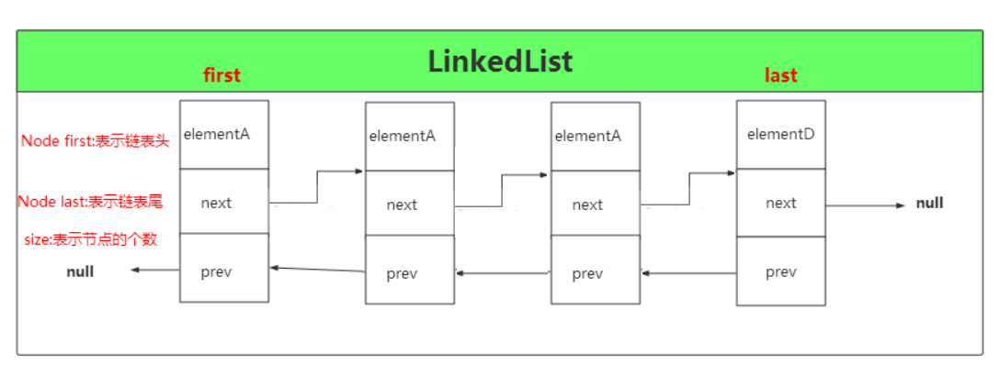

# LinkedList

## 类定义&数据结构
### 定义
LinkedList是一种可以在任何位置进行高效地插入和移除操作的有序序列，它是基于双向链表实现的。

### LinkedList的数据结构



如上图所示，LinkedList底层使用的双向链表结构，有一个头结点和一个尾结点，双向链表意味着我们可以从头开始正向遍历，或者是从尾开始逆向遍历，并且可以针对头部和尾部进行相应的操作。

### 特性
```text
Doubly-linked list implementation of the List and Deque interfaces. Implements all optional list operations, and permits all elements (including null).
```
linkedList是一个双向链表，并且实现了List和Deque接口中所有的列表操作，并且能存储任何元素，包括null，这里我们可以知道linkedList除了可以当链表使用，还可以当作队列使用，并能进行相应的操作。

```text
All of the operations perform as could be expected for a doubly-linked list. Operations that index into the list will traverse the list from the beginning or the end, whichever is closer to the specified index.
```
这个告诉我们，linkedList在执行任何操作的时候，都必须先遍历此列表来靠近通过index查找我们所需要的的值。

## 类结构图
```java
public class LinkedList<E> extends AbstractSequentialList<E> implements List<E>, Deque<E>, Cloneable, java.io.Serializable
```


和 ArrayList 集合一样，LinkedList 集合也实现了Cloneable接口和Serializable接口，分别用来支持克隆以及支持序列化。List 接口也不用多说，定义了一套 List 集合类型的方法规范。

注意，相对于 ArrayList 集合，LinkedList 集合多实现了一个 Deque 接口，这是一个双向队列接口，双向队列就是两端都可以进行增加和删除操作。

## 字段属性
```java
// 链表元素（节点）的个数
transient int size = 0;

/**
 *指向第一个节点的指针
 */
transient Node<E> first;
 
/**  
 *指向最后一个节点的指针
 */
transient Node<E> last;
```



注意这里出现了一个 Node 类，这是 LinkedList 类中的一个内部类，其中每一个元素就代表一个 Node 类对象，LinkedList 集合就是由许多个 Node 对象类似于手拉着手构成。

```java
private static class Node<E> {
    
    E item; // 实际存储的元素
    Node<E> next; // 指向上一个节点的引用
    Node<E> prev; // 指向下一个节点的引用

    // 构造函数
    Node(Node<E> prev, E element, Node<E> next) {
        this.item = element;
        this.next = next;
        this.prev = prev;
    }
}
```


上图的 LinkedList 是有四个元素，也就是由 4 个 Node 对象组成，size=4，head 指向第一个elementA,tail指向最后一个节点elementD。

## 类构造器

```java
public LinkedList() {

}

public LinkedList(Collection<? extends E> c) {
    this();
    addAll(c);
}
```

LinkedList 有两个构造函数，第一个是默认的空的构造函数，第二个是将已有元素的集合Collection 的实例添加到 LinkedList 中，调用的是 addAll() 方法

注意：LinkedList 是没有初始化链表大小的构造函数，因为链表不像数组，一个定义好的数组是必须要有确定的大小，然后去分配内存空间，而链表不一样，它没有确定的大小，通过指针的移动来指向下一个内存地址的分配。

## 添加元素

### addFirst(E e)

将指定元素添加到链表头
```java
// 将指定的元素附加到链表头节点
public void addFirst(E e) {
    linkFirst(e);
}

private void linkFirst(E e) {
    final Node<E> f = first; // 将头节点赋值给 f
    final Node<E> newNode = new Node<>(null, e, f); // 将指定元素构造成一个新节点，此节点的指向下一个节点的引用为头节点
    first = newNode; // 将新节点设为头节点，那么原先的头节点 f 变为第二个节点
    if (f == null) // 如果第二个节点为空，也就是原先链表是空
        last = newNode; // 将这个新节点也设为尾节点（前面已经设为头节点了）
    else
        f.prev = newNode; // 将原先的头节点的上一个节点指向新节点
    size++; // 节点数加1
    modCount++; // 和ArrayList中一样，iterator和listIterator方法返回的迭代器和列表迭代器实现使用。
}
```

### addLast(E e)和add(E e)

将指定元素添加到链表尾

```java
// 将元素添加到链表末尾
public void addLast(E e) {     
    linkLast(e);
}
  
// 将元素添加到链表末尾
public boolean add(E e) {
    linkLast(e);
    return true;
}
    
void linkLast(E e) {
    final Node<E> l = last; // 将l设为尾节点
    final Node<E> newNode = new Node<>(l, e, null); // 构造一个新节点，节点上一个节点引用指向尾节点l
    last = newNode; // 将尾节点设为创建的新节点
    if (l == null) // 如果尾节点为空，表示原先链表为空
        first = newNode; // 将头节点设为新创建的节点（尾节点也是新创建的节点）
    else
        l.next = newNode; // 将原来尾节点下一个节点的引用指向新节点
    size++; // 节点数加1
    modCount++; // 和ArrayList中一样，iterator和listIterator方法返回的迭代器和列表迭代器实现使用。
}
```

### add(int index, E element)

将指定的元素插入此列表中的指定位置

```java
// 将指定的元素插入此列表中的指定位置
public void add(int index, E element) {
    // 判断索引 index >= 0 && index <= size中时抛出IndexOutOfBoundsException异常
    checkPositionIndex(index);
    
    if (index == size) // 如果索引值等于链表大小
        linkLast(element); // 将节点插入到尾节点
    else
        linkBefore(element, node(index));
}

void linkLast(E e) {     
    final Node<E> l = last; // 将l设为尾节点
    final Node<E> newNode = new Node<>(l, e, null); // 构造一个新节点，节点上一个节点引用指向尾节点l
    last = newNode; // 将尾节点设为创建的新节点
    if (l == null) // 如果尾节点为空，表示原先链表为空
        first = newNode; // 将头节点设为新创建的节点（尾节点也是新创建的节点）
    else
        l.next = newNode; // 将原来尾节点下一个节点的引用指向新节点
    size++; // 节点数加1
    modCount++; // 和ArrayList中一样，iterator和listIterator方法返回的迭代器和列表迭代器实现使用。
}

Node<E> node(int index) {
    if (index < (size >> 1)) { // 如果插入的索引在前半部分
        Node<E> x = first; // 设x为头节点
        for (int i = 0; i < index; i++) // 从开始节点到插入节点索引之间的所有节点向后移动一位
            x = x.next;
        return x;
    } else { // 如果插入节点位置在后半部分
        Node<E> x = last; // 将x设为最后一个节点
        for (int i = size - 1; i > index; i--) // 从最后节点到插入节点的索引位置之间的所有节点向前移动一位
            x = x.prev;
        return x;
    }
}

void linkBefore(E e, Node<E> succ) {
    final Node<E> pred = succ.prev; // 将pred设为插入节点的上一个节点
    final Node<E> newNode = new Node<>(pred, e, succ); // 将新节点的上引用设为pred,下引用设为succ
    succ.prev = newNode; // succ的上一个节点的引用设为新节点
    if (pred == null) // 如果插入节点的上一个节点引用为空
        first = newNode; // 新节点就是头节点
    else
        pred.next = newNode; // 插入节点的下一个节点引用设为新节点
    size++;
    modCount++;
    }
```

### addAll(Collection<? extends E> c)

**按照指定集合的迭代器返回的顺序，将指定集合中的所有元素追加到此列表的末尾**

addAll有两个重载函数，addAll(Collection<? extends E>)型和addAll(int, Collection<? extends E>)型，我们平时习惯调用的addAll(Collection<? extends E>)型会转化为addAll(int, Collection<? extends E>)型

```java
// 按照指定集合的••迭代器返回的顺序，将指定集合中的所有元素追加到此列表的末尾。
public boolean addAll(Collection<? extends E> c) {     
    return addAll(size, c);
}

// 真正核心的地方就是这里了，记得我们传过来的是size，c
public boolean addAll(int index, Collection<? extends E> c) {
    // 检查index这个是否为合理。这个很简单，自己点进去看下就明白了。
    checkPositionIndex(index);
    // 将集合c转换为Object数组 a
    Object[] a = c.toArray();
    // 数组a的长度numNew，也就是由多少个元素
    int numNew = a.length;
    if (numNew == 0)
        // 集合c是个空的，直接返回false，什么也不做。
        return false;
    // 集合c是非空的，定义两个节点(内部类)，每个节点都有三个属性，item、next、prev。
    Node<E> pred, succ;
    // 构造方法中传过来的就是index==size
    if (index == size) {
        // linkedList中三个属性：size、first、last。 size：链表中的元素个数。 first：头节点  last：尾节点，就两种情况能进来这里

        // 情况一、：构造方法创建的一个空的链表，那么size=0，last、和first都为null。linkedList中是空的。什么节点都没有。succ=null、pred=last=null
        // 情况二、：链表中有节点，size就不是为0，first和last都分别指向第一个节点，和最后一个节点，在最后一个节点之后追加元素，就得记录一下最后一个节点是什么，所以把last保存到pred临时节点中。
        succ = null;
        pred = last;
    } else {
        // 情况三、index！=size，说明不是前面两种情况，而是在链表中间插入元素，那么就得知道index上的节点是谁，保存到succ临时节点中，然后将succ的前一个节点保存到pred中，这样保存了这两个节点，就能够准确的插入节点了
        // 举个简单的例子，有2个位置，1、2、如果想插数据到第二个位置，双向链表中，就需要知道第一个位置是谁，原位置也就是第二个位置上是谁，然后才能将自己插到第二个位置上。如果这里还不明白，先看一下开头对于各种链表的删除，add操作是怎么实现的。
        succ = node(index);
        pred = succ.prev;
    }
    
    // 前面的准备工作做完了，将遍历数组a中的元素，封装为一个个节点。
    for (Object o : a) {
        @SuppressWarnings("unchecked") E e = (E) o;
        // pred就是之前所构建好的，可能为null、也可能不为null，为null的话就是属于情况一、不为null则可能是情况二、或者情况三
        Node<E> newNode = new Node<>(pred, e, null);
        // 如果pred==null，说明是情况一，构造方法，是刚创建的一个空链表，此时的newNode就当作第一个节点，所以把newNode给first头节点
        if (pred == null)
            first = newNode;
        else
            // 如果pred！=null，说明可能是情况2或者情况3，如果是情况2，pred就是last，那么在最后一个节点之后追加到newNode，如果是情况3，在中间插入，pred为原index节点之前的一个节点，将它的next指向插入的节点，也是对的
            pred.next = newNode;
        // 然后将pred换成newNode，注意，这个不在else之中，请看清楚了。
        pred = newNode;
    }
    if (succ == null) {
        // 如果succ==null，说明是情况一或者情况二，
        // 情况一、构造方法，也就是刚创建的一个空链表，pred已经是newNode了，last=newNode，所以linkedList的first、last都指向第一个节点。
        // 情况二、在最后节后之后追加节点，那么原先的last就应该指向现在的最后一个节点了，就是newNode。
        last = pred;
    } else {
        // 如果succ！=null，说明可能是情况三、在中间插入节点，举例说明这几个参数的意义，有1、2两个节点，现在想在第二个位置插入节点newNode，根据前面的代码，pred=newNode，succ=2，并且1.next=newNode，1已经构建好了，pred.next=succ，相当于在newNode.next = 2； succ.prev = pred，相当于 2.prev = newNode， 这样一来，这种指向关系就完成了。first和last不用变，因为头节点和尾节点没变
        pred.next = succ;
        succ.prev = pred;
    }
    // 增加了几个元素，就把 size = size +numNew 就可以了
    size += numNew;
    modCount++;
    return true;
}
```

说明：参数中的index表示在索引下标为index的结点（实际上是第index + 1个结点）的前面插入。　　　　　

　　在addAll函数中，addAll函数中还会调用到node函数，get函数也会调用到node函数，此函数是根据索引下标找到该结点并返回，具体代码如下：

```java
Node<E> node(int index) {
    // 判断插入的位置在链表前半段或者是后半段
    if (index < (size >> 1)) { // 插入位置在前半段
        Node<E> x = first; 
        for (int i = 0; i < index; i++) // 从头结点开始正向遍历
            x = x.next;
        return x; // 返回该结点
    } else { // 插入位置在后半段
        Node<E> x = last; 
        for (int i = size - 1; i > index; i--) // 从尾结点开始反向遍历
            x = x.prev;
        return x; // 返回该结点
    }
}
```

说明：在根据索引查找结点时，会有一个小优化，结点在前半段则从头开始遍历，在后半段则从尾开始遍历，这样就保证了只需要遍历最多一半结点就可以找到指定索引的结点。