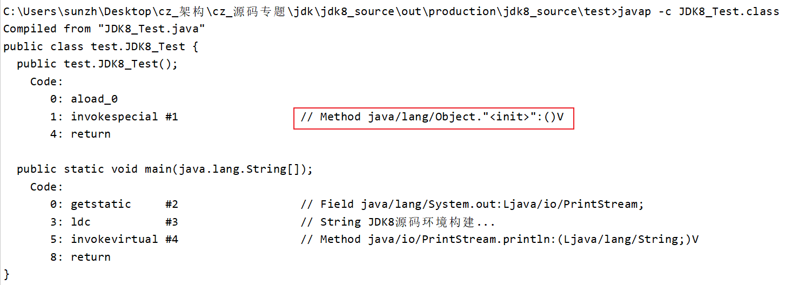
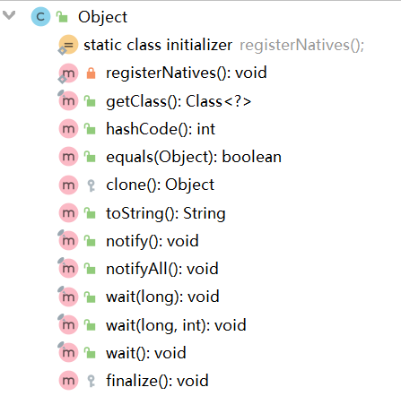
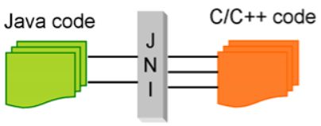

# Object源码

所有类的基类——java.lang.Object
- Object 类是所有类的基类，当一个类没有直接继承某个类时，默认继承Object类
- Object 类属于 java.lang 包，此包下的所有类在使用时无需手动导入，系统会在程序编译期间自动导入。

思考：Object是如何成为默认父类的？

推测：

情况1：编译器处理

在编译源代码时，当一个类没有显式标明继承的父类时，编译器会为其指定一个默认的父类（一般为Object），而交给虚拟机处理这个类时，由于这个类已经有一个默认的父类了，因此，VM仍然会按照常规的方法像处理其他类一样来处理这个类。

情况2：虚拟机处理

编译器仍然按照实际代码进行编译，并不会做额外的处理，即如果一个类没有显式地继承于其他类时，编译后的代码仍然没有父类。然后由虚拟机运行二进制代码时，当遇到没有父类的类时，就会自动将这个类看成是Object类的子类

验证：


使用JDK自带的工具（javap）反汇编

**结论：<font color=red>JDK无论版本，都是由编译器在编译阶段就已经织入了Object</font>**

## Object类结构图


这里有7个native方法：registerNatives()、getClass()、hashCode()、clone()、notify()、notifyAll()、wait(long)

什么是native方法？官方给的说明是"A native method is a Java method whose implementation is provided by non-java code."

通俗的说，native表示该方法的实现java本身并没有完成，而是有c/c++来完成，放在.dll动态库文件中。

Object源码如下 : 
```java
package java.lang;


public class Object {

    /**
     * 一个本地方法,具体是用C(C++)在DLL中实现的,然后通过JNI调用
     */
    private static native void registerNatives();

    /**
     * 对象初始化时自动调用此方法
     */
    static {
        registerNatives();
    }

    /**
     * 返回此Object的运行时类
     */
    public final native Class<?> getClass();

    /**
     * hashCode的常规协定是：
     * 1.在java应用程序执行期间,在对同一对象多次调用hashCode()方法时,必须一致地返回相同的整数,前提是将对象进行equals比较时所用的信息没有被修改。
     * 从某一应用程序的一次执行到同一应用程序的另一次执行,该整数无需保持一致。
     * 2.如果根据equals(object)方法,两个对象是相等的,那么对这两个对象中的每个对象调用hashCode方法都必须生成相同的整数结果。
     * 3.如果根据equals(java.lang.Object)方法,两个对象不相等,那么对这两个对象中的任一对象上调用hashCode()方法不要求一定生成不同的整数结果。
     * 但是,应该意识到,为不相等的对象生成不同整数结果可以提高哈希表的性能。
     */
    public native int hashCode();

    /**
     * 这里比较的是对象的内存地址
     */
    public boolean equals(Object obj) {
        return (this == obj);
    }

    /**
     * 本地clone方法,用于对象的复制
     */
    protected native Object clone() throws CloneNotSupportedException;

    /**
     * 返回该对象的字符串表示,非常重要的方法
     * getClass().getName();获取字节码文件的对应全路径名例如java.lang.Object
     * Integer.toHexString(hashCode());将哈希值转成16进制数格式的字符串。
     */
    public String toString() {
        return getClass().getName() + "@" + Integer.toHexString(hashCode());
    }

    /**
     * 不能被重写，用于唤醒一个在因等待该对象（调用了wait方法）被处于等待状态（waiting 或 time_wait）的线程，该方法只能同步     * 方法或同步块中调用
     */
    public final native void notify();

    /**
     * 不能被重写，用于唤醒所有在因等待该对象（调用wait方法）被处于等待状态（waiting或time_waiting）的线程，该方法只能同步方      * 法或同步块中调用
     */
    public final native void notifyAll();

    /**
     * 不能被重写，用于在线程调用中，导致当前线程进入等待状态（time_waiting)，timeout单位为毫秒,该方法只能同步方法或同步块中     * 调用,超过设置时间后线程重新进入可运行状态
     */
    public final native void wait(long timeout) throws InterruptedException;


    public final void wait(long timeout, int nanos) throws InterruptedException {
        if (timeout < 0) {
            throw new IllegalArgumentException("timeout value is negative");
        }

        if (nanos < 0 || nanos > 999999) {
            throw new IllegalArgumentException(
                    "nanosecond timeout value out of range");
        }

        if (nanos > 0) {
            timeout++;
        }

        wait(timeout);
    }

    /**
     * 在其他线程调用此对象的notify()方法或notifyAll()方法前,导致当前线程等待。换句话说,此方法的行为就好像它仅执行wait(0)调       用一样。
     * 当前线程必须拥有此对象监视器。
     * 该线程发布对此监视器的所有权并等待,直到其他线程通过调用notify方法或notifyAll方法通知在此对象的监视器上等待的线程醒来,
     * 然后该线程将等到重新获得对监视器的所有权后才能继续执行。
     */
    public final void wait() throws InterruptedException {
        wait(0);
    }

    /**
     * 这个方法用于当对象被回收时调用，这个由JVM支持，Object的finalize方法默认是什么都没有做，如果子类需要在对象被回收时执行        一些逻辑处理，则可以重写finalize方法。
     */
    protected void finalize() throws Throwable {
    }
}
```
### 补充说明：关键字 Native
问题：为什么要用 native 来修饰方法，这样做有什么用？

**JNI：Java Native Interface**

一般情况下，我们完全可以使用 Java 语言编写程序，但某些情况下，Java 可能会不满足应用程序的需求，或者是不能更好的满足需求，比如：

① 标准的 Java 类库不支持应用程序平台所需的平台相关功能。

② 我们已经用另一种语言编写了一个类库，如何用Java代码调用？

③ 某些运行次数特别多的方法代码，为了加快性能，我们需要用更接近硬件的语言（比如汇编）编写。

上面这三种需求，其实说到底就是如何用 Java 代码调用不同语言编写的代码。那么 JNI 应运而生了。



native 用来修饰方法，用 native 声明的方法表示告知 JVM 调用，该方法在外部定义，我们可以用任何语言去实现它。 简单地讲，一个native Method就是一个 Java 调用非 Java 代码的接口。