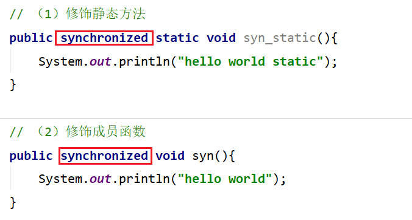
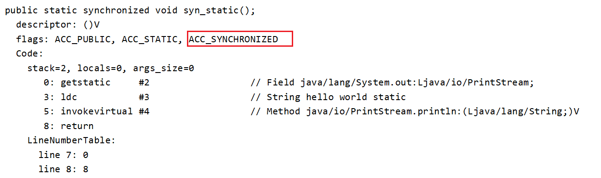
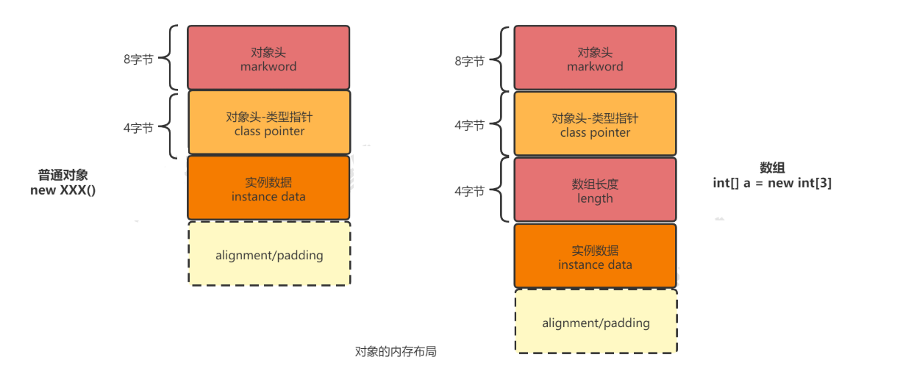
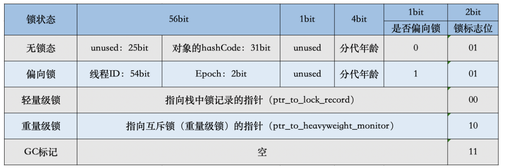

# Synchronized

## 定义

如果某一个资源被多个线程共享，为了避免因为资源抢占导致资源数据错乱，我们需要对线程进行同步，那么synchronized就是实现线程同步的关键字

**synchronized的作用是保证在同一时刻， 被修饰的代码块或方法只会有一个线程执行，以达到保证并发安全的效果。**

## 特性

- **原子性**：所谓原子性就是指一个操作或者多个操作，要么全部执行并且执行的过程不会被任何因素打断，要么就都不执行。
- **可见性**： 可见性是指多个线程访问一个资源时，该资源的状态、值信息等对于其他线程都是可见的。（通过“在执行unlock之前，必须先把此变量同步回主内存”实现）
- **有序性**：有效解决重排序问题（通过“一个变量在同一时刻只允许一条线程对其进行lock操作”）

## 用法

从语法上讲，Synchronized可以把任何一个非null对象作为"锁"，在HotSpot JVM实现中，锁有个专门的名字：**对象监视器（Object Monitor）**。

三种用法：

（1）修饰静态方法
```java
public synchronized static void helloStatic(){
    System.out.println("hello world static");
}
```

（2）修饰成员函数

```java
public synchronized void hello(){
    System.out.println("hello world");
}
```

（3）直接定义代码块

```java
public void test(){
    SynchronizedTest test = new SynchronizedTest();        
    synchronized (test){
        System.out.println("hello world");
    }
}
```

## 锁的实现

synchronized有两种形式上锁，一个是对方法上锁，一个是构造同步代码块。他们的底层实现其实都一样，在进入同步代码之前先获取锁，获取到锁之后锁的计数器+1，同步代码执行完锁的计数器-1，如果获取失败就阻塞式等待锁的释放。只是他们在同步块识别方式上有所不一样，从class字节码文件可以表现出来，一个是通过方法flags标志，一个是monitorenter和monitorexit指令操作。

### 同步代码块

定义一个同步代码块，编译出class字节码，然后找到method方法所在的指令块


关于这两条指令的作用，我们直接参考JVM规范中描述

JVM规范中对于monitorenter的描述：

https://docs.oracle.com/javase/specs/jvms/se8/html/jvms-6.html#jvms-6.5.monitorenter


这段话的大概意思为：

每个对象有一个监视器锁（monitor）。当monitor被占用时就会处于锁定状态，线程执行monitorenter指令时尝试获取monitor的所有权，过程如下：

1、如果monitor的进入数为0，则该线程进入monitor，然后将进入数设置为1，该线程即为monitor的所有者。

2、如果线程已经占有该monitor，只是重新进入，则进入monitor的进入数加1.

3.如果其他线程已经占用了monitor，则该线程进入阻塞状态，直到monitor的进入数为0，再重新尝试获取monitor的所有权。


这段话的大概意思为：

执行monitorexit的线程必须是objectref所对应的monitor的所有者。

指令执行时，monitor的进入数减1，如果减1后进入数为0，那线程退出monitor，不再是这个monitor的所有者。其他被这个monitor阻塞的线程可以尝试去获取这个 monitor 的所有权。 

### 同步方法

首先看在方法上上锁，然后进行反编译，查看其字节码：





从编译的结果来看，方法的同步并没有通过指令 monitorenter 和 monitorexit 来完成（理论上其实也可以通过这两条指令来实现），不过相对于普通方法，其常量池中多了 ACC_SYNCHRONIZED 标示符。JVM就是根据该标示符来实现方法的同步的：

> 当方法调用时，调用指令将会检查方法的 ACC_SYNCHRONIZED 访问标志是否被设置，如果设置了，执行线程将先获取monitor，获取成功之后才能执行方法体，方法执行完后再释放monitor。**在方法执行期间，其他任何线程都无法再获得同一个monitor对象。**

两种同步方式本质上没有区别，只是方法的同步是一种隐式的方式来实现，无需通过字节码来完成。两个指令的执行是JVM通过调用操作系统的互斥原语mutex来实现，被阻塞的线程会被挂起、等待重新调度，会导致“用户态和内核态”两个态之间来回切换，对性能有较大影响。

## 锁的原理&Monitor

### 对象内存布局

当一个对象在堆内存中分配好并且初始化完成之后的结构是什么样的呢？



1、添加对求填充是为了保证对象的总大小是8的整数倍个字节。

2、类型指针占4个字节是因为默认开启了指针压缩，如果不开启指针压缩，则占8个字节

Synchronized用的锁就是存在Java对象头里的，那么什么是Java对象头呢？Hotspot虚拟机的对象头主要包括两部分数据：**Mark Word（标记字段）**、Class Pointer（类型指针）。其中 Class Pointer是对象指向它的类元数据的指针，虚拟机通过这个指针来确定这个对象是哪个类的实例，Mark Word用于存储对象自身的运行时数据，它是实现轻量级锁和偏向锁的关键。

Mark Word用于存储对象自身的运行时数据，如：哈希码（HashCode）、GC分代年龄、锁状态标志、线程持有的锁、偏向线程 ID、偏向时间戳等



我们发现，markword的后三位被设定成了跟锁相关的标志位，其中有两位是锁标志位，1位是偏向锁标志位。

