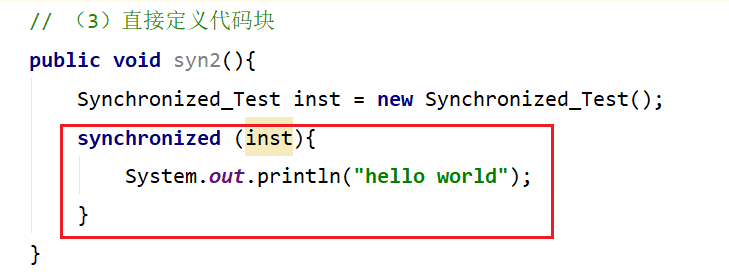
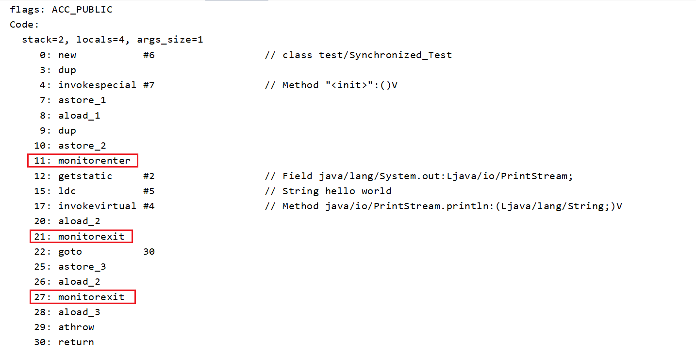
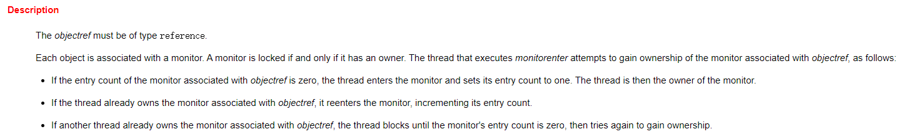
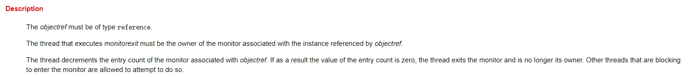

# Synchronized

## 定义

如果某一个资源被多个线程共享，为了避免因为资源抢占导致资源数据错乱，我们需要对线程进行同步，那么synchronized就是实现线程同步的关键字

**synchronized的作用是保证在同一时刻， 被修饰的代码块或方法只会有一个线程执行，以达到保证并发安全的效果。**

## 特性

- **原子性**：所谓原子性就是指一个操作或者多个操作，要么全部执行并且执行的过程不会被任何因素打断，要么就都不执行。
- **可见性**： 可见性是指多个线程访问一个资源时，该资源的状态、值信息等对于其他线程都是可见的。（通过“在执行unlock之前，必须先把此变量同步回主内存”实现）
- **有序性**：有效解决重排序问题（通过“一个变量在同一时刻只允许一条线程对其进行lock操作”）

## 用法

从语法上讲，Synchronized可以把任何一个非null对象作为"锁"，在HotSpot JVM实现中，锁有个专门的名字：**对象监视器（Object Monitor）**。

三种用法：

（1）修饰静态方法
```java
public synchronized static void helloStatic(){
    System.out.println("hello world static");
}
```

（2）修饰成员函数

```java
public synchronized void hello(){
    System.out.println("hello world");
}
```

（3）直接定义代码块

```java
public void test(){
    SynchronizedTest test = new SynchronizedTest();        
    synchronized (test){
        System.out.println("hello world");
    }
}
```

## 锁的实现

synchronized有两种形式上锁，一个是对方法上锁，一个是构造同步代码块。他们的底层实现其实都一样，在进入同步代码之前先获取锁，获取到锁之后锁的计数器+1，同步代码执行完锁的计数器-1，如果获取失败就阻塞式等待锁的释放。只是他们在同步块识别方式上有所不一样，从class字节码文件可以表现出来，一个是通过方法flags标志，一个是monitorenter和monitorexit指令操作。

### 同步代码块

定义一个同步代码块，编译出class字节码，然后找到method方法所在的指令块





关于这两条指令的作用，我们直接参考JVM规范中描述

JVM规范中对于monitorenter的描述：

https://docs.oracle.com/javase/specs/jvms/se8/html/jvms-6.html#jvms-6.5.monitorenter



这段话的大概意思为：

每个对象有一个监视器锁（monitor）。当monitor被占用时就会处于锁定状态，线程执行monitorenter指令时尝试获取monitor的所有权，过程如下：

1、如果monitor的进入数为0，则该线程进入monitor，然后将进入数设置为1，该线程即为monitor的所有者。

2、如果线程已经占有该monitor，只是重新进入，则进入monitor的进入数加1.

3.如果其他线程已经占用了monitor，则该线程进入阻塞状态，直到monitor的进入数为0，再重新尝试获取monitor的所有权。



这段话的大概意思为：

执行monitorexit的线程必须是objectref所对应的monitor的所有者。

指令执行时，monitor的进入数减1，如果减1后进入数为0，那线程退出monitor，不再是这个monitor的所有者。其他被这个monitor阻塞的线程可以尝试去获取这个 monitor 的所有权。 


