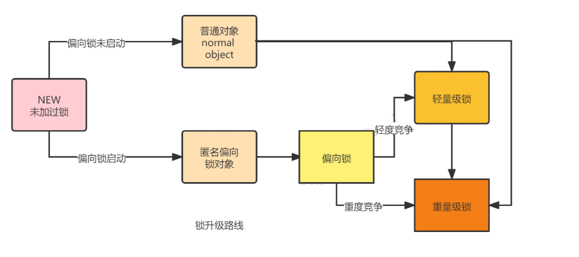

# Synchronized

## 定义

如果某一个资源被多个线程共享，为了避免因为资源抢占导致资源数据错乱，我们需要对线程进行同步，那么synchronized就是实现线程同步的关键字

**synchronized的作用是保证在同一时刻， 被修饰的代码块或方法只会有一个线程执行，以达到保证并发安全的效果。**

## 特性

- **原子性**：所谓原子性就是指一个操作或者多个操作，要么全部执行并且执行的过程不会被任何因素打断，要么就都不执行。
- **可见性**： 可见性是指多个线程访问一个资源时，该资源的状态、值信息等对于其他线程都是可见的。（通过“在执行unlock之前，必须先把此变量同步回主内存”实现）
- **有序性**：有效解决重排序问题（通过“一个变量在同一时刻只允许一条线程对其进行lock操作”）

## 用法

从语法上讲，Synchronized可以把任何一个非null对象作为"锁"，在HotSpot JVM实现中，锁有个专门的名字：**对象监视器（Object Monitor）**。

三种用法：

（1）修饰静态方法
```java
public synchronized static void helloStatic(){
    System.out.println("hello world static");
}
```

（2）修饰成员函数

```java
public synchronized void hello(){
    System.out.println("hello world");
}
```

（3）直接定义代码块

```java
public void test(){
    SynchronizedTest test = new SynchronizedTest();        
    synchronized (test){
        System.out.println("hello world");
    }
}
```

## 锁的实现

synchronized有两种形式上锁，一个是对方法上锁，一个是构造同步代码块。他们的底层实现其实都一样，在进入同步代码之前先获取锁，获取到锁之后锁的计数器+1，同步代码执行完锁的计数器-1，如果获取失败就阻塞式等待锁的释放。只是他们在同步块识别方式上有所不一样，从class字节码文件可以表现出来，一个是通过方法flags标志，一个是monitorenter和monitorexit指令操作。

### 同步代码块

定义一个同步代码块，编译出class字节码，然后找到method方法所在的指令块


关于这两条指令的作用，我们直接参考JVM规范中描述

JVM规范中对于monitorenter的描述：

https://docs.oracle.com/javase/specs/jvms/se8/html/jvms-6.html#jvms-6.5.monitorenter


这段话的大概意思为：

每个对象有一个监视器锁（monitor）。当monitor被占用时就会处于锁定状态，线程执行monitorenter指令时尝试获取monitor的所有权，过程如下：

1、如果monitor的进入数为0，则该线程进入monitor，然后将进入数设置为1，该线程即为monitor的所有者。

2、如果线程已经占有该monitor，只是重新进入，则进入monitor的进入数加1.

3.如果其他线程已经占用了monitor，则该线程进入阻塞状态，直到monitor的进入数为0，再重新尝试获取monitor的所有权。


这段话的大概意思为：

执行monitorexit的线程必须是objectref所对应的monitor的所有者。

指令执行时，monitor的进入数减1，如果减1后进入数为0，那线程退出monitor，不再是这个monitor的所有者。其他被这个monitor阻塞的线程可以尝试去获取这个 monitor 的所有权。 

### 同步方法

首先看在方法上上锁，然后进行反编译，查看其字节码：


从编译的结果来看，方法的同步并没有通过指令 monitorenter 和 monitorexit 来完成（理论上其实也可以通过这两条指令来实现），不过相对于普通方法，其常量池中多了 ACC_SYNCHRONIZED 标示符。JVM就是根据该标示符来实现方法的同步的：

> 当方法调用时，调用指令将会检查方法的 ACC_SYNCHRONIZED 访问标志是否被设置，如果设置了，执行线程将先获取monitor，获取成功之后才能执行方法体，方法执行完后再释放monitor。**在方法执行期间，其他任何线程都无法再获得同一个monitor对象。**

两种同步方式本质上没有区别，只是方法的同步是一种隐式的方式来实现，无需通过字节码来完成。两个指令的执行是JVM通过调用操作系统的互斥原语mutex来实现，被阻塞的线程会被挂起、等待重新调度，会导致“用户态和内核态”两个态之间来回切换，对性能有较大影响。

## 锁的原理&Monitor

### 对象内存布局

当一个对象在堆内存中分配好并且初始化完成之后的结构是什么样的呢？


1、添加对求填充是为了保证对象的总大小是8的整数倍个字节。

2、类型指针占4个字节是因为默认开启了指针压缩，如果不开启指针压缩，则占8个字节

Synchronized用的锁就是存在Java对象头里的，那么什么是Java对象头呢？Hotspot虚拟机的对象头主要包括两部分数据：**Mark Word（标记字段）**、Class Pointer（类型指针）。其中 Class Pointer是对象指向它的类元数据的指针，虚拟机通过这个指针来确定这个对象是哪个类的实例，Mark Word用于存储对象自身的运行时数据，它是实现轻量级锁和偏向锁的关键。

Mark Word用于存储对象自身的运行时数据，如：哈希码（HashCode）、GC分代年龄、锁状态标志、线程持有的锁、偏向线程 ID、偏向时间戳等


我们发现，markword的后三位被设定成了跟锁相关的标志位，其中有两位是锁标志位，1位是偏向锁标志位。

### 监视器（Monitor）

任何一个对象都有一个Monitor与之关联，当且一个Monitor被持有后，它将处于锁定状态。Synchronized在JVM里的实现都是 基于进入和退出Monitor对象来实现方法同步和代码块同步，虽然具体实现细节不一样，但是都可以通过成对的MonitorEnter和MonitorExit指令来实现。

- MonitorEnter指令：插入在同步代码块的开始位置，当代码执行到该指令时，将会尝试获取该对象Monitor的所有权，即尝试获得该对象的锁；
- MonitorExit指令：插入在方法结束处和异常处，JVM保证每个MonitorEnter必须有对应的MonitorExit；
那什么是Monitor？可以把它理解为 一个同步工具，也可以描述为 一种同步机制，它通常被 描述为一个对象。

与一切皆对象一样，所有的Java对象是天生的Monitor，每一个Java对象都有成为Monitor的潜质，因为在Java的设计中 ，每一个Java对象自打娘胎里出来就带了一把看不见的锁，它叫做内部锁或者Monitor锁。

也就是通常说Synchronized的对象锁，MarkWord锁标识位为10，其中指针指向的是Monitor对象的起始地址。在Java虚拟机（HotSpot）中，Monitor是由ObjectMonitor实现的，其主要数据结构如下（位于HotSpot虚拟机源码ObjectMonitor.hpp文件，C++实现的）：

```cpp
ObjectMonitor() {
    _header       = NULL;
    _count        = 0; // 记录个数
    _waiters      = 0,
    _recursions   = 0;
    _object       = NULL;
    _owner        = NULL;
    _WaitSet      = NULL; // 处于wait状态的线程，会被加入到_WaitSet
    _WaitSetLock  = 0 ;
    _Responsible  = NULL ;
    _succ         = NULL ;
    _cxq          = NULL ;
    FreeNext      = NULL ;
    _EntryList    = NULL ; // 处于等待锁block状态的线程，会被加入到该列表
    _SpinFreq     = 0 ;
    _SpinClock    = 0 ;
    OwnerIsThread = 0 ;
}
```

ObjectMonitor中有两个队列，WaitSet 和 _EntryList，用来保存ObjectWaiter对象列表（ 每个等待锁的线程都会被封装成ObjectWaiter对象 ），owner指向持有ObjectMonitor对象的线程，当多个线程同时访问一段同步代码时：

- 1、首先会进入 _EntryList 集合，当线程获取到对象的monitor后，进入 _Owner区域并把monitor中的owner变量设置为当前线程，同时monitor中的计数器count加1；
- 2、若线程调用 wait() 方法，将释放当前持有的monitor，owner变量恢复为null，count自减1，同时该线程进入 WaitSet集合中等待被唤醒；
- 3、若当前线程执行完毕，也将释放monitor（锁）并复位count的值，以便其他线程进入获取monitor(锁)；

同时，**Monitor对象存在于每个Java对象的对象头Mark Word中（存储的指针的指向），Synchronized锁便是通过这种方式获取锁的，也是为什么Java中任意对象可以作为锁的原因，同时notify/notifyAll/wait等方法会使用到Monitor锁对象，所以必须在同步代码块中使用。**

### 锁优化

前面我们看到了synchronized在字节码层面是对应monitorenter合monitorexit，而真正实现互斥的锁其实依赖操作系统底层的Mutex Lock来实现，首先要明确一点，这个锁是一个重量级的锁，由操作系统直接管理，要想使用它，需要将当前线程挂起并从用户态切换到内核态来执行，这种切换的代价是非常昂贵的。


确实jdk1.6之前每次获取的都是重量级锁，无疑在很多场景下性能不高，故jdk1.6对synchronized做了很大程度的优化，其目的就是为了减少这种重量级锁的使用。

整体锁升级的过程大致可以分为两条路径，如下：



#### 锁膨胀
上面讲到锁有四种状态，并且会因实际情况进行膨胀升级，其膨胀方向是：无锁——>偏向锁——>轻量级锁——>重量级锁，并且膨胀方向不可逆。

#### 偏向锁
一句话总结它的作用：减少统一线程获取锁的代价。在大多数情况下，锁不存在多线程竞争，总是由同一线程多次获得，那么此时就是偏向锁。

#### 轻量级锁
轻量级锁是由偏向锁升级而来，当存在第二个线程申请同一个锁对象时，偏向锁就会立即升级为轻量级锁。注意这里的第二个线程只是申请锁，不存在两个线程同时竞争锁，可以是一前一后地交替执行同步块。

#### 重量级锁
重量级锁是由轻量级锁升级而来，当同一时间有多个线程竞争锁时，锁就会被升级成重量级锁，此时其申请锁带来的开销也就变大。

重量级锁一般使用场景会在追求吞吐量，同步块或者同步方法执行时间较长的场景。


