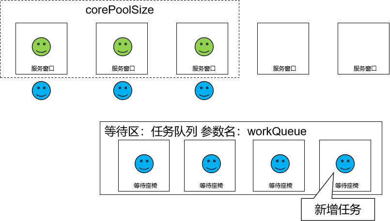
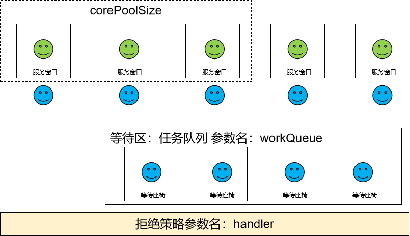

# ThreadPool

# 一、概述
## 1、线程池的意义

> 线程池和数据库连接池都属于“池技术”


<span style="color:blue;font-weight:bolder;">复用</span>：让线程对象能够实现复用

- 不必反复执行线程对象的创建
- 不必反复执行线程对象的GC回收

<span style="color:blue;font-weight:bolder;">管理</span>：避免无度、过多创建线程对象

<br/>


## 2、大致结构
- 等待队列：有现在来不及处理的任务，就存放到这个等待队列中，将来有空闲的线程就到这里提取任务执行
- 核心线程：不考核空闲时间，不管空闲多久都不会被释放；只要线程池还在运行，核心线程就会一直留在线程池内
- 非核心线程：空闲时间达到预设值就会被释放
- 拒绝策略：线程池内线程数量已经达到最大线程数、全部线程都很繁忙、等待队列都满了，但仍然有新的任务提交给线程池，此时就需要启用拒绝策略

<br/>


## 3、创建线程池对象
创建线程池对象不要使用 Executors 工具类，而应该自己创建 ThreadPoolExecutor 类的对象，使用它七个参数的构造器：
```java
public ThreadPoolExecutor(int corePoolSize,
                          int maximumPoolSize,
                          long keepAliveTime,
                          TimeUnit unit,
                          BlockingQueue<Runnable> workQueue,
                          ThreadFactory threadFactory,
                          RejectedExecutionHandler handler) {
    if (corePoolSize < 0 ||
        maximumPoolSize <= 0 ||
        maximumPoolSize < corePoolSize ||
        keepAliveTime < 0)
        throw new IllegalArgumentException();
    if (workQueue == null || threadFactory == null || handler == null)
        throw new NullPointerException();
    this.corePoolSize = corePoolSize;
    this.maximumPoolSize = maximumPoolSize;
    this.workQueue = workQueue;
    this.keepAliveTime = unit.toNanos(keepAliveTime);
    this.threadFactory = threadFactory;
    this.handler = handler;
}
```

<br/>


## 4、七个参数各自的含义

| 参数名称                                | 参数作用                                                     |
| --------------------------------------- | ------------------------------------------------------------ |
| int corePoolSize                        | 核心线程的数量                                               |
| int maximumPoolSize                     | 最大线程数                                                   |
| long keepAliveTime                      | 非核心线程的最大空闲时间的数量<br />（核心线程之外的线程，这些线程对象空闲时间达到keepAliveTime指定的值就会被释放） |
| TimeUnit unit                           | 非核心线程的最大空闲时间的单位                               |
| BlockingQueue&lt;Runnable&gt; workQueue | 等待队列                                                     |
| ThreadFactory threadFactory             | 创建线程对象的工厂                                           |
| RejectedExecutionHandler handler        | 某一个具体的拒绝策略                                         |

 

## 5、BlockingQueue

### ①类型关系


### ②特点

- 存入元素时：如果队列已满，可以阻塞操作。需要调用put()方法才有这个效果
- 取出元素时：如果队列为空，可以阻塞操作。需要调用take()方法才有这个效果


# 二、工作机制

重要的事情说三遍——以下重要！以下重要！以下重要！我们对照的模型就是去银行网点办理业务，如果窗口所有工作人员都在忙碌，我们需要等叫号。那么线程池中和这个模型一致的就按照生活中的经验来理解和记忆即可。有和生活中不一样的地方，会标【**反直觉**】，请大家留意！

❤【**反直觉**】刚创建线程池时，线程池中的线程数为零。<br/>


<br/>

❤当调用execute()方法添加一个请求任务时，线程池会做出如下判断：<br/>
❤如果正在运行的线程数量小于corePoolSize，那么马上创建线程运行这个任务；<br/>


<br/>


<br/>

❤【反直觉】如果正在运行的线程数量大于或等于corePoolSize，那么将这个任务放入队列；<br/>


<br/>



<br/>

❤【反直觉】如果这个时候队列满了且正在运行的线程数量还小于maximumPoolSize，那么还是要创建非核心线程立刻运行这个新增的任务而不是等待时间最长的任务；<br/>


<br/>

对于已经等待很长时间的任务，用户体验已经是“差”，即使立即处理也没办法从差变好：

- 任务A等待5秒（用户体验差）
- 任务B等待3秒（用户体验差）
- 任务C等待1秒（用户体验差）
- 任务D刚来的新任务

而立即处理新增的任务，用户体验至少是正常的

<br/>


❤如果队列满了且正在运行的线程数量大于或等于maximumPoolSize，那么线程池会启动饱和拒绝策略来执行。<br/>




❤当一个线程完成任务时，它会从队列中取下一个任务来执行。<br/>


<br/>


❤当一个线程空闲的时间超过keepAliveTime时，线程池会判断：<br/>
❤当前运行线程数大于corePoolSize：空闲时间超时线程会被停掉<br/>


<br/>


❤当前运行线程数小于等于corePoolSize：无动作（所以线程池的所有任务完成后，它最终会收缩到corePoolSize的大小。）<br/>


<br/>


# 三、开发时线程池参数设置的建议

- 核心线程数和最大线程数设置成一样的，避免非核心线程反复创建、释放
- 核心线程数参考CPU的核心数量，最好是CPU核心数量的整数倍


# 四、创建线程池并测试拒绝策略
```java
// 1、准备创建线程池所需的数据
// 核心线程数
int corePoolSize = 3;

// 最大线程数
int maximumPoolSize = 5;

// 最大空闲时间的数量
long keepAliveTime = 5;

// 最大空闲时间的单位
TimeUnit unit = TimeUnit.SECONDS;

// 阻塞队列的容量
int capacity = 5;

// 阻塞队列
BlockingQueue<Runnable> workQueue = new ArrayBlockingQueue<>(capacity);

// 创建线程对象的工厂
ThreadFactory threadFactory = Executors.defaultThreadFactory();

// 指定一个具体的拒绝策略
// AbortPolicy：任务满了之后，通过抛异常的方式表示拒绝
// CallerRunsPolicy：任务满了之后，把新增的任务返还给调用者
// DiscardPolicy：任务满了之后，随机丢弃某个任务
// DiscardOldestPolicy：任务满了之后，丢弃等待时间最长的任务
RejectedExecutionHandler handler =
        // new ThreadPoolExecutor.AbortPolicy();
        // new ThreadPoolExecutor.CallerRunsPolicy();
        // new ThreadPoolExecutor.DiscardPolicy();
        new ThreadPoolExecutor.DiscardOldestPolicy();

// 2、创建线程池对象
ThreadPoolExecutor threadPoolExecutor = new ThreadPoolExecutor(
        corePoolSize,
        maximumPoolSize,
        keepAliveTime,
        unit,
        workQueue,
        threadFactory,
        handler);

// 3、给线程池分配任务
while (true) {
    threadPoolExecutor.submit(()->{
        while (true) {
            System.out.println(Thread.currentThread().getName() + " is working ...");
            TimeUnit.SECONDS.sleep(1);
        }
    });
    TimeUnit.SECONDS.sleep(1);
}
```

<br/>