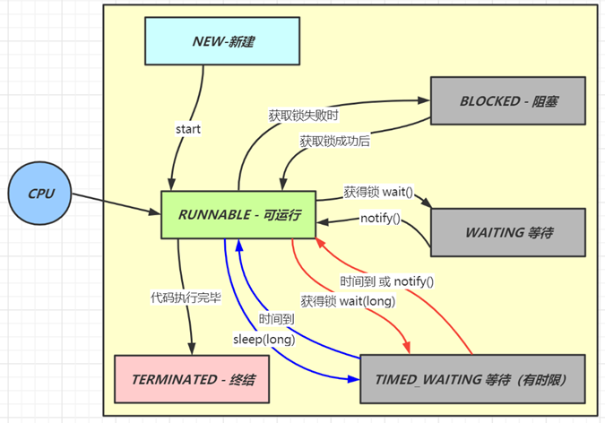
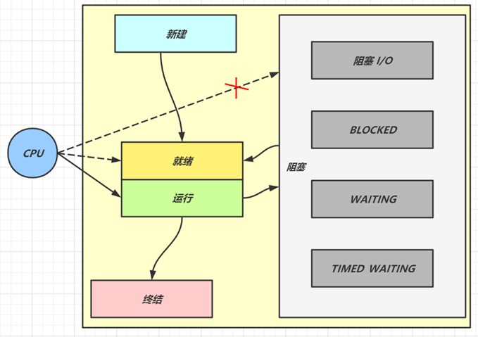

## 1. 线程状态

**要求**

* 掌握 Java 线程六种状态
* 掌握 Java 线程状态转换
* 能理解五种状态与六种状态两种说法的区别

**六种状态及转换**

分别是

* 新建
    * 当一个线程对象被创建，但还未调用 start 方法时处于**新建**状态
    * 此时未与操作系统底层线程关联
* 可运行
    * 调用了 start 方法，就会由**新建**进入**可运行**
    * 此时与底层线程关联，由操作系统调度执行
* 终结
    * 线程内代码已经执行完毕，由**可运行**进入**终结**
    * 此时会取消与底层线程关联
* 阻塞
    * 当获取锁失败后，由**可运行**进入 Monitor 的阻塞队列**阻塞**，此时不占用 cpu 时间
    * 当持锁线程释放锁时，会按照一定规则唤醒阻塞队列中的**阻塞**线程，唤醒后的线程进入**可运行**状态
* 等待
    * 当获取锁成功后，但由于条件不满足，调用了 wait() 方法，此时从**可运行**状态释放锁进入 Monitor 等待集合**等待**，同样不占用 cpu 时间
    * 当其它持锁线程调用 notify() 或 notifyAll() 方法，会按照一定规则唤醒等待集合中的**等待**线程，恢复为**可运行**状态
* 有时限等待
    * 当获取锁成功后，但由于条件不满足，调用了 wait(long) 方法，此时从**可运行**状态释放锁进入 Monitor 等待集合进行**有时限等待**，同样不占用 cpu 时间
    * 当其它持锁线程调用 notify() 或 notifyAll() 方法，会按照一定规则唤醒等待集合中的**有时限等待**线程，恢复为**可运行**状态，并重新去竞争锁
    * 如果等待超时，也会从**有时限等待**状态恢复为**可运行**状态，并重新去竞争锁
    * 还有一种情况是调用 sleep(long) 方法也会从**可运行**状态进入**有时限等待**状态，但与 Monitor 无关，不需要主动唤醒，超时时间到自然恢复为**可运行**状态

> ***其它情况（只需了解）***
>
> * 可以用 interrupt() 方法打断**等待**、**有时限等待**的线程，让它们恢复为**可运行**状态
> * park，unpark 等方法也可以让线程等待和唤醒

**五种状态**

五种状态的说法来自于操作系统层面的划分

* 运行态：分到 cpu 时间，能真正执行线程内代码的
* 就绪态：有资格分到 cpu 时间，但还未轮到它的
* 阻塞态：没资格分到 cpu 时间的
    * 涵盖了 java 状态中提到的**阻塞**、**等待**、**有时限等待**
    * 多出了阻塞 I/O，指线程在调用阻塞 I/O 时，实际活由 I/O 设备完成，此时线程无事可做，只能干等
* 新建与终结态：与 java 中同名状态类似，不再啰嗦

## 2. 线程池

**要求**

* 掌握线程池的 7 大核心参数

**七大参数**

1. corePoolSize 核心线程数目 - 池中会保留的最多线程数
2. maximumPoolSize 最大线程数目 - 核心线程+救急线程的最大数目
3. keepAliveTime 生存时间 - 救急线程的生存时间，生存时间内没有新任务，此线程资源会释放
4. unit 时间单位 - 救急线程的生存时间单位，如秒、毫秒等
5. workQueue - 当没有空闲核心线程时，新来任务会加入到此队列排队，队列满会创建救急线程执行任务
6. threadFactory 线程工厂 - 可以定制线程对象的创建，例如设置线程名字、是否是守护线程等
7. handler 拒绝策略 - 当所有线程都在繁忙，workQueue 也放满时，会触发拒绝策略
    1. 抛异常 java.util.concurrent.ThreadPoolExecutor.AbortPolicy
    2. 由调用者执行任务 java.util.concurrent.ThreadPoolExecutor.CallerRunsPolicy
    3. 丢弃任务 java.util.concurrent.ThreadPoolExecutor.DiscardPolicy
    4. 丢弃最早排队任务 java.util.concurrent.ThreadPoolExecutor.DiscardOldestPolicy

## 3. wait vs sleep

**要求**

* 能够说出二者区别

**一个共同点，三个不同点**

共同点

* wait() ，wait(long) 和 sleep(long) 的效果都是让当前线程暂时放弃 CPU 的使用权，进入阻塞状态

不同点

* 方法归属不同
    * sleep(long) 是 Thread 的静态方法
    * 而 wait()，wait(long) 都是 Object 的成员方法，每个对象都有

* 醒来时机不同
    * 执行 sleep(long) 和 wait(long) 的线程都会在等待相应毫秒后醒来
    * wait(long) 和 wait() 还可以被 notify 唤醒，wait() 如果不唤醒就一直等下去
    * 它们都可以被打断唤醒

* 锁特性不同（重点）
    * wait 方法的调用必须先获取 wait 对象的锁，而 sleep 则无此限制
    * wait 方法执行后会释放对象锁，允许其它线程获得该对象锁（我放弃 cpu，但你们还可以用）
    * 而 sleep 如果在 synchronized 代码块中执行，并不会释放对象锁（我放弃 cpu，你们也用不了）
