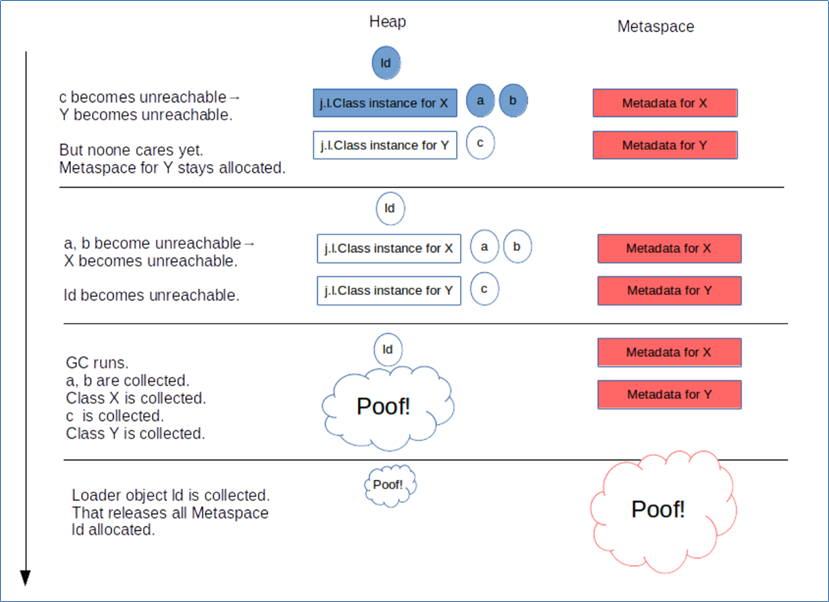
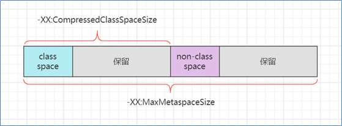

## 1. JVM 内存结构

**要求**

* 掌握 JVM 内存结构划分
* 尤其要知道方法区、永久代、元空间的关系

**结合一段 java 代码的执行理解内存划分**

* 执行 javac 命令编译源代码为字节码
* 执行 java 命令
    1. 创建 JVM，调用类加载子系统加载 class，将类的信息存入**方法区**
    2. 创建 main 线程，使用的内存区域是 **JVM 虚拟机栈**，开始执行 main 方法代码
    3. 如果遇到了未见过的类，会继续触发类加载过程，同样会存入**方法区**
    4. 需要创建对象，会使用**堆**内存来存储对象
    5. 不再使用的对象，会由**垃圾回收器**在内存不足时回收其内存
    6. 调用方法时，方法内的局部变量、方法参数所使用的是  **JVM 虚拟机栈**中的栈帧内存
    7. 调用方法时，先要到**方法区**获得到该方法的字节码指令，由**解释器**将字节码指令解释为机器码执行
    8. 调用方法时，会将要执行的指令行号读到**程序计数器**，这样当发生了线程切换，恢复时就可以从中断的位置继续
    9. 对于非 java 实现的方法调用，使用内存称为**本地方法栈**（见说明）
    10. 对于热点方法调用，或者频繁的循环代码，由 **JIT 即时编译器**将这些代码编译成机器码缓存，提高执行性能

说明

* 加粗字体代表了 JVM 虚拟机组件
* 对于 Oracle 的 Hotspot 虚拟机实现，不区分虚拟机栈和本地方法栈

**会发生内存溢出的区域**

* 不会出现内存溢出的区域 – 程序计数器
* 出现 OutOfMemoryError 的情况
    * 堆内存耗尽 – 对象越来越多，又一直在使用，不能被垃圾回收
    * 方法区内存耗尽 – 加载的类越来越多，很多框架都会在运行期间动态产生新的类
    * 虚拟机栈累积 – 每个线程最多会占用 1 M 内存，线程个数越来越多，而又长时间运行不销毁时
* 出现 StackOverflowError 的区域
    * JVM 虚拟机栈，原因有方法递归调用未正确结束、反序列化 json 时循环引用

**方法区、永久代、元空间**

* **方法区**是 JVM 规范中定义的一块内存区域，用来存储类元数据、方法字节码、即时编译器需要的信息等
* **永久代**是 Hotspot 虚拟机对 JVM 规范的实现（1.8 之前）
* **元空间**是 Hotspot 虚拟机对 JVM 规范的另一种实现（1.8 以后），使用本地内存作为这些信息的存储空间

从这张图学到三点

* 当第一次用到某个类是，由类加载器将 class 文件的类元信息读入，并存储于元空间
* X，Y 的类元信息是存储于元空间中，无法直接访问
* 可以用 X.class，Y.class 间接访问类元信息，它们俩属于 java 对象，我们的代码中可以使用

从这张图可以学到

* 堆内存中：当一个**类加载器对象**，这个类加载器对象加载的所有**类对象**，这些类对象对应的所有**实例对象**都没人引用时，GC 时就会对它们占用的对内存进行释放
* 元空间中：内存释放**以类加载器为单位**，当堆中类加载器内存释放时，对应的元空间中的类元信息也会释放

## 2. JVM 内存参数

**要求**
* 熟悉常见的 JVM 参数，尤其和大小相关的

**堆内存，按大小设置**

解释：

* -Xms 最小堆内存（包括新生代和老年代）
* -Xmx 最大对内存（包括新生代和老年代）
* 通常建议将 -Xms 与 -Xmx 设置为大小相等，即不需要保留内存，不需要从小到大增长，这样性能较好
* -XX:NewSize 与 -XX:MaxNewSize 设置新生代的最小与最大值，但一般不建议设置，由 JVM 自己控制
* -Xmn 设置新生代大小，相当于同时设置了 -XX:NewSize 与 -XX:MaxNewSize 并且取值相等
* 保留是指，一开始不会占用那么多内存，随着使用内存越来越多，会逐步使用这部分保留内存。下同

**堆内存，按比例设置**

解释：
* -XX:NewRatio=2:1 表示老年代占两份，新生代占一份
* -XX:SurvivorRatio=4:1 表示新生代分成六份，伊甸园占四份，from 和 to 各占一份

**元空间内存设置**

解释：

* class space 存储类的基本信息，最大值受 -XX:CompressedClassSpaceSize 控制
* non-class space 存储除类的基本信息以外的其它信息（如方法字节码、注解等）
* class space 和 non-class space 总大小受 -XX:MaxMetaspaceSize 控制

注意：

* 这里 -XX:CompressedClassSpaceSize 这段空间还与是否开启了指针压缩有关，这里暂不深入展开，可以简单认为指针压缩默认开启

**代码缓存内存设置**

解释：

* 如果 -XX:ReservedCodeCacheSize < 240m，所有优化机器代码不加区分存在一起
* 否则，分成三个区域（图中笔误 mthod 拼写错误，少一个 e）
  * non-nmethods - JVM 自己用的代码
  * profiled nmethods - 部分优化的机器码
  * non-profiled nmethods - 完全优化的机器码

**线程内存设置**

> ***官方参考文档***
>
> * https://docs.oracle.com/en/java/javase/11/tools/java.html#GUID-3B1CE181-CD30-4178-9602-230B800D4FAE
