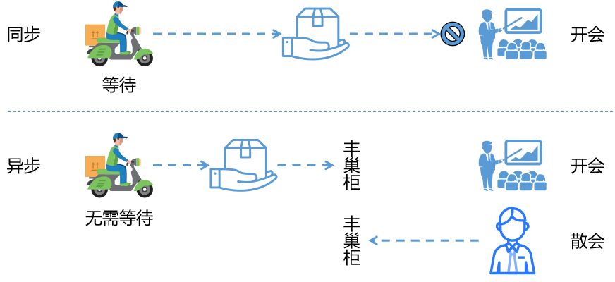
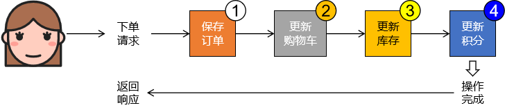
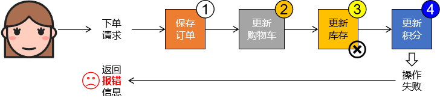
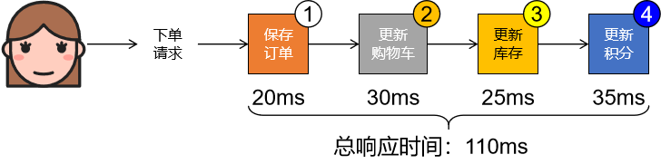
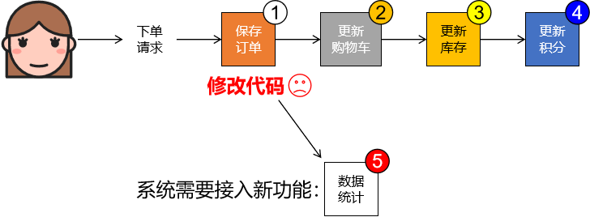
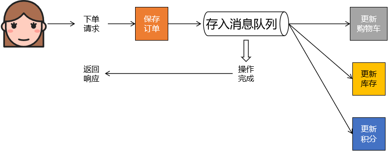
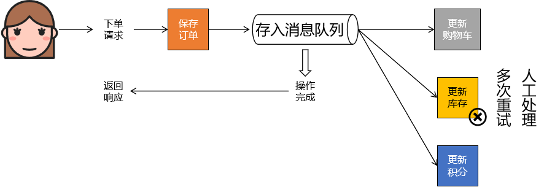
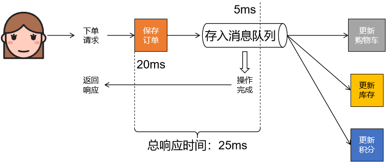
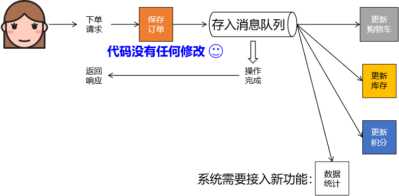
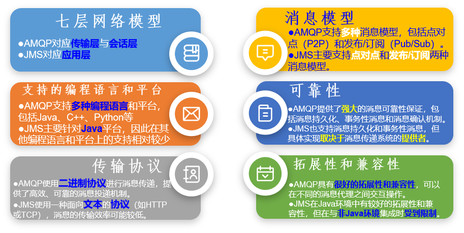

# 01-消息队列

# 一、为什么要使用消息队列

## 1、生活中收快递

## 2、下单功能：同步

### ①问题1：耦合度高

### ②问题2：响应时间长

### ③问题3：并发压力传递

### ④问题4：系统结构弹性不足

## 3、下单功能：异步

### ①好处1：功能解耦

### ②好处2：快速响应

### ③好处3：异步削峰限流

削峰填谷：

### ④好处4：系统结构弹性大，易于扩展

# 二、什么是消息队列

## 1、概念

消息队列是实现应用程序和应用程序之间通信的中间件产品

## 2、消息队列底层实现的两大主流方式

由于消息队列执行的是跨应用的信息传递，所以制定底层通信标准非常必要目前主流的

消息队列通信协议标准包括：

- AMQP (Advanced Message Queuing Protocol)：通用协议，IBM公司研发
- JMS (Java Message Service)：专门为Java语言服务，SUN公司研发，一组由Java接口组成的Java标准

对比：

## 3、主流消息队列产品

|                | RabbitMQ                                                     | ActiveMQ                                           | RocketMQ                                                     | Kafka                                                 |
| -------------- | ------------------------------------------------------------ | -------------------------------------------------- | ------------------------------------------------------------ | ----------------------------------------------------- |
| 研发团队       | Rabbit(公司)                                                 | Apache(社区)                                       | 阿里(公司)                                                   | Apache(社区)                                          |
| 开发语言       | Erlang                                                       | Java                                               | Java                                                         | Scala&Java                                            |
| 核心机制       | 基于AMQP的消息队列模型使用生产者-消费者模式，将消息发布到队列中，然后被消费者订阅和处理 | 基于JMS的消息传递模型支持点对点模型和发布-订阅模型 | 分布式的消息队列模型采用主题(Topic)和标签(Tag)的方式进行消息的分类和过滤 | 分布式流平台，通过发布-订阅模型进行高吞吐量的消息处理 |
| 协议支持       | XMPP STOMP SMTP                                      | XMPP STOMP OpenWireREST                    | 自定义协议                                                   | 自定义协议社区封装了HTTP协议支持                      |
| 客户端支持语言 | 官方支持Erlang、Java、Ruby等社区产出多种API，几乎支持所有语言 | Java C/C++ Python PHP Perl.NET等   | Java C++不成熟                                           | 官方支持Java社区产出多种API，如PHP、Python等          |
| 可用性         | 镜像队列，仲裁队列                                           | 主从复制                                           | 主从复制                                                     | 分区和副本                                            |
| 单机吞吐量     | 每秒十万左右级别                                             | 每秒数万级                                         | 每秒十万+级(双十一)                                          | 每秒百万级                                            |
| 消息延迟       | 微秒级                                                       | 毫秒级                                             | 毫秒级                                                       | 毫秒以内                                              |
| 消息确认       | 完整的消息确认机制                                           |                                                    | 内置消息表，消息保存到数据库实现持久化                       |                                                       |
| 功能特性       | 并发能力强，性能极好，延时低，社区活跃，管理界面丰富         | 老牌产品成熟度高文档丰富                           | MQ功能比较完备扩展性佳                                       | 只支持主要的MQ功能毕竟是专门为大数据领域服务的        |

# 三、Kafka介绍

## 1、Kafka是什么

Kafka是Apache开源的一款基于zookeeper协调的分布式消息系统，具有高吞吐率、高性能、实时、高可靠等特点，可实时处理流式数据。它最初由LinkedIn公司开发，使用Scala语言编写。

`Kafka`历经数年的发展，从最初纯粹的消息引擎，到近几年开始在流处理平台生态圈发力，多个组织或公司发布了各种不同特性的产品。常见产品如下：

- **Apache Kafka** ：最“正统”的`Kafka`也是开源版，它是后面其他所有发行版的基础。
- Cloudera/Hortonworks Kafka ：集成了目前主流的大数据框架，能够帮助用户实现从分布式存储、集群调度、流处理到机器学习、实时数据库等全方位的数据处理。
- Confluent Kafka ：主要提供基于`Kafka`的企业级流处理解决方案。

`Apache Kafka`，它现在依然是开发人数最多、版本迭代速度最快的`Kafka`。我们使用此产品学习。**Apache 目前为止总共演进了8个大版本，分别是0.7、0.8、0.9、0.11、1.0、2.0和3.0，我们选择3.5.1版本讲解(截止2023.8)。**

## 2、Kafka的特点

- 高吞吐量、低延迟：即使是非常普通的硬件Kafka也可以支持每秒数百万的消息，它的延迟最低只有几毫秒

- 持久性：支持消息持久化，即使数TB级别的消息也能够保持长时间的稳定性能。

- 可靠性：支持数据备份防止丢失

- 容错性：支持通过Kafka服务器和消费机集群来分区消息，允许集群中的节点失败（若分区副本数量为n，则允许n-1个节点失败）
- 高并发：单机可支持数千个客户端同时读写，支持在线水平扩展。可无缝对接hadoop、strom、spark等，支持Hadoop并行数据加载

## 3、Kafka官网地址

| kafka官网 | https://kafka.apache.org/          |
| --------- | ---------------------------------- |
| kafka下载 | https://kafka.apache.org/downloads |

## 4、Kafka应用场景

| ID   | 设计目标     | 功能                                                         |
| ---- | ------------ | ------------------------------------------------------------ |
| 1    | 日志收集     | 一个公司用Kafka可以收集各种服务的Log，通过Kafka以统一接口服务的方式开放给各种Consumer |
| 2    | 消息系统     | 解耦生产者和消费者、缓存消息等                               |
| 3    | 用户活动跟踪 | 用来记录Web用户或者APP用户的各种活动，如网页搜索、搜索、点击，用户数据收集然后进行用户行为分析。 |
| 4    | 运营指标     | Kafka也经常用来记录运营监控数据。包括收集各种分布式应用的数据，生产各种操作的集中反馈，比如报警和报告 |
| 5    | 流式处理     | 比如Spark Streaming和Storm                                   |

