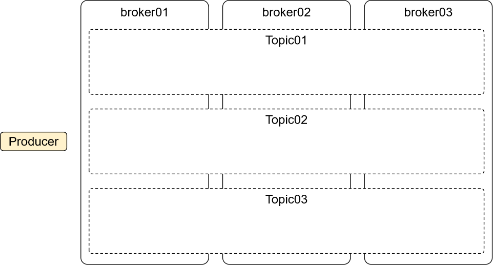
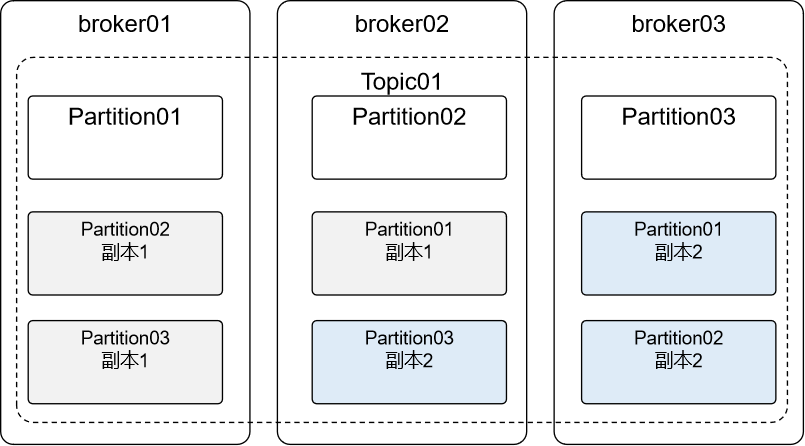
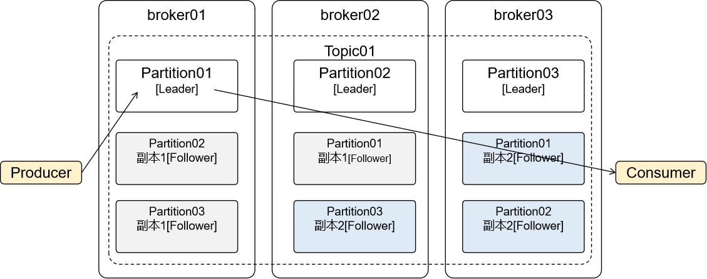
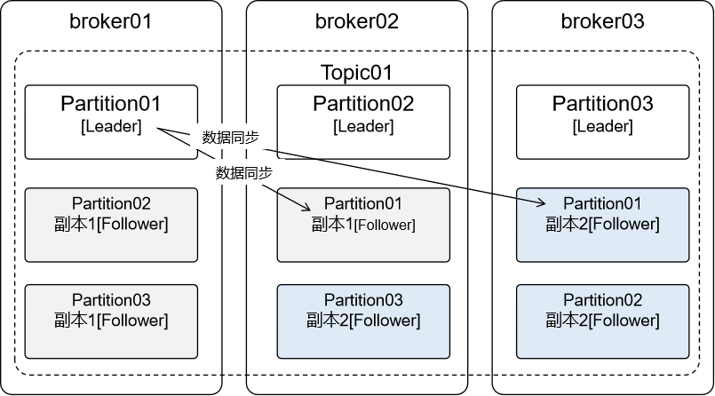
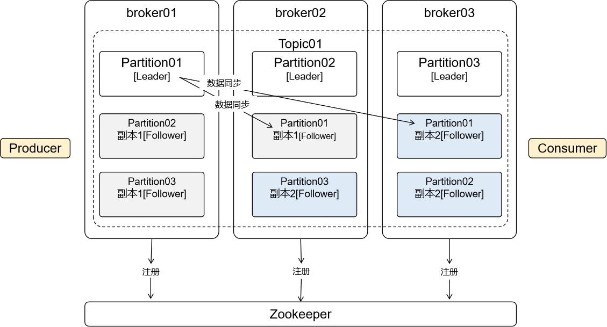

# 02-Kafka内部结构

## 一、Producer

生产者：消息发送端

## 二、Consumer

消费者：消息接收端

## 三、broker

一个Kafka服务器实例，在Kafka集群中会有多个broker实例

## 四、Topic

Topic中文意思是主题，在Kafka中只是一个逻辑概念，代表某一类消息。

结合具体项目中的业务功能，我们可以为每一个具体功能创建一个Topic。

## 五、Partition

Partition就是分区，为什么要分区？

有了分区就可以把消息数据分散到不同broker上保存。

## 六、Replication

数据分区之后有一个问题：每个broker上保存一部分数据，如果某个broker宕机，那么数据就会不完整。

所以Kafka允许分区创建副本

## 七、主从

当分区存在副本时，就会区分Leader、Follower：

- Leader：主分片，负责接收生产者端发送过来的消息，对接消费者端消费消息
- Follower：不和生产者、消费者交互，仅负责和Leader同步数据

- 创建Topic时通过“分区数”指定Partition的数量，通过“复制因子”指定数据分片的总的数量（包括数据正本和副本）
- 分区数和复制因子都不能为0
- 分区数为1，复制因子为1表示：1个Partition内有1个Leader（此时数据只有一份，没有冗余的副本，生产环境不建议）
- 复制因子为2表示，数据整体有两份，每个Partition中包含1个Leader和1个Follower
- 创建Topic时，复制因子数量不能大于broker数量

## 八、注册

Kafka工作过程中，broker、Topic、Partition……信息都需要在Zookeeper中注册

