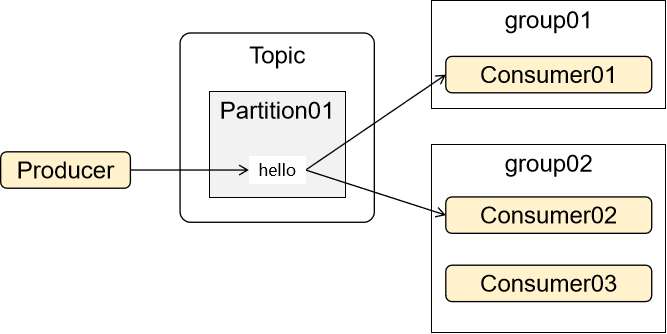

# 04-Kafka命令行操作

## [实验01]查看主题列表

```shell
kafka-topics.sh --bootstrap-server 192.168.200.100:9092 --list
```


## [实验02]创建主题

```shell
kafka-topics.sh --bootstrap-server 192.168.200.100:9092 --create --topic hello-kafka-topic
```


## [实验03]查看主题详情

```shell
kafka-topics.sh --bootstrap-server 192.168.200.100:9092 --describe --topic hello-kafka-topic
```


Leader：集群中broker.id的值，表示这个id的broker是Leader

Replicas：数据副本在各个broker中的列表，Leader会放在第一个位置


## [实验04]发送消息

```shell
kafka-console-producer.sh --bootstrap-server 192.168.200.100:9092 --topic hello-kafka-topic
```


## [实验05]消费端接收最新消息

```shell
kafka-console-consumer.sh --bootstrap-server 192.168.200.100:9092 --topic hello-kafka-topic
```


## [实验06]消费端接收全部消息

```shell
kafka-console-consumer.sh --bootstrap-server 192.168.200.100:9092 --topic hello-kafka-topic --from-beginning
```


## [实验07]同一消费者组内竞争

多个消费者在同一个组内时，接收同一个主题内的消息，彼此之间是竞争关系。

组内只能有一个消费者接收到消息。


### 1、新建主题

```shell
kafka-topics.sh --bootstrap-server 192.168.200.100:9092 --create --topic kafka-test-group01
```


### 2、发送消息

```shell
kafka-console-producer.sh --bootstrap-server 192.168.200.100:9092 --topic kafka-test-group01
```


### 3、两个消费端接收消息

打开两个不同命令行窗口，分别执行下面相同的命令：

```shell
kafka-console-consumer.sh --bootstrap-server 192.168.111.172:9092 \
--topic kafka-test-group01 \
--from-beginning \
--consumer-property group.id=group01
```

group.id=group01把消费者设定为同一个组


### 4、查看消费者组

```shell
kafka-consumer-groups.sh  --bootstrap-server 192.168.200.100:9092 --list
```


## [实验08]不同消费者组间广播




### 1、新建主题

```shell
kafka-topics.sh --bootstrap-server 192.168.200.100:9092 --create --topic kafka-test-group02
```


### 2、发送消息

```shell
kafka-console-producer.sh --bootstrap-server 192.168.200.100:9092 --topic kafka-test-group02
```


### 3、两个消费端接收消息

#### ①在组1中接收消息

```shell
kafka-console-consumer.sh --bootstrap-server 192.168.200.100:9092 \
--topic kafka-test-group02 \
--from-beginning \
--consumer-property group.id=group01
```


#### ②在组2中接收消息

```shell
kafka-console-consumer.sh --bootstrap-server 192.168.200.100:9092 \
--topic kafka-test-group02 \
--from-beginning \
--consumer-property group.id=group02
```


### 4、查看消费者组

```shell
kafka-consumer-groups.sh  --bootstrap-server 192.168.200.100:9092 --list
```