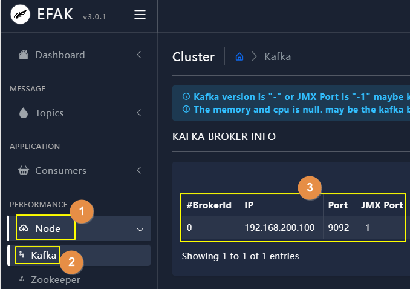
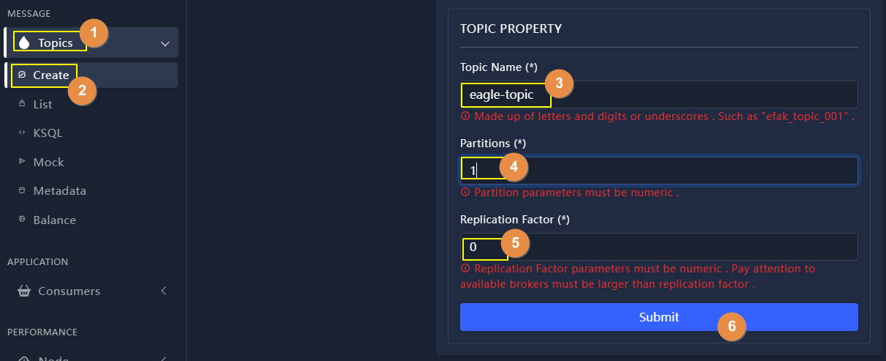
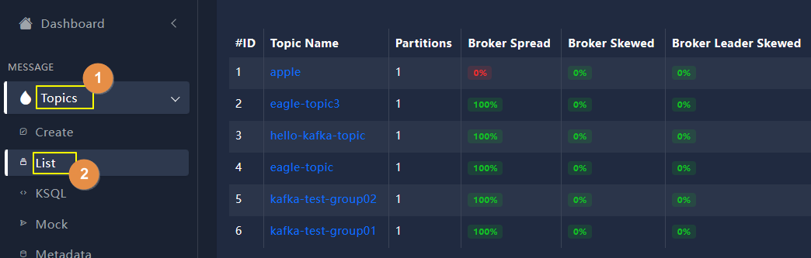
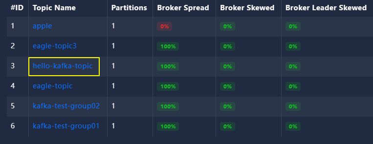
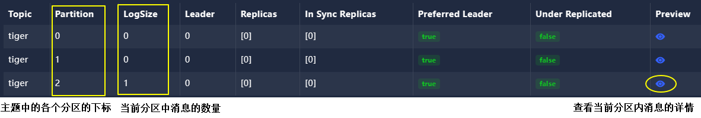
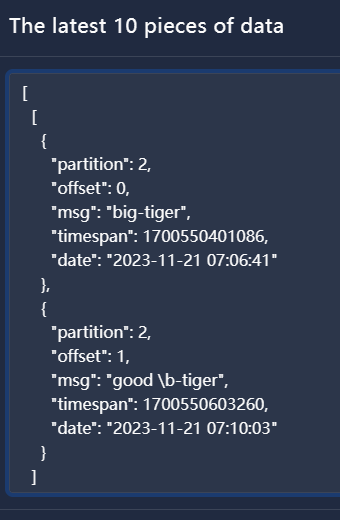

# 05-图形化界面软件Eagle

## 一、创建Docker容器

```shell
# 搜索镜像
docker search efak

# 创建容器
docker run -d --name kafka-eagle \
-p 8048:8048 \
-e EFAK_CLUSTER_ZK_LIST="192.168.200.100:2181" \
nickzurich/efak:latest
```

提示：如果无法启动，往往是因为Zookeeper所需内存不足，可以试着把Zookeeper内存调整为更大的值再试。


> 修改Zookeeper的堆内存大小：
>
> vim /opt/kafka_2.13-3.6.0/bin/zookeeper-server-start.sh


## 二、使用

### 1、访问地址

> http://192.168.200.100:8048


默认登录信息：

- 账号：admin
- 密码：123456


### 2、查看broker列表




### 3、主题相关操作

#### ①新建




注意：Kafka集群中broker实例的数量需要<span style="color:blue;font-weight:bolder;">大于等于</span>复制因子（Replication factor），如果复制因子大于broker实例数量，那么就会看到下面保存信息——


#### ②查看主题列表




#### ③查看主题详情

点击主题名称查看详情：




### 4、查看分区中的消息




